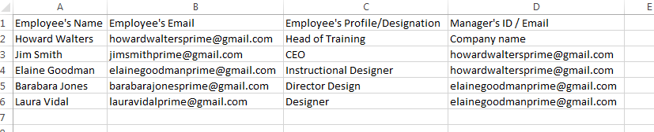

# Agregar usuarios en bloque

En este curso de formación, aprenderá a añadir usuarios en bloque mediante un CSV.

Si no puede iniciar el curso de formación, escriba a <almacademy@adobe.com>.

## Cómo añadir varios usuarios

Puede añadir varios usuarios a la vez siguiendo los pasos que se indican a continuación:

1. Haga clic en **[!UICONTROL Usuarios]** en el panel izquierdo del inicio de sesión del administrador y, a continuación, haga clic en **[!UICONTROL Añadir]** > **[!UICONTROL Cargar un archivo csv]**. Aparecerá un cuadro de diálogo emergente.

1. Puede añadir varios usuarios mediante un archivo .csv. Haga clic en **[!UICONTROL Importar]** y seleccione o abra el archivo .csv en el equipo.

1. Después de importar el archivo, asigne el contenido del archivo .csv con las etiquetas de la aplicación cuando cargue el archivo .csv por primera vez.

   En todas las cargas posteriores, se tendrán en cuenta las opciones de configuración anteriores para las etiquetas. Haga clic en **[!UICONTROL Guardar]** después de completar la asignación de datos, haga clic en **[!UICONTROL Añadir]** para cargar el archivo .csv asignado.

1. Haga clic en **[!UICONTROL Guardar]** después de completar la asignación de datos, haga clic en **[!UICONTROL Añadir]** para cargar el archivo .csv asignado.

## Carga del archivo .csv con campos obligatorios {#csvuploadwithmandatoryfields}

No es obligatorio añadir el perfil del usuario y el ID de correo electrónico del responsable en el CSV. El nombre de usuario y el ID de correo electrónico del usuario son los únicos campos obligatorios.

En este caso, de forma predeterminada, el administrador de su empresa se trata como el responsable de los usuarios. De forma predeterminada, el empleado se considera el perfil del usuario.

**Archivo .csv de muestra**

El archivo CSV de muestra de Learning Manager está disponible a continuación con campos obligatorios.
[Sample-CSV-name-email.zip](assets/sample-csv-name-email.zip)

## Carga del archivo .csv con todos los campos {#csvuploadwithallthefields}

Antes de incluir el ID de correo electrónico del responsable de cualquier empleado, asegúrese de que el responsable se añada primero como empleado en el archivo CSV. Por ejemplo, observe el nombre del empleado Luis López en la captura de pantalla siguiente:

*Plantilla CSV para la carga*

Además, los administradores de una organización pueden agregarse como empleados y mencionar el ID de correo electrónico de su responsable como raíz.

**Archivo .csv de muestra**

El archivo CSV de muestra de Learning Manager está disponible a continuación con todos los campos.
[learning-manager-sample-csv.zip](assets/learning-manager-sample-csv.zip).

Consulte la  [Uso de carga de CSV](/help/migrated/administrators/feature-summary/add-users-user-groups.md) para obtener más información, consulte el contenido de ayuda.
