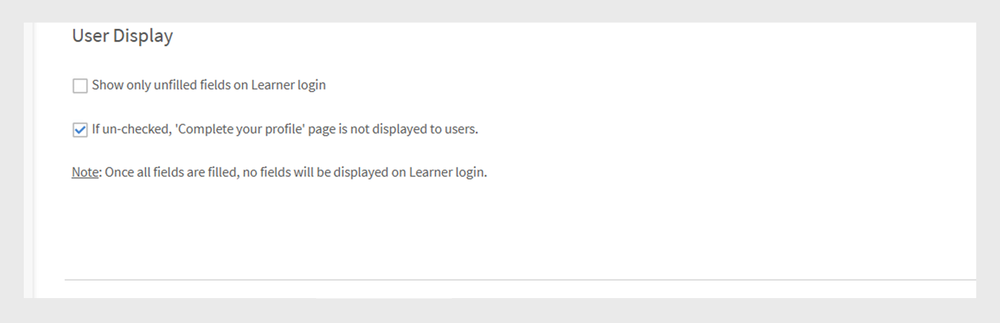
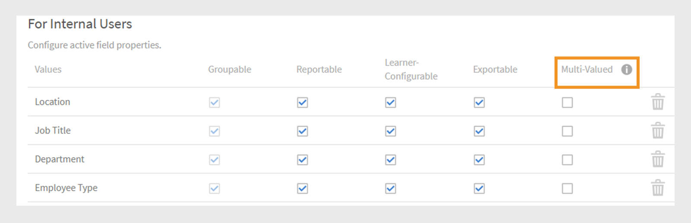

# Campos activos

Los campos activos de Adobe Learning Manager son atributos de usuario personalizados que ayudan a los administradores a organizar y administrar usuarios de manera eficaz. Permiten capturar información adicional sobre el usuario, como el departamento, la ubicación o el puesto. Los administradores pueden utilizar estos datos para crear grupos de usuarios, personalizar el aprendizaje y filtrar informes de forma más eficaz.

Los atributos de usuario son elementos de información como el nombre, apellido y dirección de correo electrónico de un usuario. Estos atributos ayudan a los administradores a:

* Identificar usuarios
* Agrupar usuarios
* Administrar permisos de usuario y restricciones de acceso

Al añadir atributos personalizados a los perfiles de usuario, los campos activos capturan información adicional relevante para su organización.

>[!INFO]
>
>Vea este curso de formación de ALM Academy para aprender a agregar, personalizar y configurar campos activos.  

## Agregar campos activos

Los campos activos se aplican a alumnos internos y externos, lo que permite a las organizaciones definir y administrar atributos de usuario personalizados para todos los usuarios.

Para agregar o administrar campos activos para usuarios internos:

1. Seleccione **Usuarios** en la página principal del administrador.

2. Seleccione **Campos activos**.

3. Escriba el nombre del campo activo y luego seleccione **Agregar**. El proceso para añadir campos activos para alumnos externos es el mismo que para alumnos internos.

   
   _Campo para escribir el nombre de un nuevo atributo personalizado para los usuarios_

4. Seleccione **Guardar**.

## Agregar valores personalizados a los campos activos

Los campos activos pueden incluir valores predefinidos o personalizados que coincidan con la estructura de la organización. La adición de valores personalizados ayuda a capturar detalles específicos de los usuarios internos, como los nombres de los departamentos, los niveles de trabajo o las oficinas regionales.

Para agregar valores personalizados para usuarios internos:

1. Seleccione **Ver valores** en la sección **Campo activo**.
2. En el cuadro de diálogo **Valores en campos personalizados**:

   * Seleccione un campo activo en el menú desplegable **Seleccionar campo**.
   * Escriba los valores del campo activo en el campo **Nuevo valor**.

   
   _Cuadro de diálogo para introducir valores personalizados para un campo activo específico_

3. Seleccione **Hecho** y luego **Guardar** para aplicar los cambios.

## Configurar los valores de los campos activos

Personalice los campos activos para facilitar las tareas de administración de usuarios y creación de informes, y configure las propiedades de los campos activos:

* **Agrupable**: esta opción le permite agrupar a los alumnos en función de los valores de campo activos.
* **Comunicado**: esta opción le permite crear un grupo de usuarios de informes basado en el valor del campo activo y habilita el filtro de informes para el campo en los informes del tablero.
* **Configurable por el alumno**: esta opción permite a los alumnos configurar el campo ellos mismos.
* **Exportable**: esta opción incluye el campo activo en los informes de grupos de usuarios exportados.
* **Multivalor**: esta opción admite varios valores para el campo activo.

Para configurar los campos activos:

1. Seleccione la pestaña **Configuración** y vaya a la sección **Visualización de usuario**.

   
   _Seleccione la ficha Configuración para personalizar los campos activos_

2. Seleccione una o ambas opciones, según sea necesario.:

   * **Mostrar solo campos sin rellenar al iniciar sesión como alumno:** Si se selecciona, los alumnos solo verán los campos activos que aún no hayan rellenado. Esto les solicita que completen su perfil, lo que ayuda a garantizar que los datos de los usuarios sean precisos y estén actualizados. La visualización de estos campos admite perfiles de alumnos completos y permite experiencias de aprendizaje personalizadas.
   * **Si está desactivada, la página &quot;Completar tu perfil&quot; no se muestra a los usuarios:** Cuando esta opción está deshabilitada, los alumnos no verán la página **Completar tu perfil** al iniciar sesión. No se les pedirá que actualicen ni rellenen ninguna información de perfil y podrán acceder a la plataforma directamente.

   
   _Interfaz de configuración para controlar cómo y cuándo se muestran los campos activos_

3. Seleccione **Guardar** para aplicar los cambios.

>[!NOTE]
>
>Asignar una nueva función no afectará a los grupos de usuarios personalizados. Sin embargo, afectará a los grupos de usuarios generados automáticamente, como Todos los administradores, Todos los autores y grupos basados en funciones similares.

## Campos activos de varios valores

Los campos activos multivalor permiten asignar varios valores a un único atributo de usuario, como ubicaciones, cargos o equipos de proyecto. Esto ayuda a capturar información del usuario más detallada y flexible.

Puede configurar hasta tres campos activos multivalor por cuenta. Están disponibles tanto para usuarios internos como externos. Después de establecer un campo como multivalor, esta configuración no se puede volver a cambiar.

Para asignar varios valores a un campo activo:

1. Seleccione **Usuarios** y, a continuación, **Campos activos**.
2. En la pestaña **Configuración**, seleccione **Varios valores**.

_Interfaz de configuración para controlar cómo y cuándo se muestran los campos activos_

Puede añadir varios valores mediante el CSV o a través de la interfaz de usuario. Una vez que se utiliza el campo multivalor en un grupo de usuarios, no se puede cambiar a un solo valor.

## Agregar campos activos cargando un archivo CSV

Añada campos activos al cargar usuarios mediante CSV incluyendo encabezados coincidentes para cada campo definido. Los administradores pueden cargar usuarios en bloque mediante un archivo CSV. El archivo CSV debe incluir los nuevos campos activos que definan los usuarios que se van a importar. Asegúrese de que los nombres de encabezado del archivo coincidan exactamente con los campos activos configurados en el sistema para que los datos se asignen correctamente. Cargue el archivo CSV desde la sección **Usuarios**.

Consulte este [artículo](/help/migrated/administrators/feature-summary/add-users-user-groups.md) para obtener más información sobre cómo agregar usuarios en bloque.

## Restringir valores para campos CSV

La opción **Restringir selección** en **Valores en campos personalizados** controla si los usuarios que importan datos a través de archivos CSV solo pueden seleccionar valores predefinidos para campos personalizados. Cuando se activa, los usuarios deben elegir entre la lista de valores establecida, lo que garantiza la coherencia de los datos y evita entradas nuevas o inesperadas. Si está desactivado, los usuarios pueden introducir cualquier valor, lo que ofrece más flexibilidad pero menos control sobre la precisión de los datos.

_Casilla de verificación para habilitar la restricción de valor durante la carga de CSV_

## Administrar los campos activos que faltan en la importación de CSV de usuarios

En algunos casos, los administradores prefieren que los alumnos rellenen manualmente determinados campos activos cuando inician sesión en Adobe Learning Manager. Esto es compatible con los usuarios importados a través de un archivo CSV. Consulte este [artículo](/help/migrated/administrators/feature-summary/add-users-user-groups.md) para saber cómo agregar usuarios en bloque. Los usuarios se agregan automáticamente a los campos activos o a los grupos basados en funciones en función de los valores de campo de Box FTP. No se pueden agregar a grupos personalizados.

Si un archivo CSV no incluye todos los campos activos, el administrador debe introducir manualmente los valores que faltan después de la importación.

De forma predeterminada, todos los campos activos deben asignarse a un campo correspondiente en el archivo CSV de origen. Sin embargo, si no desea asignar un campo activo específico a ninguna columna del archivo CSV, puede seleccionar el valor **DontImportFromSource** en la lista desplegable durante los procesos de importación de Box y FTP. Esta opción está disponible al importar usuarios mediante conectores de FTP o Box. Consulte este [artículo](https://experienceleague.adobe.com/en/docs/learning-manager/using/integration/connectors) para obtener más información sobre los conectores.

