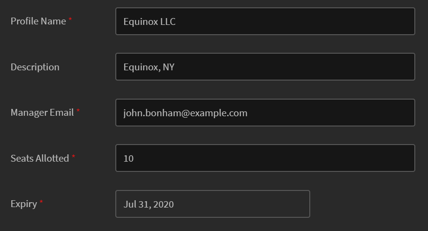
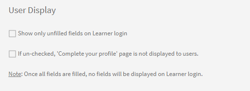

# Añadir usuarios y crear grupos de usuarios

Obtenga información sobre cómo añadir usuarios o grupos de usuarios en la aplicación Learning Manager.

<!---->

## Administrar grupos de usuarios

En este curso de formación, aprenderá a crear un grupo de usuarios por nombres, ID de correo electrónico y combinando varios grupos de usuarios generados automáticamente.

<!--In this training, you will learn how to create a user group by names, email IDs, and combining multiple auto-generated user groups.-->

Si no puede iniciar el curso de formación, escriba a <almacademy@adobe.com>.

## Información general {#overview}

En Adobe Learning Manager, puede asumir las funciones siguientes:

* **Administrador:** define la estrategia de formación de la empresa. Un administrador puede agregar alumnos, buscar las aptitudes correspondientes para los alumnos, administrar y asignar cursos, crear planes de aprendizaje, certificaciones y programas de aprendizaje, y administrar informes para toda la empresa.
* **Autor:** diseñador pedagógico y creador de contenido. Un autor puede añadir módulos y cursos a Learning Manager.
* **Responsable:** administra las actividades de aprendizaje de un equipo. Un responsable puede nominar integrantes del equipo para realizar un curso, aprobar solicitudes de integrantes del equipo y proporcionar comentarios sobre su rendimiento tras haber completado la formación. Los responsables también pueden ver informes de su equipo para controlar el rendimiento.
* **Alumno:** los alumnos pueden tener acceso a los cursos, programas de aprendizaje y certificaciones que se les han asignado. Asimismo, pueden explorar todos los cursos disponibles mediante un catálogo e inscribirse en cursos, programas de aprendizaje o certificaciones.

Como administrador, puede añadir usuarios de tres maneras:

* Interno
* Externo
* Grupos de usuarios

## Agregar un único usuario {#addasingleuser}

Añadir alumnos internos a Adobe Learning Manager con la opción de un solo usuario.

Si no puede iniciar el curso de formación, escriba a <almacademy@adobe.com>.

Para añadir usuarios:

1. Inicie sesión como administrador en Adobe Learning Manager.
1. En la página de inicio, haga clic en **[!UICONTROL Añadir usuarios]**. En esta página, puede agregar un único usuario o varios a la vez mediante un archivo .csv. También puede crear un vínculo de registro automático para empleados internos o crear un perfil de alumno externo.
1. Para agregar un único usuario, haga clic en **[!UICONTROL Agregar]** en la esquina superior derecha; a continuación, elija la opción **[!UICONTROL Usuario único]**.

1. Para agregar un único usuario, haga clic en **[!UICONTROL Agregar]** en la esquina superior derecha; a continuación, elija la opción **Usuario único**.

   
   *Añadir un único usuario interno*

1. En el cuadro de diálogo **[!UICONTROL Añadir usuario]**, indique los datos del alumno. En el campo **[!UICONTROL Nombre del responsable]**, seleccione el nombre de un usuario que ya exista en el sistema.

   
   *Cuadro de diálogo Agregar usuario*

1. Para añadir el nuevo usuario a Learning Manager, haga clic en **[!UICONTROL Añadir]**. Después de agregar el usuario, este recibe un correo de verificación. A continuación, el alumno activa la cuenta y empieza a utilizar Learning Manager. Este flujo de trabajo es útil si necesita añadir un número limitado de alumnos a su cuenta de Learning Manager. Ahora bien, si tiene previsto inscribir a todos los empleados de una empresa grande, los puede incorporar de una sola vez. Para obtener más información, consulte la sección siguiente.

## Agregar usuarios en bloque {#addusersinbulk}

En general, las empresas utilizan sistemas de administración de recursos humanos con los cuales mantienen todos los registros de los empleados, por ejemplo denominación, ubicación, fecha de incorporación o jerarquía. Esta información se puede exportar a formato .csv. Para importar a un archivo .csv, siga los pasos que se indican a continuación:

1. Haga clic en **[!UICONTROL Agregar]** en la esquina superior derecha y elija la opción **[!UICONTROL Cargar un CSV]**.

   
   *Cargar un archivo CSV para añadir usuarios en bloque*

1. El archivo .csv que se carga se compone de campos, como se muestra a continuación:

   
   *Estructura del CSV*

   Debe mantener un archivo CSV maestro y realizar todas las adiciones y eliminaciones en el archivo CSV maestro. El informe csv maestro contiene los siguientes campos:

   * name &#42;
   * correo electrónico &#42;
   * perfil
   * responsable

   (&#42;) Campo obligatorio.

1. Tras hacer clic en la opción **[!UICONTROL Cargar un CSV]**, se muestra el cuadro de diálogo siguiente.

   
   *Cuadro de diálogo Cargar CSV*

1. Elija el archivo .csv, o arrástrelo y suéltelo. Una vez que haya elegido el archivo, asigne los campos de datos a los del archivo CSV. Haga clic en el menú desplegable pertinente y elija el campo adecuado.

   
   *Asignar campos en CSV*

1. Para empezar a importar usuarios, haga clic en **[!UICONTROL Guardar]**. Puede ver un mensaje de confirmación.

   
   *Mensaje de confirmación para la carga correcta del archivo CSV*

1. Los nuevos usuarios ahora se incorporan a su cuenta de Adobe Learning Manager. Para seleccionar los usuarios nuevos, marque la casilla de verificación junto a los nombres.

   
   *Nuevos usuarios añadidos*

>[!NOTE]
>
>Para obtener más información, consulte las preguntas frecuentes y [Agregar usuarios en bloque](../add-users-in-bulk.md).

Tras haber seleccionado los usuarios, puede efectuar las acciones siguientes:

## Registrar un usuario {#registerauser}

Después de seleccionar el usuario, haga clic en **[!UICONTROL Acciones]** en la esquina superior derecha y elija la opción **[!UICONTROL Registrar]**.

Los usuarios seleccionados reciben un correo electrónico de bienvenida. Si los alumnos ya tienen un Adobe ID, pueden hacer clic en este vínculo. Si no tienen un Adobe ID existente, pueden hacer clic en el vínculo Bienvenido para crear un Adobe ID y vincularlo a su cuenta de Learning Manager.

## Asignar una función {#assignarole}

Tras añadir alumnos a la cuenta de Adobe Learning Manager, si desea cambiarles las funciones, haga clic en Acciones en la esquina superior derecha de la página. Elija la opción **[!UICONTROL Asignar función]**. Aquí puede decidir si otorga acceso de autor o de administrador al alumno. Después de asignar una función, este alumno tiene acceso de autor a la cuenta y puede añadir módulos y crear cursos.

*Asignar una función a un usuario*

## Eliminar una función {#removearole}

También puede eliminar el acceso de autor o administrador a un usuario. Seleccione uno o más usuarios, haga clic en **[!UICONTROL Acciones]** y elija **[!UICONTROL Eliminar función]**. Elija una opción, por ejemplo, **[!UICONTROL Quitar autor]** y se revoca el acceso de autor para este alumno.

>[!NOTE]
>
>No es posible asignar manualmente la función de responsable en el sistema. Se tiene acceso automáticamente al tablero de responsable cuando se agregan a él uno o más empleados.

## Eliminar un usuario {#deleteauser}

Para eliminar un usuario, haga clic en **[!UICONTROL Acciones]** y elija **[!UICONTROL Eliminar usuario]**. En el cuadro de diálogo de confirmación, haga clic en **[!UICONTROL Sí]** y el alumno se elimina.

*Mensaje de confirmación para eliminar un usuario*

## Editar un usuario {#editauser}

En la lista de usuarios, elija un usuario y haga clic en él. En los detalles del usuario, haga clic en **[!UICONTROL Editar]** ( ). En el cuadro de diálogo **[!UICONTROL Editar usuario]**, efectúe los cambios correspondientes; para guardarlos, haga clic en **[!UICONTROL Guardar]**.

*Cuadro de diálogo Editar usuario*

## Flujos de trabajo para campos activos y valores de campos activos que conservan la distinción entre mayúsculas y minúsculas

En esta versión, Learning Manager conserva la distinción entre mayúsculas y minúsculas del atributo de usuario y su valor. **Por ejemplo**, la distinción entre mayúsculas y minúsculas de un atributo de usuario es &#39;location&#39;; su valor &#39;PARIS&#39; se conservará y se mostrará de la misma manera. En caso de problemas, el administrador puede editar el nombre y los valores de atributo para corregir cualquier error de distinción entre mayúsculas y minúsculas.

El administrador puede hacer esto visitando **[!UICONTROL Aplicación de administración]** > **[!UICONTROL Usuarios]** > **[!UICONTROL Grupos de usuarios]** y haciendo clic en el nombre del grupo.

El administrador puede añadir y actualizar los valores de atributos permitidos para un alumno mediante la interfaz de usuario.

Tipos de campos activos:

* Agrupable: Los alumnos se agruparían según los valores
* Comunicado: Los grupos de usuarios de informes se crearían en función de los campos activos
* Exportable: Los campos se mostrarán en el informe de grupo de usuarios exportado.

## Crear un registro automático {#createaselfregistrationlink}

También puede permitir que los empleados de su empresa se registren como alumnos en la cuenta de Adobe Learning Manager sin que intervenga en ese proceso como administrador. El administrador puede crear un vínculo de registro automático y compartirlo con los empleados, que pueden registrarse en el administrador de aprendizaje utilizando sus credenciales de Adobe.

En la esquina superior derecha de la página, haga clic **[!UICONTROL Añadir]** y seleccione **[!UICONTROL Registro automático]**.

*Crear vínculo para registrarse como alumno*

Aparece el cuadro de diálogo **[!UICONTROL Añadir perfil de registro automático]**. Asigne un nombre a este perfil. A continuación, indique el nombre del responsable. Es importante saber que el responsable ya debe estar registrado como alumno en Learning Manager.

*Añadir perfil para el registro automático*

Después de hacer clic en **[!UICONTROL Guardar]**, se genera una URL que se puede compartir con los alumnos. Al hacer clic en ella, los alumnos se pueden registrar por su cuenta.

## Inscribir alumnos externos {#enrollexternallearners}

En Adobe Learning Manager, también es posible crear vínculos de registro para empresas o socios externos con acceso limitado a su cuenta y proporcionarles material de aprendizaje.

Los registros internos y externos presentan algunas diferencias.

<table>
 <tbody>
  <tr>
   <td>
    
<b>Usuarios internos</b>
</td>
   <td>
    
<b>Usuarios externos</b>
</td>
  </tr>
  <tr>
   <td>
    
Inicio de sesión con Adobe ID o mediante credenciales de inicio de sesión único.
</td>
   <td>
    
Inicio de sesión con cualquier ID de correo electrónico.
</td>
  </tr>
  <tr>
   <td>
    
La interacción está disponible.
</td>
   <td>
    
La interacción no está disponible.
</td>
  </tr>
  <tr>
   <td>
    
Las jerarquías de alumno están disponibles.
</td>
   <td>
    
Las jerarquías de alumno no están disponibles.
</td>
  </tr>
 </tbody>
</table>

Para inscribir usuarios externos, siga los pasos que se indican continuación:

1. En el panel de navegación izquierdo, haga clic en **[!UICONTROL Externo]**.

   

   *Inscribir usuarios externos*

1. En la esquina superior derecha de la página, haga clic en **[!UICONTROL Agregar]**.

1. En el cuadro de diálogo **Añadir perfil de registro externo**, indique la información siguiente:

   * El nombre de perfil de la organización asociada.
   * La dirección de correo electrónico del responsable de la organización asociada.
   * Límite de puestos para la inscripción externa de este socio.
   * Fecha de caducidad para establecer una fecha límite para dejar de permitir nuevos registros en este grupo. Posteriormente a la fecha de caducidad, solo pueden acceder a esta formación los usuarios que ya se hayan registrado.

   

   *Cuadro de diálogo Añadir perfil de registro externo*

   * En la **[!UICONTROL Configuración avanzada]** , introduzca lo siguiente:

      * **[!UICONTROL Requisito de inicio de sesión]:** Especifique un valor en días. Los alumnos se eliminan si no inician sesión durante el tiempo especificado.
      * **[!UICONTROL Dominios permitidos]:** Una lista separada por comas de nombres de dominio de correo electrónico de la lista blanca.
      * **[!UICONTROL Verificación por correo electrónico obligatoria]:** Seleccione esta opción para que la verificación por correo electrónico sea obligatoria para un alumno.

   

   *Introduzca los detalles en la sección Configuración avanzada*

1. Tras hacer clic en **[!UICONTROL Guardar]**, puede ver el mensaje de confirmación siguiente. Debe compartir la URL con su socio externo.

   

## Activar un perfil externo {#enableanexternalprofile}

Después de crear un perfil externo, debe activar su estado. En la lista de perfiles externos, elija el perfil correspondiente y active el botón de estado.

*Habilitar un perfil externo*

De este modo, se activa el vínculo de inscripción externa. El socio recibe automáticamente un correo electrónico de bienvenida. También puede copiar el vínculo y compartirlo haciendo clic en el icono Copiar URL (); otra opción es reenviar el correo electrónico de bienvenida a la empresa asociada haciendo clic en el icono Correo ().

El gestor de socios puede compartir el enlace con los empleados que deben realizar la formación en PreLearning Manager. Al hacer clic en el vínculo, se pueden inscribir por su cuenta tras facilitar algunos datos a fin de crear su perfil en Learning Manager. Estos usuarios no seleccionados no aparecerán en la Ficha Alumnos con los alumnos internos. Sus nombres figuran en la ficha **[!UICONTROL Alumnos externos]**.

## Pausar un perfil externo {#pause}

Después de añadir un grupo de usuarios externos a Learning Manager, también puede pausar el proceso de registro de usuarios externos. Al pausar, se bloquea el proceso de registro de los usuarios externos. Sin embargo, este proceso solo funciona cuando los usuarios aún no se han registrado aceptando la invitación.

Para pausar los grupos de usuarios externos, elija uno o más grupos; a continuación, haga clic en **[!UICONTROL Acciones]** en la esquina superior derecha de la página y seleccione **[!UICONTROL Pausar]**.

## Reanudar un perfil externo {#resumeanexternalprofile}

En cualquier momento puede revocar el estado de pausa de un socio externo y reanudar los servicios normales. Haga clic en **[!UICONTROL Acciones]** en la esquina superior derecha de la página y seleccione **[!UICONTROL Currículum]**.

Los estados siguientes se aplican a usuarios externos:

* **Estado inactivo** - En este estado, el registro de los usuarios externos ha caducado. Los administradores establecen la fecha de caducidad de los usuarios externos al incorporarlos mediante el flujo de trabajo Añadir usuario.
* **Estado Activo:** en este estado, los usuarios externos se pueden registrar en la aplicación Learning Manager e iniciar sesión en ella.
* **Pausa**: en este estado, el proceso de registro está bloqueado para usuarios externos. Sin embargo, los usuarios que ya existen pueden seguir iniciando sesión.

## Comprobar los puestos utilizados {#checkusedseats}

En la lista de perfiles externos, haga clic en **[!UICONTROL Puestos usados]**. Puede ver la cantidad de alumnos de la empresa asociada que se han agregado.

*Comprobar asientos usados*

## Eliminar un usuario {#Deleteauser-1}

Elija un usuario y, en la esquina superior derecha, haga clic en **[!UICONTROL Acciones]** > **[!UICONTROL Eliminar usuario]**.

## Cambiar perfil {#changeprofile}

Para mover un usuario a otro perfil externo, elija un usuario. En la esquina superior derecha, haga clic en **[!UICONTROL Acciones]** > **[!UICONTROL Cambiar perfil]**. En la lista de perfiles, elija un perfil y haga clic en **[!UICONTROL Cambiar]**.

## Asignar una función {#Assignarole-1}

Elija un usuario y, en la esquina superior derecha, haga clic en **[!UICONTROL Acciones]** > **[!UICONTROL Asignar función]** > **Crear`<role>`**. El usuario recibe una función nueva.

## Eliminar una función {#Removearole-1}

Elija un usuario y, en la esquina superior derecha, haga clic en **[!UICONTROL Acciones]** > **[!UICONTROL Quitar rol]** > **Quitar`<role>`**. La función seleccionada se elimina de la lista de funciones que el usuario tenía asignadas.

## Crear grupos de usuarios {#createusergroups}

Un grupo de usuarios es un conjunto de usuarios que se inscriben en una categoría determinada. Los grupos de usuarios permiten a los administradores seleccionar los alumnos de la empresa según sus atributos y, de este modo, asignarles contenido de aprendizaje. Además, estos grupos de usuarios permiten a los administradores asignar logotipos y catálogos personalizados a los alumnos, y mostrar informes personalizados sobre su progreso.

Para acceder a los grupos de usuarios, en el panel izquierdo haga clic en **[!UICONTROL Grupos de usuarios]**.

*Crear grupos de usuarios*

Existen dos tipos de grupos en Adobe Learning Manager: personalizados y generados automáticamente. Al agregar alumnos a su cuenta, algunos grupos se crean automáticamente a partir de sus propiedades comunes.

Para ver grupos que se han creado de manera automática, haga clic en la ficha **[!UICONTROL Generado automáticamente]**.

*Ver grupos generados automáticamente*

Aquí existen diferentes grupos, por ejemplo Todos los usuarios internos o Todos los responsables, grupos que se basan en el centro de costes, en el departamento y en los equipos de los responsables.

Además de los grupos generados automáticamente, puede crear grupos personalizados. Para añadir un nuevo grupo personalizado, en la esquina superior derecha, haga clic en **[!UICONTROL Añadir]**.

1. Escriba el nombre y la descripción del grupo.
1. Escriba el nombre o el perfil de usuario en el campo de búsqueda según se escribe y selecciónelo en la lista desplegable para añadir usuarios.

1. Para añadir más alumnos, haga clic en **[!UICONTROL Añadir más usuarios]**.

1. Para crear el grupo de usuarios, haga clic en **[!UICONTROL Guardar]**.

Se crea este grupo personalizado y se incorpora al perfil. Los grupos de usuarios que crea son de naturaleza dinámica. Si se añaden usuarios con atributos similares, de manera automática se agregan al grupo de usuarios.

## Exclusión de grupos de usuarios

A veces, es posible que desee excluir un pequeño conjunto de usuarios de un grupo de usuarios grande. Esto es necesario para inscribir este conjunto específico de usuarios en la formación mediante planes de aprendizaje o para configurar la visibilidad correcta de los catálogos. En esta versión de Learning Manager, puede excluir alumnos o grupos de usuarios al crear un grupo de usuarios personalizado. En el cuadro de diálogo Añadir grupo de usuarios, la sección Excluir alumnos le permite realizar esta acción.

*Excluir grupos de usuarios*

Por ejemplo, si desea configurar un plan de aprendizaje para que se inscriban todos los usuarios que pertenezcan a la ubicación = California, excepto Store-5 (ubicada en California).

## Configuración avanzada {#advancedsettings}

### Fuentes de datos {#datasources}

Puede utilizar esta función cuando desee importar o sincronizar los usuarios o los datos de aprendizaje de la base de datos de su organización en la aplicación Learning Manager. También puede configurar la frecuencia de esta sincronización.

Haga clic en **[!UICONTROL Orígenes de datos]** en el panel izquierdo debajo de **[!UICONTROL Avanzado]** sección.

*Orígenes de datos para importar o sincronizar usuarios*

Elija el tipo de origen de datos de la **[!UICONTROL Source]** , seleccione la frecuencia de actualización y haga clic en **[!UICONTROL Sincronizar ahora]** si necesita sincronizar inmediatamente o hacer clic en **[!UICONTROL Guardar].** Los tipos de orígenes de datos son SFDC, FTP, etc., para usuarios internos.

Puede añadir varias fuentes de datos.

### Campos activos {#activefields}

Esta función permite a los administradores agregar más campos activos además de lo que se ha proporcionado durante el registro del usuario.

Haga clic en **[!UICONTROL Campos activos]** disponible en la página usuarios. Los alumnos solo pueden elegir entre los valores proporcionados en valores personalizados.

*Campos activos*

### Configurar campos {#configurefields}

**Usuarios internos**

Puede añadir valores personalizados para campos de usuario de usuarios internos.

Para añadir valores personalizados, siga estos pasos:

1. Haga clic en  **[!UICONTROL Modificar valores]** para un usuario interno.

   
   *Modificar valores para usuarios internos*

1. La **Valores del campo Personalizado** que aparece.

   
   *Valores del cuadro de diálogo Campos personalizados*

1. En el menú desplegable **[!UICONTROL Campo seleccionado]**, seleccione el valor que añadir.
1. Indique valores nuevos en el campo **[!UICONTROL Nuevo valor]**.
1. Haga clic en **[!UICONTROL Listo]**.
1. En la esquina superior derecha, haga clic en **[!UICONTROL Guardar]** para conservar los cambios.

**Usuarios externos**

Añada valores personalizados similares a ese para usuarios internos.

*Modificar valores para usuarios externos*

### Configuración {#settings}

**Visualización de usuario**

Si la opción **Mostrar solo campos sin rellenar al iniciar sesión como alumno** está habilitada, un usuario solo ve los campos en blanco al iniciar sesión.

*Mostrar campos sin rellenar*

Con esta opción, un administrador puede decidir mostrar los campos u ocultarlos una vez que se hayan rellenado.

## Restringir campos activos en informes {#restrictactivefields}

Learning Manager 27.7 presenta dos nuevas opciones: **[!UICONTROL Comunicado]** y **[!UICONTROL Exportable]**, para Campos activos.

*Opciones de Campos activos*

Para los campos CSV y los campos añadidos manualmente, si un campo activo se marca como **[!UICONTROL Reportable]**, se puede buscar en un filtro dentro de un informe del tablero.

*Filtros en un informe de tablero*

Si un campo activo se marca como **[!UICONTROL Exportable]**, aparece en el archivo de Excel al descargar cualquier informe de Excel.

Estas opciones aparecen para los campos activos internos y externos.

Solo puede eliminar un campo activo personalizado.

## Visualización de usuario

Puede ocultar toda la página &quot;Completar su perfil&quot; a los alumnos. La página no aparecerá cuando el alumno inicie sesión.

Tenga en cuenta que el comportamiento predeterminado existente no cambia. Esta es una capacidad opcional que ahora están disponibles para los administradores.

Habilite las opciones siguientes:

*Sección Visualización de usuario*

## Compatibilidad con campos CSV manuales mediante conectores de FTP y Box {#import-connector}

A menudo, los usuarios desean que los campos activos se proporcionen manualmente cuando un alumno inicie sesión en Learning Manager. Esto es posible en Learning Manager en este momento, cuando el usuario importa un archivo CSV manualmente.

Es posible que el archivo CSV no contenga todos los campos activos. Para todos los campos activos que no se actualizan en el archivo CSV cargado, el usuario debe introducir los datos de dichos campos activos.

Actualmente, todos los campos activos deben asignarse a algún campo desde el CSV de origen.

Sucede que, a veces, un usuario no desea asignar un campo activo a un campo especificado en el CSV. En estos casos, el usuario puede asignar el campo Activo al valor **[!UICONTROL DontImportFromSource]**. Seleccione este valor en la lista desplegable al importar usuarios desde conectores de FTP y Box.

## Funciones personalizadas {#customroles}

Añada cualquier campo que desee como parte de su información de usuario y haga clic en **[!UICONTROL Guardar]**. Después de agregar los campos, también puede comprobar la disponibilidad de los campos en el **[!UICONTROL Editar usuarios]** diálogo.

Después de añadir los campos, puede observar que los campos que llevan la marca de verificación se obtienen de la fuente de datos o del archivo .csv como se muestra en la captura de pantalla siguiente. El administrador puede editar estos campos de origen habilitando o deshabilitando los campos.

**Valores de campos activos en Learning Manager**

Los valores de los campos activos se obtienen de las siguientes maneras:

1. La aplicación Learning Manager importa metadatos de fuentes de datos asociadas con su cuenta.
1. Metadatos capturados desde el archivo .csv importado manualmente.
1. Los alumnos rellenan los metadatos al iniciar sesión.
1. El administrador proporciona los datos para los usuarios.

>[!NOTE]
>
>La aplicación Learning Manager crea automáticamente grupos de usuarios a partir de estos metadatos.

**Añadir valor personalizado**

Puede añadir valores personalizados para campos de usuario en los campos de usuario Interno y Externo.

Para añadir valores personalizados, siga estos pasos:

Los campos personalizados se pueden añadir y eliminar; son aplicables a todos los usuarios. Los campos CSV se pueden habilitar o deshabilitar; solo se aplican al cargar el archivo .csv tras efectuar las modificaciones en los campos activos. Todos los campos activos internos son aplicables a todos los tipos de usuarios internos. Los campos externos solo son aplicables a usuarios externos. Si un campo personalizado está presente en el archivo .csv, en la siguiente carga se convierte automáticamente a un campo CSV y queda habilitado.

## Valores de campos CSV {#valuesforcsvfields}

Los usuarios solo pueden elegir en campos predefinidos de campos CSV si se selecciona la casilla de verificación **[!UICONTROL Restringir selección]**.

*Casilla de verificación Restringir selección*

## Importar registros {#importlogs}

En este espacio, puede ver el historial de importación del archivo .csv para los usuarios que el administrador ha añadido mediante la función de importación en bloque. También puede hacer clic en **[!UICONTROL Añadir]** en la esquina superior derecha de la página para añadir usuarios mediante la función de carga de CSV.

## Campos activos de varios valores

Con esta función, puede tener más de un campo para un campo activo. En una cuenta, puede haber como máximo tres campos activos de varios valores. Los campos activos de varios valores están disponibles para usuarios internos y externos.

Una vez marcado un campo activo como de varios valores, no puede volver a convertirlo en uno de un solo valor. Este proceso es irreversible.

Un campo de un solo valor existente no se puede marcar como un campo de varios valores.

Para crear un campo activo de varios valores, siga los pasos que se indican a continuación:

1. Añada un campo activo.

   
   *Agregar un campo activo*

1. Haga clic en Añadir.
1. En la ficha Configuración, marque el nuevo campo como multivalor.

   
   *Marcar como multivalor*

   Hay otra casilla de verificación, **[!UICONTROL Configurable por el alumno]**, que cuando está desactivada, el alumno no podrá ver el campo en la página Perfil.

1. Añada los valores mediante un archivo CSV o haciendo clic en Modificar valores.

   
   *Agregar valores*

1. Haga clic en [!UICONTROL **Listo**].

>[!NOTE]
>
>Una vez creado el grupo de usuarios y rellenado el campo, no se pueden convertir varios valores en valores individuales y viceversa.

### Añadir un campo activo de varios valores mediante un archivo .csv

Siga los pasos a continuación:

1. Cree un archivo .csv con los nuevos campos activos como columnas (valores separados por comas o valores únicos).
1. Importe el archivo .csv.
1. Marque los campos como multivalor en el cuadro de diálogo Valores en campos personalizados .
1. Vuelva a importar el archivo .csv.

El archivo .csv debe tener una columna con el mismo nombre que la de un campo activo marcado como de varios valores.

El archivo .csv contiene los siguientes campos:

* **[!UICONTROL Usuario]**: grupos de usuarios creados como funciones.
* **[!UICONTROL Funciones]**: Campo activo multivalor con valores.

Si se vuelve a cargar el archivo .csv con nuevos valores o se eliminan valores, los campos y los grupos activos también se actualizan en consecuencia.

### Informes

Todos los informes incluyen campos activos y sus valores.

El administrador puede añadir campos activos generados automáticamente y configurar los informes de formación y actividad del usuario.

El informe Transcripciones de alumnos contiene todos los campos activos y valores separados por comas. A continuación, el administrador puede filtrar los datos como corresponda.

## Preguntas más frecuentes {#faq}

+++Cómo registrar usuarios en Learning Manager

Después de agregar un usuario y asignarle una función, puede registrarlo realizando los pasos que se indican a continuación:

1. Con el usuario o los usuarios seleccionados, haga clic en **[!UICONTROL Acciones]** en la esquina superior derecha y haga clic en **[!UICONTROL Registro]**.

1. En la ventana emergente, haga clic en **[!UICONTROL Sí]**.

Los usuarios seleccionados reciben un correo electrónico de bienvenida. Si los alumnos ya tienen un Adobe ID, pueden hacer clic en este vínculo. Si no tienen un Adobe ID existente, pueden hacer clic en el vínculo Bienvenido para crear un Adobe ID y vincularlo a su cuenta de Learning Manager.

Es obligatorio que los alumnos hagan clic en uno de estos vínculos para que Learning Manager verifique sus cuentas.

+++

+++Cómo editar datos de usuarios?

Para editar un usuario, siga los pasos que se indican continuación:

1. En la lista de usuarios, haga clic en el usuario para el que desea editar los datos.
1. Haga clic en el ícono de lápiz, como se muestra a continuación.

En el cuadro de diálogo **Editar usuario**, actualice los campos, según sea necesario. Para guardar los cambios, haga clic en **[!UICONTROL Guardar]**.

+++

+++Cómo pausar y reanudar un usuario externo en Learning Manager

En la lista de usuarios externos, seleccione el usuario que desea eliminar. En la esquina superior derecha, haga clic en **[!UICONTROL Acciones]** > **[!UICONTROL Pausa]**.

Para obtener más información, consulte [Pausar un perfil externo](add-users-user-groups.md#pause).

Después de pausar un perfil, el perfil externo muestra el estado como ***Pausado***.

+++

+++Cómo enviar el correo electrónico de bienvenida al perfil externo recién creado?

Al añadir un usuario externo, en el **[!UICONTROL Añadir perfil de registro externo]** , introduzca el correo electrónico del responsable externo. Al hacer clic en Guardar, también se enviará un mensaje de bienvenida a la dirección de correo electrónico especificada. Si desea volver a enviar el mensaje de bienvenida, haga clic en el icono de sobre, como se muestra a continuación:

+++

+++Cómo crear grupos de usuarios personalizados

Haga clic en **[!UICONTROL Usuarios]** > **[!UICONTROL Grupos de usuarios]** y en la página Grupos de usuarios, haga clic en **[!UICONTROL Añadir]**. En el cuadro de diálogo Añadir grupo de usuarios, añada los usuarios de forma individual y como un equipo.

+++

+++Cómo deshabilitar los campos activos ya rellenados?

Si desea que los alumnos solo vean los campos activos que no han rellenado, siga los pasos que se indican a continuación:

1. Haga clic en **[!UICONTROL Usuarios]** > **[!UICONTROL Campos activos]**.

1. Haga clic en **[!UICONTROL Configuración]** y activar la opción **[!UICONTROL Mostrar solo campos sin rellenar al iniciar sesión como alumno]**.

1. Haga clic en **[!UICONTROL Guardar]**.

+++

+++Cómo evitar que los alumnos introduzcan valores aleatorios en los campos activos.

Puede restringir la selección de los alumnos para que solo puedan seleccionar los valores predefinidos y no introducir valores aleatorios. Siga los pasos a continuación:

1. Haga clic en **[!UICONTROL Usuarios]** > **[!UICONTROL Campos activos]**.
1. Active la opción **[!UICONTROL Restringir selección]**.
1. Haga clic en **[!UICONTROL Listo]**.

+++

+++ ¿Cómo diferencio los campos activos de CSV de los campos activos personalizados?

Solo puede habilitar o deshabilitar los campos activos de CSV, pero no puede eliminarlos. Por otro lado, no puede habilitar ni deshabilitar campos activos personalizados.

+++
