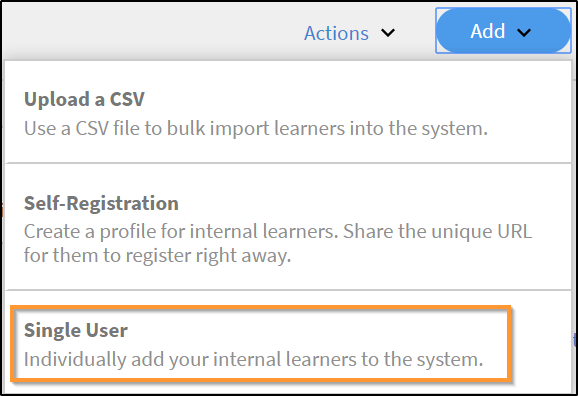
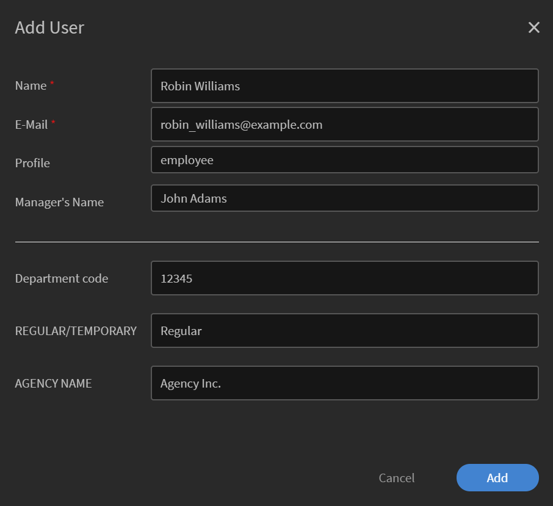
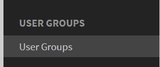

# Añadir usuarios en Adobe Learning Manager

En Adobe Learning Manager, los usuarios son personas que utilizan la plataforma para el aprendizaje o la formación. Hay dos tipos de usuarios: usuarios internos y usuarios externos.

Los usuarios internos son empleados o miembros del equipo de su organización.

Los usuarios externos son personas ajenas a su empresa, como clientes, socios, proveedores o clientes, que pueden acceder a su contenido de aprendizaje.

Adobe Learning Manager (ALM) permite a los administradores integrar y administrar usuarios internos y externos mediante diversos métodos, incluidas la entrada manual, la carga de CSV, el registro automático y las integraciones de sistemas.

## Usuarios internos

Los usuarios internos de Adobe Learning Manager se refieren a los empleados o miembros del equipo de su organización. Puede añadirlos manualmente, cargarlos en bloque o importarlos mediante integraciones del sistema. Después de añadir a estos usuarios, puede organizarlos en grupos, asignar cursos y supervisar su progreso de aprendizaje.

Los usuarios de Adobe Learning Manager pueden asumir diferentes responsabilidades y administrar diversas tareas en función de las funciones que tengan asignadas. Cada función, incluidos el administrador, el autor, el instructor y el administrador de integración, ofrece un conjunto de capacidades específicas adaptadas para respaldar las responsabilidades del usuario dentro de la plataforma.

Adobe Learning Manager admite las siguientes funciones de usuario:

* **Administrador**: Administra usuarios y grupos de usuarios, asigna funciones y configura preferencias en todo el sistema como orígenes de datos, dominios permitidos y opciones de visualización. Los administradores también son responsables de crear y organizar el contenido de aprendizaje, realizar el seguimiento del progreso de los alumnos, generar informes y configurar integraciones con sistemas externos.
* **Autor**: Crea y administra contenido, incluidos módulos y cursos.
* **Responsable**: supervisa las actividades de aprendizaje del equipo, designa a miembros del equipo para los cursos, aprueba solicitudes y proporciona comentarios.
* **Administrador de integración**: Administra las integraciones del sistema y las conexiones de datos entre ALM y las plataformas externas.
* **Funciones personalizadas**: los administradores pueden crear funciones personalizadas para dar a los usuarios acceso personalizado en función de sus responsabilidades. Consulte este artículo para obtener más información sobre las funciones personalizadas.

### Métodos para añadir usuarios internos

Los administradores pueden añadir usuarios internos mediante los siguientes métodos:

* **Agregar un solo usuario**: agregue manualmente un usuario cada vez.
* **Perfil de registro automático**: permite que los alumnos se registren automáticamente como alumnos en Adobe Learning Manager mediante un vínculo de registro creado por el administrador.
* **Carga en bloque mediante CSV**: carga un archivo CSV para agregar varios usuarios a la vez.

### Añadir manualmente un usuario interno

Los administradores pueden añadir manualmente usuarios individuales introduciendo su nombre, ID de correo electrónico, identificador único y nombre del responsable. El identificador único de Adobe Learning Manager es un identificador necesario que los administradores asignan al crear un usuario. Debe ser único para cada usuario y servir de referencia coherente en todo el sistema.

>[!INFO]
>
>Vea este curso de formación de ALM Academy para obtener más información sobre cómo añadir usuarios individuales en Adobe Learning Manager.  

Para añadir un solo usuario a Adobe Learning Manager:

1. Inicie sesión como administrador.
2. Seleccione **Usuarios** y, a continuación, seleccione **Interno**.
3. Seleccione **Agregar** y, a continuación, seleccione **Usuario único**.

   
   _Interfaz de administrador que muestra la opción de agregar manualmente un único usuario interno_
4. En el símbolo del sistema **Agregar usuario**, escriba el **Nombre**, **Correo electrónico** y el **Perfil** (cargo) del usuario.

   
   _Campos para escribir el nombre, el correo electrónico, el identificador único y el perfil de un nuevo usuario_
5. Busque el responsable del usuario y seleccione el nombre en la lista de responsables.
6. Seleccione **Agregar**.
El usuario recibe un correo electrónico de bienvenida que contiene una URL de inicio de sesión para el acceso.

### Permitir el registro automático para usuarios internos

El registro automático es un proceso de incorporación de autoservicio en el que los usuarios pueden visitar una URL de registro, introducir sus datos e inscribirse automáticamente en la plataforma. Este método minimiza el esfuerzo administrativo al permitir a los usuarios registrarse a través de la dirección URL proporcionada.

Para crear una URL de registro automático para un usuario:

1. Inicie sesión como administrador.
2. Seleccione **Usuarios** y, a continuación, seleccione **Interno**.
3. Seleccione **Agregar** en la esquina superior derecha y, a continuación, seleccione **Registro automático.**

   
   _Menú desplegable para seleccionar la opción de registro automático_
4. En el símbolo del sistema **Agregar perfil de registro automático**, escriba el perfil en el campo **Nombre de perfil** (cargo del usuario).
5. Seleccione el administrador del usuario buscando el administrador en el campo **Nombre del administrador**. El responsable asignado al perfil de registro automático debe ser un usuario registrado en Adobe Learning Manager.

   
   _Campos de entrada para establecer el cargo y asignar un administrador a un perfil de registro automático_
6. Seleccione una imagen con la opción **Agregar imagen**. Esta imagen estará visible para los alumnos en la sección de perfil.
7. Seleccione **Guardar**.

   Adobe Learning Manager crea un perfil de usuario y genera una URL de registro automático, que se puede compartir con los usuarios para completar su registro.

   
   _Mensaje de confirmación que indica la creación correcta de una URL de registro automático_
8. Comparta la URL con los usuarios que deseen registrarse por sí mismos.

   La URL se puede compartir con varios usuarios para su registro. Por ejemplo, puede generar una dirección URL para el perfil **Sales Associate** y compartirla con el equipo de Sales Associate para que se registren.

_El vínculo de registro automático abre una página de registro_

### Ver la lista de direcciones URL de registro automático

Para ver la lista de direcciones URL de registro automático:

1. Seleccione **Usuarios** y, a continuación, seleccione **Interno**.
2. Seleccione **Registro automático**.

   Los administradores pueden ver la lista de direcciones URL de registro automático.

_Vista de lista que muestra las direcciones URL de registro automático disponibles para usuarios internos_

### Cargar usuarios internos en bloque

Adobe Learning Manager permite a los administradores añadir varios usuarios a la vez cargando un archivo CSV que contiene la información del usuario, incluidos el nombre, el ID de correo electrónico y el nombre del responsable. Esta función de carga en bloque ahorra tiempo y esfuerzo en comparación con la adición de usuarios individualmente.

>[!INFO]
>
>Vea este curso de formación de ALM Academy para aprender a añadir usuarios en bloque mediante un CSV.   

Para añadir varios usuarios:

1. Inicie sesión como administrador.
2. Seleccione **Usuarios** y, a continuación, seleccione **Interno**.
3. Seleccione **Agregar** en la esquina superior derecha y seleccione **Cargar un CSV**.

   
   _Opción para cargar un archivo CSV para la importación masiva de usuarios_

4. Prepare un archivo CSV con los siguientes campos:

   * Nombre del empleado*
   * Correo electrónico del empleado*
   * Perfil/designación del empleado
   * Id./correo electrónico del responsable\
     (*) Campos obligatorios.

5. Antes de añadir el ID de correo electrónico de un responsable para cualquier empleado, asegúrese de que el responsable ya esté incluido como empleado en el archivo CSV. Por ejemplo, consulte al empleado llamado Howard Walters en la captura de pantalla siguiente.

   
   _Imagen de archivo CSV de muestra con todos los campos_

6. Cargue el archivo CSV y asigne los campos de datos según corresponda.

   
   _Interfaz de asignación de CSV para alinear columnas de hoja de cálculo con campos del sistema_
7. Seleccione **Guardar** para importar los usuarios.

   Aparece un mensaje de confirmación después de que la carga se realice correctamente.

   
   _La imagen muestra el estado de la carga del archivo CSV como correcta_

>[!NOTE]
>
>Mantener un archivo CSV maestro para todas las adiciones y eliminaciones. No es posible actualizar y volver a cargar un archivo CSV existente.

Al cargar un archivo CSV para añadir usuarios, es importante incluir toda la información relacionada en el orden correcto. Si asigna el ID de correo electrónico de un responsable a un empleado, los detalles del responsable deben aparecer antes en el archivo CSV. Esto garantiza que el sistema reconozca al responsable como un usuario existente antes de vincularlo a los miembros de su equipo. Por ejemplo, si Howard Walters es un responsable, incluya todos sus detalles de usuario en el CSV antes de enumerar los empleados que reportan ante él.

### Administrar registro de usuarios

Después de añadir usuarios individualmente o en bloque, debe registrarlos para activar sus cuentas. Esto permite a los usuarios acceder a Adobe Learning Manager y empezar a utilizar la plataforma.

Para registrar a los usuarios:

1. Seleccione **Usuarios** en la página principal del administrador.
2. Seleccione las casillas de verificación junto a los nombres de los usuarios que desea registrar.
3. Seleccione **Acciones** y, a continuación, **Registrar**.

   
   _Botón de registro para activar los usuarios seleccionados en Adobe Learning Manager_

4. Seleccione **Sí** para activar el usuario.

Se envía un correo electrónico de verificación al usuario. El usuario debe seleccionar el vínculo en el correo electrónico para activar su cuenta y comenzar a utilizar Adobe Learning Manager.

## Usuarios externos

Adobe Learning Manager le permite añadir usuarios fuera de su empresa, como clientes, socios, proveedores o clientes, para acceder al contenido de aprendizaje. Una vez agregados, puede agruparlos, asignar cursos y realizar un seguimiento de su progreso de aprendizaje.

La adición de usuarios externos en Adobe Learning Manager implica los siguientes pasos:

* Crear un perfil de registro externo
* Habilitar el perfil de registro
* Compartir el vínculo de registro con usuarios externos
* Pausar o reanudar el perfil cuando sea necesario

Adobe Learning Manager admite la inscripción de estos usuarios a través de perfiles de registro externos.

Para crear un usuario externo, siga estos pasos:

1. Inicie sesión como administrador.
2. Seleccione **Usuarios** y, a continuación, seleccione **Externo**.
3. En la esquina superior derecha, selecciona **Agregar** para crear un registro para un usuario externo.
4. En el cuadro de diálogo **Agregar perfil de registro externo**, proporcione lo siguiente:

   * **Nombre de perfil:** Escriba el nombre de la organización asociada que desea obtener acceso a Adobe Learning Manager
   * **Correo electrónico del administrador:** Escriba la dirección de correo electrónico del administrador del usuario.
   * **Límite de puestos:** Establezca el número máximo de inscripciones permitidas.
   * **Caducidad:** Defina la última fecha para nuevos registros. Una vez que caduque, el vínculo no funcionará para el nuevo registro de usuario.

   
   _Cuadro de diálogo para introducir el nombre del perfil, el correo electrónico del administrador, el límite de puestos y la caducidad_

5. Seleccione una imagen con la opción **Agregar imagen**. Esta imagen estará visible para los alumnos en la sección de perfil.
6. Seleccione la sección **Configuración avanzada** para expandirla y escriba los detalles necesarios:
   * **Requisito de inicio de sesión:** Escriba el número de días. Si los alumnos permanecen inactivos durante todo el período, se eliminarán automáticamente.
   * **Dominios permitidos:** Escriba la lista separada por comas de los dominios de correo electrónico permitidos. Solo los usuarios con direcciones de correo electrónico de dominios aprobados pueden registrarse.
   * **Se requiere verificación por correo electrónico:** Seleccione esta opción para aplicar la verificación por correo electrónico durante el registro.

   
   _Panel Configuración avanzada para establecer los requisitos de inicio de sesión, los dominios permitidos y la verificación por correo electrónico_

7. Seleccione **Guardar**.

Se generará una URL de registro.

### Habilitar el perfil externo

Para activar el perfil externo:

1. Localice el perfil recién creado en la lista de perfiles externos.

2. Seleccione el botón de alternancia **Estado** para habilitarlo.

El administrador puede compartir esta dirección URL con el socio externo para que pueda registrarse e iniciar sesión en Adobe Learning Manager con ella.

_Seleccione el conmutador para habilitar el perfil externo_

### Copiar y compartir la URL de registro del perfil externo

La URL de registro para un perfil externo se puede copiar desde la sección **Usuarios externos**.

_Copiar la dirección URL de registro de un perfil externo_

### Diferencias clave entre los registros de usuarios internos y externos

Existen algunas diferencias entre los registros internos y externos:

| Usuarios internos | Usuarios externos |
|---|---|
| Puede iniciar sesión con las credenciales de Adobe ID o SSO. | Puede iniciar sesión con cualquier ID de correo electrónico. |
| La interacción está disponible. | La interacción está disponible. El administrador debe habilitar la interacción para alumnos externos en [Configuración de interacción](https://experienceleague.adobe.com/en/docs/learning-manager/using/admin/gamification). |

### Pausar perfil de registro externo

En Adobe Learning Manager, los administradores pueden administrar el registro de usuarios externos pausando sus perfiles. Esto resulta útil cuando desea pausar temporalmente a los nuevos usuarios para que no se unan mediante un perfil de usuario externo específico. Al pausar un perfil, se impide que los usuarios que han recibido invitaciones pero no se han registrado aún completen el proceso de registro. Esta acción no afecta a los usuarios que ya han completado su registro.

Para pausar un perfil externo:

1. Seleccione **Acciones** en la esquina superior derecha de la página **Usuarios externos**.
2. Seleccione **Pausar** para pausar el perfil de usuario externo.

Esto bloquea el proceso de registro para los usuarios que aún no han aceptado sus invitaciones. Tenga en cuenta que esta acción solo afecta a los usuarios que aún no han completado su registro.

_Opción para pausar un perfil de usuario externo existente desde el menú Acciones_

### Reanudar perfil de registro externo

Si un perfil externo estaba previamente en pausa, los administradores pueden reanudarlo para permitir que los nuevos usuarios completen su registro. Esto reactiva el proceso de registro para los usuarios que fueron invitados pero no completaron su registro.

Para reanudar un usuario externo:

1. Seleccione **Acciones** en la esquina superior derecha de la página.
2. Seleccione **Reanudar** para reanudar el acceso de un asociado en pausa.

_Opción para reanudar un perfil de usuario externo previamente pausado_

### Controlar el uso de asientos externos

Los administradores pueden realizar un seguimiento del número de usuarios añadidos a cada perfil externo en Aprendizaje Adobe.

Para comprobar los asientos usados:

1. Seleccione **Puestos usados** en la lista de perfiles externos.

Puede ver el número de alumnos añadidos a la organización asociada y si los alumnos están activos.

## Administrar usuarios

Los administradores pueden editar los detalles de los usuarios, eliminar usuarios, asignar funciones y eliminar funciones. Esto ayuda a garantizar que cada usuario tenga el acceso y las tareas adecuados.

>[!INFO]
>
>Vea este curso de formación de ALM Academy para aprender a asignar y eliminar funciones, enviar un correo electrónico de bienvenida y eliminar y purgar usuarios. [[button]](https://content.adobelearningmanageracademy.com/app/learner?accountId=98632#/course/7555586) 

### Editar un usuario

Use la opción **Editar usuario** en Adobe Learning Manager para actualizar la información de perfil de un usuario, como el nombre, la dirección de correo electrónico, el identificador único, el perfil y el nombre del administrador. Los administradores pueden realizar estos cambios para garantizar que los datos de los usuarios sean precisos y estén actualizados.

Para editar un usuario:

1. Seleccione **Usuarios** en la página principal del administrador.
2. Seleccione el usuario que desea editar en la lista **Usuarios**.
3. Seleccione **Editar perfil**.

   
   _Opción Eliminar usuario en el menú Acciones para quitar un usuario de la plataforma_

4. Seleccione **Sí** para eliminar el usuario.

Aparece un mensaje de confirmación cuando el usuario se elimina correctamente.

## Asignar una función a un usuario

Las funciones de usuario en Adobe Learning Manager definen qué acciones puede realizar cada persona en el sistema. Cada función incluye permisos específicos basados en las responsabilidades del usuario.

Para asignar funciones a usuarios:

1. Seleccione **Usuarios** en la página principal del administrador.
2. Seleccione el usuario al que desea asignar una función.
3. Seleccione **Acciones** en la esquina superior derecha.
4. Seleccione **Asignar función**.
5. Seleccione el rol requerido.

   
   _Las opciones del menú Asignar función muestran las funciones disponibles para el usuario seleccionado_

6. Seleccione **Sí** en el cuadro de diálogo de confirmación.

## Eliminar una función

Al quitar una función de usuario, se revocan los permisos otorgados por dicha función.

Para eliminar funciones de usuarios:

1. Seleccione **Usuarios** en la página principal del administrador.
2. Seleccione los usuarios cuyas funciones desee quitar.
3. Seleccione **Acciones** y, a continuación, seleccione **Quitar rol**.

   
   _Opción para quitar las funciones asignadas a un usuario en el menú Acciones_

4. Seleccione **Sí** en el cuadro de diálogo de confirmación.
<!--# Add users and create user groups

Learn how to add users or user groups in Learning Manager application.

<!---->

<!--## Overview {#overview}

In Adobe Learning Manager, you can assume the following roles:

* **Administrator:** An Administrator defines the training strategy for the organization. An Administrator can add learners, search required skills for learners, manage and assign courses, create learning plans, certifications, and learning programs, and manage reports for the entire organization.
* **Author:** Authors are Instructional Designers and content creators. An Author can add modules and courses to Learning Manager.
* **Manager:** A Manager manages the learning activities of a team. A Manager can nominate team members to take a course, approve requests from team members, and provide feedback on performance of their team members post-completion of training. Managers can also view reports for their team to track their performance.
* **Learner:** Learners can access courses, learning programs, and certifications assigned to them. Learners can also browse through all the available courses by using a catalog and enroll themselves for either courses, learning programs, or certifications.

As an Administrator, you can add users in three ways:

* Internal
* External
* User groups

## Add a single user {#addasingleuser}

Add internal learners to the Adobe Learning Manager using a single user option.

>[!INFO]
>
>In this training, you will learn how to add internal learners to the Adobe Learning Manager.    

If you're unable to launch the training, write to <almacademy@adobe.com>.

To add users,

1. Log into Adobe Learning Manager as an Administrator. 
1. On the home page, click **[!UICONTROL Add Users]**. On this page, you can add a single user or multiple users at a time using a CSV. You can also create a self-registration link for internal employees or create an external learner profile.
1. To add a single user, click **[!UICONTROL Add]** on the upper-right corner and choose the option **[!UICONTROL Single User]**.

1. To add a single user, click **[!UICONTROL Add]** on the upper-right corner and choose the option **Single User**.

   
   *Add a single internal user*

1. On the **[!UICONTROL Add User]** dialog, enter the details of the learner. For the field **[!UICONTROL Manager's Name]**, pick the name of an existing user in the system.

   
   *Add user dialog box*

1. To add the new user in Learning Manager, click **[!UICONTROL Add]**. After the user is added, the user receives a verification mail. The Learner then activates the account and starts using Learning Manager. This workflow is helpful if you need to add limited number of learners to your Learning Manager Account. But if you're planning to enroll all the employees of a large organization, you can add them in a singe attempt. For more information, see the next section.

## Add users in bulk {#addusersinbulk}

Typically, most organizations work with an HR Management System (HRMS), which maintains all employee records, such as, designation, location, date of joining, or employee hierarchy. You can export this data in a CSV format. To import a CSV, follow the steps below:

1. Click **[!UICONTROL Add]** on the upper-right corner, and choose the option **[!UICONTROL Upload a CSV]**.

   
   *Upload a CSV to add users in bulk*

1. The CSV that you upload consists of the fields, as shown below:

   
   *Structure of the CSV*

   You must maintain a master CSV and perform perform all additions and deletions on the master CSV. The master CSV contains the following fields:

   * name &#42;
   * email &#42;
   * profile
   * manager

   (&#42;) Required field.

1. After you click the option **[!UICONTROL Upload a CSV]**, the following dialog displays.

   
   *Upload a CSV dialog*

1. Choose the CSV or drag-and-drop the file. After you've chosen the file, map the data fields with the ones in the CSV file. Click the required drop-down and choose the right field.

   
   *Map fields in CSV*

1. To start importing the users, click **[!UICONTROL Save]**. You can see a confirmation message.

   
   *Confirmation message for successful upload of the CSV*

1. The new users are now added to your Adobe Learning Manager account. To select the new users, select the check-box next to the names so that everybody is selected. 

   
   *New users added*

>[!NOTE]
>
>For more information, see the FAQ, [Add users in bulk](../add-users-in-bulk.md).

>[!INFO]
>
>In this training, you will learn how to add users in bulk through a CSV.    

If you're unable to launch the training, write to <almacademy@adobe.com>.

## Register a user {#registerauser}

With the user selected, click **[!UICONTROL Actions]** on the upper-right corner and click **[!UICONTROL Register]**.

The selected users receive a Welcome email. If the learners have an existing Adobe ID, they can click this link. If they don't have an existing Adobe ID, they can go ahead and click the Welcome link to create an Adobe ID and link it to their Learning Manager account.

### Manage users

In this training, you will learn how to assign and remove roles, send a welcome email, and delete and purge users. 

If you're unable to launch the training, write to <almacademy@adobe.com>.

## Assign a role {#assignarole}

After adding learners to the Adobe Learning Manager account, if you want to change their roles, click Actions on the upper-right corner of the page. Choose the option **[!UICONTROL Assign Role]**. Here you can decide whether you want to give Author access or Admin access to the learner. After you have assigned a role, this learner has Author access to the account and can add modules and create courses. 

*Assign a role to a user*

## Remove a role {#removearole}

You can also remove Author or Admin access for the users. Select one or more learners, click **[!UICONTROL Actions]**, and select **[!UICONTROL Remove Role]**. Choose an option, for example, **[!UICONTROL Remove Author]**, and the author access gets revoked for this learner. 

>[!NOTE]
>
>You cannot manually assign a Manager role to someone in the system. They automatically get access to the Manager dashboard when one or more employees are added under them.

## Delete a user {#deleteauser}

To delete a user, click **[!UICONTROL Actions]**, and choose **[!UICONTROL Delete User]**. On the confirmation dialog, click **[!UICONTROL Yes]**, and the learner gets deleted.

*Confirmation message to delete a user*

## Edit a user {#editauser}

On the list of users, choose a user, and click the user. On the user details, click the **[!UICONTROL Edit]** ( ) button. On the **[!UICONTROL Edit User]** dialog, make the necessary edits and to save the changes, click **[!UICONTROL Save]**.

*Edit User dialog*

## Active fields

Active Fields in Adobe Learning Manager are customizable metadata fields used to store and manage user-specific information. These fields help define key attributes or characteristics associated with each user in the system.

### Manage user attributes

>[!INFO]
>
>In this training, you will learn how to add, customize, and configure Active Fields.    

If you're unable to launch the training, write to <almacademy@adobe.com>.

Adobe Learning Manager preserves the case sensitivity of the user attribute and its value. **For example**, the case sensitivity of a user attribute is 'location' and its value as 'PARIS' will be preserved and displayed in the same manner. In case of any issues, the Administrator can now edit the attribute name and values to correct any case sensitivity errors. 

The Administrator can do this by visiting **[!UICONTROL Admin app]** > **[!UICONTROL Users]** > **[!UICONTROL User groups]** and clicking on the group name.  

An Admin can add and update allowed attribute values for a learner through UI.

Types of active fields:

* Groupable: Learners would get grouped on the basis of the Values
* Reportable: Reporting user groups would be created based on the active fields
* Exportable: The fields will be seen in exported in user group report.

## Create a self-registration link {#createaselfregistrationlink}

You can also enable employees in your organization to register themselves as Learners to Adobe Learning Manager Account, without taking help from you as an administrator. The administrator can create a Self-Registration link and share with the employees, who can further register to Learning Manager using their Adobe credentials.

On the upper-right corner of the page, click **[!UICONTROL Add]**, and select **[!UICONTROL Self-Registration]**.

*Create link to self-register as learner*

The **[!UICONTROL Add Self-Registration Profile]** dialog appears. Give this profile a name. Then add the manager's name. It's important to know that the manager must already be registered learner in Learning Manager.

*Add profile for self-registration*

After you click **[!UICONTROL Save]**, a URL gets generated, which you can share with the learners, so that they can click the URL and self-register themselves.

## Enroll external learners {#enrollexternallearners}

In Adobe Learning Manager, you can also create Registration links for external partners or agencies with limited access to your account and provide them learning material.

There are a few differences between internal and external registrations.

<table>
 <tbody>
  <tr>
   <td>
    
<b>Internal users</b>
</td>
   <td>
    
<b>External users</b>
</td>
  </tr>
  <tr>
   <td>
    
Log in using Adobe ID or SSO credentials.
</td>
   <td>
    
Log in using any email ID.
</td>
  </tr>
  <tr>
   <td>
    
Gamification is available.
</td>
   <td>
    
Gamification is available. The admin must enable gamification for external learners in the Gamification settings.
</td>
  </tr>
  <tr>
   <td>
    
Learner hierarchies are available.
</td>
   <td>
    
Learner hierarchies are not available.
</td>
  </tr>
 </tbody>
</table>

To enroll external users, follow the steps below:

1. In the left navigation pane, click **[!UICONTROL External]**.

   
   
   *Enroll external users*

1. On the upper-right corner of the page, click **[!UICONTROL Add]**.

1. On the **Add External Registration Profile** dialog, add the following details:

   * The profile name of the partner organization.
   * The email address of the manager of the partner organization.
   * Seat limit for external enrollment for this partner.
   * Expiry date to set a deadline to stop allowing new registrations to this group. After the Expiry date, only the existing registered users can access this training.

   

   *Add External Registration Profile dialog*

   * In the **[!UICONTROL Advanced Settings]** section, enter the following:

     * **[!UICONTROL Login Requirement]:** Specify a value in days. Learners get deleted if they do not login for the above duration.
     * **[!UICONTROL Allowed Domains]:** A comma-separated list of whitelisted email domain names.
     * **[!UICONTROL Email Verification Required]:** Select this option to make email verification mandatory for a learner.

   

   *Enter the details in the Advanced Settings section* 

1. After you click **[!UICONTROL Save]**, you can see the following confirmation message. You must share the URL with your external partner.

   

## Enable an external profile {#enableanexternalprofile}

After an external profile has been created, you must enable its status. From the list of external profiles, choose the required profile, and toggle the status button.

*Enable an external profile*

This enables the External Enrollment link. A welcome email is automatically be sent to the partner. You can also copy the link and share with them by clicking the Copy URL icon (), or you can resend the welcome email to the partner organization by clicking the Mail icon ().

The partner manager can share the link with the employees who must take the training in PrLearning Managerime. When they click the link, they can self-enroll themselves after filling out some details to create their profile on Learning Manager. These users will not appear on the Learners tab along with the internal employees. You can see their names under the **[!UICONTROL External Learners]** tab.

## Pause an external profile {#pause}

After adding an external user group to Learning Manager, you can also pause the external users' registration process. When you pause, the external users' registration process is blocked. However, this process works only when the users haven't registered yet by accepting the invitation.

To pause the external user groups, choose a group or groups, click **[!UICONTROL Actions]** from the upper-right corner of the page, and click **[!UICONTROL Pause]**.

## Resume an external profile {#resumeanexternalprofile}

At any time, you can always revoke the paused state of an external partner and resume normal services. Click **[!UICONTROL Actions]** at the upper-right corner of the page and select **[!UICONTROL Resume]**.

The following states are applicable for external users:

* **Inactive state** - In this state, the external users' registration is expired. Administrators set the expiry date for the external users while adding them through the add user workflow.
* **Active state** - In this state, the external users can register to the Learning Manager application, and log in to the application.
* **Pause** - In this state, the registration process for external users is blocked. However, the existing users can continue to log in.

## Check used seats {#checkusedseats}

On the list of external profiles, click **[!UICONTROL Seats Used]**. You can view the number of learners in the partner organization who have been added.

*Check used seats*

## Delete a user {#Deleteauser-1}

Choose a user, and from the upper-right corner, click **[!UICONTROL Actions]** > **[!UICONTROL Delete User]**.

## Change profile {#changeprofile}

To move a user to another external profile, choose a user, from the upper-right corner, click **[!UICONTROL Actions]** > **[!UICONTROL Change Profile]**. From the list of profiles, choose a profile, and click **[!UICONTROL Change]**.

## Assign a role {#Assignarole-1}

Choose a user, and from the upper-right corner, click **[!UICONTROL Actions]** > **[!UICONTROL Assign Role]** > **Make `<role>`**. The user gets a new role.

## Remove a role {#Removearole-1}

Choose a user, and from the upper-right corner, click **[!UICONTROL Actions]** > **[!UICONTROL Remove Role]** > **Remove `<role>`**. The selected role gets removed from the list of roles that were assigned to the user.

>[!NOTE]
>
>Assigning a new role will not affect custom user groups. However, it will impact auto-generated user groups such as All Admins, All Authors, and similar role-based groups.

## Create user groups {#createusergroups}

A User Group is a set of users who are related to a category. User Groups help administrators to select learners in their organization based on their attributes, and then assign learning content to them. Also, these User Groups enable administrators to assign customized logos and catalogs to learners and show customized reports on their progress.

To access User Groups, on the left navigation pane, click **[!UICONTROL User Groups]**.

*Create user groups*

### Manage user groups

>[!INFO]
>
>In this training, you will learn how to create a user group by names, email IDs, and combining multiple auto-generated user groups.    

If you're unable to launch the training, write to <almacademy@adobe.com>.

There are two types of groups in Adobe Learning Manager, Custom and Auto-generated. When you add learners to your account, some groups are automatically created based on their common properties.

To see the automatically created groups, click the tab **[!UICONTROL Auto-generated]**.

*View Auto-generated groups*

You can see that there are different groups, like All Internal Users, All Managers, groups based on the Cost Center, based on the department, and based on the teams of the managers.

In addition to Auto-generated groups, you can create Custom groups. To add a new Custom Group, on the upper-right corner, click **[!UICONTROL Add]**. 

1. Enter the name, and description for the group.
1. Enter user name or profile in search-as-you-type field and select from the drop-down list, to add users.

1. To add more learners, click **[!UICONTROL Add More Users]**.

1. To create the user group, click **[!UICONTROL Save]**.

This Custom Group is now created and added to the profile. The User Groups that you create are dynamic in nature. If new users are added with similar attributes, they're automatically added to the User Group.

To view the list of groups a user belongs to, navigate to **[!UICONTROL User]** > **[!UICONTROL User Groups]**, search for the user's name, and select it. This will display all the groups the user is part of.

### Download the list of users in a user group

To download the list of users in a specific user group, navigate to **[!UICONTROL User]** > **[!UICONTROL User Groups]**, select the **[!UICONTROL Download icon]** next to the group. This will generate a CSV file containing the list of users in that group.

 

## Exclusion of user groups

At times you would want to exclude a small set of users from a large user group. This is required to enroll this specific set of users into training via Learning Plans or to setup the correct visibility of catalogs. In this release of Learning Manager, you can exclude learners or User Groups when you create a custom user group. In the Add User Group dialog, the Exclude Learners section enables you to achieve so.

*Exclude user groups*

For example, if you want to set up a Learning Plan so that all users belonging to location = California except Store-5 (located in California) get enrolled. 

## Advanced settings {#advancedsettings}

### Data Sources {#datasources}

You can use this feature when you want to import/sync the users or learning data from your organization's database in to the Learning Manager application. You can also set up the frequency of this sync. 

Click **[!UICONTROL Data Sources]** on the left pane under **[!UICONTROL Advanced]** section. 

*Data sources to iport or sync users*

Choose the data source type from the **[!UICONTROL Source]** drop-down, select the update frequency, and click **[!UICONTROL Sync now]** if you need to sync immediately or click **[!UICONTROL Save].** Data source types are SFDC, FTP, and so on for internal users. 

You can add multiple data sources. 

### Active Fields {#activefields}

This feature enables administrators to add more active fields in addition to what has been provided during user registration. 

Click **[!UICONTROL Active Fields]** available inside users page. Learners can only choose from the values given in custom values.

*Active fields*

### Configure Fields {#configurefields}

**Internal users**

You can add custom value for user fields for internal users.

To add  custom values, follow these steps:

1. Click  **[!UICONTROL Modify Values]** for an Internal user. 

   
   *Modify values for internal users*

1. The **Values in Custom field** dialog box appears.

   
   *Values in Custom Fields dialog box*

1. Select the value to add from the **[!UICONTROL Select Field]** drop-down menu.
1. Enter new values in the **[!UICONTROL New Value]** field.
1. Click **[!UICONTROL Done]**. 
1. Click Save on the top right corner to **[!UICONTROL Save]** changes.

**External users**

Add custom values similar to that for internal users.

*Modify values for external users*

### Settings {#settings}

**User Display**

If the option **Show only unfilled fields on Learner login** is enabled, a user only sees the blank fields upon login.

*Show unfilled fields*

Using this option, an Administrator can decide whether he/she wants to show the fields or hide them once these have been populated.

## Restrict Active Fields in reports {#restrictactivefields}

Learning Manager 27.7 introduces two new options- **[!UICONTROL Reportable]** and **[!UICONTROL Exportable]**, for Active Fields.

*Options in Active Fields*

For CSV fields and manually added fields, if an Active Field is marked as **[!UICONTROL Reportable]**, the Active Field becomes searchable in a filter inside a dashboard report.

*Filters in a dashboard report*

If an Active Field is marked as **[!UICONTROL Exportable]**, then the Active Field appears in the Excel file upon downloading any Excel report.

These options appear for both internal and external Active Fields.

You can only delete a custom Active Field.

## User Display

You can hide the entire 'Complete your profile' page from the learners. The page will not pop up once the learner logs in.

Note that the existing default behavior does not change. This is an optional capability now available to Administrators. 

Enable the options below:

*User Display section*

## Support for manual CSV fields by FTP and Box connectors {#import-connector}

Often, users want Active fields to be manually provided when a learner logs in to Learning Manager. This is possible in Learning Manager at present, when the user imports a CSV manually.

The CSV may not contain all the Active fields. For all the Active fields that are not updated in the uploaded CSV, the user needs to enter the data for such Active fields.

Presently, all Active fields must be mapped to some field from the source CSV.

It so happens that sometimes a user does not want to map an Active field to a field specified in the CSV. In such cases, the user can map the Active field to the value **[!UICONTROL DontImportFromSource]**. Select this value from the drop-down list, when importing users from FTP and Box connectors.

## Custom Roles {#customroles}

Add any field of your choice as part of your user information and click **[!UICONTROL Save]**. After adding the fields, you can also cross check the availabilities of the fields in the **[!UICONTROL Edit users]** dialog. 

After adding the fields, you can notice that the fields marked with tick mark are sourced from data source or CSV as mentioned in the below snapshot. Administrator can edit these sourced fields by enabling or disabling the fields. 

**Values for active fields in Learning Manager**

The values for active fields are fetched in the following ways: 

1. Learning Manager application imports metadata from data sources associated with your account. 
1. Metadata captured from the manually imported CSV file. 
1. Learners fill up metadata when they log in
1. Administrator enters data for the users. 

>[!NOTE]
>
>Learning Manager application creates user groups automatically, from these metadata. 

**Add custom value**

You can add custom value for user fields in the Internal and External user fields.

To add  custom values, follow these steps:

Custom fields can be added and deleted, they are applicable to all users. CSV fields can be enabled or disabled, they come into effect only when you upload CSV after making the modifications in Active fields. All internal active fields are applicable to all types of Internal users. External fields are applicable only to external users. If a custom field is present in CSV, on next upload it gets converted to a CSV field automatically and it is enabled. 

## Values for CSV fields {#valuesforcsvfields}

Users can only choose from predefined fields for CSV fields if the **[!UICONTROL Restrict Selection]** check-box is enabled.

*Restrict selection check-box*

## Import Logs {#importlogs}

In this space, you can view the CSV import history for the users the administrator has added using bulk import feature. You can also click **[!UICONTROL Add]** at the upper-right corner of the page to add users using CSV upload feature. 

## Multi-valued Active Fields

With this feature, you can have more than one field for an active field. In an account, there can be at most three multi-valued active fields. The multi-valued active fields are available for both external and internal users.

Once you mark an active field as multi-valued, you cannot convert it back to single valued. This is irreversible.

An existing single valued field cannot be marked as multi-valued field.

To create a multi-valued active field, follow the steps below:

1. Add an active field.

   
   *Add an active field*

1. Click Add.
1. In the Settings tab, mark the new field as multi-valued.

   
   *Mark as multi-valued*

   There is another checkbox, **[!UICONTROL Learner Configurable]**, which when disabled, the learner will not be able to see the field on the Profile page.

1. Add the values using a CSV or by clicking Modify Values.

   
   *Add values*

1. Click [!UICONTROL **Done**].

>[!NOTE]
>
>Once is the user group is created and the field is populated, multi values cannot be converted to single values, and vice versa.

### Add multi-valued active field via CSV

Follow the steps below:

1. Create a CSV with the new active fields as columns (comma-separated or single values).
1. Import the CSV.
1. Mark the fields as multi-valued in the Values in Custom Fields dialog.
1. Import the CSV again.

The CSV must have a column with the same name as that of an active field that was marked as multi-valued.

The CSV contains the fields:

* **[!UICONTROL User]**: User groups created as roles.
* **[!UICONTROL Roles]**: Multi-valued active field with values.

If the CSV is re-uploaded with new values or deleted values, the active fields and groups also get updated accordingly.

### Reports

All reports include the multi-valued active fields and their values.

The Administrator can add auto-generated active fields, and configure user activity and training reports.

The Learner Transcript report contains all the active fields and comma-separated values. The Administrator can then filter the data accordingly.

## User group report

Adobe Learning Manager's new User Group Report helps manage user groups by providing visibility into groups left unmanaged when admins left. Admins can access the reports under the **[!UICONTROL Users]** > **[!UICONTROL User Group]** section. It provides detailed information about each group, including:

* User group type
* Group name
* Description
* Created by (Name)
* Created by (Email)
* Created on (UTC Timezone)
* Number of Users

To download the report, follow these steps:

1. Log in as an **[!UICONTROL Admin]**.
2. Select **[!UICONTROL Users]** > **[!UICONTROL User Group]**.
3. Select **[!UICONTROL Actions]** > **[!UICONTROL Download User Group Report]**.

 
_Download the User Group report_

## Frequently Asked Questions {#faq}

+++How to register users in Learning Manager?

After adding a user and assigning a role to the user, you can register the user by performing the steps below:

1. With the user or users selected, click **[!UICONTROL Actions]** on the upper-right corner, and click **[!UICONTROL Register]**.

1. On the pop-up window, click **[!UICONTROL Yes]**.

The selected user(s) receive a Welcome email. If the learners have an existing Adobe ID, they can click this link. If they don't have an existing Adobe ID, they can go ahead and click the Welcome link to create an Adobe ID and link it to their Learning Manager account.

Clicking one of these links in the email is mandatory for the learners as it helps Learning Manager to verify the learner's account.

+++

+++How to edit user data?

To edit a user, follow the steps below:

1. In the list of users, click the user for who you want to edit the data.
1. Click the pencil icon, as shown below.

In the **Edit User** dialog, update the fields accordingly. To save the changes, click **[!UICONTROL Save]**.

+++

+++How to pause and resume an external user in Learning Manager?

In the list of External Users, choose the user that you want to delete. On the upper-right corner, click **[!UICONTROL Actions]** > **[!UICONTROL Pause]**.

For more information, see [Pause an external profile](add-users-user-groups.md#pause).

After you pause a profile, the external profile displays the status as ***Paused***.

+++

+++How to send welcome email to newly created external profile?

When adding an external user, in the **[!UICONTROL Add External Registration Profile]** dialog, enter the email of the external manager. When you click Save, a welcome email also gets sent to the email address that you had specified. If you want to send the welcome mail again, click the envelope icon, as shown below:

+++

+++How to create Custom User Groups?

Click **[!UICONTROL Users]** > **[!UICONTROL User Groups]** and on the User Groups page, click **[!UICONTROL Add]**. In the Add User Group dialog, add the users both individually and as a team.

+++

+++How to disable already filled active fields?

If you want learners to only see the active fields that are not filled by them, then follow the steps below:

1. Click **[!UICONTROL Users]** > **[!UICONTROL Active Fields]**.  

1. Click **[!UICONTROL Settings]** and enable the option **[!UICONTROL Show only unfilled fields on Learner login]**.

1. Click **[!UICONTROL Save]**.

+++

+++How to prevent learners from entering random values in the active fields.?

You can restrict the selection for learners so that they can only select the values that are pre-defined and not enter any random values. Follow the steps below:

1. Click **[!UICONTROL Users]** > **[!UICONTROL Active Fields]**.
1. Enable the option **[!UICONTROL Restrict Selection]**.
1. Click **[!UICONTROL Done]**.

+++

+++How do I differentiate CSV active fields and Custom Active fields?

You can only enable or disable CSV active fields, but cannot delete them. On the other hand, you cannot enable or disable custom active fields.

+++-->