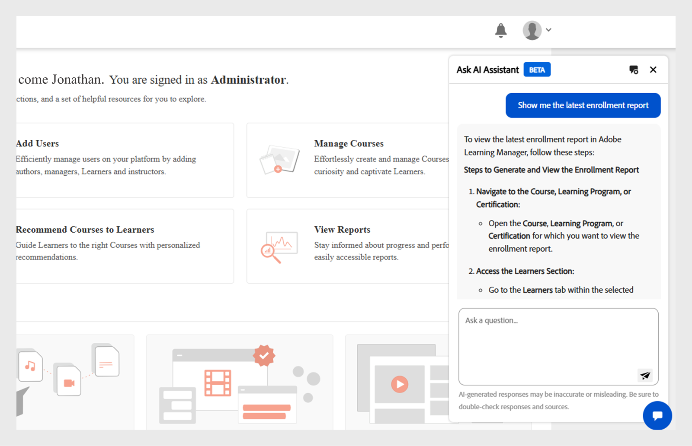

# Asistente para IA de administración (beta) en Adobe Learning Manager

En configuraciones de aprendizaje complejas, los administradores pueden tener dificultades para encontrar contenido o completar tareas debido a menús complicados y flujos de trabajo desconectados. Por ejemplo, tareas como ejecutar informes o acceder a información específica pueden requerir la exploración de varias pantallas. El Asistente para IA de administración (Beta) le ayuda a encontrar la información adecuada para comprender y completar las tareas de manera eficaz.

El Asistente para IA de administración (Beta) de Adobe Learning Manager ayuda a los administradores a encontrar rápidamente respuestas a preguntas comunes, explorar las funciones del sistema y comprender cómo completar tareas clave, con solo preguntar en un lenguaje sencillo. Tanto si es la primera vez que usa Adobe Learning Manager como si busca formas más rápidas de solucionar problemas, la versión beta del asistente para IA de administración simplifica su flujo de trabajo al proporcionar ayuda según el contexto directamente en la plataforma.

Utiliza las capacidades de IA de Adobe para permitir consultas de lenguaje natural en el contenido de aprendizaje y los flujos de trabajo del sistema.  Los administradores pueden hacer preguntas como **Cómo añadir usuarios a Adobe Learning Manager** o **Cómo añadir rutas de aprendizaje**. El Asistente para IA de administración de Adobe Learning Manager (Beta) está capacitado exclusivamente en documentación de Adobe disponible públicamente, como recursos alojados en **[!UICONTROL Experience League]**. No aprende ni accede a contenido del cliente, material de formación interno ni datos generados por el usuario.

Este asistente reduce la dependencia de la navegación manual, reduce el tiempo de descubrimiento y ayuda a impulsar rápidamente información procesable.

<!--## Key benefits

* Perform common administrator tasks faster with conversational guidance.
* Get instant answers without browsing through extensive menus.
* Gain real-time insights and step-by-step guidance for administrative workflows.-->

>[!IMPORTANT]
>
>Solo está disponible para administradores y actualmente solo admite el inglés.

## Privacidad, seguridad y gobernanza

El Asistente para IA de administración (beta) se ha diseñado teniendo en cuenta la seguridad y la privacidad de los datos. Esto es lo que puedes esperar:

* Admin AI Assistant (Beta) no utiliza ningún dato personal, incluidos los fines de formación.
* No tiene acceso a los datos de aprendizaje ni al contenido almacenado en Adobe Learning Manager.
* El Asistente de inteligencia artificial aplicada a los administradores (Beta) no tiene acceso a ninguna información de identificación personal (PII) ni la comparte, ni comparte información privada ni confidencial.
* Cualquier mensaje proporcionado por los usuarios (como preguntas o consultas) no se comparte con otros clientes.

>[!IMPORTANT]
>
>El Asistente para IA de administración (Beta) se implementará por fases, y los clientes recibirán un aviso previo de dos semanas. Para obtener ayuda, póngase en contacto con su administrador de éxito de clientes (CSM).

## Cómo acceder al Asistente para IA de administración (Beta)

Siga estos pasos para iniciar el Asistente para IA de administración (Beta):

1. Inicie sesión como Administrador.
2. Seleccione el icono de chat para iniciar el Asistente para IA de administración (Beta).

   
   _Seleccione la burbuja de chat para iniciar el Asistente para IA de administración (Beta)_

   >[!NOTE]
   >
   >Al iniciar el Asistente para IA de administración (Beta) por primera vez, debe dar su consentimiento antes de utilizarlo. El cuadro de diálogo de consentimiento solo aparecerá durante este inicio inicial. Para todos los inicios posteriores, se le dirigirá directamente al Asistente para IA de administración (Beta) para introducir sus indicaciones.

3. Seleccione **[!UICONTROL Introducción]**. Ya puede utilizar el Asistente para IA de administración (Beta).

   
   _Preguntar para aceptar la directiva de uso antes del primer uso_

## Cómo usar el Asistente para IA de administración (Beta)

Para utilizar el Asistente para IA de administración (Beta):

1. Escriba el mensaje y presione **[!UICONTROL Intro]**. La respuesta aparece en el Asistente para IA de administración (Beta).

   
   _Una consulta de ejemplo y respuesta del Asistente para IA de administración (Beta)_

### Mensajes de ejemplo

A continuación, se muestran algunos mensajes de ejemplo que los administradores pueden utilizar para utilizar de forma eficaz el Asistente para IA de administración (Beta):

* **Asignar un curso a un usuario**
   * **Mensaje**: &quot;¿Cómo asigno un curso a un usuario?&quot;

  
  _Respuesta al mensaje ¿Cómo asigno un curso a un usuario?_

* **Informe de inscripción más reciente**
   * **Mensaje**: Muéstreme el informe de inscripción más reciente.

  
  _Respuesta al mensaje Mostrar el informe de inscripción más reciente_

* **Eliminar un usuario**
   * **Mensaje**: &quot;¿Cómo puedo eliminar un usuario?&quot;

  
  _Respuesta a la pregunta ¿Cómo puedo eliminar un usuario?_

### Sugerencias para usar el Asistente para IA de administración (Beta) de forma eficaz

* **Sé específico con tus preguntas**: Cuando hagas una pregunta, incluye contexto y detalles claros. Por ejemplo, en lugar de preguntar &quot;¿Cómo añado un usuario en Adobe Learning Manager?&quot;, pregunte &quot;¿Cómo asigno un curso a un usuario en Adobe Learning Manager?&quot;
* **Usa un lenguaje claro y conciso**: Mantén tus preguntas claras y enfocadas. Esto ayuda al Asistente para inteligencia artificial aplicada a los administradores (Beta) a comprender sus intenciones y proporcionar una respuesta más precisa.
* **Explora diferentes capacidades**: Consulta una variedad de funciones como informes de inscripción, progreso del alumno, asignación de contenido o seguimiento de la certificación para descubrir toda la gama de asistencia disponible.
* **Proporcionar comentarios**: Después de recibir una respuesta, háganos saber si fue útil. Utilice las funciones de pulgar hacia arriba, pulgar hacia abajo, informe o comentario para compartir sus comentarios. Sus comentarios desempeñan un papel fundamental en la mejora del Ayudante.

## Proporcionar comentarios sobre las respuestas del Asistente para IA de administración (Beta)

Sus comentarios sobre las respuestas generadas por Admin AI Assistant (Beta) ayudan a mejorar su precisión, relevancia y rendimiento general.

### Indicar si una respuesta le gusta o no

* Selecciona **[!UICONTROL Pulgares hacia arriba]** si la respuesta fue útil y precisa.
* Seleccione **[!UICONTROL Pulgares abajo]** si la respuesta es incorrecta o no es útil.

### Marcar una respuesta

Siga estos pasos para marcar una respuesta:

1. Seleccione **[!UICONTROL Indicador]** al final de la respuesta.

   
   _Seleccionar informe en la pantalla del Asistente para IA de administrador_

2. Selecciona uno o más motivos, agrega comentarios si es necesario y, a continuación, selecciona **[!UICONTROL Enviar]**.

   
   _Los administradores califican la respuesta usando los pulgares hacia arriba o hacia abajo con comentarios opcionales_

Adobe utiliza estos comentarios para mejorar el Asistente para IA de administración (Beta) con el tiempo.

## Preguntas más frecuentes

+++¿Puedo utilizar la versión beta del asistente de inteligencia artificial de administrador como alumno?

No. Este asistente solo está disponible para administradores.

+++

+++¿Está disponible en la aplicación móvil?

No en este momento.

+++

+++¿Puede realizar acciones de administrador?

No. El Asistente para IA de administración (Beta) solo proporciona orientación.

+++

+++¿Admitirá más idiomas?

El equipo de Adobe Learning Manager está evaluando la compatibilidad con varios idiomas para futuras actualizaciones.

+++
