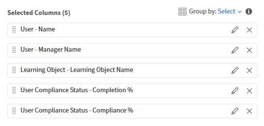
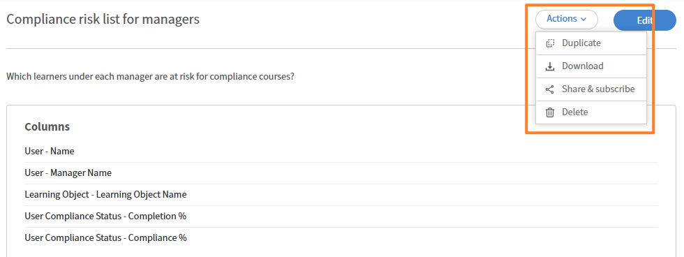
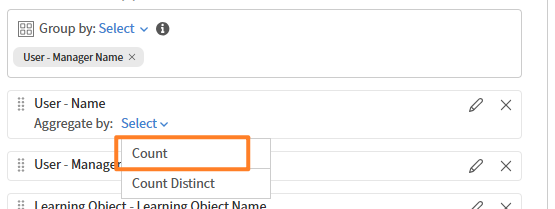

# Crear un informe personalizado en Report Builder

## Información general

La creación desde cero funciona mejor cuando tiene una imagen clara de las columnas y la salida que necesita, y ninguna plantilla existente coincide con su caso de uso. Si es la primera vez que utiliza Report Builder, considere la posibilidad de empezar con una plantilla.

## Crear un informe personalizado

En este ejemplo, identificará a los alumnos de cada responsable que están en riesgo de recibir cursos de cumplimiento.

1. Inicie sesión en Adobe Learning Manager como administrador.
2. Seleccione **Informes** y, a continuación, seleccione **Report Builder**.
3. Selecciona la pestaña **Informes** y luego selecciona **Crear informe**.
4. Introduzca un nombre de informe. Se requiere un nombre. También puede introducir una descripción.

   

5. En el panel de columnas, seleccione los siguientes conjuntos de datos y amplíelos:

   * Usuario
   * Objeto de aprendizaje
   * Estado de cumplimiento del usuario

6. Seleccione **+** junto a las siguientes columnas que desee incluir. Las columnas seleccionadas aparecen en el lienzo del informe.

   * Nombre de usuario
   * Usuario: Nombre del responsable
   * Objeto de aprendizaje: Nombre del objeto de aprendizaje
   * Estado de cumplimiento del usuario: % de finalización
   * Estado de cumplimiento del usuario: % de cumplimiento

   

7. Reorganice las columnas arrastrándolas en el lienzo.
8. Para cambiar el nombre de una columna, introduzca un nombre en el campo de alias de la columna. El alias aparece como encabezado de columna en el archivo descargado.
9. Seleccione **Guardar informe**.

## Descargar el informe

1. Seleccione **Acciones** en la esquina superior derecha.

   

2. Seleccione **Descargar**. Puede descargar el informe desde el icono de notificaciones cuando esté listo.

El informe descargado (csv) contiene las siguientes columnas:

* name
* managerName
* name
* completedPct
* compliancePct

## Aplicar agrupar por, filtros y ordenación

### Filtro

Una vez descargado el informe, aplique un filtro en el que el valor de completedPct O compliancePct sea igual a 100.

1. Abra el informe y seleccione **Editar** en la esquina superior derecha.
2. Seleccione **Agregar filtro** y busque en las columnas donde desee aplicar los filtros.

   

3. Seleccione **Agregar**.
4. Combine los filtros con la lógica AND/OR; seleccione el operador alternar entre filas de filtro.

   

5. Seleccione **Guardar informe** y descargue el informe.

El informe descargado contiene registros en los que completedPct O compliancePct es igual a 100.

### Agrupar por

Agrupar los registros por responsable en:

* Agregar datos de alumnos por responsable
* Calcular promedios a nivel de responsable
* Contar alumnos en cada responsable

1. Abra el informe y seleccione **Editar** en la esquina superior derecha.
2. Seleccione **Agrupar por:Select** y seleccione la columna **Nombre del administrador de usuarios**.

   

3. Agregue las siguientes columnas:

   * User-Name
   * Objeto de aprendizaje: Nombre del objeto de aprendizaje

4. Seleccione **Count** como una función de agregado para las columnas.

   

5. Repetir para objeto de aprendizaje - Nombre de objeto de aprendizaje.

   

6. Seleccione **Guardar informe** y descargue el informe.

El informe descargado contiene un resumen del rendimiento de la formación del alumno según el responsable. Muestra las tasas medias de finalización, las puntuaciones medias de cumplimiento y los recuentos totales de alumnos de cada responsable. Los datos indican la finalización universal de la formación en todos los grupos, mientras que el rendimiento de la conformidad varía significativamente entre los gestores.

### Ordenar

Ordene el informe en orden descendente por el número de alumnos de cada responsable.

1. Abra el informe y seleccione **Editar** en la esquina superior derecha.
2. Seleccione **Agregar ordenación**.
3. Busque el nombre de usuario y seleccione **User-Name**.
4. Seleccione **Descendente**.

   

5. Seleccione **Agregar**.
6. Seleccione **Guardar informe** y descargue el informe.

El informe descargado contiene el número de alumnos por responsable en orden descendente.
