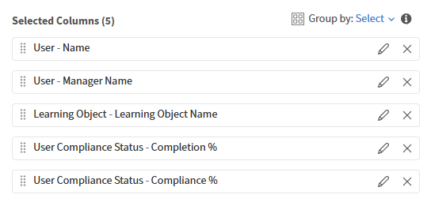

# Agregar y combinar filtros en un informe

Los filtros le permiten definir el ámbito del informe exactamente en los registros que necesita. Puede aplicar un solo filtro, combinar varios filtros con la lógica AND u OR y crear grupos anidados para condiciones complejas.

## Agregar un filtro

Utilice filtros para limitar el informe a un subconjunto específico de datos en lugar de verlo todo.

Por ejemplo, es posible que desee comprender cuántos alumnos se han inscrito en los cursos en los últimos 365 días. En este caso, se aplica un filtro de fecha en la fecha de inscripción para incluir únicamente la actividad reciente.

1. Inicie Report Builder y seleccione **Crear informe**.
2. Escriba el nombre y la descripción del informe\.
3. Seleccione las siguientes columnas: &lt;`dataset>:<column name>`
a. Fecha de inscripción-inscripción
b. User-Name
   
4. En la sección Informes, seleccione **Agregar filtro**.
5. Busque o busque el campo por el que desea filtrar. En este ejemplo, seleccione **Fecha de inscripción**.
   
6. Seleccione **Agregar**.
7. Seleccione un operador. Los operadores disponibles dependen del tipo de datos del campo:
a. Campos de cadena: contiene, es igual a, empieza por
b. Campos numéricos: mayor que, menor que, igual a, entre
c. Campos de fecha: es igual a los últimos N días, antes, después, entre
d. Campos de lista (enum): está en, no está en
8. En este caso, seleccione **en el último año**.
   
9. Seleccione **Guardar informe** y seleccione **Acciones** > **Descargar** para descargar el informe.

El informe descargado muestra una lista de todos los usuarios que se han inscrito en un objeto de aprendizaje en los últimos 365 días.

### Añadir varios filtros con la lógica Y/O

Cuando se agrega un segundo filtro, la relación predeterminada entre filtros es AND; ambas condiciones deben ser verdaderas para que aparezca una fila.

Por ejemplo, puede que desee identificar a los alumnos que se han inscrito en cursos en los últimos 365 días Y enviar un informe a un responsable específico. En este caso, ambas condiciones deben ser verdaderas, por lo que los filtros se combinan usando la lógica AND.

1. Inicie Report Builder y seleccione **Crear informe**.
2. Escriba el nombre y la descripción del informe.
3. Seleccione las siguientes columnas: `<dataset>:<column name>`
a. User-Name
b. Nombre del administrador de usuarios
c. Fecha de inscripción
   

4. Agrupar por la columna **Nombre del administrador de usuarios**.
5. En la sección **Filtro**, seleccione los siguientes filtros:
a. La fecha de inscripción **está dentro del último año**
b. El nombre del administrador de usuarios **empieza por N**
c. El nombre del administrador de usuarios **no está vacío**
   
6. Seleccione **Guardar informe** y seleccione **Acciones** > **Descargar** para descargar el informe.

En el informe descargado, se enumeran todos los usuarios que se han inscrito en un objeto de aprendizaje en los últimos 365 días y se informa a un responsable cuyo nombre empieza por N.

### Crear grupos de filtros anidados

Los grupos anidados permiten crear condiciones con varios niveles lógicos, equivalentes a corchetes en una fórmula\. Por ejemplo: (Catálogo = Seguridad O Catálogo = Higiene) Y la fecha de finalización está en los últimos 90 días.

Utilice grupos de filtros anidados cuando la lógica incluya una mezcla de condiciones AND y OR que se deben evaluar juntas.

Por ejemplo, utilice una lógica de filtros anidada para identificar las inscripciones incompletas en las que los alumnos tienen un progreso inferior al 50 % o formación vencida, lo que demuestra cómo las condiciones Y y O funcionan en conjunto.

1. Inicie **Report Builder** y seleccione **Crear informe**.
2. Escriba el nombre y la descripción del informe.
3. Seleccione las siguientes columnas: `<dataset>:<column name>`
a. Inscripción - Estado
b. Inscripción - Porcentaje de progreso
c. Inscripción - Vencida
   
4. En la sección **Filtro**, seleccione los siguientes filtros:
a. El estado de inscripción **no es igual a ninguno de los** completados.
b. Seleccione **+**.
c. Busque Porcentaje de progreso de inscripción.
d. Seleccione el filtro.
e. Seleccione **Agregar como grupo**.
   
f. Agregar porcentaje de progreso de inscripción **menor que** 50
   
g. Seleccione **+**.
h. Busque Inscripción vencida.
i. Seleccione el filtro.
j. Seleccione **Agregar como grupo**.
   
k. Add Enrollment-Overdue es igual a TRUE.
l. Cambie el AND anidado a OR.
   
5. Seleccione **Guardar informe** y seleccione **Acciones** > **Descargar** para descargar el informe.

El informe descargado enumera todas las inscripciones que están en curso o que no se han iniciado, cuyo porcentaje de progreso es inferior al 50 % o que han vencido.
