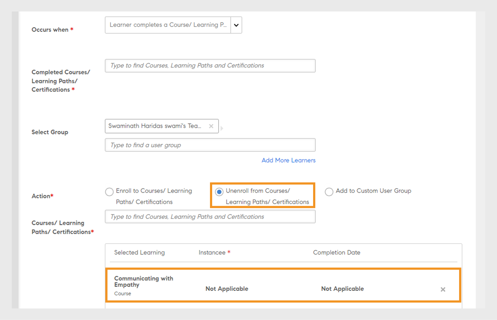
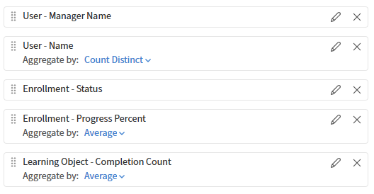

# Generar un informe de tendencias en Report Builder

Los informes de tendencias muestran cómo las métricas, como el recuento de cursos, el recuento de inscripciones o las finalizaciones, cambian con el tiempo. Puede elegir una columna de fecha y una granularidad de tendencia (día, semana o mes), y el Report Builder agrupa los datos por ese período de tiempo.

## Qué significan los datos de tendencias

Los informes de tendencias en Report Builder reflejan **una instantánea actual de los datos, agrupados por fecha**. No muestran el estado histórico de los datos en cada fecha pasada.

Por ejemplo, una tendencia de inscripción mensual muestra el número de inscripciones que existen actualmente, distribuidas entre los meses en los que se crearon. Si un alumno se inscribió en enero y más tarde se dio de baja, es posible que ese registro de inscripción ya no aparezca. El informe refleja el estado actual de los registros, no lo que era cierto en enero.

Se trata de una distinción importante a efectos de auditoría. Si necesita datos históricos puntuales, utilice este informe para el análisis de tendencias direccionales en lugar de registros históricos precisos.

## Crear un informe de tendencia de recuento de cursos

Este informe muestra cuántos cursos se han añadido a la cuenta mensualmente.

1. Seleccione **Informes** > **Report Builder** y, a continuación, seleccione la pestaña **Informes**.
2. Seleccione **Crear informe**. Escriba un nombre como Número de cursos MoM.
3. Agregue el **ID de objeto de aprendizaje** del conjunto de datos **Objeto de aprendizaje**.
4. Agregue **Fecha de creación** del conjunto de datos **Objeto de aprendizaje**.
   
5. Aplicar **Agrupar por** en **Fecha de creación**. Establezca la granularidad de tendencia en **Mes**.
   
6. Aplique **Count** al **ID de objeto de aprendizaje**. Introduzca el alias Recuento de cursos.
   
7. Ordenar por **Fecha de creación** ascendente para mostrar la tendencia cronológicamente.
   
8. Seleccione **Guardar informe** y seleccione **Acciones** > **Descargar** para descargar el informe.

El archivo descargado consta de una tendencia mensual de la actividad de creación de cursos, que muestra el número de cursos creados a lo largo del tiempo. Ayuda a realizar un seguimiento de los patrones de producción de cursos, los picos, las caídas y el crecimiento general del contenido.

## Crear un informe de tendencias de finalizaciones por catálogo

Este informe muestra los totales de finalización mensuales por catálogo durante un período definido.

1. Seleccione **Informes** > **Report Builder** y, a continuación, seleccione la pestaña **Informes**.
2. Seleccione **Crear informe**. Escriba un nombre como MoM de finalizaciones de catálogo.
3. Agregue **Nombre de catálogo** del conjunto de datos **Catalog**.
4. Agregue **Fecha de finalización** del conjunto de datos **Module Transcript**.
5. Agregue **ID de objeto de aprendizaje** del conjunto de datos **Objeto de aprendizaje** para contar las finalizaciones.
6. Aplicar **Agrupar por** en **Nombre de catálogo**. Aplicar también **Agrupar por** en **Fecha de finalización** con granularidad **Mes**.
   
7. Aplique **Count** al **ID de objeto de aprendizaje**. Introduzca el alias Total de finalizaciones.
8. Agregar un filtro: **El catálogo** está en Seguridad, POS, Entrega (o los catálogos correspondientes a tu cuenta).
9. Agregar un filtro: **La fecha de finalización** está dentro del último año.
   
10. Ordenar por **Fecha de finalización** ascendente.
    
11. Seleccione **Guardar informe** y seleccione **Acciones** > **Descargar** para descargar el informe.

## Prácticas recomendadas

* Use **Fecha de finalización** para las tendencias de finalización y **Fecha de inscripción** para las tendencias de inscripción. Utilizar el campo de fecha incorrecto produce resultados engañosos.
* Agregue un filtro de fecha para limitar la tendencia a una ventana significativa, por ejemplo, los últimos 12 meses para una tendencia mensual o las últimas 8 semanas para una tendencia semanal.
* Etiquete el informe de tendencias con la granularidad y el intervalo de fechas en el nombre, por ejemplo, &quot;MoM de finalizaciones de catálogo: últimos 3 meses&quot;, para que quede claro cuando lo vea más adelante.
