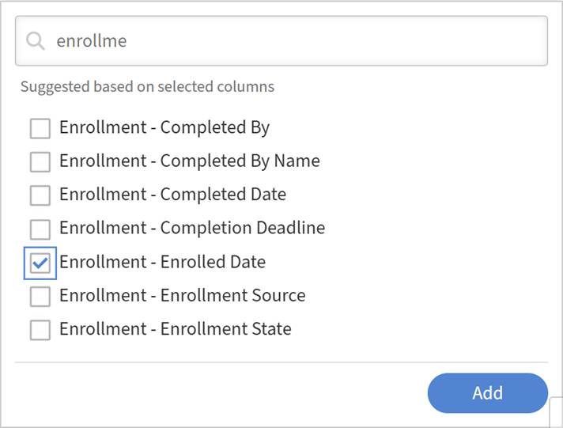

# Descargar, compartir y suscribirse a un informe

Después de guardar un informe en Report Builder, puede descargarlo a petición, compartirlo con otros administradores de su cuenta o suscribirse para recibirlo periódicamente.

## Descargar un informe

1. En la pestaña **Informes**, busca el informe que deseas descargar.
2. Seleccione **Descargar**.
3. Seleccione **Aceptar**.
   
La generación de informes se ejecuta de forma asincrónica. Recibirá una notificación en la aplicación cuando el archivo esté listo.
4. Abra la notificación y descargue el archivo.

>[!NOTE]
>
>Si el informe no tiene datos coincidentes, por ejemplo, porque los filtros no devuelven resultados, se sigue generando un archivo vacío. No recibirá ningún error; el archivo descargado tendrá encabezados pero no filas.

## Compartir un informe y suscribirse a él en Report Builder

Ofrece a otros administradores acceso a un informe guardado y configura la entrega programada de correo electrónico en Adobe Learning Manager Report Builder.

El cuadro de diálogo **Compartir y suscribirse** tiene dos secciones independientes: uno para compartir el informe con otros administradores y otro para configurar una suscripción por correo electrónico. Puede utilizar una o ambas.

## Compartir un informe con otros administradores

Los administradores compartidos pueden ver, duplicar y editar el informe.

1. Abra el informe que desee compartir.
2. Seleccione **Acción** > **Compartir y suscribirse**.
   
3. En **Administradores con acceso compartido**, seleccione **Editar**. A continuación, seleccione el campo **Seleccionar usuarios / grupos de usuarios**.
4. Busque y seleccione los administradores o grupos de usuarios con los que desee compartir.
   
5. Seleccione **Guardar**.

Los administradores seleccionados ahora pueden acceder al informe en su vista de Report Builder.

>[!NOTE]
>
>Los administradores con acceso compartido pueden ver, duplicar y editar el informe. Para quitar el acceso, vuelva a **Compartir y suscribirse** y anule la selección del usuario o grupo de usuarios.

## Suscribir administradores a un informe

Los administradores suscritos recibirán el informe por correo electrónico con la frecuencia que elija.

1. Abra el informe al que desee suscribir administradores.
2. Seleccione **Acciones** > **Compartir y suscribirse**.
3. En **Administradores con suscripción**, seleccione **Editar**.
4. Seleccione el menú desplegable **Frecuencia de correo electrónico**.
5. Elija una frecuencia:
   * **Enviar a diario**
   * **Enviar semanalmente**
   * **Enviar mensualmente**
6. En el campo **Seleccionar usuarios / grupos de usuarios**, busque y seleccione los administradores o grupos de usuarios a los que suscribirse.
7. Seleccione **Guardar**.

Los administradores suscritos recibirán el informe por correo electrónico con la frecuencia elegida.

>[!TIP]
>
>Aplique al menos una ordenación al informe antes de configurar una suscripción. Esto garantiza que el pedido de fila sea coherente en todas las entregas programadas.

