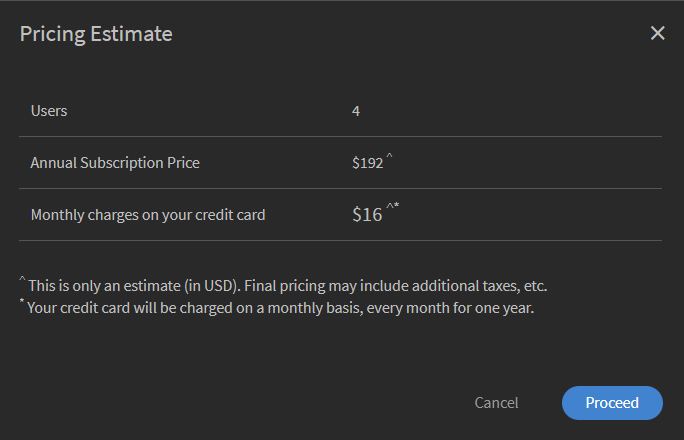

# Administrar pedidos y facturación de Learning Manager

La compra basada en tarjeta de crédito solo está disponible en la [región de Estados Unidos](http://learningmanager.adobe.com/).

Administre la facturación de Learning Manager, realice pedidos con una tarjeta de crédito, suscríbase con una orden de compra o con un plan de usuarios activos mensuales.

Adobe Learning Manager cuenta con un modelo flexible, sencillo para el cliente y uno de los mejores modelos de precios para satisfacer las necesidades de tu organización. Para obtener más información, consulte la [Learning Manager](https://www.adobe.com/products/learningmanager.html) página.

Solo los administradores de su organización pueden administrar la facturación.

Si desea ponerse en contacto con el Adobe para obtener más información sobre la suscripción y la facturación de Learning Manager, escríbanos a la dirección [learningmanagersales@adobe.com](mailto:learningmanagersales@adobe.com).

## Realizar pedidos con tarjetas de crédito {#placeordersusingcreditcards}

Puede comprar una suscripción para un máximo de 3500 alumnos mediante cualquier orden de pago con tarjeta de crédito. El primer orden de la cuenta debe ser para un mínimo de 10 alumnos.

1. En la aplicación del administrador, haga clic en **[!UICONTROL Factura]** en el panel de navegación izquierdo.

   

   *Iniciar facturación de Adobe Learning Manager*

1. En la **[!UICONTROL Información de facturación]** , añada el número de usuarios en la página **[!UICONTROL Añadir usuarios]** campo. Al utilizar una tarjeta de crédito para las suscripciones de prepago, puede ver el número de usuarios que puede añadir para la suscripción. El número de usuarios que puede agregar no debe exceder el número mencionado en la sección Restantes.1.

   

   *Añadir número de usuarios*

1. Después de especificar el número de usuarios que desea añadir, haga clic en Realizar pedido en la esquina superior derecha de la página.

   

1. Revise la estimación que aparece en la pantalla.

   

   *Realizar un pedido*

   La cuota de suscripción anual se calcula en función del número de usuarios añadidos para la suscripción. Por ejemplo, si se agregan cuatro usuarios, la cuota anual se calcula utilizando la expresión 4 usuarios X$4X$12, que devuelve 192 $.

   Haga clic en **[!UICONTROL Continuar]**.

   *Revisar la estimación*

1. En la página Detalles de Pago, puede ver el precio estimado del pedido. La moneda aparece según la configuración regional actual.

   

   *Ver datos de pago*

   También puede cambiar la configuración regional seleccionando el país en la lista desplegable.

   

   *Seleccione el país de facturación*

1. Introduzca su información de contacto, elija el tipo de tarjeta de crédito y proporcione los detalles de la tarjeta de crédito. Una vez que haya introducido los detalles necesarios, haga clic en **[!UICONTROL Completar pedido]**.
1. Después de realizar el pedido, para ver los paquetes pedidos recientemente, haga clic en **[!UICONTROL Historial de pedidos]** de la pestaña **[!UICONTROL Factura]** página.

   

   *Ver historial de pedidos*

## Comprobar estado del pedido {#checkorderstatus}

Todos los pedidos pueden tener uno de los cuatro estados siguientes:

**Activo:** Un pedido está activo y los usuarios se registran correctamente.

**Suspendido:** Un pedido pasa a tener el estado suspendido en los siguientes casos:

* Retraso en la recepción del pago de la tarjeta de crédito
* Vencimiento de la tarjeta de crédito.
* El pago se rechaza para cualquier ciclo de pago periódico.

**Cancelado iniciado:** Un pedido pasa a este estado cuando el administrador de Learning Manager desactiva la cuenta. A continuación, el pedido pasa a un estado cancelado después de recibir la confirmación de cancelación del pedido.

## Actualizar detalles de suscripción {#updatesubscriptiondetails}

1. En la lista de pedidos, haga clic **[!UICONTROL Editar]**.

   

   *Actualizar detalles de suscripción*

1. En la página Detalles de la suscripción, haga clic en **[!UICONTROL Editar suscripción]**.
1. Elija el elemento que desea editar:

   * Forma de pago: utilice esta opción para actualizar los datos de pago como, por ejemplo, la tarjeta de crédito.
   * Dirección: utilice esta opción para actualizar los detalles de la dirección.

## Cancelar una suscripción {#cancelasubscription}

Para cancelar un pedido:

1. En el panel izquierdo de la página Administrador, haga clic en Facturación.
1. En la página Facturación, en la esquina superior derecha, seleccione **[!UICONTROL Acciones]** > **[!UICONTROL Desactivar cuenta]**.
1. Una vez que el administrador desactiva la cuenta, todos los pedidos existentes en la cuenta se cancelan a partir del siguiente ciclo de facturación.

Cuando el cliente desactiva una cuenta, entra en estado de prueba durante los siguientes 30 días. El propietario de la cuenta recibe tres correos electrónicos de recordatorio para reactivar la cuenta. Si el propietario no reactiva la cuenta, ninguno de los usuarios puede acceder a Learning Manager aparte del propietario.

## Realizar pedidos mediante pedido de compra {#placeordersusingpurchaseorder}

Puede elegir el proceso de pedido de compra como una forma alternativa de pago. Como requisito previo, la cuenta de su organización debe estar registrada con Adobe. Este proceso se cobra a la cuenta de su organización. La cuenta se carga en función de las actividades de un alumno. Solo se cargan las actividades de nivel de objeto de aprendizaje. Para realizar un pedido con PO:

1. Enviar un correo electrónico a [learningmanagersales@adobe.com](mailto:learningmanagersales@adobe.com) y mencionar el número de alumnos necesarios.
1. El equipo de Learning Manager le envía una clave de activación.
1. En la página Facturación de la aplicación del administrador, introduzca la clave de activación.
1. Haga clic en Activar en la esquina superior derecha de la página.

## Comprobar el estado de la cuenta {#checkaccountstatus}

Después de activar una cuenta, esta puede tener cualquiera de los siguientes estados:

* **Prueba** - Puedes crear una cuenta de Adobe Learning Manager y utilizarla sin ningún pago durante un período de 30 días. No hay ningún límite en el número de alumnos registrados durante el período de prueba.
* **Activo** - En este estado, la cuenta tiene suscripciones activas de alumnos con pagos mensuales recurrentes según el pedido de suscripción.
* **Inactivo** - Una cuenta pasa a estar inactiva en los siguientes casos:

   * Después del período de prueba, si no hay pedidos de suscripción activos en la cuenta.
   * El administrador desactiva la cuenta, lo que hace que se cancelen todos los pedidos existentes en una cuenta a partir del siguiente ciclo de facturación de la suscripción.
   * El pago se rechaza para los pedidos activos de una cuenta, incluso después de los recordatorios.

Un estado inactivo no cancela su cuenta con efecto inmediato. Recibirá al menos un par de recordatorios del equipo de Learning Manager en los que se le solicitará que proporcione la información más reciente sobre

su tarjeta de crédito si ha caducado. En un estado inactivo, sólo un administrador puede iniciar sesión en el Captivate

cuenta de Learning Manager. El resto de usuarios no pueden acceder a la cuenta.

* **Se requiere activación** - La cuenta pasa a este estado cuando el administrador de Learning Manager decide desactivar la cuenta. Se cancelan todos los pedidos de esta cuenta. El cobro de los pagos de estos pedidos no se produce a partir del siguiente ciclo de facturación. El estado de la cuenta permanece en este estado hasta el día del último ciclo de facturación. En este estado, todos los usuarios pueden seguir utilizando la aplicación sin ningún impacto hasta el final de la última fecha de pago recurrente.

## Cancelar una suscripción {#Cancelasubscription-1}

Para cancelar una suscripción activa, póngase en contacto con el equipo de asistencia de Learning Manager.

## Cargo por cancelación de cuenta {#accountterminationfee}

Si desea cancelar la suscripción antes de la finalización del período anual, se cobrará una tarifa de cancelación anticipada. La tarifa de cancelación equivale al 50 % del precio de suscripción del período de compromiso restante.

## Plan de usuarios activos mensuales (MAU) {#monthlyactiveusersmauplan}

Usted puede elegir un plan MAU como su forma preferida de facturación. Esta opción genera la facturación en función del número de usuarios activos únicos mensuales. Los usuarios activos únicos mensuales se agregan de forma acumulativa durante un período de 12 meses a partir del mes de activación del plan. Este número se utiliza para la facturación del período.

Utilice el ejemplo siguiente para comprender cómo se calcula la MAU.

Supongamos que el número de usuarios al mes es el siguiente:

* Mes 1 = 50
* Mes 2 = 500
* Mes 3 = 5000
* Mes 4 a 12 = 10

Total de usuarios activos mensuales facturados = Mes 1 + Mes 2 + Mes 3 + Mes 4 a 12 = 50 + 500 + 5000 + 90 = 5640.

La facturación del período sería para 5640 usuarios.

Al final del período de 12 meses, el recuento de uso se restablece a cero y comienza un nuevo período para el plan MAU. Puede añadir varias claves de activación para aumentar el número de puestos adquiridos.

Cualquier usuario que realice las siguientes acciones o logre finalizaciones debido a las acciones realizadas por otros se considera un usuario activo único mensual para ese mes natural.

* Realizar un curso, programa de aprendizaje o certificación.
* Consumir, descargar una ayuda de trabajo o archivos adjuntos de un curso.
* Consumir, descargar o crear notas personales.
* Participar en el aprendizaje social mediante la creación de tableros, publicaciones o comentarios.
* Conseguir finalizaciones debido a las aprobaciones de envío de certificados externos o a la asistencia a sesiones de clase o de clase virtual.

## Ver detalles de uso {#viewusagedetails}

1. Para ver el número de usuarios activos por mes, haga clic en **[!UICONTROL Ver detalles de uso]**.

   

   *Ver usuarios activos por mes*

1. En la página que se muestra, puede ver lo siguiente:

   * **Uso general:** Puede comprobar el número total de usuarios activos, los usuarios que consumen Learning Manager en un mes y el número de usuarios que aún no se han inscrito en ningún curso.

   * **Uso mensual:** Puede ver una tabla de usuarios activos únicos al mes.

## Descargar informe de uso {#downloadusagereport}

También puede descargar los datos del número de usuarios activos por mes y año. Para descargar, haga clic en **[!UICONTROL Descargar informe detallado]**.

En la **Generar solicitud de informe** , introduzca los meses y el año necesarios, y haga clic en **[!UICONTROL Generar]**.

*Descargar informe de uso activo*

Si cierra la ventana del navegador, la descarga comenzará la próxima vez que visite Learning Manager.

Los informes se guardan en la carpeta Descargas del navegador.

## Cancelar una suscripción

Para cancelar una suscripción activa, póngase en contacto con el equipo de asistencia de Learning Manager.

## Preguntas más frecuentes {#frequentlyaskedquestions}

+++Cómo añadir o eliminar suscripciones de una cuenta

Para agregar suscripciones a una cuenta, agregue el número de usuarios para los que desea adquirir suscripciones. En la esquina superior derecha, haga clic en **[!UICONTROL Realizar pedido]**. Revise la estimación y haga clic en **[!UICONTROL Continuar]**. Introduzca los datos de su cuenta y de su tarjeta de crédito. A continuación, para adquirir las suscripciones, haga clic en **[!UICONTROL Completar pedido]**.

Para eliminar una suscripción activa, póngase en contacto con el equipo de asistencia de Learning Manager.
+++

+++Cómo cambiar una tarjeta de crédito para suscripciones

En la **[!UICONTROL Historial de pedidos]** , para una cuenta activa, haga clic en **[!UICONTROL Editar]**. A continuación, en la página Detalles de la suscripción, haga clic en **[!UICONTROL Editar suscripción]**. Introduzca los datos de la nueva tarjeta de crédito y haga clic en **[!UICONTROL Actualizar método de pago]**.

*Ver datos de la tarjeta de crédito*
+++

+++Cómo actualizar la información de facturación en Learning Manager

Para actualizar la información de facturación, siga estos pasos:

1. Iniciar sesión como **Administrador** y haga clic en **[!UICONTROL Factura]**.
1. En la lista de pedidos, haga clic **[!UICONTROL Editar]**.
1. En la página Detalles de la suscripción, haga clic en **[!UICONTROL Editar suscripción]**.

Elija el elemento que desea editar:

1. **[!UICONTROL Forma de pago]:** Utilice esta opción para actualizar los datos de pago como, por ejemplo, la tarjeta de crédito.
1. **[!UICONTROL Dirección]:** Utilice esta opción para actualizar los detalles de la dirección.
+++

+++¿Puedo cancelar parcialmente una suscripción?

No, no se puede cancelar parcialmente una suscripción. Si necesita reducir el número de puestos que ha adquirido, puede cancelar la suscripción al final del ciclo de facturación y, a continuación, adquirir el número de puestos necesarios.
+++

+++¿Cómo puedo obtener una factura de los pagos con tarjeta de crédito?

Contacto [PrimaveraRápida](https://fastspring.com/) para obtener una factura de sus pagos, mediante uno de los métodos siguientes:

* Crear una solicitud de servicio con FastSpring mediante el vínculo `https://questionacharge.com`.
* Enviar un correo electrónico a FastSpring el `orders@fastspring.com` solicitando la factura.
+++
