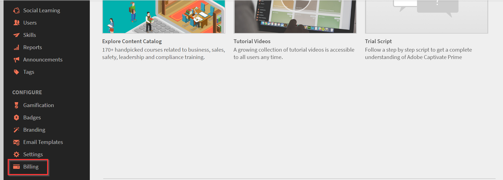
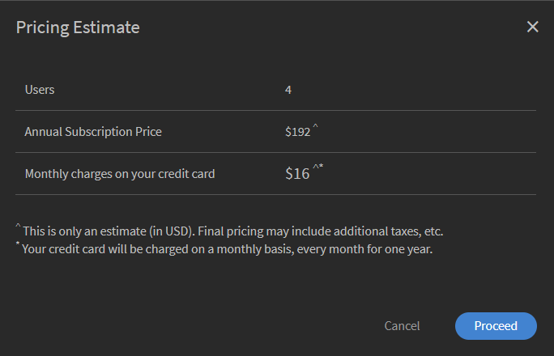
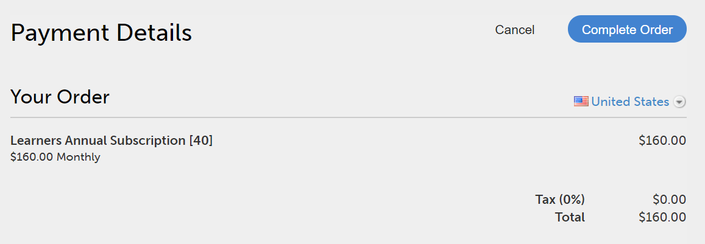
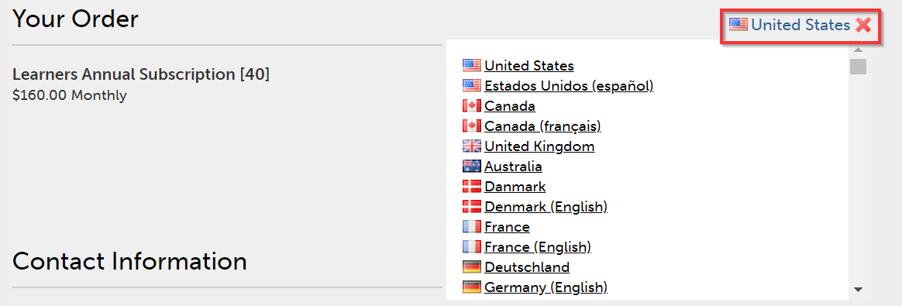

# Administrar pedidos y facturación de Learning Manager

La compra basada en tarjeta de crédito solo está disponible en la [región de EE. UU.](http://learningmanager.adobe.com/).

Administre la facturación de Learning Manager, realice pedidos con una tarjeta de crédito, suscríbase con una orden de compra o con un plan de usuarios activos mensuales.

Adobe Learning Manager tiene modelos de precios flexibles, cómodos para el cliente y uno de los modelos de precios más adecuados para satisfacer las necesidades de su empresa. Para obtener más información, consulte la página de [Learning Manager](https://www.adobe.com/products/learningmanager.html).

Los administradores de su empresa son los únicos que pueden ocuparse de la facturación.

Si desea ponerse en contacto con Adobe para obtener más información sobre la facturación y la suscripción a Learning Manager, escríbanos a [learningmanagersales@adobe.com](mailto:learningmanagersales@adobe.com).

## La página Facturación

Para acceder a la página Facturación, inicie sesión en Adobe Learning Manager como administrador y seleccione **[!UICONTROL Facturación]** en el panel de navegación izquierdo.

La página Facturación contiene las siguientes pestañas:

| Pestaña | Propósito |
|---|---|
| **Suscripción** | Consulte los detalles de la cuenta, los derechos de licencia y el consumo de licencias. Administrar la activación del plan. |
| **Historial de pedidos** | Revisar los pedidos pasados realizados en la cuenta. |

### Pestaña Suscripción

**Detalles de la cuenta**

La tarjeta **Detalles de cuenta** situada en la parte superior de la pestaña **Suscripción** muestra cuatro identificadores de solo lectura para tu cuenta.

| Campo | Descripción |
|---|---|
| **ECCID** | Número de referencia del Adobe para su cuenta. Cítelo al contactar con el servicio de asistencia del Adobe. |
| **Id. de cuenta** | El identificador único de tu cuenta de Adobe Learning Manager. |
| **Nombre de cuenta** | El nombre para mostrar de su cuenta de Adobe Learning Manager. |
| **Id. de organización de IMS** | La organización de Adobe Admin Console vinculada a esta cuenta. Está en blanco si aún no está vinculado. |

**Licencias**

La sección **Licencias** muestra todas las licencias o derechos activos de la cuenta. Cada bloque muestra el nombre de la licencia, una descripción del plan cuando corresponda y una fila de estadísticas que muestra las cifras de consumo del período de contrato actual.

Las columnas de la fila Estadísticas varían según el tipo de licencia:

| Tipo de licencia | Columnas mostradas |
|---|---|
| Licencia de pago (por ejemplo, Adobe Learning Manager Ultimate) | Adquirido / Utilizado / Utilizado por cuentas de igual a igual / Restante |
| Licencia de prueba (por ejemplo, Virtual Coach) | Disponible / Usado / Restante |

Seleccione **[!UICONTROL Ver detalles de uso]** debajo de la fila de estadísticas para expandir un desglose en línea. La sección expandida muestra:

- Un menú desplegable **Seleccionar período** para filtrar por período de contrato, incluidos los períodos históricos
- Una tabla **Uso general** con columnas: Adquirido / Utilizado por esta cuenta / Utilizado por cuentas de igual a igual / Restante
- Un vínculo **Ver desglose de cuentas** para ver el uso distribuido entre cuentas de igual a igual individuales
- Un vínculo **Descargar informe detallado** para exportar datos de uso como un archivo

**Bloque de licencias de Agent Orchestrator**

Cuando se vincula una licencia de Agent Orchestrator, la fila de estadísticas muestra:

| Columna | Descripción |
|---|---|
| **Adquirido** | Créditos de IA de generación total adquiridos para el período del contrato. |
| **Usado** | Créditos consumidos en todos los servicios que utilizan esta licencia. |
| **Usado por ALM** | Créditos consumidos específicamente por Adobe Learning Manager. |
| **Restantes** | Créditos aún disponibles. |

Si su organización utiliza cuentas primarias y secundarias, la sección **Licencias** de la cuenta principal muestra la columna **Utilizado por cuentas secundarias**, que refleja el consumo de crédito en todas las cuentas secundarias vinculadas. Las cuentas secundarias muestran su asignación como **Puestos sancionados** en lugar de Comprados.

## Vincule su cuenta de Adobe Learning Manager a Adobe Admin Console

Para que las funciones de IA general puedan activarse, su cuenta de Adobe Learning Manager debe estar conectada a una organización de Adobe Admin Console. Una vez vinculada, Adobe Learning Manager detecta la licencia de Agent Orchestrator y pone a su disposición la pestaña **Créditos**.

La vinculación se establece automáticamente cuando se adquiere su cuenta mediante el proceso de pedidos estándar de Adobe o cuando activa su cuenta mediante una clave de activación. Puede verificar el vínculo en la pestaña **Suscripción**: si el campo **ID de organización de IMS** en **Detalles de cuenta** está lleno, la cuenta ya está vinculada.

### Vincular la cuenta manualmente

Si su cuenta se configuró de forma independiente y el campo **ID de organización de IMS** está en blanco, vincule manualmente.

**Requisitos previos:**
- Debe ser administrador de la cuenta de Adobe Learning Manager.
- Debe tener la función de administrador del sistema en la organización de Adobe Admin Console que desee vincular.
- La organización Adobe Admin Console debe tener una licencia de Agent Orchestrator activa.

1. Seleccione **[!UICONTROL Facturación]** y, a continuación, seleccione la pestaña **[!UICONTROL Suscripción]**.
2. En la tarjeta **Detalles de la cuenta**, seleccione **[!UICONTROL Vincular organización IMS]**.
3. Se abre una ventana de inicio de sesión. Introduzca las credenciales de su cuenta de Adobe y seleccione su organización en la lista. Adobe Learning Manager confirma que el inicio de sesión de la cuenta tiene la función de administrador del sistema en la organización Adobe Admin Console y que la misma cuenta tiene la función de administrador en Adobe Learning Manager.
4. Si ambas comprobaciones se superan, se establece el vínculo. El campo **ID de organización de IMS** se actualiza con el identificador de su organización, y el saldo acreedor aparece en la sección **Licencias**.
5. Si falla alguna de las comprobaciones, se muestra un mensaje de error. Confirme los requisitos previos anteriores e inténtelo de nuevo.

### Desvincular la cuenta

Después de la desvinculación, las funciones de generación de inteligencia artificial se deshabilitan para todos los alumnos y la pestaña **Créditos** no está disponible hasta que la cuenta se vincule de nuevo.

1. Seleccione **[!UICONTROL Facturación]** y, a continuación, seleccione la pestaña **[!UICONTROL Suscripción]**.
2. En la tarjeta **Detalles de la cuenta**, seleccione **[!UICONTROL Desvincular organización IMS]**.
3. Vuelva a iniciar sesión para confirmar su función de administrador en la organización.
4. El vínculo se elimina. El campo **ID de organización de IMS** vuelve a estar en blanco y la pestaña **Créditos** está oculta.

Para restaurar el acceso, repita los pasos de vinculación manual anteriores.

## Realizar pedidos con tarjetas de crédito {#placeordersusingcreditcards}

Puede comprar una suscripción para un máximo de 3500 alumnos mediante cualquier orden de pago con tarjeta de crédito. El primer pedido de la cuenta debe ser para un mínimo de 10 alumnos.

1. En el panel de navegación izquierdo de la aplicación del administrador, haga clic en **[!UICONTROL Facturación]**.

   

   *Iniciar facturación de Adobe Learning Manager*

1. En la página **[!UICONTROL Información de facturación]**, agregue el número de usuarios en el campo **[!UICONTROL Agregar usuarios]**. Al utilizar una tarjeta de crédito para suscripciones de prepago, puede ver la cantidad de usuarios que puede añadir para la suscripción. El número de usuarios que puede añadir no debe superar el número indicado en la sección Restante.1.

   

   *Agregar número de usuarios*

1. Tras indicar la cantidad de usuarios que añadir, haga clic en Realizar pedido en la esquina superior derecha de la página.

   

1. Examine la estimación que aparece en la pantalla.

   

   *Realizar un pedido*

   La tarifa de suscripción anual se calcula según el número de usuarios que se añaden para la suscripción. Por ejemplo, si se añaden cuatro usuarios, la tarifa anual se calcula con la expresión 4 usersX$4X$12, que devuelve $192.

   Haga clic en **[!UICONTROL Continuar]**.

   *Revisar la estimación*

1. En la página Detalles del pago, puede ver el precio estimado del pedido. La moneda aparece según la configuración regional actual.

   

   *Ver detalles de pago*

   También puede cambiar la configuración regional seleccionando el país en la lista desplegable.

   

   *Seleccione el país de facturación*

1. Proporcione su información de contacto, elija el tipo de tarjeta de crédito y especifique los datos de la tarjeta de crédito. Después de introducir los detalles necesarios, haz clic en **[!UICONTROL Completar pedido]**.
1. Después de realizar el pedido, para ver los paquetes pedidos recientemente, haz clic en la pestaña **[!UICONTROL Historial de pedidos]** en la página **[!UICONTROL Facturación]**.

   

   *Ver historial de pedidos*

## Comprobar el estado de los pedidos {#checkorderstatus}

Todos los pedidos pueden tener uno de los cuatro estados siguientes:

**Activo:** un pedido está activo y los usuarios se registran correctamente.

**Suspendido:** Un pedido pasa a tener este estado en los siguientes casos:

- Cuando hay algún retraso en el recibo del pago de la tarjeta de crédito.
- Cuando caduca la tarjeta de crédito.
- El pago se rechaza en cualquier ciclo de pago recurrente.

**Inicio de cancelación:** un pedido pasa a tener este estado cuando el administrador de Learning Manager desactiva la cuenta. Posteriormente, el pedido pasa al estado Cancelado después de recibir la confirmación de cancelación del pedido.

## Actualizar datos de la suscripción {#updatesubscriptiondetails}

1. En la lista de pedidos, haga clic en **[!UICONTROL Editar]**.

   

   *Actualizar detalles de suscripción*

1. En la página Datos de la suscripción, haga clic en **[!UICONTROL Editar suscripción]**.
1. Elija el elemento que desea editar:

   - Forma de pago: Utilice esta opción para actualizar los datos de pago como, por ejemplo, la tarjeta de crédito.
   - Dirección: Utilice esta opción para actualizar los detalles de la dirección.

## Cancelar una suscripción {#cancelasubscription}

Para cancelar un pedido:

1. En el panel izquierdo de la página Administrador, haga clic en Facturación.
1. En la página Facturación, en la esquina superior derecha, elija **[!UICONTROL Acciones]** > **[!UICONTROL Desactivar cuenta]**.
1. Cuando el administrador desactiva la cuenta, se cancelan todos los pedidos a partir del siguiente ciclo de facturación.

Cuando el cliente desactiva una cuenta, pasa a un estado de prueba durante los 30 días siguientes. El propietario de la cuenta recibe tres recordatorios por correo electrónico para reactivar la cuenta. Si no la reactiva, ninguno de los usuarios podrá acceder a Learning Manager, excepto el propietario.

## Realizar pedidos con una orden de compra {#placeordersusingpurchaseorder}

El proceso de orden de compra es un método de pago alternativo. Como requisito previo, la cuenta de su organización debe estar registrada con Adobe. Este proceso se carga en la cuenta de su empresa. La cuenta se carga en función de las actividades de un alumno. Solo se cobran las actividades relacionadas con objetos de aprendizaje. Para realizar un pedido mediante una orden de compra:

1. Envíe un correo electrónico a [learningmanagersales@adobe.com](mailto:learningmanagersales@adobe.com) e indique la cantidad de alumnos requeridos.
1. El equipo de Learning Manager le envía una clave de activación.
1. En la página Facturación de la aplicación Administrador, indique la clave de activación.
1. Haga clic en Activar en la esquina superior derecha de la página.

## Comprobar estado de la cuenta {#checkaccountstatus}

Tras la activación, una cuenta puede tener uno de los estados siguientes:

- **Prueba**: puedes crear una cuenta de Adobe Learning Manager y usarla sin ningún pago durante un período de 30 días. Durante el período de prueba, no hay límite en la cantidad de alumnos registrados.
- **Activo**: en este estado, la cuenta tiene suscripciones de alumno activas con pagos mensuales recurrentes según el pedido de suscripción.
- **Inactivo**: una cuenta pasa a este estado en los siguientes casos:

  - Después del período de prueba si no hay pedidos de suscripción activos en la cuenta.
  - El administrador desactiva la cuenta, lo que hace que se cancelen todos los pedidos existentes en una cuenta a partir del siguiente ciclo de facturación de la suscripción.
  - El pago se rechaza para los pedidos activos de una cuenta, incluso después de los recordatorios.

Un estado inactivo no cancela su cuenta con efecto inmediato. Recibirá al menos un par de recordatorios del equipo de Learning Manager en los que se le solicitará que proporcione la información más reciente sobre su tarjeta de crédito si ha caducado. En estado inactivo, solo un administrador puede iniciar sesión en la cuenta de Adobe Learning Manager. Los demás usuarios no tienen acceso a la cuenta.

- **Se requiere activación**: tu cuenta pasa a este estado cuando el administrador de Learning Manager decide desactivar la cuenta. Se cancelan todos los pedidos de esta cuenta. El cobro de pagos de estos pedidos no se produce en el próximo ciclo de facturación. La cuenta se mantiene en este estado hasta la fecha del último ciclo de facturación. En este estado, todos los usuarios pueden continuar utilizando la aplicación sin problema hasta el final de la última fecha de pago recurrente.

## Cancelar una suscripción {#Cancelasubscription-1}

Para cancelar una suscripción activa, póngase en contacto con el equipo de asistencia de Learning Manager.

## Tarifa de cancelación de la cuenta {#accountterminationfee}

Si desea cancelar la suscripción antes de que finalice el período anual, se cobrará una tarifa de cancelación anticipada. La tarifa de cancelación equivale al 50 % del precio de la suscripción del período de permanencia restante.

## Plan de usuario activo mensual {#monthlyactiveusersmauplan}

Puede optar por un plan de usuarios activos mensuales como opción preferida de facturación. Esta opción genera la facturación a partir de la cantidad de usuarios activos exclusivos mensuales. Los usuarios activos exclusivos mensuales se añaden de manera acumulativa por un período de 12 meses a partir del mes activación del plan. Este número se utiliza para la facturación durante el período.

Utilice el ejemplo siguiente para saber cómo se calcula un plan de usuarios activos mensuales.

Supongamos que hay un caso en el que el número de usuarios por mes es el siguiente:

- Mes 1 = 50
- Mes 2 = 500
- Mes 3 = 5000
- Mes 4 a 12 = 10

Total de usuarios activos mensuales que se facturan = Mes 1 + Mes 2 + Mes 3 + Mes 4 a 12 = 50 + 500 + 5000 + 90 = 5640.

La facturación del periodo es para 5640 usuarios.

Al final del período de 12 meses, la cantidad de utilizaciones se restablece a cero y comienza otro período del plan de usuario exclusivo mensual. Puede añadir varias claves de activación para incrementar la cantidad de licencias adquiridas.

Cualquier usuario que efectúe las acciones siguientes o consiga finalizaciones debido a acciones realizadas por otros usuarios se considera un usuario activo exclusivo de ese mes.

- Consumir un curso, un programa de aprendizaje o una certificación.
- Consumir, descargar una ayuda de trabajo o archivos adjuntos del curso.
- Consumir, descargar o crear notas personales.
- Participar en Aprendizaje social creando tableros, publicaciones o comentarios.
- Conseguir finalizaciones debido a aprobaciones de envío de certificados externos o a la asistencia a sesiones de clase o de clase virtual.

## Ver detalles de uso {#viewusagedetails}

1. Para ver la cantidad de usuarios activos por mes, haga clic en **[!UICONTROL Ver detalles de uso]**.

   

   *Ver usuarios activos por mes*

1. En la página que se muestra, puede ver el contenido siguiente:

   - **Uso general:** Puede comprobar el número total de usuarios activos, los usuarios que consumen Learning Manager en un mes y el número de usuarios que aún no se han registrado en ningún curso.
   - **Uso mensual:** Puede ver una tabla de usuarios activos únicos al mes.

## Descargar informe de uso {#downloadusagereport}

También puede descargar los datos de la cantidad de usuarios activos por mes y año. Para descargar, haga clic en **[!UICONTROL Descargar informe detallado]**.

En el cuadro de diálogo **Generar solicitud de informe**, indique los meses y el año correspondientes; a continuación, haga clic en **[!UICONTROL Generar]**.

*Descargar informe de uso activo*

Si cierra la ventana del navegador, la descarga se inicia la próxima vez que visite Learning Manager.

Los informes se guardan en la carpeta Descargas del navegador.

## Cancelar una suscripción

Para cancelar una suscripción activa, póngase en contacto con el equipo de asistencia de Learning Manager.

## Créditos de IA de generación {#genaicredits}

### Cómo funcionan los créditos de IA general

Los créditos de IA generales se consumen cada vez que un alumno interactúa con una función impulsada por IA, por ejemplo, al formular una pregunta mediante el Asistente de IA o al generar una recomendación de aprendizaje personalizada. Antes de que comience cada interacción, Adobe Learning Manager comprueba que los créditos están disponibles. Si hay créditos disponibles, la interacción continúa. Si se ha agotado el saldo, el alumno ve un mensaje que indica que la función no está disponible temporalmente.

Los créditos se adquieren como parte de una licencia de Adobe Experience Platform Agent Orchestrator. Esa licencia se administra en su Adobe Admin Console y Adobe Learning Manager se conecta a ella automáticamente para detectar los créditos disponibles.

**Regla de prioridad de crédito:** Si su plan de Adobe Learning Manager incluye créditos de IA generales y también tiene una licencia de Agent Orchestrator, los créditos incluidos se consumen primero. Los créditos de Agent Orchestrator sólo se utilizan una vez agotados los créditos incluidos en el paquete.

**Grupos de créditos compartidos:** Si tu organización tiene varias cuentas de Adobe Learning Manager vinculadas a la misma organización de Adobe Admin Console, todas las cuentas se extraen de un solo grupo de créditos compartidos.

>[!IMPORTANT]
>
>Todas las funciones de IA general están desactivadas de forma predeterminada. Debe activar cada función y establecer un límite de uso de créditos para que los alumnos puedan acceder a ella.

### Acceder a la pestaña Créditos de AI generales

1. Seleccione **[!UICONTROL Administrador]** > **[!UICONTROL Facturación]**.
2. Seleccione la ficha **[!UICONTROL Créditos]**.

La pestaña **Créditos** solo está visible cuando se han comprado créditos de IA general o si estaban activos históricamente en la cuenta. Si la ficha no está visible, compruebe que su cuenta esté vinculada a una organización de Adobe Admin Console que tenga una licencia de Agent Orchestrator activa.

### Tabla de características de IA general

En la tabla **Características generales de IA** se enumeran todas las características de IA disponibles en la cuenta.

| Columna | Descripción |
|---|---|
| **Nombre de característica** | Nombre de la función AI. Seleccione el nombre para ir a la página de configuración de esa función. |
| **Estado** | Si la función está activada o desactivada. Cambie la función de su página de configuración. |
| **Límite máximo de uso de créditos** | Créditos máximos que esta función puede consumir durante el período del contrato. Se debe definir antes de activar la función. Solo se aplica a las funciones orientadas al alumno. |
| **Créditos usados** | Créditos totales consumidos por esta función desde la fecha de inicio del contrato, actualizados en tiempo real. |

### Activar una función de IA general

1. En la ficha **[!UICONTROL Créditos]**, busque la característica en la tabla **Características generales de IA**.
2. En la columna **Límite máximo de uso de créditos**, introduzca el número máximo de créditos que esta función puede consumir durante el período del contrato.
3. Seleccione el nombre de la característica para ir a su página **Configuración de características**.
4. En la página **Configuración de características**, active la característica.
5. Complete cualquier configuración adicional, como la asignación de alumnos y catálogos al Asistente de IA.

### Qué sucede cuando se agotan los créditos

- Si una característica alcanza su **límite máximo de uso de créditos**, los alumnos verán un mensaje que indica que la característica no está disponible temporalmente. Aumenta el límite en cualquier momento desde la pestaña **Créditos**.
- Si se agotan los créditos de la cuenta en general, todas las funciones de IA general dejan de funcionar para los alumnos hasta que se adquieren créditos adicionales. Los administradores pueden acceder a los informes de uso y las métricas de crédito.
- Si un alumno se encuentra en mitad de la interacción cuando se agotan los créditos, dicha interacción se completa. Todas las interacciones posteriores se bloquean.
- Los administradores pueden establecer un límite de crédito mayor que el número de créditos comprados. Se permite una sobreasignación y se puede realizar un reajuste en la renovación.

### Gráfico de uso de créditos mensuales

Debajo de la tabla Características de generación de inteligencia artificial, un gráfico **Uso de créditos mensuales** muestra los créditos consumidos por función al mes. De forma predeterminada, el gráfico muestra el período del año del contrato actual basado en la fecha de inicio del contrato de Agent Orchestrator. Seleccione **[!UICONTROL Descargar]** para exportar el informe mensual correspondiente al período seleccionado. La generación de informes es asíncrona: recibirá una notificación en la aplicación y un correo electrónico cuando el archivo esté listo.

### Informes de uso de IA general

Adobe Learning Manager proporciona dos informes generales de uso de IA en **[!UICONTROL Informes]** > **[!UICONTROL Informes de IA]**.

**Informe de uso de créditos mensuales**

Muestra los créditos consumidos por función al mes. Útil para la planificación presupuestaria y la renovación de contratos.

- **Columnas:** Mes | Función | Créditos utilizados
- **Filtro:** Seleccione un intervalo de fechas que abarque uno o más períodos de contrato
- **Descargar:** Asíncrono: recibes una notificación en la aplicación y un correo electrónico cuando el archivo está listo

**Informe de uso de créditos de IA de generación de alumno**

Un seguimiento de auditoría que muestre qué alumnos utilizaron qué funciones y cuántos créditos consumió cada interacción.

- **Columnas:** Fecha | Nombre del alumno | Correo electrónico del alumno | Función | Créditos utilizados
- **Filtro:** Seleccione el intervalo de fechas que desea auditar
- **Descargar:** Asíncrono: recibes una notificación en la aplicación y un correo electrónico cuando el archivo está listo

### Alertas de uso de crédito

Adobe Learning Manager le notifica automáticamente cuando el consumo de crédito supera los umbrales clave. Las notificaciones se entregan tanto en la aplicación como por correo electrónico.

| Desencadenador | Notificación |
|---|---|
| Los créditos de la cuenta llegan al 90 % del total adquirido | Advertencia: los créditos están casi agotados en el nivel de cuenta |
| Los créditos de la cuenta alcanzan el 100 % del total adquirido | Alerta: se consumen todos los créditos y las funciones de IA general se detienen para los alumnos |
| Una función alcanza su límite de uso de créditos máximo individual | Alerta: nombra la función específica; esa función se detiene para los alumnos |

Cuando reciba una advertencia del 90 %, póngase en contacto con el equipo de su cuenta de Adobe para adquirir créditos adicionales antes de alcanzar el umbral del 100 %.

## Preguntas más frecuentes {#frequentlyaskedquestions}

**Cómo agregar o quitar suscripciones de una cuenta?**

Para añadir suscripciones a una cuenta, añada el número de usuarios para los que desee adquirir suscripciones. A continuación, en la esquina superior derecha, haga clic en **[!UICONTROL Realizar pedido]**. Revise la estimación y haga clic en **[!UICONTROL Continuar]**. Introduzca los datos de su cuenta y también los de su tarjeta de crédito. A continuación, para adquirir las suscripciones, haga clic en **[!UICONTROL Completar pedido]**.

Para eliminar una suscripción activa, póngase en contacto con el equipo de asistencia de Learning Manager.

**Cómo cambiar una tarjeta de crédito para suscripciones?**

En la pestaña **[!UICONTROL Historial de pedidos]**, para una cuenta activa, haz clic en **[!UICONTROL Editar]**. A continuación, en la página Datos de la suscripción, haga clic en **[!UICONTROL Editar suscripción]**. Introduzca los datos de la nueva tarjeta de crédito y haga clic en **[!UICONTROL Actualizar método de pago]**.

*Ver detalles de la tarjeta de crédito*

**Cómo actualizar la información de facturación en Learning Manager?**

Para actualizar la información de facturación, siga los pasos que se indican a continuación:

1. Inicie sesión como **administrador** y haga clic en **[!UICONTROL Facturación]**.
1. En la lista de pedidos, haga clic en **[!UICONTROL Editar]**.
1. En la página Datos de la suscripción, haga clic en **[!UICONTROL Editar suscripción]**.

Elija el elemento que desea editar:

1. **[!UICONTROL Método de pago]:** Utilice esta opción para actualizar los datos de pago como, por ejemplo, la tarjeta de crédito.
1. **[!UICONTROL Dirección]:** Use esta opción para actualizar los detalles de la dirección.

**¿Puedo cancelar parcialmente una suscripción?**

No, no se puede cancelar parcialmente una suscripción. Si necesita reducir el número de puestos que ha adquirido, puede cancelar la suscripción al final del ciclo de facturación y, a continuación, adquirir el número de puestos necesarios.

**¿Cómo puedo obtener una factura de los pagos con tarjeta de crédito?**

Póngase en contacto con [FastSpring](https://fastspring.com/) para obtener una factura de sus pagos mediante una de las siguientes formas:

- Cree una solicitud de servicio con FastSpring mediante el vínculo `https://questionacharge.com`.
- Envíe un correo electrónico a FastSpring el `orders@fastspring.com` solicitando la factura.

## Solución de problemas de créditos de IA general

| Problema | Solución |
|---|---|
| **La ficha Créditos no está visible** | No se han adquirido ni aplicado créditos de AI generales a esta cuenta. Verifique su licencia de Agent Orchestrator en su Adobe Admin Console y luego confirme que una organización está vinculada en **[!UICONTROL Facturación]** > **[!UICONTROL Suscripción]** > **Detalles de la cuenta**. |
| El campo **ID de organización de IMS está en blanco** | Tu cuenta aún no está vinculada. Seleccione **[!UICONTROL Vincular organización IMS]** en la tarjeta **Detalles de cuenta** y siga los pasos de vinculación anteriores. |
| **Error al vincular** | Confirme que tiene la función de administrador tanto en Adobe Learning Manager como en la organización de Adobe Admin Console que intenta vincular. Ambos controles deben pasar para que se establezca el vínculo. |
| El campo **ID de organización de IMS está en blanco después de aplicar una clave de activación** | La vinculación automática solo se produce para las cuentas activadas a través del flujo de pedidos estándar de Adobe. Para las cuentas de configuración independiente, complete los pasos de vinculación manual anteriores después de activar la clave. |
| **Después de la desvinculación, las características de IA general no están disponibles** | La desvinculación elimina el acceso a todas las funciones de IA general y oculta la pestaña Créditos . Vuelva a vincular la cuenta a una organización de Adobe Admin Console con una licencia de Agent Orchestrator activa para restaurar el acceso. |

<!-- 
# Manage Learning Manager orders and billing

Credit card-based purchase is only available in the [US region](http://learningmanager.adobe.com/).

Manage Learning Manager billing, place orders by using a credit card, subscribe using a Purchase Order, or via a Monthly Active Users plan.

Adobe Learning Manager has a flexible, customer-friendly, and one of the best pricing models to cater to your organization needs. For more information, see the [Learning Manager](https://www.adobe.com/products/learningmanager.html) page.

Only the Administrators of your organization can manage billing.

If you want to contact Adobe for more information about Learning Manager subscription and billing, write to us at [learningmanagersales@adobe.com](mailto:learningmanagersales@adobe.com).

## Place orders using credit cards {#placeordersusingcreditcards}

You can buy a subscription for a maximum of 3500 learners through any single credit card payment order. The first order in the account must be for a minimum of 10 learners.

1. On the Administrator app, click **[!UICONTROL Billing]** on the left navigation pane.

   

   *Launch Adobe Learning Manager billing*

1. On the **[!UICONTROL Billing Information]** page, add the number of users in the **[!UICONTROL Add Users]** field. When using a credit card for pre-paid subscriptions, you can see the number of users that you can add for the subscription. The number of users you can add must not exceed the number mentioned in the section Remaining.1. 

   

   *Add number of users*

1. After specifying the number of users to add, click Place Order in the upper-right corner of the page.

   

1. Review the estimate that appears on the screen.

   

   *Place an order*

   The annual subscription fee is calculated based on the number of users who are added for the subscription. For example, if four users are being added, the annual fee is calculated using the expression 4 usersX$4X$12, which returns $192.

   Click **[!UICONTROL Proceed]**.

   *Review the estimate*

1. On the Payment Details page, you can view the estimated price of the order. The currency appears based on the current locale.

   

   *View payment details*

   You can also change the locale by choosing the country from the drop-down list.

   

   *Select the country of billing*

1. Enter your contact information, choose the credit card type, and provide the details of the credit card. After you've entered the required details, click **[!UICONTROL Complete Order]**.
1. After you've placed the order, to see the recently ordered packages, click the **[!UICONTROL Order History]** tab on the **[!UICONTROL Billing]** page.

   

   *View order history*

## Check order status {#checkorderstatus}

All orders can have one of the four statuses:

**Active:** An order is active, and users are registered successfully.

**Suspended:** An order moves into suspended state in the following scenarios:

* Delay in receipt of payment from the credit card
* Expiry of the credit card.
* Payment is declined for any recurring payment cycle.

**Canceled initiated:** An order moves into this state when the Learning Manager Administrator deactivates the account. The order then moves into a canceled state after receiving the cancellation confirmation of the order.

## Update subscription details {#updatesubscriptiondetails}

1. In the list of orders, click **[!UICONTROL Edit]**.

   

   *Update subscription details*

1. In the Subscription details page, click **[!UICONTROL Edit Subscription]**.
1. Choose the item that you want to edit:

   * Payment method: Use this option to update payment details, such as, credit card.
   * Address: Use this option to update address details.

## Cancel a subscription {#cancelasubscription}

To cancel an order:

1. In the left pane of the Administrator page, click Billing.
1. In the Billing page, on the upper-right corner, choose **[!UICONTROL Actions]** > **[!UICONTROL Deactivate Account]**.
1. Once the Administrator deactivates the account, all existing orders in the account are canceled from the next billing cycle.

When an account is deactivated by the customer, it enters a trial state for the next 30 days. The account owner receives three reminder emails to revive the account. If the owner does not reactivate the account, none of the users are able to access Learning Manager apart from the owner.

## Place orders using Purchase Order {#placeordersusingpurchaseorder}

You can choose purchase order process as an alternative mode of payment. As a pre-requisite, your organization's account must be registered with Adobe. Your organization account is charged for this process. The account is charged based on a learner's activities. Only Learning Object-level activities are charged. To place an order using PO:

1. Send an email to [learningmanagersales@adobe.com](mailto:learningmanagersales@adobe.com) and mention the number of required learners.
1. The Learning Manager team sends you an activation key.
1. In the Billing page of the Administrator app, enter the activation key.
1. Click Activate in the upper-right corner of the page.

## Check account status {#checkaccountstatus}

After an account gets activated, the account can be in any of the following states:

* **Trial** - You can create an Adobe Learning Manager account and use it without any payment for a period of 30 days. There is no limit on the number of learners registered during the trial period.
* **Active** - In this state, the account has active learner subscriptions with recurring monthly payment as per the subscription order.
* **Inactive** - An account moves into inactive state in the following scenarios:

  * After the trial period if there are no active subscription orders in the account.
  * Administrator deactivates the account, which results in canceling all the existing orders in an account from the next billing cycle of subscription.
  * Payment is declined for active orders in an account even after reminders.

An inactive state does not cancel your account with immediate effect. You receive at least a couple of reminders from the Learning Manager team asking you to provide the latest information about

your credit card if it has expired. In an inactive state, only an administrator can log in to the Captivate

Learning Manager account. All other users cannot access the account.

* **Activation required** - Your account moves into this state when the Learning Manager administrator chooses to deactivate the account. All the orders of this account get canceled. The collection of payment for these orders does not happen from the next billing cycle. The status of the account remains in this state until the day of the last billing cycle. In this state, all users can continue to use the application without any impact until the end of the last recurring payment date.

## Cancel a subscription {#Cancelasubscription-1}

To cancel an active subscription, contact the Learning Manager support team.

## Account termination fee {#accountterminationfee}

If you want to cancel the subscription before the completion of the annual term, an early termination fee is charged. The termination fee is equivalent to 50% of the subscription price of the remaining commitment period.

## Monthly Active Users (MAU) plan {#monthlyactiveusersmauplan}

You can choose a MAU plan as your preferred way of billing. This option generates billing based on the number of monthly unique active users. The monthly unique active users are added cumulatively for a period of 12 months starting from the month of plan activation. This number is used for billing for the period.

Use the following example to understand how MAU is calculated.

Let there be a case where the number of users per month are as follows:

* Month 1 = 50
* Month 2 = 500
* Month 3 = 5000
* Month 4 to 12 = 10

Total Monthly Active Users that are billed = Month 1 + Month 2 + Month 3 + Month 4 to 12 = 50 + 500 + 5000 + 90 = 5640.

The billing for the period would be for 5640 users.

At the end of the 12-month period, the usage count is reset back to zero and a new period for MAU plan starts. You can add multiple activation keys to increase the purchased number of seats.

Any user who performs the following actions or achieves completions due to actions taken by others is considered as a monthly unique active user for that calendar month.

* Consuming a course, learning program or certification.
* Consuming, downloading a Job Aid or course attachments.
* Consuming, downloading or creating personal notes.
* Participating in Social Learning by creating Boards, posts or comments.
* Achieving completions due to External Certificate submission approvals or attendance for a classroom/virtual classroom sessions.

## View usage details {#viewusagedetails}

1. To view the number of active users by month, click **[!UICONTROL View Usage Details]**.

   

   *View active users by month*

1. On the page that displays, you can view the following:

   * **Overall usage:** You can check the total number of active users, users who are consuming Learning Manager in a month, and the number of users who have not yet signed up for any course.

   * **Monthly usage:** You can see a table of unique active users per month.

## Download usage report {#downloadusagereport}

You can also download the data of the number of active users by month and year. To download, click **[!UICONTROL Download Detailed Report]**.

On the **Generate Report Request** dialog, enter the required months and year, and click **[!UICONTROL Generate]**.

*Download active usage report*

If you close the browser window, the download starts the next time you visit Learning Manager.

The reports are saved in the Downloads folder of your browser.

## Cancel a subscription

To cancel an active subscription, contact the Learning Manager support team.

## Frequently Asked Questions {#frequentlyaskedquestions}

+++How to add/remove subscriptions from an account?

To add subscriptions in an account, add the number of users for who you'd like to purchase subscriptions. Then on the upper-right corner, click **[!UICONTROL Place Order]**. Review the estimate and click **[!UICONTROL Proceed]**. Enter your account details and also your credit card details. Then to purchase the subscriptions, click **[!UICONTROL Complete Order]**.

To remove an active subscription, contact the Learning Manager support team.
+++

+++How to change a credit card for subscriptions?

In the **[!UICONTROL Order History]** tab, for an active account, click **[!UICONTROL Edit]**. Then on the Subscription Details page, click **[!UICONTROL Edit Subscription]**. Enter your new credit card details and click **[!UICONTROL Update Payment Method]**.

*View credit card details*
+++

+++How to update the Billing information on Learning Manager?

To update the billing information, follow the steps below:

1. Log in as **Admin** and click **[!UICONTROL Billing]**.
1. In the list of orders, click **[!UICONTROL Edit]**.
1. In the Subscription details page, click **[!UICONTROL Edit Subscription]**.

Choose the item that you want to edit:

1. **[!UICONTROL Payment method]:** Use this option to update payment details, such as, credit card.
1. **[!UICONTROL Address]:** Use this option to update address details.
+++

+++Can I partially cancel a subscription?

No, you cannot cancel a subscription partially. If you need to reduce the number of seats that you have purchased, you can cancel the subscription at the end of the billing cycle and then purchase the number of seats required.
+++

+++How do I get an Invoice for my Credit card payments?

Contact [FastSpring](https://fastspring.com/) to get an invoice for your payments, using one of the following ways:

* Create a service request with FastSpring using the link `https://questionacharge.com`.
* Send an email to FastSpring on `orders@fastspring.com` requesting for the invoice.
-->
