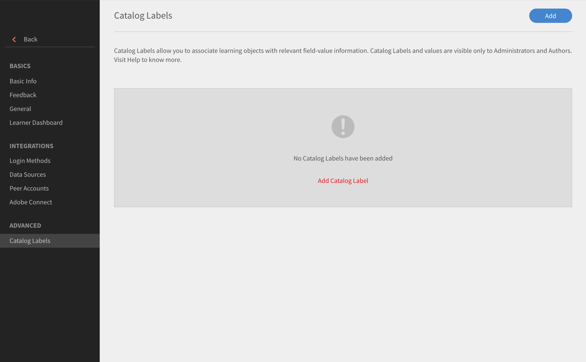

# Etiquetas de catálogo

Las etiquetas de catálogo permiten etiquetar objetos de aprendizaje con campos concretos y aplicar uno o más valores. Si la opción está habilitada, los administradores y los autores pueden definir etiquetas de catálogo y valores, y vincularlos a objetos de aprendizaje.

Esta función se utiliza para categorizar datos fácilmente. Por ejemplo, si desea categorizar objetos de aprendizaje según su ubicación, departamento o aptitudes. Puede aplicar estos campos y filtrar datos.

Para activar etiquetas de catálogo, siga estos pasos:

* Como administrador, abra **[!UICONTROL Configuración]** > **[!UICONTROL General]** > **[!UICONTROL Mostrar etiqueta de catálogo]**.
* Utilice la casilla de verificación para habilitar la etiqueta.

## Añadir etiquetas de catálogo {#addcataloglabels}

Para añadir etiquetas de catálogo, siga este paso:

1. Abrir  **[!UICONTROL Configuración]** > **[!UICONTROL Etiquetas de catálogo]** en virtud del **[!UICONTROL Avanzado]** opción. Se abre la página [!UICONTROL Etiquetas de catálogo].

   

1. Haga clic en **[!UICONTROL Añadir etiqueta de catálogo]** o en **[!UICONTROL Añadir]** en la esquina superior derecha. Se muestra el cuadro de diálogo **[!UICONTROL Añadir etiqueta de catálogo]**.
1. Añada la etiqueta de catálogo y sus valores en los campos. Un campo personalizado puede tener varios valores. Los autores pueden seleccionar estos valores desde el proceso de creación del curso.

   

1. Haga clic en **[!UICONTROL Guardar]**.
1. Cuando guarde la etiqueta, aparecerá en la página Etiquetas de catálogo. Elija si quiere que el valor sea o no obligatorio.

   

## Aplicar etiquetas a catálogos {#applylabelstocatalogs}

Tras haber creado etiquetas de catálogo, puede aplicarlas a catálogos siguiendo estos pasos:

1. Abra **[!UICONTROL Catálogos]** en el panel de la izquierda. La página Catálogo se abre y enumera la lista de catálogos.
1. Seleccione el catálogo y aplique a la etiqueta.
1. Abra etiquetas de catálogo en el panel de la izquierda.
1. Haga clic en **[!UICONTROL Editar]** en la esquina superior derecha. La página muestra la lista de etiquetas de catálogo disponibles.
1. Para incorporar una etiqueta al catálogo, haga clic en **[!UICONTROL Añadir a catálogo]**.
1. Para eliminar etiquetas añadidas a un catálogo, haga clic en **[!UICONTROL Quitar]**.

Cuando el campo personalizado se añade al catálogo, se aplica a todos los objetos de aprendizaje que son parte del catálogo.
