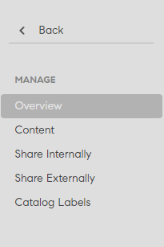

# Catálogos

Los catálogos son una colección de cursos de aprendizaje, programas de aprendizaje y certificaciones. Utilice los catálogos para proporcionar a los alumnos un conjunto personalizado de materiales de aprendizaje. Puede asociar aprendizaje con un catálogo durante la creación de un catálogo.

Como administrador, puede crear catálogos personalizados si desea que determinados cursos estén disponibles para varios alumnos de su cuenta o de diferentes cuentas.

## Introducción a los catálogos

En este curso de formación, aprenderá a crear y administrar catálogos.

Si no puedes iniciar el entrenamiento, escribe a <almacademy@adobe.com>.

## Crear un catálogo {#createacatalog}

Para crear un catálogo, efectúe los pasos siguientes:

1. Como administrador, en el panel izquierdo, haga clic en Catálogos. En esta página hay un catálogo predeterminado que se crea automáticamente al crear una cuenta de Learning Manager. De forma automática, todos los objetos de aprendizaje de este catálogo se comparten con todos los alumnos,
1. Para crear un catálogo, en la esquina superior derecha de la página, haga clic en **[!UICONTROL Crear]**. También puede hacer clic en **[!UICONTROL Crear catálogo]**, que está debajo de la lista de catálogos.
1. En la página **[!UICONTROL Crear catálogo]**, indique el nombre y la descripción del catálogo que desea crear.

   

   Para continuar, haga clic en **[!UICONTROL Siguiente]**.

   Las miniaturas solo se pueden ver en la interfaz de usuario envolvente, no en la clásica.

1. En la página Catálogo, puede agregar lo siguiente en el catálogo nuevo:

   * [Cursos](catalogs.md#course)
   * [Programas de aprendizaje](catalogs.md#lp)
   * [Certificaciones](catalogs.md#cert)
   * [Ayudas de trabajo](catalogs.md#job)

## Agregar un curso al catálogo {#course}

1. En la lista de cursos, elija el que desee agregar al catálogo.

   

   *Crear un catálogo*

   Puede añadir varios cursos al catálogo.
1. Puede filtrar los cursos por aptitudes, funciones e idioma. El curso seleccionado se recomendará a los alumnos interesados en esas aptitudes y funciones.
1. Guarde los cambios. Regrese a la lista de catálogos y haga clic en el nuevo catálogo de la lista.
1. En la página del catálogo nuevo, en el panel izquierdo, haga clic en **[!UICONTROL Contenido]**.

   

   *Seleccione un curso para agregarlo al catálogo*

   El curso que ha añadido figura en la ficha **[!UICONTROL Cursos]**.

## Agregar un programa de aprendizaje al catálogo {#lp}

1. En la lista de programas de aprendizaje, elija el que desea agregar al catálogo.
1. Guarde los cambios. Regrese a la lista de catálogos y haga clic en el nuevo catálogo de la lista.
1. En la página del catálogo nuevo, en el panel izquierdo, haga clic en **[!UICONTROL Contenido]**.

   El programa de aprendizaje que ha agregado aparece en la ficha **[!UICONTROL Programas de aprendizaje]**.

## Agregar una certificación al catálogo {#cert}

1. En la lista de certificaciones, elija la que desea agregar al catálogo.
1. Guarde los cambios. Regrese a la lista de catálogos y haga clic en el nuevo catálogo de la lista.
1. En la página del catálogo nuevo, en el panel izquierdo, haga clic en **[!UICONTROL Contenido]**.

   La certificación que ha agregado aparece en la ficha **[!UICONTROL Certificaciones]**.

## Agregar una ayuda de trabajo al catálogo {#job}

1. En la lista de ayudas de trabajo, elija la que desea agregar al catálogo.
1. Guarde los cambios. Regrese a la lista de catálogos y haga clic en el nuevo catálogo de la lista.
1. En la página del catálogo nuevo, en el panel izquierdo, haga clic en **[!UICONTROL Contenido]**.

   La ayuda de trabajo que ha agregado aparece en la ficha **[!UICONTROL Ayudas de trabajo]**.

El contenido aparece en cada una de estas fichas si ya está disponible en la cuenta. De lo contrario, primero debe crear el contenido. Por ejemplo, si no ha añadido ninguno de los cursos o programas de aprendizaje que ya están en la aplicación Learning Manager, antes debe comenzar a crearlos.

## Vínculo profundo al catálogo para alumnos {#deep-link}

Un administrador puede generar un vínculo profundo para un catálogo que pueda llevar a los alumnos a la página específica del catálogo.

En la página **[!UICONTROL Catálogos]**, coloque el cursor sobre el catálogo para el que haya generado el vínculo profundo y haga clic en el icono resaltado.

*Generar un vínculo profundo para los alumnos*

## Activar el catálogo {#enablethecatalog}

Una vez que se crea un catálogo y se le agregan objetos de aprendizaje, si se desea que el catálogo esté visible para los alumnos, se debe activar el catálogo.

Para activar el catálogo,

1. En la lista de catálogos, elija la opción junto al catálogo que desea activar. También puede seleccionar la casilla de verificación junto al catálogo, hacer clic en **[!UICONTROL Acciones]** en la esquina superior derecha y elegir la opción **[!UICONTROL Activar]**.

1. Asimismo, es posible activar varios catálogos de la lista. Seleccione los catálogos; a continuación, en la lista **[!UICONTROL Acción]**, elija la opción **[!UICONTROL Activar]**.

## Desactivar el catálogo {#disablethecatalog}

Para desactivar un catálogo, desactive la opción junto al catálogo.

También puede seleccionar la casilla de verificación junto al catálogo, hacer clic en Acciones en la esquina superior derecha y elegir **[!UICONTROL Deshabilitar]**.

Asimismo, es posible desactivar varios catálogos de la lista. Seleccione los catálogos y, en el menú Acción, elija la opción **[!UICONTROL Deshabilitar]**.

## Eliminar el catálogo {#deletethecatalog}

Para eliminar un catálogo, seleccione un catálogo de la lista. Haga clic en el botón Eliminar cerca del catálogo o en **[!UICONTROL Acciones]** > **[!UICONTROL Eliminar]**.

También puede eliminar varios catálogos.

## Compartir el catálogo {#shared}

Un administrador puede compartir los catálogos con usuarios internos de una empresa o con cualquier usuario externo. Ahora bien, el uso compartido es exclusivo. Es decir, un catálogo compartido internamente no se puede compartir con grupos externos y viceversa.

Los cursos, los programas de aprendizaje, las ayudas de trabajo y las certificaciones son los objetos de aprendizaje admitidos en el catálogo que se desea compartir.

### Compartir catálogos

Esta formación le enseñará a compartir catálogos con grupos de usuarios internos y cuentas externas de Adobe Learning Manager.

Si no puedes iniciar el entrenamiento, escribe a <almacademy@adobe.com>.

## Compartir el catálogo de manera interna {#int}

Elija un catálogo que desee compartir internamente.

En el panel izquierdo, haga clic en **[!UICONTROL Compartir internamente]**.

Si no hay ningún grupo, debe agregar un grupo de usuarios internos.

Para agregar un grupo de usuarios internos, haga clic en **[!UICONTROL Añadir grupos de usuarios]**.

*Compartir un catálogo internamente*

No hay opción para habilitar ni deshabilitar un grupo de usuarios compartido. Para deshabilitarlo, debe eliminar el grupo de usuarios. Para ello, coloque el ratón sobre los puntos suspensivos y haga clic en el icono de eliminar. También puede hacer clic en el menú desplegable Acciones en la esquina superior derecha de la página y, a continuación, hacer clic en Eliminar.

## Compartir el catálogo de manera externa {#ext}

En la página Catálogos, haga clic en el catálogo que desea compartir. En el panel izquierdo, haga clic en **[!UICONTROL Compartir externamente]**.

*Compartir un catálogo externamente*

Indique el subdominio asociado a su cuenta de Learning Manager. Haga clic en **[!UICONTROL ¿Cómo obtener un subdominio?]** para obtener información sobre el uso del subdominio. También puede hacer clic en **[!UICONTROL Marca]** en el panel izquierdo de la página principal del administrador para ver el subdominio asociado a la cuenta de su organización.

**Límite de inscripciones**

Puede definir el límite de inscripciones por curso en el catálogo compartido añadiendo el número en el campo **Inscripciones permitidas**. El destinatario del catálogo compartido no puede utilizar los cursos con límite de inscripciones en los planes de aprendizaje.

**Vencimiento**

Puede establecer la validez del catálogo compartido configurando una fecha de caducidad en el campo **[!UICONTROL Caducidad]**. Después de la fecha de vencimiento del catálogo compartido, no se permiten inscripciones en los cursos. Los alumnos siguen pudiendo acceder al contenido. Los objetos de aprendizaje se retiran, pero las insignias y las aptitudes continúan activas. En este estado, el receptor del catálogo compartido no puede anular la retirada de los objetos de aprendizaje retirados.

Haga clic en **[!UICONTROL Guardar]** después de añadir toda la información requerida. Haga clic en el menú desplegable **[!UICONTROL Acciones]** en la esquina superior derecha de la página y haga clic en **[!UICONTROL Compartir]** para compartir el catálogo con cuentas externas.

Los catálogos propiedad del titular de la cuenta compartida solo se pueden compartir con cuentas externas. No puede compartir los catálogos que ya están compartidos por otras cuentas.

El administrador de la cuenta compartida externa recibe una notificación en la aplicación y el correo electrónico. El destinatario debe hacer clic en la URL única proporcionada en el correo electrónico, o bien hacer clic en el mensaje de notificación y aceptar la solicitud de uso compartido del catálogo. En la aplicación, el destinatario puede hacer clic en Aceptar o Rechazar. Antes de aceptar el catálogo compartido, el destinatario puede ver los detalles del catálogo, por ejemplo quién lo comparte, la fecha de uso compartido o el vencimiento.

El catálogo compartido aparece en la cuenta del destinatario. Los objetos de aprendizaje asociados al catálogo compartido aparecen en las funciones respectivas de administrador y autor de la aplicación. Puede diferenciar los catálogos compartidos que ha recibido buscando el icono de flecha &lt;-- mostrado para los catálogos adquiridos por usted.

Los objetos de aprendizaje con el estado abierto o activo para inscripción solo se añaden a los catálogos compartidos.

**Dejar de compartir catálogos**

Dejar de compartir un catálogo significa deshabilitar una cuenta externa en la aplicación. Para dejar de compartir un catálogo, haz clic en **[!UICONTROL Acciones]** en la esquina superior derecha de la página y haz clic en **[!UICONTROL Dejar de compartir]**. Un catálogo puede dejarse de compartir en cualquier momento. Cuando se deja de compartir un catálogo, todos los objetos de aprendizaje de ese catálogo compartido pasan al estado retirado. Los catálogos desactivados aparecen como retirados en la aplicación del receptor.

Puede eliminar una cuenta externa de una lista compartida solo antes de que el destinatario acepte la solicitud.

**Eliminar catálogos**

Para eliminar un catálogo compartido, haz clic en el menú desplegable **[!UICONTROL Acciones]** y haz clic en **[!UICONTROL Eliminar]**.

* No puede compartir un catálogo predeterminado con cuentas externas.
* No puede eliminar un catálogo que haya compartido externamente.
* No puede eliminar un catálogo compartido de otras cuentas.

## Permitir control total del catálogo compartido {#enablefullcontrolofsharedcatalog}

Puede otorgar acceso completo a su catálogo a cuentas externas. De este modo, el administrador de la cuenta puede aceptar el catálogo y, en consecuencia, añadir o eliminar aprendizajes o módulos.

Para obtener más información, consulte [Permitir control total del catálogo compartido](shared-catalog-full-control.md).

## Propiedades de objetos de aprendizaje del catálogo compartido {#sharedcataloglearningobjectsproperties}

Cualquier modificación realizada en los objetos de aprendizaje en la aplicación propietaria se transfiere al receptor del catálogo compartido. A continuación se muestra una lista de las propiedades del objeto de aprendizaje que se reflejan en la aplicación receptora:

<table>
 <tbody>
  <tr>
   <td>
    
<strong>Curso</strong>
</td>
   <td>
    
Nombre, descripción y otros campos del objeto Curso, excepto puntos de interacción, badgeId
</td>
  </tr>
  <tr>
   <td>
    
<strong>Programa de aprendizaje</strong>
</td>
   <td>
    
Nombre, descripción y otros campos del objeto LP excepto badgeId, retirada
</td>
  </tr>
  <tr>
   <td>
    
<strong>Certificación</strong>
</td>
   <td>
    
Todas las propiedades del objeto de certificación excepto badgeId, retirada de la certificación
</td>
  </tr>
  <tr>
   <td>
    
<strong>Insignia</strong>
</td>
   <td>
    
Nombre y retirada del distintivo
</td>
  </tr>
  <tr>
   <td>
    
<strong>Categoría </strong>
</td>
   <td>
    
Nombre, descripción, color y retirada de la categoría, adición de un nuevo nivel
</td>
  </tr>
  <tr>
   <td>
    
<strong>Job-Aid</strong>
</td>
   <td>
    
Todas las propiedades del objeto jobAid
</td>
  </tr>
  <tr>
   <td>
    
<strong>Módulo</strong>
</td>
   <td>
    
Todas las propiedades del objeto de módulo
</td>
  </tr>
 </tbody>
</table>

## Características de los catálogos compartidos en la aplicación del destinatario {#sharedcatalogfeaturesinreceiverapplication}

* Los objetos de aprendizaje del catálogo compartido aparecen en la aplicación del autor y del administrador, pero no se muestran los módulos. Están ocultos.
* Los objetos de aprendizaje compartidos se pueden usar para todos los flujos de trabajo en la cuenta del destinatario. Por ejemplo, añadir cursos compartidos a programas de aprendizaje, certificaciones, catálogos; sin embargo, dichos programas de aprendizaje, certificaciones y catálogos no se pueden volver a compartir, puesto que ya tienen un objeto de aprendizaje compartido de otra cuenta.
* Todas las ayudas de trabajo que están asociadas al curso o aprendizaje, o bien al programa o la certificación, pero que no forman parte del catálogo se copian en la cuenta del destinatario.
* Los destinatarios del catálogo compartido no pueden añadir objetos de aprendizaje al catálogo compartido.
* El destinatario del catálogo compartido no puede modificar módulos de objetos de aprendizaje compartidos.
* El destinatario del catálogo compartido no puede añadir cursos al programa ni a la certificación de aprendizaje compartidos.
* No se permite duplicar ni volver a compartir objetos de aprendizaje compartidos.
* Los destinatarios ven automáticamente los activos recién añadidos al catálogo compartido.
* Las aptitudes asociadas a los objetos de aprendizaje se copian en las cuentas de destinatarios de catálogos compartidos.

* Si la cuenta del destinatario del catálogo compartido ya tenía el mismo nombre de aptitud, se creará una nueva aptitud añadiendo &#42; después del nombre.
* Los datos (por ejemplo, insignias, L1, L3 o notificaciones) de las instancias predeterminadas de los cursos y los programas de aprendizaje también se copian en la cuenta del destinatario junto con los cursos y los programas de aprendizaje.

Las certificaciones recurrentes no pueden formar parte de un catálogo compartido externamente. El destinatario no puede usar objetos de aprendizaje adquiridos en certificaciones recurrentes si tienen el límite de inscripción o la fecha de vencimiento configurados en el catálogo.

## Propagación de contenido de catálogos compartidos {#propagation}

Los administradores de las cuentas de una empresa pueden compartir los catálogos en varias cuentas. Los destinatarios de los catálogos compartidos pueden adquirir los objetos de aprendizaje asociados a los catálogos compartidos. Además de esta función, a partir de la versión de noviembre de 2016 de Learning Manager, los destinatarios pueden adquirir las propiedades de los objetos de aprendizaje compartidos a través de los catálogos.

Tras compartir los catálogos, si el administrador de una cuenta realiza algún cambio en los objetos de aprendizaje, los mismos cambios se propagarán en todos los objetos de aprendizaje adquiridos por el destinatario de catálogos compartidos.

Los objetos de aprendizaje admitidos como parte de esta función de propagación son los siguientes:

* Aptitudes
* Cursos
* Programas de aprendizaje
* Certificaciones
* Ayudas de trabajo
* Instancias predeterminadas de cursos y programas de aprendizaje

Si los destinatarios de catálogos compartidos modifican cualquiera de los campos de objeto de aprendizaje recibidos en la aplicación Learning Manager, no se propagarán más las actualizaciones de esos campos para esos objetos de aprendizaje. Por ejemplo, si el destinatario edita campos del curso como Nombre de curso o Breve descripción, la propagación no tiene lugar cuando el propietario cambia estos campos. En otras palabras, esos campos de objetos de aprendizaje editados se vuelven locales en la cuenta de Learning Manager del destinatario.

## Preguntas más frecuentes {#frequentlyaskedquestions}

+++Cómo añadir cursos, programas de aprendizaje y certificaciones a un catálogo

Para añadir cursos, programas de aprendizaje y certificaciones al catálogo, consulte los [pasos](catalogs.md#q1) para incluirlos en el catálogo.

+++

+++Cómo compartir un catálogo externa e internamente?

Para compartir el catálogo de manera interna o externa, consulte las secciones siguientes:

* [Compartir internamente](catalogs.md#int)
* [Compartir externamente](catalogs.md#ext)

+++

+++¿Cómo permitir a los alumnos ver todo el catálogo del que forman parte?

Los catálogos se pueden compartir con los alumnos dentro de su organización mediante los grupos de usuarios. Para permitir que los alumnos vean los catálogos de los que forman parte, siga los pasos que se indican a continuación:

1. Abra un catálogo y haga clic en **[!UICONTROL Compartir internamente]**.
1. Para añadir alumnos, en la esquina superior derecha de la página, haga clic en **[!UICONTROL Agregar]**.
1. En el cuadro de diálogo **[!UICONTROL Grupos de usuarios]**, empiece a agregar alumnos.
1. Haga clic en **[!UICONTROL Guardar]**.

Cuando un alumno inicia sesión en Learning Manager, puede ver los Catálogos que se han compartido con él.

+++

+++Cómo crear y utilizar etiquetas de catálogo

Las etiquetas de catálogo permiten asociar objetos de aprendizaje con información de valor de campo relevante. Las etiquetas de catálogo y los valores solo están visibles para administradores y autores. Para obtener más información, consulte [***Etiquetas de catálogo***](/help/migrated/administrators/feature-summary/catalog-labels.md).

Tras haber creado etiquetas de catálogo, puede aplicarlas a catálogos siguiendo estos pasos:

1. Abra Catálogos en el panel izquierdo.
1. Seleccione el catálogo y aplique a la etiqueta.
1. Abra etiquetas de catálogo en el panel de la izquierda.
1. Haga clic en **[!UICONTROL Editar]** en la esquina superior derecha. La página muestra la lista de etiquetas de catálogo disponibles.
1. Para incorporar una etiqueta al catálogo, haga clic en **[!UICONTROL Añadir a catálogo]**.
1. Para quitar las etiquetas existentes agregadas a un catálogo, haga clic en **[!UICONTROL Quitar]**.

+++

+++¿Cómo puedo proporcionar acceso a determinados catálogos a usuarios externos recién creados?

1. Como administrador, seleccione el catálogo al que desea proporcionar acceso a un perfil de usuario externo.
1. Compartir internamente > Añadir más > Seleccionar el perfil de usuario externo correspondiente
1. Active o desactive esta opción para habilitar el catálogo.

+++

+++¿Cómo limito a los usuarios para que solo vean catálogos específicos?

Desactive el catálogo predeterminado y active solo el catálogo que se ha creado y al que se ha concedido acceso a los usuarios externos.

+++
