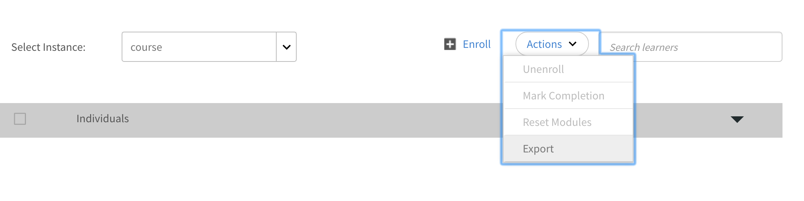

# Certificaciones

Aprenda a crear certificaciones, inscribir alumnos y editar certificaciones publicadas.

Certifica a tus alumnos una vez o en un intervalo de tiempo recurrente con esta función. Solo los administradores pueden definir las certificaciones para los alumnos.

Como administrador, puede crear un programa de certificación alojado internamente o dirigido por un tercero. En caso de certificación interna, defina los cursos que un alumno debe completar para obtener la certificación. Publique el programa y asígnelo a los alumnos.

## Crear una certificación {#createacertification}

1. Haga clic en **[!UICONTROL Certificación]** en el panel izquierdo.\
   Aparece una página con una lista de todos los borradores y el estado publicado de las certificaciones.

1. Vea las certificaciones en varios modos:

   1. Haga clic en **[!UICONTROL Draft]** para ver todas las certificaciones que están en estado de borrador. Tiene que terminar de crearlas.
   1. Haga clic en **[!UICONTROL Publicado]** para ver todas las certificaciones publicadas por usted.
   1. Haga clic en **[!UICONTROL Todo]** para ver las certificaciones en todos los estados.
   1. Ordene y vea la lista de certificaciones en orden ascendente o descendente, o según la fecha en que las actualizó.

1. Haga clic en **[!UICONTROL Añadir]**.

   Aparece una nueva página de certificación.

*Ver la página para añadir una certificación*

1. Agregue el nombre y la descripción del certificado.

<table>
 <tbody>
  <tr>
   <th>Campo</th>
   <th>Descripción</th>
  </tr>
  <tr>
   <td>Días para completar</td>
   <td>El plazo para la certificación. Introduzca un valor numérico.</td>
  </tr>
  <tr>
   <td>Tipo</td>
   <td>
    
El tipo de certificación:

    <ul>
     <li><b>Recurrente</b>- Elija esta opción si la certificación debe darse cada año, cada dos años o cada tres años.</li>
     <li><b>Perpetual</b>- Elija esta opción si la certificación debe darse una única vez.</li>
    </ul></td>
  </tr>
  <tr>
   <td>Reasignación</td>
   <td>Elija si desea reasignar el certificado según la fecha de finalización o la fecha de inscripción. </td>
  </tr>
  <tr>
   <td>Validez (en meses)  </td>
   <td>Especifique cuánto tiempo puede seguir siendo válida la certificación.</td>
  </tr>
  <tr>
   <td>Secuencia de los cursos </td>
   <td>Decida si los alumnos deben realizar los cursos en un orden determinado o sin un orden concreto. </td>
  </tr>
  <tr>
   <td>Darse de baja </td>
   <td>Active o desactive la opción que permite a los alumnos darse de baja por sí mismos.</td>
  </tr>
  <tr>
   <td>Emisor del certificado </td>
   <td>
    
Elegir <b>Interno</b> si pertenece a su organización, o elija <b>Externo</b> para certificaciones de organizaciones externas.

    
Cuando elija <b>Certificación externa</b>, verá dos opciones más:

    <ul>
     <li>Igual que fecha de aprobación </li>
     <li>Enviado por el alumno </li>
    </ul>
    
Los alumnos pueden especificar la fecha de finalización correcta para las certificaciones externas. En versiones anteriores, Captivate Prime establecía la fecha de finalización de forma predeterminada, según la fecha de aprobación del responsable. La fecha de finalización proporcionada por el alumno debe ser posterior a la fecha de creación del certificado..
</td>
  </tr>
  <tr>
   <td>Duración</td>
   <td>Si ha elegido Certificación externa, especifique la duración en minutos.</td>
  </tr>
  <tr>
   <td>Etiquetas</td>
   <td>Introduzca las etiquetas que desea asociar al certificado. Las etiquetas son útiles cuando desea buscar el certificado.</td>
  </tr>
  <tr>
   <td>Seleccionar catálogos </td>
   <td>Elija el catálogo del que forma parte el certificado.</td>
  </tr>
 </tbody>
</table>

Elija los cursos que se añadirán a la certificación de **[!UICONTROL Cursos]** > **[!UICONTROL Catálogo]** .

Coloque el ratón sobre el mosaico de cada curso y haga clic en + para añadirlos a la certificación. Haga clic en **[!UICONTROL Vista previa]** para ver el curso como alumno antes de añadirlo.

1. Haga clic en **[!UICONTROL Plan de estudios]** para ver o verificar la lista de cursos que ha añadido.
1. Haga clic en **[!UICONTROL Publicar]**.

## Asignación de instancias de cursos para certificaciones {#courseinstancemappingforcertifications}

Para asignar el curso y la instancia de certificaciones:

1. Haga clic en Certificaciones en el panel izquierdo.
1. En la lista de certificaciones, seleccione Ver certificación de la certificación a la que desea asignar el curso y la instancia.
1. En el panel izquierdo, haga clic en Cursos. Se muestran los cursos para la certificación. Haga clic en Editar.
1. Sitúe el cursor sobre el curso en el que desea definir la asignación de instancias y seleccione Asignación de instancias de curso.
1. En la ventana emergente que aparece, seleccione la instancia del curso que se va a entregar para la certificación que ha elegido.
1. Haga clic en Guardar.

Un administrador puede añadir cursos de clase y de clase virtual a un programa de aprendizaje. Cualquier sesión que el autor haya dado durante la creación del curso se convierte en la instancia predeterminada. Cuando el administrador añade cursos a un programa de aprendizaje, de forma predeterminada se asigna a la instancia predeterminada de todos los cursos, pero el administrador puede cambiar la asignación de instancias. El número de cursos añadidos a un programa de aprendizaje también es visible en la página de instancias, como se muestra a continuación.

## Habilitar el control total del catálogo {#catalog}

Como conceder el pleno [control del catálogo para los aprendizajes o módulos](shared-catalog-full-control.md), también puede habilitar el control total del catálogo para las certificaciones.

## Inscribir o cancelar la inscripción de alumnos en la certificación {#enrollorunenrolllearnerstothecertification}

Para obtener más información sobre cómo inscribir alumnos y los pasos a seguir, consulte [Inscribir alumnos](courses.md#main-pars_header_1058138132).

## Dar de baja para alumnos {#unenrollmentforlearners}

Al crear certificaciones, el administrador tiene una opción para seleccionar si los alumnos pueden darse de baja de la certificación. Si el administrador selecciona la opción, el alumno puede darse de baja por sí mismo.

*Seleccionar dar de baja a alumnos*

## Marcar finalización {#markcompletion}

Los administradores pueden marcar una certificación como completada mediante la opción disponible para ellos. Para marcar la finalización de una certificación, siga estos pasos.

1. Abrir **[!UICONTROL Certificación]** > **[!UICONTROL Alumnos]**.

   Se abre la página Alumnos con la lista de alumnos inscritos.

1. Seleccione uno, varios o todos los alumnos para marcar la finalización de la certificación con la casilla de verificación disponible para cada alumno.
1. Haga clic en  **[!UICONTROL Acción]** > **[!UICONTROL Marcar finalización.]**

   Tenga en cuenta que si una certificación tiene varios cursos, se marcará la finalización de todos ellos.

## Cursos obligatorios para certificación externa {#mandatory}

En versiones anteriores de Learning Manager, la finalización del curso por parte del alumno en certificación externa no era obligatoria para completar un certificado.

Ahora puede hacer que los cursos sean obligatorios habilitando la opción **[!UICONTROL Definir los cursos requeridos como obligatorios para la finalización del certificado]** en la ficha Programa durante la edición de la certificación.

## Editar una certificación publicada {#editingapublishedcertification}

Un administrador puede editar una certificación en un estado publicado. En este estado, el administrador puede editar todas las secciones de una certificación y volver a publicarla.

Para editar una certificación publicada, haga clic en la tarjeta de certificación y, a continuación, en **[!UICONTROL Editar]** en la esquina superior derecha de la página.

Al editar las secciones de una certificación, si tiene que salir de la página, debe volver a publicar la certificación. Aparece un cuadro de diálogo de confirmación que le solicita volver a publicar la certificación.

## Suscripción {#subscription}

Un administrador puede obtener la puntuación de la prueba y los informes de estado del alumno. Pueden definir la frecuencia del informe, el asunto del correo electrónico y el ID de correo electrónico de los destinatarios. Según la frecuencia establecida, el destinatario recibirá un correo electrónico con el informe adjunto.

*Establecer la frecuencia del informe y otras propiedades*
