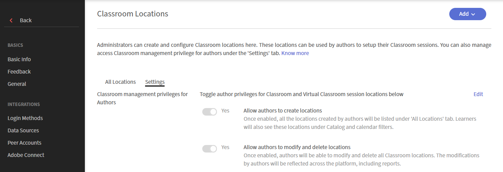

# Añadir ubicaciones de clases

Los administradores pueden crear y administrar una biblioteca de ubicaciones de clase para reutilizarla al configurar eventos de formación dirigidos por un instructor en el módulo de clase y clases virtuales. Para cada ubicación, puede definir detalles como el nombre de la ubicación, el límite de asientos e información adicional, incluida una dirección URL de ubicación. A continuación, los autores pueden seleccionar estas ubicaciones predefinidas al crear un curso.

De forma predeterminada, Adobe Learning Manager utiliza un formato de ubicación de campo único. Para las organizaciones que administran ubicaciones de clase en varios países e idiomas, Learning Manager también admite un formato estructurado de cuatro campos que incluye **País**, **Provincia/Región**, **Ciudad** y **Nombre de ubicación**. Este formato proporciona capacidades adicionales como filtrado basado en la ubicación y compatibilidad de idiomas para ubicaciones individuales. Los administradores pueden cambiar al formato de cuatro campos mediante una migración única.

>[!NOTE]
>
>Si el formato de ubicación de los cuatro campos no está activado, los autores y los alumnos pueden seguir utilizando Ubicaciones de clase de la forma habitual. El formato de ubicación de un solo campo existente sigue estando disponible y no es necesario realizar cambios. Vea [Migrar al método de cuatro campos](#migrate-classroom-locations-to-the-four-field-format) para obtener más información.

## Configurar la ubicación de clase

Los administradores pueden controlar si los autores pueden crear y administrar ubicaciones de clase. Use la configuración de **Ubicaciones de clase** para definir el nivel de acceso disponible para los autores.

Para configurar las **Ubicaciones de clase**:

1. Inicie sesión en Adobe Learning Manager como **administrador**.
1. Seleccione **Configuración** > **Ubicaciones de clase**.

   Se muestra la página **Ubicaciones de clase**.

1. Seleccione la ficha **Configuración**.

   

   *Habilite privilegios de autor para ubicaciones de clase y clase virtual desde la pestaña **Configuración**.*

1. Seleccione **Editar**.

   El botón deslizante se puede editar, lo que le permite actualizar los siguientes ajustes:

   | **Configuración** | **Descripción** |
   |---|---|
   | **Permitir a los autores crear ubicaciones** | Active esta opción para permitir que los autores creen ubicaciones de los módulos Clase y Clase virtual al crear sesiones de formación dirigidas por el instructor. |
   | **Permitir a los autores modificar y eliminar ubicaciones** | Active esta opción para permitir que los autores editen o eliminen las ubicaciones de clase y clase virtual. |

1. Seleccione **Guardar**.

## Crear y administrar ubicaciones de clase

Los administradores pueden crear y administrar ubicaciones de clase que los autores pueden reutilizar al crear sesiones de formación de clase y clase virtual. Adobe Learning Manager admite dos formatos de ubicación:

* **Formato de campo único**: Cada ubicación de clase se identifica mediante un único campo **Nombre de ubicación**. Vea [Agregar una ubicación de clase usando un formato de campo único](#add-a-classroom-location-using-a-single-field-format) para obtener más información.
* **Formato de cuatro campos**: Cada ubicación de clase está organizada en **País**, **Estado/Provincia/Región**, **Ciudad** y **Nombre de ubicación**, lo que facilita la administración de ubicaciones en varias regiones. Si su cuenta utiliza actualmente el formato de campo único, complete la migración única antes de cambiar al formato de cuatro campos. Vea [Migrar al método de cuatro campos](#migrate-classroom-locations-to-the-four-field-format) para obtener más información.

### Añadir una ubicación de clase mediante un formato de campo único

Puede añadir una ubicación de clase mediante el formato de campo único:

1. Inicie sesión en Adobe Learning Manager como **administrador**.
1. Seleccione **Configuración** > **Ubicaciones de clase**.
1. Seleccione **Agregar** > **Nueva ubicación**.
1. Escriba los siguientes detalles en el cuadro de diálogo **Ubicaciones de clase**:

   1. Escriba el **Nombre de ubicación**. Utilice un nombre exclusivo. De lo contrario, Learning Manager mostrará un mensaje de error.
   1. Introduzca la descripción de la ubicación en el campo **Información de ubicación**. Este campo es opcional.
   1. Introduzca la **URL de ubicación**. Los alumnos pueden ver esta información en los detalles de la clase. La dirección URL también puede ser una URL de ubicación de mapa, si es necesario. Se trata de un campo opcional.
   1. Escriba y seleccione la **región de ubicación**. Este campo es opcional.
   1. Escriba el número de puestos disponibles en el campo **Límite de puestos**. Esto indica la capacidad de asientos de la clase. Este valor se puede cambiar al crear el evento de formación real dirigido por el instructor.
      
      *Agregar una ubicación de clase usando el formato de campo único.*

### Migrar ubicaciones de clase al formato de cuatro campos

Si su cuenta utiliza el formato heredado de ubicación de clase de un solo campo, migre las ubicaciones de clase existentes antes de habilitar el formato de cuatro campos. El formato de cuatro campos organiza los datos de ubicación en **País**, **Estado/Provincia/Región**, **Ciudad** y **Nombre de ubicación**, lo que facilita la administración de ubicaciones en varias regiones.

Esta migración se realiza una sola vez. Después de cambiar al formato de cuatro campos, no puede revertir la cuenta al formato de un solo campo.

Para migrar ubicaciones existentes:

1. Vaya a **Administrador** > **Ubicaciones de clase** y seleccione la pestaña **Configuración**.
1. Seleccione **Exportar** en la sección **Migración de formato de ubicación**.

   Se descargará un archivo CSV con las ubicaciones de clase existentes. Están disponibles las siguientes columnas:

   1. **room_id**: Identificador único de la ubicación.
   1. **configuración regional**: Configuración regional para el nombre de ubicación y la información de ubicación traducidos.
   1. **nombre**: Nombre de la clase.
   1. **país**: País donde se encuentra el aula.
   1. **estado**: Estado, provincia o región donde se encuentra el aula.
   1. **ciudad**: Ciudad donde se encuentra el aula.
   1. **información**: Detalles adicionales, como el nombre del edificio, el piso o el número de la habitación.
   1. **url**: URL asociada a la ubicación, como un vínculo de mapa.
   1. **seatlimit**: Máxima capacidad de asientos del aula.

   >[!NOTE]
   >
   >El archivo CSV exportado siempre incluye las columnas de formato de ubicación de cuatro campos, incluso cuando el formato de cuatro campos no está habilitado.

   

   *Compruebe el progreso de la migración antes de cambiar al formato de ubicación de cuatro campos.*

1. Para cada nombre de columna, actualice el archivo CSV con la información necesaria, como el país, el estado o la ciudad, junto con cualquier otra información necesaria.
1. Seleccione **Importar** y, a continuación, cargue el archivo CSV actualizado.

   Adobe Learning Manager valida los datos y actualiza el progreso de la migración.

1. Cuando la barra de progreso de la migración alcance el 100 %, seleccione **Cambiar al nuevo formato de 4 campos**. El estado de **migración de formato de ubicación** se actualiza a **Migración completada**.

   

   La migración del formato de ubicación *se actualiza al estado de migración completada.*

## Añadir ubicaciones de clase mediante un formato de cuatro campos

Después de completar la migración única, los administradores pueden crear ubicaciones de clase en el formato de cuatro campos. A continuación, los autores pueden reutilizar estas ubicaciones al crear sesiones de formación con instructor. Los administradores pueden añadir ubicaciones de clase de forma individual o importar varias ubicaciones de clase desde un archivo CSV.

### Añadir una ubicación de clase

Utilizar las ubicaciones de clase para estandarizar los centros de formación y simplificar la programación de sesiones para los autores.

Para añadir una ubicación de clase:

1. En la aplicación de administración, seleccione **Configuración** > **Ubicaciones de clase**.

   

   *Seleccione la ficha **Todas las ubicaciones**&#x200B;para agregar una ubicación de clase.*

1. Seleccione **Agregar** > **Nueva ubicación** en la esquina superior derecha.

   Aparece la ventana emergente **Ubicación de clase**.

   Ventana emergente 

   *Especifique los detalles en la ventana emergente Ubicación de clase.*

1. En la ventana emergente **Ubicación de clase**, introduzca los siguientes detalles:

   | **Campo** | **Descripción** |
   |---|---|
   | **País** | Seleccione el país donde se encuentra la clase. |
   | **Estado/provincia/región** | Seleccione el estado, provincia o región. |
   | **Ciudad** | Seleccione la ciudad donde se encuentra la clase. |
   | **Nombre de ubicación** | Escriba el nombre de la clase o sala. |
   | **Información de ubicación** | Introduzca detalles adicionales, como el nombre del edificio, el piso o el número de la habitación. |
   | **URL de ubicación** | Introduzca una dirección URL para la ubicación, como un vínculo de mapa. |
   | **Límite de asientos** | Entrar en la capacidad máxima de asientos de la clase. |

1. Seleccione **Guardar**.

   La ubicación de clase se guarda y se muestra en la ficha **Todas las ubicaciones**.

### Importar ubicaciones de clase de forma masiva

Utilice la importación en bloque para añadir varias ubicaciones de clase o actualizar ubicaciones existentes mediante un archivo CSV.

Para importar ubicaciones de clase de forma masiva:

1. En la aplicación de administración, seleccione **Configuración** > **Ubicaciones de clase**.
1. Seleccione **Descargar CSV** en la pestaña **Todas las ubicaciones**.

   Se descarga un archivo CSV que contiene las ubicaciones de clase existentes. Están disponibles las siguientes columnas:

   1. **room_id**: Identificador único de la ubicación.
   1. **configuración regional**: Configuración regional para el nombre de ubicación y la información de ubicación traducidos.
   1. **nombre**: Nombre de la clase.
   1. **país**: País donde se encuentra el aula.
   1. **estado**: Estado, provincia o región donde se encuentra el aula.
   1. **ciudad**: Ciudad donde se encuentra el aula.
   1. **información**: Detalles adicionales, como el nombre del edificio, el piso o el número de la habitación.
   1. **url**: URL asociada a la ubicación, como un vínculo de mapa.
   1. **seatlimit**: Máxima capacidad de asientos del aula.

1. Para cada nombre de columna, actualice el archivo CSV con la información necesaria, como el país, el estado o la ciudad, junto con cualquier otra información necesaria.
1. Seleccione **Agregar** > **Ubicaciones de importación en bloque** en la esquina superior derecha.

   Aparece la ventana emergente **Importar ubicaciones CSV**.

   

   *Arrastre y suelte el archivo CSV con la información actualizada.*

1. Arrastre y suelte el archivo CSV actualizado en el área de carga.
1. Seleccione **Importar**.

   Las ubicaciones de clase se actualizan.

## Añadir traducciones para una ubicación de clase

Agregue traducciones para los campos **Nombre de ubicación** e **Información de ubicación** para mostrar los detalles de la ubicación de clase en los idiomas preferidos del alumno.

Para añadir traducciones para una ubicación de clase:

1. Seleccione **Todas las ubicaciones** > **Agregar** en las **Ubicaciones de clase**.
1. Seleccione **Nueva ubicación**.

   Aparece la ventana emergente **Ubicación de clase**.

1. Seleccione **Agregar nuevo idioma**.

   Aparece la ventana emergente **Agregar nuevo idioma**.

   

   *Seleccione los idiomas en la ventana emergente Agregar nuevo idioma.*

1. Seleccione **Guardar**.

   Las traducciones se guardan y se muestran a los usuarios.

>[!NOTE]
>
>Solo los campos **Nombre de ubicación** e **Información de ubicación** admiten traducciones. Los detalles de la ubicación, como **País**, **Estado/Provincia/Región** y **Ciudad**, no están traducidos.

## Editar una ubicación de clase

Para editar una ubicación de clase, siga estos pasos:

1. En la aplicación de administración, seleccione **Configuración** > **Ubicaciones de clase**.
1. Pase el ratón sobre la ubicación de clase que desee editar.

   

   *Pase el ratón sobre la ubicación de clase requerida y seleccione el icono de edición.*

1. Seleccione el icono **Editar ubicación de clase**.

   Aparece la ventana emergente Ubicación de clase.

1. Modifique la ubicación de la clase y seleccione **Guardar**.

## Eliminar una ubicación de clase

Para eliminar una ubicación de clase, siga estos pasos:

1. En la aplicación de administración, seleccione **Configuración** > **Ubicaciones de clase**.
1. Pase el ratón sobre la ubicación de clase que desee eliminar.
1. Seleccione el icono **Eliminar ubicación de clase**.

   Aparecerá la ventana emergente Confirmación Necesaria.

   

   *Seleccione Eliminar para confirmar la eliminación de una ubicación de clase.*

1. Seleccione **Eliminar**.

## Preguntas frecuentes

1. **¿Qué sucede con las ubicaciones de clase existentes una vez completada la migración?** 
Puede habilitar el formato de ubicación de cuatro campos solo después de migrar todas las ubicaciones existentes, ya sea manualmente o mediante una carga de CSV. Una vez habilitado el formato de cuatro campos, todos los cursos existentes que utilizan Ubicaciones de clase muestran las ubicaciones en el nuevo formato.

1. **¿Necesito reestructurar manualmente el archivo CSV exportado para que coincida con el formato de ubicación de cuatro campos?** 
No. El archivo CSV exportado siempre utiliza el formato de ubicación de cuatro campos, independientemente de si está activado actualmente. Solo tiene que actualizar los valores que faltan antes de importar el archivo.

1. **¿Afecta la migración a los informes de Adobe Learning Manager?** 
Sí. Después de la migración, los informes que incluyen información de Ubicación de clase muestran las ubicaciones con el siguiente formato:

   **País > Estado/Provincia/Región > Ciudad > Nombre de ubicación**

   Este formato reemplaza el valor de ubicación de campo único anterior.

1. **¿Qué sucede si no habilito el formato de ubicación de cuatro campos?** 
Nada cambia para los autores o los alumnos. Las ubicaciones de clase siguen apareciendo y funcionando como en la actualidad, utilizando el formato de campo único existente hasta que un administrador complete la migración y active el formato de cuatro campos.
