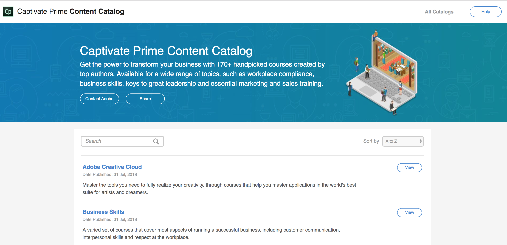
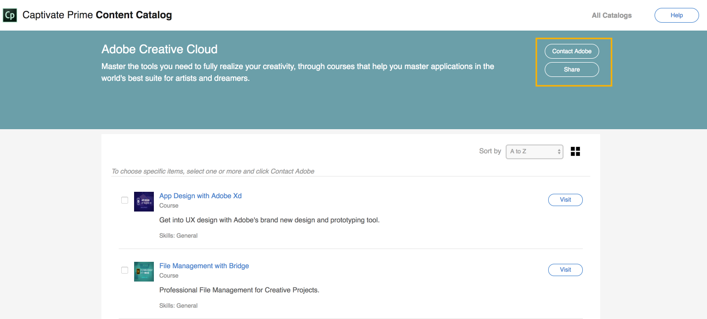

# Catálogo de contenido de Learning Manager

<!--Learning Manager introduces Content Catalog-->

El catálogo de contenido no se admite en una instancia de Azure de Learning Manager.

* **Curso** hace referencia a una única consolidación de tareas y módulos de aprendizaje electrónico sobre un tema específico que se crea y se suministra al cliente con Adobe Learning Manager.
* **Proveedor de contenido** hace referencia al propietario de los cursos que ha autorizado a Adobe a mostrarlos y sublicenciarlos en Adobe Learning Manager.

Learning Manager presenta el catálogo de contenido, un conjunto de bases de contenido listas para usar que puede adquirir. Puede comprar cursos de la plataforma, por ejemplo sobre aptitudes comerciales, requisitos del lugar de trabajo, Adobe Creative Cloud o tecnología, en nuestro mercado de contenido.

En el panel izquierdo, haga clic en Content Marketplace y, a continuación, haga clic en **[!UICONTROL Formación para Creative Cloud]**.

<!---->

Para ver los detalles del catálogo y los cursos de cada catálogo, haga clic en **[!UICONTROL Ver]**. La nueva ventana muestra todos los cursos.

<!---->

Para ver los detalles del curso, haga clic en **[!UICONTROL Visitar]**. Utilice las casillas de verificación para seleccionar los cursos que le interesan.

* Puede compartir los cursos seleccionados con sus compañeros seleccionando **[!UICONTROL Compartir]**.
* Puede ponerse en contacto con el Adobe seleccionando **[!UICONTROL Contactar con el Adobe]**.

<!---->

El cliente de correo electrónico se abre de manera predeterminada en ambas instancias. Si ha seleccionado determinados cursos con las casillas de verificación, las URL se agregan automáticamente al cuerpo del correo electrónico.

Si tu cliente de correo electrónico no se abre de forma predeterminada, puedes enviar tu interés por correo electrónico a `learningmanagercontentcontentadmin@adobe.com`.

Para poder acceder al catálogo de contenido, es necesario haber iniciado sesión en Learning Manager.
