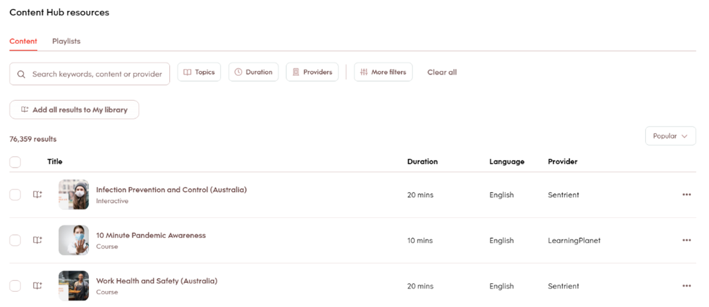

# Tienda de contenido

Los administradores de aprendizaje a menudo se enfrentan a problemas al buscar y cargar contenido de calidad. La Tienda de contenido de Adobe Learning Manager simplifica este proceso al permitir la concesión de licencias de cursos premium a proveedores de confianza, lo que permite una distribución de aprendizaje más rápida y ampliable. Con la Tienda de contenido, el administrador puede examinar, previsualizar y comprar licencias de cursos de terceros de proveedores.

La Tienda de contenido ofrece los siguientes planes para adquirir contenido:

* **[!UICONTROL Aspectos básicos premium]**
* **[!UICONTROL Aspectos básicos premium Plus]**

| **[!UICONTROL Aspectos básicos premium]** | **[!UICONTROL Aspectos básicos premium Plus]** |
|---|---|
| Acceso a más de 90.000 cursos | Acceso a más de 100.000 cursos |
| Contenido de más de 250 proveedores | Incluye todo el contenido de Premium Essentials |
| Contenido exclusivo de proveedores de confianza como:<li>EasyLlama</li><li>Skillshub</li><li>Thomson Reuters</li><li>Emtrain</li><li>Harvard ManageMentor</li> | Cursos exclusivos de los principales proveedores, como: <li>Blinkist</li><li>Pluralsight</li>Skillsoft</li><li>Traliant</li><li>Coursera</li> |

<!--**[!UICONTROL Premium Essentials]**:
A cost-effective solution designed to enhance employee engagement. 

* Access to over 90,000 courses
* Content from more than 250 providers
* Focus on compliance and skill improvement
* Exclusive content from trusted providers such as:
   * EasyLlama
   * Skillshub
   * Thomson Reuters
   * Emtrain
   * Harvard ManageMentor

**[!UICONTROL Premium Essentials Plus]**:

* Access to more than 100,000 courses
* Includes all Premium Essentials content
* Exclusive courses from top providers like:
   * Blinkist
   * Pluralsight
   * Skillsoft
   * Traliant
   * Coursera

Select the plan that best meets your organization's learning goals and budget.-->

## Adquirir contenido de proveedores

Para examinar y adquirir contenido de proveedores de contenido, siga estos pasos:

1. Seleccione **[!UICONTROL Mercado de contenido]** en la página principal del administrador. Aparece la página **[!UICONTROL Mercado de contenido]**.

   
   _Ver los planes de compra en la página Tienda de contenido_

2. Los administradores pueden obtener una vista previa y explorar el centro de contenido para los planes **[!UICONTROL Premium Essentials]** y **[!UICONTROL Premium Essentials Plus]**.

Los proveedores de contenido gestionan la eliminación del contenido obsoleto, lo que garantiza que no se retire ningún material de aprendizaje sin previo aviso.

<!--Learning Manager now offers Content Marketplace for you to explore and purchase trainings. Explore 70,000+ courses that cover a wide range of topics, available in multiple formats. Choose from curated playlists that cater to a vast variety of roles and meet your learning and upskilling needs.

In the Administrator app, there is a new option **[!UICONTROL Content Marketplace]**, which you'll find on the left panel.

Users can purchase from curated playlists covering various topics or purchase the entire catalog. 

On the page, you can see two tiles, Enterprise Training and Creative Cloud Training. The first tile launches the marketplace, using which you can acquire courses for your learners. The latter launches the content catalog.

The Enterprise Training page in the Administrator app enables you to invite users and download the Express Interest report, and also purchase the entire catalog or curated playlist.-->

## Solicitar un presupuesto

Los administradores pueden seleccionar un plan, como Premium Essentials o Premium Essentials Plus, especificar el número de puestos necesarios y generar un formulario de solicitud de presupuesto descargable. Una vez completado, el formulario se envía al equipo de ventas de Adobe Learning Manager para su procesamiento. El proceso de solicitud de presupuesto también permite que el Adobe proporcione precios personalizados en función de las necesidades de la organización.

Para descargar la petición de oferta, siga estos pasos:

1. Seleccione **[!UICONTROL Mercado de contenido]** en la página principal del administrador.

2. Seleccione el tipo de licencia y escriba el número de licencias para generar el presupuesto en la sección **[!UICONTROL Solicitar un presupuesto]**.

3. Seleccione **[!UICONTROL Descargar petición de presupuesto]** para descargar el presupuesto.

_Descargar solicitud de presupuesto después de seleccionar un plan_

Envíe el presupuesto a [learningmanagersales@adobe.com](mailto:learningmanagersales@adobe.com) para activar su licencia. También puede ponerse en contacto con el administrador Adobe de éxito de clientes para iniciar el proceso de compra.

## Invitar a alumnos al centro de contenido

Invita a los alumnos a la Tienda de contenido para explorar el contenido y expresar interés. Como administrador, puede invitar a todos los alumnos de la cuenta o a los alumnos seleccionados. Se debe invitar a los alumnos antes de que puedan explorar el contenido. Consulte el [artículo](/help/migrated/administrators/feature-summary/content-marketplace.md#content-hub) para obtener más información sobre el centro de contenido.

Para invitar a los alumnos:

1. Seleccione **[!UICONTROL Mercado de contenido]** en la página principal del administrador.
2. Seleccione **[!UICONTROL Invitar a alumnos]** y elija a los alumnos requeridos.
3. Seleccione **[!UICONTROL Invitar a alumnos]**.

Los administradores también pueden revocar el acceso al **[!UICONTROL Centro de contenido]** seleccionando el vínculo **[!UICONTROL Quitar el acceso de todos los usuarios]**. Una vez revocado el acceso, los alumnos ya no verán la página Centro de contenido en la aplicación del alumno.

_Invitar a usuarios a acceder al centro de contenido_

De forma predeterminada, esta opción está activada para todas las cuentas nuevas. Para las cuentas existentes, los administradores deben invitar manualmente a los alumnos a acceder a la Tienda de contenido.

<!--## Purchase

You get unlimited access to the entire library of courses. Click the **[!UICONTROL Purchase]** button to download a Purchase Request form.

*Enter the number of seats to purchase*

Specify the number of seats for which you want to purchase the courses for. Download the purchase request form and then send the form to the sales team of Learning Manager.

The team will then validate the information and then generate a key, which will be provided to you. This is the activation key using which you'll grant access to your users to the content offering.

After the key is generated by the CSAM team, the Administrator can use the key to import the courses, and migrate the courses into the existing catalog or the new catalog.

During migration of courses, the status displays as **[!UICONTROL Importing Courses]**. Once the migration completes, the Administrator gets a notification that migration is complete and successful.

The **[!UICONTROL Licenses]** section then displays all the licenses that are acquired for the account.

The Administrator can see the links of the purchased catalogs in the Catalog Overview page.

Once the courses are added to the catalog, the Administrator can then grant access to the trainings to various user or user groups.

*Grant access to training to users and user groups*-->

<!--## Express interest report

When a learner clicks Express interest to Catalog in the Learner app, the interest is recorded in an Express interest report. The Administrator can download the report. The report (csv) contains the following fields:

* Name of the catalog
* Number of users expressing interest
* Email of the user expressing interest-->

## Centro de contenido

El centro de contenido permite a los administradores preseleccionar listas de reproducción necesarias desde la aplicación del alumno. La página Centro de contenido está visible constantemente para los administradores en su función de alumno, ya que les permite preseleccionar listas de reproducción fácilmente. Para ayudarle a preseleccionar la lista de reproducción correcta, los administradores pueden hacer que esta página esté accesible para los expertos en la materia de su cuenta.

Adobe Learning Manager se sincroniza con regularidad con el centro de contenido, lo que garantiza que las nuevas adiciones y actualizaciones se reflejen automáticamente en la plataforma.

Todo el contenido se asigna a los idiomas admitidos, lo que permite a los administradores filtrar y administrar el contenido de forma más eficaz en función de las preferencias de idioma.

## Plantillas de correo electrónico

Adobe Learning Manager ofrece plantillas de correo electrónico preconfiguradas que notifican a los administradores y alumnos sobre compras de contenido, actualizaciones del sistema y actividades de aprendizaje.

Existen tres plantillas de correo electrónico que puede utilizar:

1. **[!UICONTROL Activación de contenido correcta]:** Enviada a los administradores tras una compra correcta de contenido de terceros. Esta notificación confirma que la activación ha finalizado y que el contenido adquirido ya está disponible en el sistema para la asignación de alumnos.
2. **[!UICONTROL Error de carga automatizada de usuarios]:** Se activa cuando falla la importación automatizada de usuarios mediante CSV. Esta alerta ayuda a los administradores a identificar rápidamente los problemas en las actualizaciones de usuarios programadas, para que se puedan tomar medidas correctivas.
3. **[!UICONTROL Invitar a usuarios a explorar contenido]:** Correo electrónico de invitación que se envía a los alumnos una vez que el administrador adquiere contenido en la tienda. Después de eso, los usuarios pueden comenzar su recorrido de aprendizaje inmediatamente.

<!--Purchased courses cannot be added in recurring certificates.
Purchased courses cannot be shared to peer accounts.
Purchased courses can be consumed by all users who get access to it. Configure the catalog visibility to restrict the visibility of purchased courses to limited users.
Purchased courses cannot be consumed once the activation key expires. Please purchase/activate another key to allow consumption.-->

<!--## Content Hub in Content Marketplace

Content Hub allows Administrators and Subject Matter Experts (SMEs) to shortlist required playlists from learner app. Once shortlisted, Admins can download the Purchase Request Form and share it with the Adobe Sales agent.

An Admin can invite SMEs to shortlist the playlist which they are interested in. 

*Launch Content Hub from the marketplace*

Content Hub is available in Learner role for all Administrators. Administrators allow SMEs to shortlist the playlist which they are interested in purchasing.

The Content Hub page is visible to Administrators in their learner role all the time as it allows them to shortlist playlists easily. To help you in shortlisting the right playlist, Admins can make this page accessible to limited Subject matter experts in their account. Just visit the Enterprise Training page on Admin side and take steps to provide access.  

*View resources in the Content hub*

Learning Manager also enables Administrators to download a shortlisted playlist and share it with Adobe Sales team. Before downloading the shortlist, visit the Content Hub and shortlist a playlist by adding a playlist to your library. 

Then as Administrator, click **[!UICONTROL Content Marketplace]** > **[!UICONTROL Enterprise Training]** > **[!UICONTROL Purchase section]** > **[!UICONTROL Curated Playlists]**. Click the **[!UICONTROL Purchase]** button to download the Purchase request form which contains the details of your shortlisted playlist.

*Download the Purchase Request form*

The courses and Playlist which you see in the Content Hub are the same as what you see in the Content Marketplace. Content Hub simply provides an ability for Administrators and limited SMEs to shortlist playlist easily for purchase.-->
