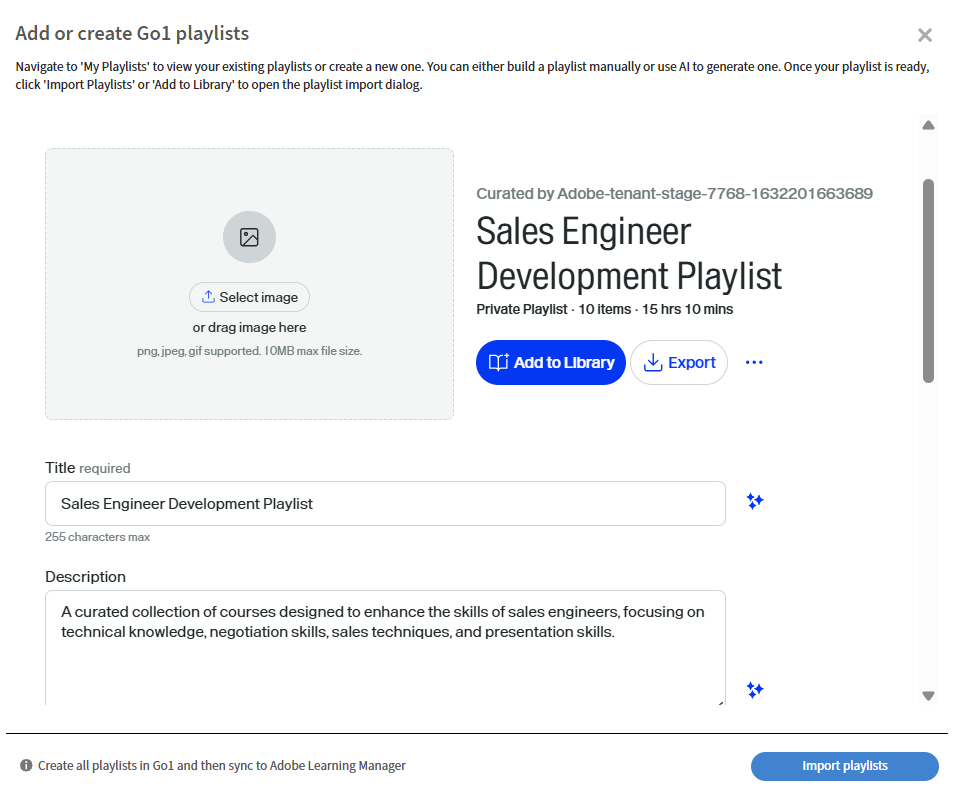
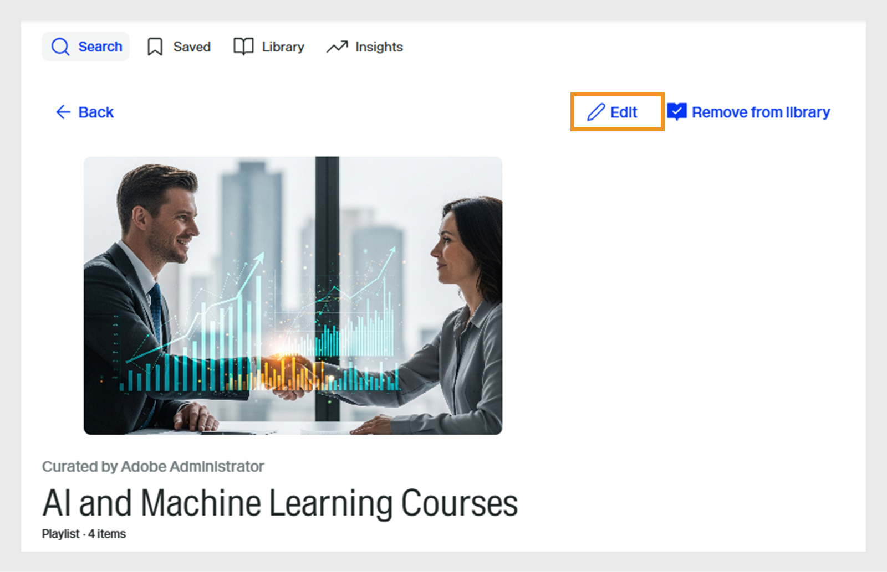
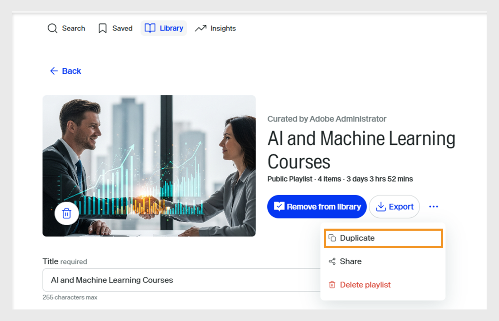

# Selección de cursos de Go1 en una ruta de aprendizaje

Los administradores a menudo necesitan seleccionar cursos de varios repositorios o catálogos, lo que dificulta la identificación de las mejores opciones. Esto es especialmente difícil con Go1, donde hay miles de cursos disponibles. Para simplificar esto, ofrecemos una función de gestión basada en IA directamente en el flujo de creación de la ruta de aprendizaje. Esto ayuda a los administradores a descubrir y seleccionar rápidamente los cursos más relevantes

Añade cursos de Go1 directamente a las rutas de aprendizaje y las certificaciones. Cree rutas de aprendizaje que incluyan cursos de Go1, para que los alumnos puedan acceder a los cursos de Go1 seleccionados como parte de su formación.

>[!INFO]
>
>Necesita una licencia de Go1 activa para añadir cursos de Go1 a rutas de aprendizaje o certificaciones. Consulte este [artículo](/help/migrated/administrators/feature-summary/content-marketplace.md) para obtener más información sobre los detalles de la licencia Go1.

## Crear una ruta de aprendizaje

Para crear una ruta de aprendizaje con cursos Go1:

1. Inicie sesión en **Adobe Learning Manager** como administrador.
2. Seleccione **[!UICONTROL Rutas de aprendizaje]** en el panel de navegación izquierdo.
3. Seleccione **[!UICONTROL Agregar]**.

   
   _Selecciona Añadir en la sección Rutas de aprendizaje para crear y organizar nuevos programas de formación estructurados para tus alumnos_

4. Escriba los detalles necesarios y seleccione **[!UICONTROL Guardar]**. Vea este [artículo](/help/migrated/administrators/feature-summary/learning-paths.md) para obtener más información.
5. Puede añadir cursos a una ruta de aprendizaje de las siguientes maneras:

   * **[!UICONTROL Agregar cursos o rutas de aprendizaje]**: agregue cursos o rutas de aprendizaje existentes disponibles en Adobe Learning Manager.
   * **[!UICONTROL Conservar contenido de Go1]**: agregue cursos desde la plataforma Go1.
6. Seleccione **[!UICONTROL Conservar contenido de Go1]**.

   
   _Añade cursos de Go1 a la lista de reproducción de desarrollo de habilidades de ingenieros de ventas para ampliar las opciones de aprendizaje con contenido seleccionado de terceros_
7. Los administradores pueden crear una lista de reproducción de las siguientes maneras:

   * Usando **[!UICONTROL Asistente de Inteligencia Artificial Go1]**. Consulte [Asistente de inteligencia artificial Go1](/help/migrated/administrators/feature-summary/content-marketplace/curate-go1-playlist.md#go1-ai-assistant) para obtener más información.
   * En **[!UICONTROL Biblioteca]**, selecciona **[!UICONTROL Crear lista de reproducción]** y elige una de las siguientes opciones:
a. **[!UICONTROL con IA]**: Crea una lista de reproducción con la ayuda de IA. Vea esta [sección](/help/migrated/administrators/feature-summary/content-marketplace/curate-go1-playlist.md#create-a-playlist-with-ai) para obtener más información.
b. **[!UICONTROL por mí mismo]**: Cree una lista de reproducción agregándole cursos manualmente. Vea esta [sección](/help/migrated/administrators/feature-summary/content-marketplace//curate-go1-playlist.md#create-a-playlist-manually) para obtener más información.

### Asistente de inteligencia artificial de Go1

Adobe Learning Manager ofrece asistencia basada en IA para facilitar la gestión de los cursos a los administradores. Con el asistente de inteligencia artificial disponible en la página Centro de contenido, los administradores pueden hacer preguntas, obtener recomendaciones personalizadas y crear listas de reproducción al instante. Además, la asistencia de IA está integrada en el flujo de creación de la ruta de aprendizaje, lo que ayuda a los administradores a identificar rápidamente los cursos más relevantes de los catálogos grandes, como Go1. Estas funciones agilizan el proceso de revisión, ahorran tiempo y garantizan que los alumnos reciban el mejor contenido.

Para crear una lista de reproducción con IA:

1. Seleccione la opción **[!UICONTROL Chatear con IA]** en el centro de contenido **Go1**.

   
   _La pantalla del centro de contenido muestra la opción Chat con IA, donde los administradores pueden interactuar con el Asistente de IA para hacer preguntas_

2. Escriba la pregunta y seleccione **[!UICONTROL Enviar]**.

   
   _Asistente de inteligencia artificial para la pantalla donde los administradores pueden escribir sus preguntas, obtener recomendaciones de cursos y crear al instante una lista de reproducción adaptada a sus necesidades_
3. Seleccione las aptitudes y, a continuación, seleccione **[!UICONTROL Compilar en una lista]**.

   
   _AI Assistant muestra las habilidades relevantes para seleccionar y compilar en la lista de reproducción_
4. Seleccione **[!UICONTROL Convertir en lista de reproducción]**.

   
   _La pantalla del Asistente de inteligencia artificial muestra la opción Convertir en lista de reproducción para compilar todos los cursos en listas de reproducción_

5. Seleccione **[!UICONTROL Ver Lista De Reproducción]**.

   
   _La pantalla del Asistente de IA muestra la opción Ver lista de reproducción para publicar e importar la lista de reproducción en la ruta de aprendizaje_

6. Seleccione **[!UICONTROL Publish]** para crear la lista de reproducción. Puede crear listas de reproducción adicionales en Go1 y agregarlas a una ruta de aprendizaje.
7. Seleccione **Sí** en el mensaje de confirmación.
8. Seleccione la lista de reproducción en el **[!UICONTROL Aviso de selección de lista de reproducción para importar]**.

   
   _Seleccione e importe la lista de reproducción de mejora de aptitudes del ingeniero de ventas de la biblioteca Go1 en Adobe Learning Manager_

9. Seleccione **[!UICONTROL Agregar listas de reproducción a la ruta de aprendizaje]** y, a continuación, **[!UICONTROL Publish]**.

Los cursos de la lista de reproducción se añadirán a la ruta de aprendizaje. Los administradores pueden inscribir a los alumnos, que pueden comenzar inmediatamente a realizar los cursos.

### Creación de una lista de reproducción con IA

Los administradores pueden escribir la descripción de la lista de reproducción en el aviso de AI. La IA seleccionará los cursos relacionados y creará una lista de reproducción basada en los requisitos. AI genera una lista de reproducción interpretando el objetivo de aprendizaje o el mensaje proporcionado por el usuario. Al crear una lista de reproducción, los administradores pueden seleccionar seleccionar contenido &quot;con IA&quot;, lo que permite al sistema utilizar modelos de lenguaje de gran tamaño para comprender los objetivos de aprendizaje y las preferencias de contenido especificados, como la duración y el tipo. A continuación, la IA busca en la biblioteca de contenido los objetos de aprendizaje relevantes que coincidan con estos criterios.

1. Selecciona **[!UICONTROL Crear lista de reproducción]** y luego selecciona **[!UICONTROL con IA]**.

   
   _Crea listas de reproducción revisadas con inteligencia artificial, lo que permite ofrecer recomendaciones de cursos automatizadas adaptadas a las necesidades de los alumnos_

2. Escribe una breve descripción de tu lista de reproducción en el campo de texto **[!UICONTROL Introduce tu objetivo de aprendizaje]**. Por ejemplo, _Crea una lista de reproducción de aprendizaje seleccionada para los ingenieros de ventas centrada en mejorar el conocimiento del producto, la comunicación técnica, la participación del cliente y la venta de soluciones_.

   
   _Escribe tu objetivo de aprendizaje para crear una lista de reproducción personalizada, lo que ayuda a que Adobe Learning Manager recomiende cursos específicos adaptados a las necesidades de tus alumnos_

3. Seleccione **[!UICONTROL Siguiente]**. El mensaje muestra las aptitudes, la duración del curso y el tipo de curso necesarios para la selección.
4. Seleccione las aptitudes requeridas.

   
   _Elija las aptitudes de la lista para seleccionar los cursos del ingeniero de ventas_

5. Seleccione la duración del curso y escriba para la lista de reproducción.
   
   _Elija la duración y el tipo de cursos para seleccionar los cursos del Ingeniero de ventas_

6. Seleccione **[!UICONTROL Generar lista de reproducción]**. La lista de reproducción se crea con 10 cursos en 2 páginas y los administradores pueden utilizarla para crear una ruta de aprendizaje.

   
   _Revisar la lista de reproducción de la mejora de aptitudes del ingeniero de ventas seleccionado en Adobe Learning Manager_

7. Busque y agregue una imagen a la lista de reproducción seleccionando **[!UICONTROL Seleccionar imagen]**.
8. Cambie el título usando las opciones de AI disponibles:

   * **[!UICONTROL Mejora la escritura]**: Perfecciona el título existente para que sea más claro.
   * **[!UICONTROL Generar título]**: Crea un nuevo título basado en el contenido o contexto automáticamente.

   
   _Pantalla de creación de listas de reproducción Go1 con opciones de inteligencia artificial para mejorar el título de la lista de reproducción_

9. Cambie la descripción utilizando las opciones de IA disponibles:
   * **[!UICONTROL Mejora la escritura]**: Perfecciona la descripción existente para que sea más clara.
   * **[!UICONTROL Generar descripción]**: Crea una nueva descripción basada en el contenido o contexto automáticamente.
   * **[!UICONTROL Acorta el texto]**: Reduce el texto o el título mientras mantienes la idea principal.

   
   _Pantalla de creación de listas de reproducción Go1 con opciones de inteligencia artificial para mejorar la descripción de la lista de reproducción_

10. Seleccione **[!UICONTROL Agregar elemento]** para agregar más cursos a la lista de reproducción.

11. Seleccione **[!UICONTROL Publish]** para crear la lista de reproducción. Puede crear listas de reproducción adicionales en Go1 y agregarlas a una ruta de aprendizaje.
12. Seleccione **Sí** en el mensaje de confirmación.
13. Seleccione la lista de reproducción en el **[!UICONTROL Aviso de selección de lista de reproducción para importar]**.

    
    _Seleccione e importe la lista de reproducción de mejora de aptitudes del ingeniero de ventas de la biblioteca Go1 en Adobe Learning Manager_

14. Seleccione **[!UICONTROL Agregar listas de reproducción a la ruta de aprendizaje]** y, a continuación, **[!UICONTROL Publish]**.

Los cursos de la lista de reproducción se añadirán a la ruta de aprendizaje. Los administradores pueden inscribir a los alumnos, que pueden comenzar inmediatamente a realizar los cursos.

>[!NOTE]
>
>Los administradores también pueden crear listas de reproducción directamente desde la página del centro de contenido. Vea [Centro de contenido](/help/migrated/administrators/feature-summary/content-marketplace.md#content-hub) para obtener más información.

## Creación manual de una lista de reproducción

Seleccione manualmente los cursos que mejor se adapten a los requisitos de los alumnos y seleccione otros cursos relevantes.

Para crear una lista de reproducción manualmente:

1. Seleccione **[!UICONTROL Crear lista de reproducción]** y, a continuación, seleccione **[!UICONTROL yo mismo]**.

   
   _Crea manualmente una lista de reproducción que ofrezca a los administradores control total para seleccionar cursos según las necesidades específicas de los alumnos_

2. Busque y agregue una imagen a la lista de reproducción seleccionando **[!UICONTROL Seleccionar imagen]**.
3. Escriba el título y la descripción de la lista de reproducción.

   
   _Agrega un título y una descripción a tu lista de reproducción en Adobe Learning Manager para definir claramente su propósito y ayudar a guiar a los alumnos hacia el desarrollo de habilidades específicas_

4. Seleccione **[!UICONTROL Crear]**.
5. Seleccione **[!UICONTROL Agregar elemento]** para agregar los cursos relacionados.

   
   _Agregar elementos a la lista de reproducción de desarrollo de aptitudes de ingenieros de ventas en Adobe Learning Manager para seleccionar cursos específicos_

6. Busque y seleccione los cursos requeridos.
7. Seleccione **[!UICONTROL Publish]**. La lista de reproducción se ha creado con cursos relacionados.
8. Seleccione **Sí** en el mensaje de confirmación.
9. Seleccione la lista de reproducción en el **[!UICONTROL Aviso de selección de lista de reproducción para importar]**.
10. Seleccione **[!UICONTROL Agregar listas de reproducción a la ruta de aprendizaje]** y, a continuación, **[!UICONTROL Publish]**.

Los cursos de la lista de reproducción se añadirán a la ruta de aprendizaje. Los administradores pueden inscribir a los alumnos, que pueden comenzar inmediatamente a realizar los cursos.

## Administrar listas de reproducción de Go1

Los administradores pueden administrar las listas de reproducción Go1 creadas duplicándolas, compartiéndolas o eliminándolas.

### Duplicar la lista de reproducción

Para duplicar la lista de reproducción:

1. Inicie sesión en Adobe Learning Manager como administrador.
2. Seleccione **[!UICONTROL Mercado de contenido]**.
3. Seleccione **[!UICONTROL Centro de contenido]** y, a continuación, seleccione **[!UICONTROL Biblioteca]**.
4. Seleccione la lista de reproducción y, a continuación, **[!UICONTROL Editar]**.
   
   Pantalla de la lista de reproducción de _Go1 que muestra opciones para editar la lista de reproducción_
5. Seleccione los puntos suspensivos y, a continuación, seleccione **[!UICONTROL Duplicar]**.
   
   _Pantalla de administración de listas de reproducción, resaltando la opción Duplicar_

La lista de reproducción seleccionada se duplicará y se agregará a la biblioteca de contenido Go1

### Eliminar la lista de reproducción

Para eliminar la lista de reproducción:

1. Inicie sesión en Adobe Learning Manager como administrador.
2. Seleccione **[!UICONTROL Mercado de contenido]**.
3. Seleccione **[!UICONTROL Centro de contenido]** y, a continuación, seleccione **[!UICONTROL Biblioteca]**.
4. Seleccione la lista de reproducción y, a continuación, **[!UICONTROL Editar]**.
   
   Pantalla de lista de reproducción de _Go1 que muestra opciones para editar la lista de reproducción_
5. Seleccione los puntos suspensivos y, a continuación, **[!UICONTROL Eliminar lista de reproducción]**.
   
   _Pantalla de administración de listas de reproducción, resaltando la opción Eliminar lista de reproducción_

La lista de reproducción seleccionada se eliminará de la biblioteca Go1.

### Compartir la lista de reproducción

La opción Compartir lista de reproducción no se admite en la integración de Go1 con Adobe Learning Manager. Esta opción se eliminará de la interfaz de usuario en la próxima versión.

## Límite de cursos superado

Al añadir cursos de Go1 a una ruta de aprendizaje, los administradores pueden ver un error si los cursos recién añadidos aún no se han sincronizado con Adobe Learning Manager. Estos cursos estarán disponibles dentro de 48 a 72 horas.

Si añade la lista de reproducción ahora, solo se incluirán los cursos que ya estén sincronizados.

Para incluir todos los cursos, se recomienda esperar hasta que se complete la sincronización antes de añadir la lista de reproducción a una ruta de aprendizaje.

## Cursos de Go1 en certificaciones

Los administradores pueden añadir cursos de Go1 en programas de certificación de Adobe Learning Manager. Al crear una certificación, los administradores pueden buscar y seleccionar cursos en el catálogo de contenido de Go1. Todos los cursos de Go1 importados a través del plan Go1 están disponibles para su selección en el flujo de trabajo de certificación.

Las certificaciones que incluyen cursos de Go1 se pueden configurar como permanentes o recurrentes. En el caso de las certificaciones recurrentes, el certificado se renueva automáticamente después del intervalo de tiempo definido, lo que permite a los alumnos volver a realizar los cursos de Go1 y mantener su estado de certificación.

Vea [Certificaciones](/help/migrated/administrators/feature-summary/certifications.md) para obtener más información sobre la creación de certificados.
