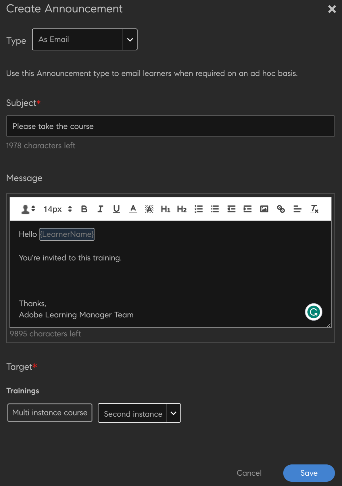
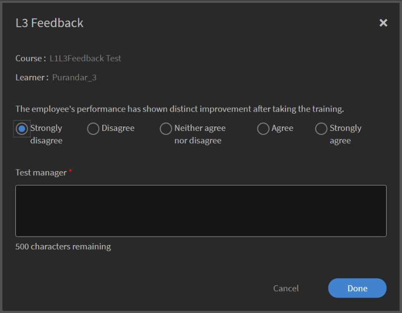
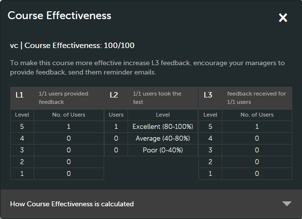
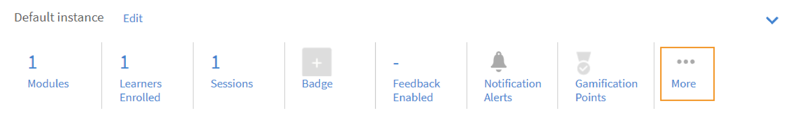
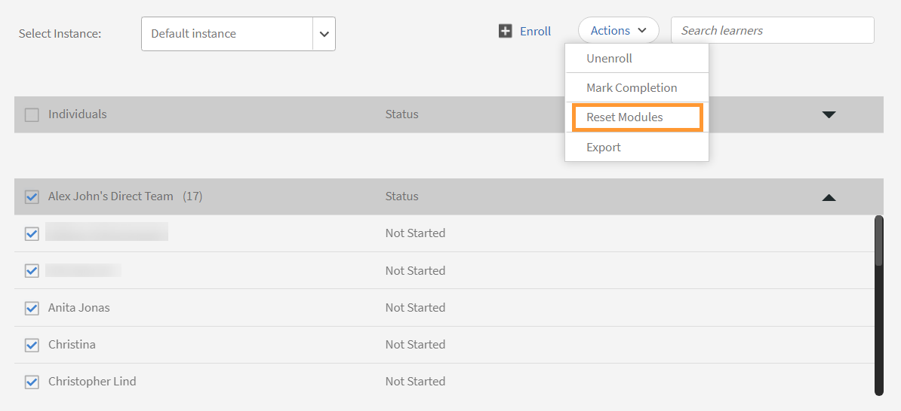

# Crear módulos de cursos, instancias y programas de aprendizaje

Este documento consta de ayuda para crear módulos de cursos, instancias y cursos para la función de administrador.

Los autores crean cursos. Los alumnos pueden realizar los cursos y los administradores pueden realizar un seguimiento del rendimiento de los alumnos en función del consumo del curso.

## Resumen {#overview}

Los autores crean cursos. A continuación, los alumnos realizan los cursos y los administradores pueden realizar un seguimiento del rendimiento de los alumnos en función del consumo del curso. Los administradores pueden ver los cursos creados por los autores y realizar algunas actividades, como se explica en esta sección. Como administrador, puede crear programas de aprendizaje únicos con un conjunto predefinido de cursos para alumnos.

## Crear una instancia de un curso {#createinstanceofacourse}

Después de que un autor haya creado un curso, puede crear instancias del curso. Al crear instancias de un curso, puede ofrecer el mismo curso a los alumnos en diferentes períodos de tiempo. Los alumnos pueden elegir cualquier instancia e inscribirse. Puede configurar cada instancia para que tenga su propio conjunto de insignias, comentarios y otros ajustes.

Para crear una instancia:

1. En la aplicación web de administrador, haga clic en **[!UICONTROL Cursos]** en el panel izquierdo.
1. En la lista de cursos, elija el curso deseado y haga clic en **[!UICONTROL Ver curso]**.

   

   *Ver un curso*

1. Para crear instancias, haga clic en **[!UICONTROL Instancias]** en el panel izquierdo. Cada curso tiene una instancia de forma predeterminada. Puede modificar la instancia predeterminada o añadir instancias. No se puede eliminar esta instancia de curso.
1. Para crear una instancia, haga clic en **[!UICONTROL Añadir nueva instancia]** en la esquina superior derecha de la información del curso. Se muestra una nueva instancia del curso.
1. Introduzca las propiedades de la instancia:

   * En la **[!UICONTROL Nombre de instancia]** , introduzca el nombre de la instancia que desea asociar al curso. Asegúrese de utilizar un nombre único para la instancia.
   * Especifique la fecha límite de finalización de la instancia. Los alumnos deben alcanzar el estado de finalización del curso en esta fecha.
   * Haga clic en **[!UICONTROL Mostrar más opciones]** para mostrar otras opciones de fecha límite.
   * **[!UICONTROL Plazo de inscripción]:** Se trata de la fecha en la que se espera que un alumno se inscriba en un objeto de aprendizaje en caso de inscripción automática.
   * **[!UICONTROL Fecha límite de cancelación]:** Puede optar por restringir que el propio alumno se dé de baja estableciendo una fecha límite para darse de baja.

   Un administrador puede decidir establecer plazos de finalización para un curso o programa de aprendizaje en función de los requisitos. Sin embargo, se recomienda tener uno para los cursos de formación de clase o clase virtual.

   

   *Establecer fecha límite de finalización*

## Ver las propiedades de la instancia {#viewpropertiesoftheinstance}

*Ver las propiedades de la instancia*

1. **Módulos:** El número de módulos creados por el autor del curso.
1. **Alumnos inscritos:** El número de alumnos que el administrador ha inscrito en el curso.
1. **Sesiones:** El número de módulos de clase y clase virtual del curso.
1. **Comentarios activados:** Muestra si los comentarios de L1, L2 y L3 están habilitados para este curso.

## Retirar una instancia {#retireaninstance}

Para retirar una instancia, siga los pasos que se indican a continuación:

1. En la instancia, haga clic en el menú desplegable y elija la opción **[!UICONTROL Retirar instancia]**.

   

   *Retirar una instancia*

1. Para buscar todas las instancias retiradas, haga clic en la ficha **[!UICONTROL Retirado]** en la página Instancias.

## Restaurar una instancia {#restoreaninstance}

Para restaurar una instancia retirada a un estado de activación, realice los siguientes pasos:

1. En la instancia, haga clic en el menú desplegable y elija la opción **[!UICONTROL Reabrir instancia]**.

   

   *Restaurar una instancia*

1. Ahora la instancia se restaura a un modo activo.

## Enviar correos electrónicos a nivel de instancia

Para enviar correos electrónicos a nivel de instancia a alumnos inscritos:

1. En la página Instancias, seleccione las opciones de cualquier instancia y, a continuación, haga clic en **[!UICONTROL Enviar correo electrónico a alumnos inscritos]**.

*Enviar por correo electrónico a los alumnos inscritos en la instancia*

1. En el cuadro de diálogo Crear anuncio, seleccione Escribir como correo electrónico. Especifique el asunto, escriba el mensaje y haga clic en Guardar. La formación se selecciona automáticamente.

   

   *Crear anuncio como correo electrónico*

1. Después de hacer clic **[!UICONTROL Guardar]**, verá un mensaje de confirmación para la creación correcta del anuncio. Para publicar el anuncio, haga clic en **[!UICONTROL Publicar ahora]**.

   

### Inscribir alumnos en varias instancias

1. Seleccione un curso de la lista de cursos.
1. Seleccionar **[!UICONTROL Alumnos]** en el panel izquierdo.
1. Seleccionar **[!UICONTROL Inscribir]**.

   

   *Publicar el curso*

1. En la [!UICONTROL **Inscribir alumnos**] , puede:

   * Seleccione una instancia para inscribir a un alumno en el menú desplegable Seleccionar instancia .
   * Seleccione el usuario o los grupos de usuarios, o ambos, en el campo Incluir alumnos.
   * Seleccione los alumnos que desea excluir de la instancia en el campo Excluir alumnos.
   * En la parte inferior del cuadro de diálogo, seleccione Sí si desea que uno o varios alumnos se inscriban en la instancia seleccionada.

1. Seleccionar **[!UICONTROL Continuar]**.

   

   *Continuar con la inscripción de alumnos*

### Ver informe de inscripción de una instancia

1. Seleccione un curso de la lista de cursos.
1. Seleccionar **[!UICONTROL Alumnos]** en el panel izquierdo.
1. Seleccionar **[!UICONTROL Acciones]** > **[!UICONTROL Exportar]**.

El archivo de Excel contiene hojas de cálculo para cada instancia. Una hoja de cálculo consta de los siguientes campos:

* Alumnos
* Correo electrónico
* ID único de usuario
* Nombre del curso
* ID único de objeto de aprendizaje
* Estado
* Criterios de selección
* Fecha de inscripción / Fecha de cancelación de la inscripción (zona horaria UTC)
* Fecha de finalización (zona horaria UTC)
* Fecha de vencimiento (zona horaria UTC)
* Fecha de inicio (zona horaria UTC)
* Puntuación de prueba
* Nombre del responsable
* Dirección
* userState
* Área de especialización
* Comentarios
* Número de visitas
* Fechas de visita
* Marcas de tiempo (zona horaria UTC)
* Tiempo empleado (minutos)

>[!NOTE]
>
>Nota: Al activar la inscripción múltiple, se añaden varias filas al informe de transcripciones de alumnos para cada curso (una fila para cada instancia).
>
>Si ha configurado la automatización de informes que solo prevé una fila por curso, debe realizar los ajustes necesarios en la automatización de informes antes de activar la función Inscripción múltiple.

## Establecer nivel de escalación {#escalation}

Para enviar notificaciones por correo electrónico, un administrador debe elegir explícitamente el nivel de escalación para:

* Responsable
* Responsable y responsable de nivel de omisión

*Establecer nivel de escalación*

## Moderación del curso {#coursemoderation}

Cada vez que un autor añade, actualiza o elimina módulos y vuelve a publicar un curso, todos los administradores reciben una notificación sobre lo mismo. Como administrador, puede ver los cambios, comparar el contenido antiguo y el nuevo haciendo clic en el vínculo y aprobar o rechazar los cambios en consecuencia.

Para activar Moderación de los cursos, haga clic en **[!UICONTROL Configuración]** > **[!UICONTROL General]**. Seleccione la **[!UICONTROL Moderación del curso]** para activar esta función.

*Activar la moderación del curso*

Haga clic en la notificación para ver los cambios que el autor ha realizado en el curso. A continuación, apruebe o rechace los cambios realizados por el autor. Si decide aprobarlo, el curso se volverá a publicar. Si rechaza las actualizaciones, seguirá existiendo la versión anterior del curso. En cualquier caso, se envía una notificación al autor.

*Creación de solicitudes de actualizaciones de cursos*

Si hay varios autores que están actualizando el mismo curso, el último cambio realizado o el más reciente se reflejará en la notificación del administrador. A continuación, puede aprobar o rechazar los cambios más recientes.

## Agregar comentarios de L1 y L3 {#addl1andl3feedback}

Puede añadir opciones de comentarios de L1 y L3 al crear los cursos:

1. Haga clic en Cursos en el panel izquierdo después de iniciar sesión como administrador. La lista de todos los cursos aparece en la página derecha.
1. Haga clic en el mosaico del curso para el que desee agregar comentarios de L1 o L3
1. Haga clic en Instancia predeterminada en el panel izquierdo.
1. Haga clic en el círculo del botón conmutador junto a los comentarios de L1 o L3 para activarlos.
1. Añada la pregunta de comentarios de L3 en el área de texto debajo de Pregunta de L3.

## Comentarios de L1 obligatorios {#mandatory-l1-feedback}

Puede hacer que todas las preguntas o la primera pregunta sean obligatorias en los comentarios de L1.

*Establecer como obligatorias todas las preguntas o la primera pregunta en los comentarios de L1*

Ahora, puede crear las preguntas, que serán obligatorias.

*Crear las preguntas*

Si las dos preguntas obligatorias, por algún motivo, no tienen texto, las preguntas no aparecerán en el formulario de comentarios.

>[!NOTE]
>
>No basta con activar esta configuración en la instancia del programa de aprendizaje. También debe activar esta configuración en el nivel de instancia del curso para cada curso del programa de aprendizaje.

En la página Valores predeterminados de instancia, si habilita **[!UICONTROL Establecer todas las preguntas como obligatorias]**, todas las instancias nuevas creadas posteriormente heredarán esta configuración.

*Ver la página Valores por Defecto de Instancia*

## Comentarios de L1 en el nivel del curso {#l1-feedback-course-level}

En versiones anteriores de Learning Manager, un administrador podía activar los comentarios de L1 para el programa de aprendizaje.

En esta versión de Learning Manager, el administrador puede enviar comentarios de L1 para todos los cursos que forman parte del programa de aprendizaje. El administrador debe asegurarse de que los comentarios de L1 estén activados para todos los cursos en el nivel de instancia del curso.

1. Para activar los comentarios de L1 de cada curso, en la aplicación de administración, haga clic en **[!UICONTROL Programas de aprendizaje]** > **[!UICONTROL Ver programa de aprendizaje]**.

1. Haga clic en **[!UICONTROL Instancias]** > **[!UICONTROL Comentarios de L1 activados]**.

1. Active la opción **[!UICONTROL Activar para cada curso]**.

   

   *Activar comentarios del curso*

   Si solo se activa este botón deslizante en el nivel de programa de aprendizaje, no se activarán los comentarios de L1 para los cursos de este programa. Para activar los comentarios de L1, vaya a cada curso del programa de aprendizaje y active el conmutador Comentarios de L1.

   

   *Activar los comentarios de L1 de cada curso*

   Si los comentarios de L1 están activados para todos los cursos, pero están desactivados en la instancia del programa de aprendizaje, los comentarios de L1 no se activarán para los cursos.

## Informes de prueba específicos del idioma

Los informes de prueba ayudan a evaluar el rendimiento de un alumno tras la finalización de un programa de aprendizaje o curso.

En la actualidad, Learning Manager facilita el aprendizaje en 13 idiomas de interfaz y 32 idiomas de contenido. Aunque esta opción es fácil de usar para los alumnos y proporciona comodidad a nuestros alumnos de todo el mundo, es difícil para los administradores obtener los informes que se intentan obtener en varias configuraciones regionales.

En los informes de prueba, se muestran datos en diferentes idiomas siempre que el curso se ofrezca en varios idiomas. Hasta ahora, los informes generados por el administrador mostraban las respuestas una debajo de la otra, independientemente del idioma en el que se intentara realizar la prueba. **Por ejemplo**, Si un usuario ha realizado una prueba en neerlandés, el administrador solo podrá ver los informes de prueba que los usuarios realicen en este idioma cada vez. El administrador que ha seleccionado el inglés como idioma de la interfaz no podía ver los informes de todos los usuarios a la vez, independientemente de la configuración regional utilizada.

Esto se ha corregido, ya que el administrador ahora puede ver todos los informes en el idioma respectivo que el alumno ha intentado simultáneamente, independientemente de la configuración regional de contenido elegida. La prueba realizada en diferentes idiomas se añadirá como columnas adicionales en el informe de prueba.

## Activar los comentarios de L1 en el nivel de cuenta {#l1-feedback-account-level}

*Activar los comentarios de L1 en el nivel de cuenta*

Un administrador podrá habilitar los comentarios de L1 para los cursos y el programa de aprendizaje recién creados activando esta configuración en el nivel de cuenta. Sin embargo, si se activa esta opción, no se verán afectados los cursos ni los programas de aprendizaje existentes

Si está activada, los comentarios estarán activados de forma predeterminada en todos los nuevos cursos de formación e instancias. En el caso de que un autor/administrador visite la instancia, la instancia se establece de forma predeterminada y se desactiva manualmente; a continuación, se mantiene.

Para activar los comentarios de L1, en la aplicación de administración, haga clic en **[!UICONTROL Configuración]** > **[!UICONTROL Comentarios]**.

*Ver la página Configuración de comentarios*

Haga clic en **[!UICONTROL Editar]** en la esquina superior derecha y active la opción para activar los comentarios de L1.

Cuando un autor crea un curso, en la página Instancia de la aplicación de administración, aparece el **[!UICONTROL Comentarios de L1]** se activa automáticamente para el nuevo curso.

<!---->

También puede desactivar los comentarios de L1. Para ello, conmute el **[!UICONTROL Habilitar]** , como se muestra a continuación:

*Activar o desactivar los comentarios de L1*

## Añadir preguntas descriptivas para los comentarios de L1 y L3 {#descriptive}

Como parte de la versión de noviembre de Learning Manager, se ha proporcionado una opción para añadir preguntas descriptivas. Los administradores tienen la opción de añadir estas preguntas a los alumnos. Esta disposición se añade al conjunto predeterminado de preguntas que proporciona Learning Manager. También puede hacerlas obligatorias si es necesario, seleccionando la opción debajo de la pregunta.

Puede añadir dos preguntas descriptivas para los comentarios de L1 y una pregunta descriptiva para los comentarios de L3.

Una vez que habilite los comentarios de L1, podrá ver las opciones como se muestra en la captura de pantalla siguiente.

*Añadir preguntas descriptivas para los comentarios de L1 y L3*

Si desea que el cuestionario se muestre al alumno inmediatamente después de la finalización del curso, puede elegir la opción correspondiente.

A continuación se proporciona un ejemplo de los resultados del cuestionario de L1 para su referencia. Los alumnos pueden ver el cuestionario en el formato que se muestra a continuación. Prueba-1 y Prueba-2 son las preguntas descriptivas.

*Preguntas de comentarios de un curso de ejemplo*

Una vez que active los comentarios de L3, puede ver las opciones como se muestra en la captura de pantalla siguiente:

*Activar comentarios de L3*

La pregunta 2 es la pregunta descriptiva de los comentarios de L3. Puede hacerlo obligatorio haciendo clic en la opción correspondiente debajo de la pregunta.

A continuación se proporciona una muestra del cuestionario L3 como referencia. Los alumnos pueden ver el cuestionario en el formato que se muestra a continuación.

*Ver salida de comentarios de L3*

## Configurar el cuestionario de comentarios de L1 y L3 {#setupl1andl3feedbackquestionnaire}

Puede configurar el cuestionario de comentarios de L1 y L3, así como establecer recordatorios en el nivel de cuenta.

1. Haga clic en **[!UICONTROL Configuración]** y, a continuación **[!UICONTROL Comentarios]** en el panel izquierdo después de iniciar sesión como administrador.\
   Aparece la página de configuración de comentarios con dos fichas: **[!UICONTROL Comentarios de L1]** y **[!UICONTROL Comentarios de L3]**.\
   **[!UICONTROL Comentarios de L1]** consta de una lista de valores predeterminados **[!UICONTROL Comentarios de L1]** cuestionario para cursos de clase y cursos con ritmo personalizado junto con la configuración de recordatorio. En **[!UICONTROL Comentarios de L3]** , puede ver la declaración predeterminada de comentarios de L3 y la configuración de recordatorio.

1. Haga clic en Editar en la esquina superior derecha de la página para modificar el cuestionario existente.\
   En **[!UICONTROL Comentarios de L1]** , puede activar o desactivar cada pregunta haciendo clic en el botón de alternancia Sí/No.\
   En **[!UICONTROL Comentarios de L3]** , puede modificar la declaración de comentarios predeterminada.\
   Haga clic en **[!UICONTROL Agregar nuevo recordatorio]** en la parte inferior de la página y elija cuándo enviar los recordatorios.

1. Haga clic en **[!UICONTROL Guardar]** en la esquina superior derecha de la página.

En los comentarios de L1, puede ver dos conjuntos de cuestionarios junto con una pregunta predeterminada. El primer conjunto de cuestionarios se refiere a cursos a ritmo personalizado que también se pueden utilizar para cursos basados en actividades. El segundo conjunto de cuestionarios se puede utilizar para los tipos de cursos de clase y clase virtual.

## Exportar datos de lista de comprobación {#export-checklist-data}

En la lista de cursos, abra un curso que contenga una lista de comprobación. En el panel izquierdo, verá una opción **[!UICONTROL Lista de comprobación]**.

*Exportar datos de lista de comprobación*

Haga clic en la opción y, en la página del curso, realice lo siguiente:

1. Seleccione la instancia y el módulo.
1. Haga clic en **[!UICONTROL Acciones]** > **[!UICONTROL Exportar]** y, a continuación, exporte el informe de lista de comprobación del alumno.

En la **[!UICONTROL Lista de comprobación]** , un instructor puede exportar el informe de lista de comprobación desde la página **[!UICONTROL Acciones]** lista desplegable.

El informe CSV contiene los siguientes campos:

* Nombre de usuario
* Correo electrónico del usuario
* Nombre y correo electrónico del responsable
* Nombre del curso
* Instancia de formación
* Nombre y correo electrónico del instructor
* Enviado el
* Estado de evaluación
* Preguntas con texto real
* Estado del usuario
* Perfil
* Campo(s) activo(s)

Al descargar un informe después de seleccionar un filtro de estado, el informe de transcripciones de alumnos descargado contendrá los datos del alumno en función del filtro de estado aplicado. Este filtro añadido también se mostrará al responsable y el administrador personalizado cuando estén a punto de generar una transcripción del alumno.

## Ver cursos {#viewingcourses}

Como administrador, puede ver una lista de todos los cursos disponibles.   Haga clic en **[!UICONTROL Cursos]** en el panel izquierdo para ver la lista de cursos con las opciones de búsqueda y filtro. También puede ver el porcentaje de eficacia de cada curso en las miniaturas de los cursos.

>[!NOTE]
>
>Puede retirar un curso una vez que los alumnos hayan consumido el curso o cuando desee retener un curso en particular después de publicarlo. Puede retirar un curso solo cuando se encuentra en un estado publicado. Para ver la lista de todos los cursos retirados, haga clic en **[!UICONTROL Retirado]** .

## Ver puntuaciones de pruebas {#viewquizscores}

1. Haga clic en el nombre del curso en la miniatura del curso.
1. Haga clic en Puntuación de prueba en el panel izquierdo.

Puede ver las puntuaciones de las pruebas de cualquier curso en particular en función del nombre de usuario o de cada pregunta. Elija las pestañas Por usuario o Por pregunta en consecuencia.

Elija el tipo de instancia en la lista desplegable para ver las puntuaciones según cada instancia del curso.

## Administrar la lista de alumnos de un curso {#managelearnerslistforacourse}

1. Haga clic en el nombre del curso en la miniatura del curso.
1. En el panel izquierdo, haga clic en **[!UICONTROL Alumnos]**.

*Seleccionar alumnos de un curso*

Puede realizar las siguientes acciones desde la página Alumnos:

* Seleccione el alumno que desea eliminar y haga clic en [!UICONTROL **Acciones**] > [!UICONTROL **Quitar**].
* Seleccione el alumno cuya asistencia desea marcar y haga clic en [!UICONTROL **Acciones**] > [!UICONTROL **Marcar como completado**].

Para permitir que los alumnos restablezcan un módulo y vuelvan a utilizarlo, haga clic en [!UICONTROL **Restablecer**]. En el cuadro de diálogo emergente, haga clic en Sí para confirmar el restablecimiento. Los módulos que se han completado no se pueden restablecer. Solo se pueden restablecer los módulos fallidos o incompletos.

También puede exportar la lista de alumnos en una hoja de Excel. Para exportar la lista de alumnos, haga clic en [!UICONTROL **Acciones**] > [!UICONTROL **Exportar**].

>[!NOTE]
>
>Si hay varias instancias de un curso, la lista de alumnos en Excel se proporciona en cada ficha por separado. La lista de alumnos consta del nombre del alumno, su estado y los criterios de selección. El estado de los alumnos puede ser **No iniciado**, o **En curso**, o **Completado**.

## Exportar asistencia de alumnos {#attendance}

Para cualquier clase y curso de clase virtual, puede descargar la lista de alumnos que han asistido a este curso, para cualquier instancia.

En la página de detalles del curso, haga clic **[!UICONTROL Asistencia y puntuación]** en el panel derecho.

En la esquina superior derecha de la página, haga clic en el icono **[!UICONTROL Acciones]** lista desplegable. Luego haga clic en la opción **[!UICONTROL Exportar lista de alumnos (PDF)]**.

*Exportar lista de alumnos como PDF*

En el PDF, puede ver el mismo conjunto de alumnos que un instructor.

Al descargar el PDF, puede ver la zona horaria (en UTC) utilizada al crear el curso.

## Exportar alumnos con estado de aprobación pendiente

Un administrador, un responsable o un administrador personalizado pueden exportar datos de alumnos con un estado de inscripción de aprobación pendiente. Puede exportar los datos mediante **Curso > Alumno** y haga clic en la lista desplegable Acción.

La opción estará presente cuando no haya ningún alumno inscrito/pendiente de aprobación en el curso aprobado por el responsable y se generará un informe vacío. También puede exportar cuando los alumnos estén en estado de aprobación pendiente, inscrito, pendiente y no inscrito.

El informe contiene datos de usuarios activos, eliminados y suspendidos si están pendientes de aprobación. Además, el informe contiene datos de usuarios internos y externos que están en estado de aprobación pendiente.

Si un alumno que tenía un estado de aprobación pendiente se da de baja, su registro no estará presente en el informe. Además, si un alumno con un estado de aprobación pendiente se inscribe en el curso mediante inscripción de administrador/responsable/administrador personalizado, su registro estará presente en el informe.

## Ver comentarios de L1 y L3 {#viewl1andl3feedback}

Puede ver los comentarios de L1 proporcionados por los alumnos de un curso y los comentarios de L3 proporcionados por los responsables de los alumnos.

1. Haga clic en cualquier mosaico de curso de la lista Cursos.
1. Haga clic en Comentarios de L1 o Comentarios de L3 en el panel izquierdo para ver los comentarios recibidos.
1. Seleccione la instancia en la lista desplegable para ver los comentarios de esa instancia en particular.

## Previsualización de cursos {#previewcourses}

El administrador puede previsualizar cursos haciendo clic en **[!UICONTROL Vista previa como alumno]** al visualizar los módulos del curso.

1. Haga clic en **[!UICONTROL Cursos]** en el panel izquierdo después de iniciar sesión como administrador.
1. Haga clic en cualquier icono de curso de la lista de cursos de la página.
1. Haga clic en Vista previa como alumno en el panel izquierdo y haga clic en el nombre del módulo en la página para obtener una vista previa del módulo del curso en el reproductor.

## Eficacia del curso {#courseeffectiveness}

La eficacia del curso se evalúa para comprender la utilidad de un curso para el alumno. Se trata de una combinación de los resultados de los comentarios de los alumnos sobre el contenido del curso, los resultados de las pruebas del curso de un alumno y los comentarios del responsable que evalúa a un alumno en función de lo aprendido en el curso.

El administrador puede ver la clasificación de la eficacia del curso en las miniaturas de los cursos, como se muestra en la captura de pantalla siguiente. Puede ver la clasificación de este curso como 100.

<!---->

El valor de valoración de la eficacia del curso se obtiene considerando los valores de comentarios de L1, L2 y L3. Para ver el desglose de cada comentario, haga clic en el valor de eficacia del curso. Aparece una ventana emergente como se muestra a continuación.

*Ver la eficacia de los cursos para los comentarios de L1, L2 y L3*

En esta captura de pantalla de ejemplo, 1 de 1 usuarios recibió los tres comentarios, de ahí que la puntuación sea 100/100. En esta tabla, puede comprender que si alguno de los tres comentarios (L1, L2 y L3) no se proporciona para un curso, se produce un impacto negativo en la eficacia general. Haga clic en la flecha hacia abajo en la esquina inferior derecha de la ventana emergente para ver cómo se realizan los cálculos de eficacia del curso.

*Cálculo de la eficacia del curso*

Según el gráfico circular mostrado anteriormente, se da más peso a los comentarios de L3 del gerente.

## Búsqueda de cursos y programas de aprendizaje {#searchingcoursesandlearningprograms}

Adobe Learning Manager le facilita la búsqueda rápida de los cursos y programas de aprendizaje que desee. Puede buscar los cursos de dos formas:

1. Mediante el campo Buscar. Haga clic en el icono de búsqueda que se muestra en la esquina superior derecha. Aparece un campo de búsqueda. Escriba el nombre del curso o cualquier palabra clave asociada a los cursos para localizar los cursos o programas de aprendizaje. También puede realizar búsquedas con etiquetas predefinidas, como Captivate, C, Java y HTML. Las etiquetas se pueden buscar dentro del campo Buscar, lo que significa que las etiquetas se muestran en el campo de búsqueda mientras escribe.
1. Filtrando la lista de cursos/programas de aprendizaje mediante los filtros. Puede filtrar los cursos por estado, como Todos, Publicados, Borrador y Retirado. En el modo de administrador, el filtro de borrador no aparece.

Puede buscar por competencias haciendo clic en Competencias y eligiéndolas. Como administrador, puede ordenar los cursos de cuatro formas para encontrar mejor el curso requerido. Haga clic en Ordenar por y elija orden alfabético ascendente, orden alfabético descendente, fecha de actualización del curso o eficacia de los cursos.

<!---->

Puede ordenar los programas de aprendizaje de tres maneras: orden alfabético ascendente, orden alfabético descendente y según la fecha de actualización.

## Inscribir alumnos {#enrollinglearners}

Puede seguir los mismos pasos para inscribir alumnos en cursos, programas de aprendizaje y certificaciones. Los responsables también pueden inscribir alumnos debajo de él siguiendo estos pasos.

El administrador inscribe a algunos alumnos en cursos obligatorios según los requisitos de la organización:

1. Coloque el ratón sobre cualquier mosaico de curso publicado y haga clic en Inscribir alumnos.\
   Como alternativa, haga clic en cualquier mosaico de curso publicado y haga clic en Alumnos en el panel izquierdo. Aparece una página con una lista de alumnos. Haga clic en Inscribir.\
   Aparece el cuadro de diálogo Inscribir alumnos.

1. Seleccione la instancia en el menú desplegable para seleccionar instancia. El menú desplegable enumera todas las instancias, incluidas las instancias activas, retiradas y caducadas.

>[!NOTE]
>
>El administrador puede eliminar a cualquier alumno registrado de un curso haciendo clic en la flecha desplegable de la página Alumnos y haciendo clic en **[!UICONTROL Acciones]** > **[!UICONTROL Quitar]**.

*Añadir comentarios al inscribir alumnos*

*Inscribir alumnos*

## Usuarios

+++Incluir alumnos

Seleccione los grupos de usuarios y los alumnos individuales (mediante el ID de correo electrónico o el nombre) que desea incluir. Añadir todos los grupos de usuarios en una intersección bajo el mismo conjunto. Para añadir otro grupo de usuarios en la unión, utilice un nuevo conjunto de inclusión.

+++

+++Excluir alumnos

Seleccione los grupos de usuarios y los alumnos individuales (mediante el ID de correo electrónico o el nombre) que desea excluir. Añadir todos los grupos de usuarios en una intersección bajo el mismo conjunto. Para añadir otro grupo de usuarios en una unión, utilice un nuevo conjunto de inclusión.

+++

## ID de correo electrónico del usuario

+++ID de correo electrónico

Copie y pegue los ID de correo electrónico de los alumnos que desea inscribir, separados por punto y coma, coma o interlineado. Utilice la **[!UICONTROL Validar ID de correo electrónico]** para validar las entradas. Todas las entradas no válidas aparecerían marcadas en rojo. Elimine o corrija esas entradas y proceda haciendo clic en **[!UICONTROL Continúe.]**

*Inscribir alumnos*

El cuadro de diálogo de resumen aparece con el número de usuarios del conjunto de inclusión, el conjunto de exclusión y los usuarios ya inscritos en la instancia del curso.

+++

### Añadir comentarios al inscribir alumnos {#enroll-comments}

<!----->

Como administrador o responsable, puede añadir comentarios al inscribir alumnos en un curso. Puede mencionar información adicional sobre la cohorte de usuarios que se inscriben. Estos datos se exportan en los informes del curso.

El comentario es **no** se muestra al alumno.

Cuando un administrador genera el informe del curso del alumno, cualquier comentario, si se añade, aparece en el informe. El cuadro de diálogo de resumen aparece con el número de usuarios del conjunto de inclusión, el conjunto de exclusión y los usuarios ya inscritos en la instancia del curso.

En la **[!UICONTROL Inscribir alumnos]** , expanda la opción **[!UICONTROL Opciones avanzadas]**. En la **[!UICONTROL Comentario adicional]** , escriba el comentario correspondiente.

*Añadir comentarios para los alumnos*

## Buscar usuarios inscritos {#searchforusers}

Busque usuarios inscritos en la sección Alumno del objeto de aprendizaje mediante la búsqueda de escritura anticipada. Mediante la búsqueda de escritura anticipada, puede buscar progresivamente los usuarios inscritos mediante el nombre, el ID de correo electrónico y el uuid.

*Tutorial de búsqueda de usuarios inscritos*

Este tipo de búsqueda también se conoce a veces como búsqueda incremental, autocompletar, búsqueda en línea o búsqueda instantánea.

A medida que escribe para un alumno o un grupo de usuarios en el campo de búsqueda, se encuentran una o más coincidencias de los términos de búsqueda y se le presentan inmediatamente.

El proceso le permite encontrar lo que está buscando de una manera mucho más rápida y menos engorrosa que la ejecución de varias búsquedas seguidas.

Los alumnos o grupos de usuarios de todas las instancias se muestran después de una búsqueda. Para cada alumno, la instancia en la que se inscribe el alumno se muestra en el **[!UICONTROL Instancia]** columna.

*Ver resultados de búsqueda*

Con la búsqueda de escritura anticipada, puede:

* Ver todos los usuarios, independientemente de las instancias, que están inscritos.
* Ver todos los grupos de usuarios que tienen uno o más usuarios inscritos.

Después de ejecutar una búsqueda, no puede filtrar alumnos por instancias. La opción para seleccionar una instancia de la **[!UICONTROL Seleccionar instancia]** la lista desplegable está desactivada.

Además, con los resultados de la búsqueda, puede elegir un alumno o un grupo de usuarios y realizar las siguientes acciones:

* Dar de baja
* Marcar finalización
* Restablecer módulo

Al realizar una búsqueda, la opción Dar de baja > En bloque de la lista desplegable Acciones está desactivada para el curso o programa de aprendizaje.

## Comparta el código QR con los alumnos para que se inscriban, se completen o ambos {#shareqrcodewithlearnerstoenrollcompleteorboth}

Los administradores de Adobe Learning Manager pueden compartir los códigos QR con los alumnos para inscribirse rápidamente en el curso. Los tres códigos QR diferentes se utilizan para marcar la &#39;inscripción&#39;, &#39;finalización&#39; o &#39;inscripción y finalización&#39; de un curso.

Los alumnos pueden utilizar la aplicación de Adobe Learning Manager para escanear el código QR correspondiente.

**Para descargar el código QR, haga lo siguiente**:

1. Haga clic en **[!UICONTROL Cursos]** en la sección Aprendizaje del panel de navegación izquierdo.
1. Seleccione un curso > **[!UICONTROL Ver curso]**.
1. Haga clic en **[!UICONTROL Instancias]** > **[!UICONTROL Más]** > **[!UICONTROL código QR]**.

   <!---->

1. Habilite el código QR y, a continuación, haga clic en los iconos de descarga &quot;Inscribir&quot;, &quot;Completar&quot; y &quot;Inscribir y completar&quot; para descargar un PDF que contenga el código QR de cada uno. A continuación, el administrador puede compartir el código QR con los alumnos.

   

   *Comparte el código QR con otros usuarios*

## Ciclo de vida del curso {#courselifecycle}

El ciclo de vida de un curso típico es el siguiente:

**Draft** - Cuando un autor termina de crear un curso y lo guarda. En este estado, el curso aún no está disponible para los alumnos. Puede eliminar un curso en este estado.

**Publicado** - Cuando un autor finaliza la publicación de un curso. En este estado, el curso está disponible para que los alumnos se inscriban.

**Retirado** - Después de publicar un curso, un autor puede moverlo al estado retirado si no desea que el curso aparezca en el catálogo de cursos para los alumnos. Puede volver a publicar o eliminar un curso en este estado.

**Eliminado** - Un curso en estado eliminado se elimina por completo de la aplicación Adobe Learning Manager. Los autores solo pueden eliminar los cursos cuando están en estado Borrador. También puede eliminar cursos del estado retirado.

*Flujo de trabajo del ciclo de vida de un curso*

## Configuración de notificaciones {#notificationsettings}

Como administrador, puede ajustar la configuración de las notificaciones. Para obtener más información, consulte [Notificaciones.](user-notifications.md)

## Preguntas más frecuentes {#frequentlyaskedquestions}

+++¿Cómo se restablece el módulo como administrador?

En la página Alumnos de un curso, elija el alumno o los alumnos o un grupo, haga clic en **[!UICONTROL Acciones]** > **[!UICONTROL Restablecer módulos]**.

*Opción Ver para restablecer módulos*

Después de hacer clic en la opción, se restablecerá el estado de los módulos de todos los alumnos seleccionados. Los módulos que se completen no se restablecerán.

+++

+++Cómo añadir la URL del curso para redirigir a los alumnos directamente al curso.

Coloque el cursor del ratón sobre una tarjeta de curso y haga clic en **[!UICONTROL Copiar URL]**. Después de copiar la dirección URL, los alumnos pueden acceder al curso directamente con ella.

+++

+++Cómo volver a abrir una instancia?

Para volver a abrir una instancia retirada, haga clic en el menú desplegable de la instancia y, a continuación, en **[!UICONTROL Reabrir instancia]**.

+++
