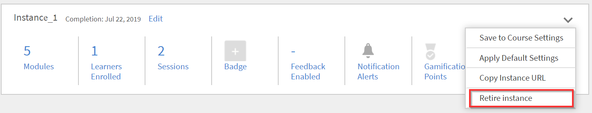
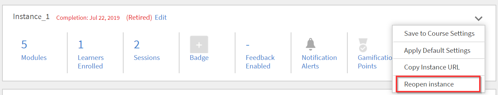
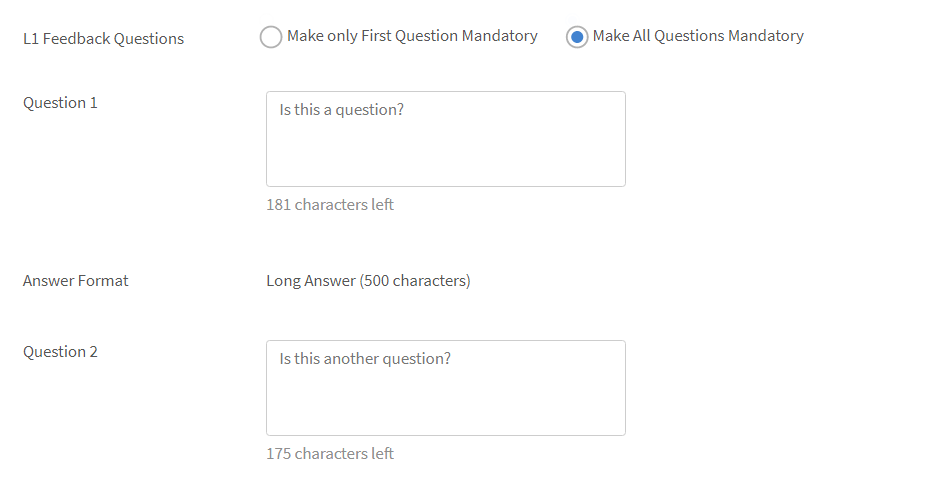
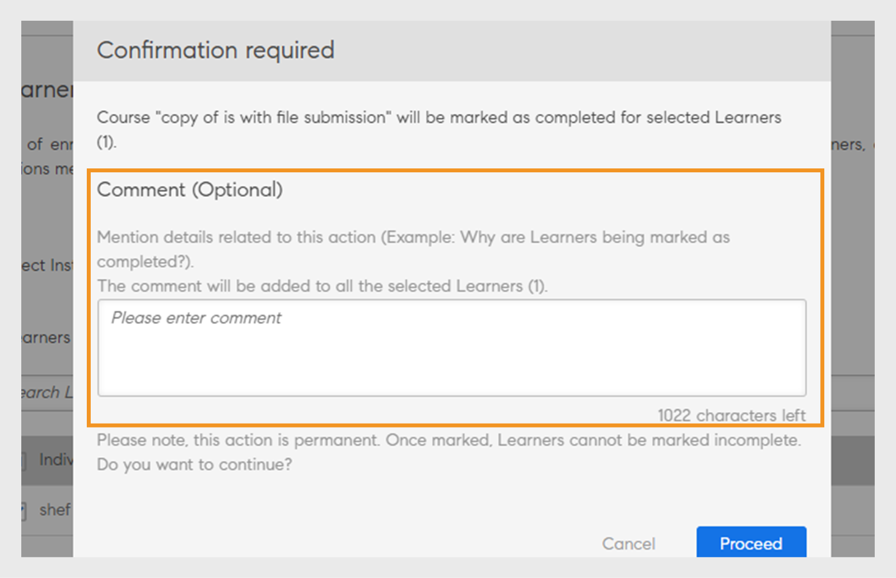

# Creación de instancias de cursos y rutas de aprendizaje

Este documento consta de ayuda para crear módulos de cursos, instancias y cursos para la función de administrador.

Los autores crean cursos. Los alumnos pueden realizar cursos y los administradores pueden realizar un seguimiento del rendimiento de los alumnos según el consumo del curso.

## Información general {#overview}

Los autores crean cursos. Los alumnos pueden realizar los cursos y los administradores pueden hacer un seguimiento del rendimiento de los alumnos según el consumo del curso. Los administradores pueden ver los cursos creados por los autores y realizar algunas actividades, como se explica en esta sección. Los administradores pueden crear programas de aprendizaje únicos con un conjunto predefinido de cursos para alumnos.

## Crear la instancia de un curso {#createinstanceofacourse}

### Configurar instancias

En este curso de formación, aprenderá a configurar los valores predeterminados de las instancias, añadir una nueva instancia, retirar y volver a abrir una instancia, y configurar las plantillas de correo electrónico de una instancia.

Si no puedes iniciar el entrenamiento, escribe a <almacademy@adobe.com>.

### Cómo crear una instancia

Una vez que un autor ha creado un curso, puede crear instancias del mismo. Al crear instancias de un curso, puede ofrecer el mismo curso a los alumnos en períodos de tiempo diferentes. Los alumnos pueden elegir cualquier instancia e inscribirse. Puede configurar cada instancia para que tenga su propia serie de insignias, comentarios y otras opciones de configuración.

Para crear una instancia:

1. En la aplicación web de administrador, haga clic en **[!UICONTROL Cursos]** en el panel izquierdo.
1. En la lista de cursos, seleccione uno y haga clic en **[!UICONTROL Ver curso]**.

   

   *Ver un curso*

1. Para crear instancias, haga clic en **[!UICONTROL Instancias]** en el panel izquierdo. Cada curso tiene una instancia de forma predeterminada. Es posible modificar la instancia predeterminada o bien añadir instancias. Esta instancia del curso no se puede eliminar.
1. Para crear una instancia, en la esquina superior derecha de la información del curso, haga clic en **[!UICONTROL Añadir nueva instancia]**. Se muestra una nueva instancia del curso.
1. Indique las propiedades de la instancia:

   * En el campo **[!UICONTROL Nombre de instancia]**, escriba el nombre de la instancia que desea asociar al curso. Asigne un nombre exclusivo a la instancia.
   * Especifique la fecha límite de finalización de la instancia. Los alumnos deben lograr el estado de finalización del curso en esta fecha.
   * Haga clic en **[!UICONTROL Mostrar más opciones]** para mostrar otras opciones de fecha límite.
   * **[!UICONTROL Plazo de inscripción]:** Esta es la fecha en la que se espera que un alumno se inscriba en un objeto de aprendizaje en caso de inscripción automática.
   * **[!UICONTROL Fecha límite de cancelación de inscripción]:** Puede optar por restringir que el propio alumno cancele la inscripción estableciendo una fecha límite de cancelación de inscripción.
   * **[!UICONTROL Zona horaria]:** Busque y, a continuación, seleccione la **[!UICONTROL zona horaria]** en el menú desplegable.

   Un administrador puede decidir establecer límites de finalización para un curso o programa de aprendizaje según los requisitos. Ahora bien, se recomienda tener uno según las modalidades de formación de clase o clase virtual.

   

   *Establecer fecha límite de finalización*

### Ver las propiedades de la instancia {#viewpropertiesoftheinstance}

*Ver propiedades de la instancia*

1. **Módulos:** Cantidad de módulos creados por el autor del curso.
1. **Alumnos inscritos:** Cantidad de alumnos que el administrador ha inscrito en el curso.
1. **Sesiones:** Cantidad de módulos de clase y clase virtual del curso.
1. **Comentarios activados:** Indica si los comentarios de L1, L2 y L3 se han activado para este curso.

>[!NOTE]
>
>El administrador cancela las sesiones yendo a Instancias > Sesiones y seleccionando Cancelar sesión.

### Administrar instancias

>[!INFO]
>
>En este curso de formación, aprenderá a editar los detalles de la instancia y las propiedades de la instancia.    

Si no puedes iniciar el entrenamiento, escribe a <almacademy@adobe.com>.

### Retirar una instancia {#retireaninstance}

Para retirar una instancia, aplique los pasos siguientes:

1. En la instancia, seleccione el menú desplegable y elija la opción **[!UICONTROL Retirar instancia]**.

   

   *Retirar una instancia*

1. Para buscar todas las instancias retiradas, en la página Instancias, haga clic en la pestaña **[!UICONTROL Retirado]**.

### Restaurar una instancia {#restoreaninstance}

Para devolver una instancia al estado activo, aplique los pasos siguientes:

1. En la instancia, haga clic en el menú desplegable y seleccione la opción **[!UICONTROL Reabrir instancia]**.

   

   *Restaurar una instancia*

1. La instancia se restaura a un modo activo.

### Eliminación de una instancia

Los administradores pueden eliminar la instancia mediante la opción **Eliminar esta instancia** inmediatamente después de la creación. No se pueden eliminar instancias si hay una sesión vinculada a ella o si algún alumno se ha inscrito en ella.

*Eliminar una instancia*

>[!NOTE]
>
>No se puede eliminar la instancia predeterminada.

### Enviar correos electrónicos a nivel de instancia

Para enviar correos electrónicos a nivel de instancia a alumnos inscritos:

1. En la página **[!UICONTROL Instancias]**, seleccione las opciones en cualquier instancia y, a continuación, haga clic en **[!UICONTROL Alumnos inscritos por correo electrónico]**.

*Enviar correo electrónico a los alumnos inscritos en la instancia*

1. En el cuadro de diálogo **[!UICONTROL Crear anuncio]**, seleccione Escribir como correo electrónico. Especifique el asunto, escriba el mensaje y haga clic en **[!UICONTROL Guardar]**. La formación se selecciona automáticamente.

   

   *Crear anuncio como correo electrónico*

1. Después de hacer clic en **[!UICONTROL Guardar]**, verá un mensaje de confirmación informándole de la creación correcta del anuncio. Para publicar el anuncio, haga clic en **[!UICONTROL Publicar ahora]**.

   

## Inscribir alumnos en cursos

En este curso de formación, aprenderá a inscribir, dar de baja y volver a inscribir alumnos.

Si no puedes iniciar el entrenamiento, escribe a <almacademy@adobe.com>.

### Inscribir a los alumnos en varias instancias

1. Seleccione un curso de la lista.
1. Seleccione los **[!UICONTROL Alumnos]** en el panel izquierdo.
1. Seleccione **[!UICONTROL Inscribir]**.

   

   *Publish el curso*

1. En el cuadro de diálogo [!UICONTROL **Inscribir alumnos**], puede hacer lo siguiente:

   * Seleccione una instancia para inscribir a un alumno en el menú desplegable Seleccionar instancia .
   * Seleccione el usuario o los grupos de usuarios, o ambos, en el campo Incluir alumnos.
   * Seleccione los alumnos que desea excluir de la instancia en el campo Excluir alumnos.
   * En la parte inferior del cuadro de diálogo, seleccione Sí si desea que uno o varios alumnos se inscriban en la instancia seleccionada.

1. Seleccione **[!UICONTROL Continuar]**.

   

   *Continuar con la inscripción de alumnos*

### Ver el informe de inscripción de una instancia

1. Seleccione un curso de la lista.
1. Seleccione los **[!UICONTROL Alumnos]** en el panel izquierdo.
1. Seleccione **[!UICONTROL Acciones]** > **[!UICONTROL Exportar]**.

El archivo de Excel contiene las hojas de cálculo de cada instancia. Una hoja de cálculo consta de los campos:

* Alumnos
* Correo electrónico
* ID exclusivo de usuario
* Nombre del curso
* ID exclusivo de objetos
* Estado
* Criterios de selección
* Fecha de inscripción/Fecha de cancelación de la inscripción (zona horaria UTC)
* Fecha de finalización (zona horaria UTC)
* Fecha de vencimiento (zona horaria UTC)
* Fecha de inicio (zona horaria UTC)
* Puntuación de prueba
* Nombre del responsable
* Dirección
* Estado del usuario
* Área de especialización
* Comentarios
* Número de visitas
* Fechas de visita
* Marcas de tiempo (zona horaria UTC)
* Tiempo empleado (minutos)

>[!NOTE]
>
>Al activar la opción de varias inscripciones, se añaden diferentes filas al informe de transcripciones de alumnos por cada curso (una fila por instancia).
>
>Si ha configurado la automatización de informes que solo prevé una fila por curso, debe realizar los ajustes necesarios en la automatización de informes antes de activar la función Inscripción múltiple.

### Administrar la lista de alumnos de un curso {#managelearnerslistforacourse}

1. Haga clic en el nombre del curso en la miniatura del curso.
1. En el panel izquierdo, haga clic en **[!UICONTROL Alumnos]**.

*Seleccionar alumnos en un curso*

En la página Alumnos, puede realizar las acciones siguientes:

* Seleccione el alumno que desea quitar y haga clic en [!UICONTROL **Acciones**] > [!UICONTROL **Quitar**].
* Seleccione el alumno cuya asistencia desea marcar y haga clic en [!UICONTROL **Acciones**] > [!UICONTROL **Marcar como completada**].

Para permitir que los alumnos restablezcan un módulo y vuelvan a consumirlo, haga clic en [!UICONTROL **Restablecer**]. En el cuadro de diálogo emergente, haga clic en Sí para confirmar el restablecimiento. Los módulos que se han completado no se pueden restablecer. Solo se pueden restablecer los módulos incorrectos o incompletos.

También puede exportar la lista de alumnos en una hoja de Excel. Para exportar la lista de alumnos, haga clic en [!UICONTROL **Acciones**] > [!UICONTROL **Exportar**].

>[!NOTE]
>
>Si hay varias instancias de un curso, la lista de alumnos en Excel se proporciona en cada ficha por separado. La lista de alumnos se compone del nombre del alumno, el estado y los criterios de selección. El estado de los alumnos puede ser **No iniciado**, **En curso** o **Completado**.

### Exportar alumnos con estado de aprobación pendiente

Un administrador, un responsable o un administrador personalizado pueden exportar datos de alumnos con un estado de inscripción de aprobación pendiente. Puede exportar los datos a través de la ficha **Curso > Alumno** y hacer clic en la lista desplegable Acción.

La opción estará presente cuando no haya ningún alumno inscrito/pendiente de aprobación en el curso aprobado por el responsable y se generará un informe vacío. También puede exportar cuando los alumnos estén en estado de aprobación pendiente, inscrito, pendiente y no inscrito.

El informe contiene datos de usuarios activos, eliminados y suspendidos si están pendientes de aprobación. Además, el informe contiene datos de usuarios internos y externos que están en estado de aprobación pendiente.

Si un alumno con un estado de aprobación pendiente se da de baja, su registro no estará presente en el informe. Además, si un alumno con un estado de aprobación pendiente se inscribe en el curso mediante inscripción de administrador/responsable/administrador personalizado, su registro estará presente en el informe.

## Administrar de forma masiva la inscripción, la asistencia y la finalización de alumnos {#bulk-enrollment}

Con la función de inscripción masiva de Adobe Learning Manager, los administradores pueden inscribir de manera eficiente grandes grupos de alumnos en cursos, certificaciones o programas de aprendizaje cargando un archivo CSV. Este proceso ahorra tiempo, garantiza la coherencia y respalda la escalabilidad de la organización. Además, los administradores y los instructores pueden actualizar la información del alumno, su asistencia y sus finalizaciones en bloque mediante la carga de archivos CSV, lo que minimiza el trabajo manual y garantiza la precisión de los datos.

Puede utilizar el mismo formato de archivo CSV para la inscripción, la asistencia y la finalización. Solo tiene que introducir los ID de correo electrónico del alumno en la columna &quot;Correo electrónico&quot; y guardar el archivo con un nombre basado en la acción, por ejemplo, bulk_enrollment.csv, bulk_attend.csv o bulk_completed.csv. Solo se admite el formato CSV. No se admite el formato UTF-8. Descargue el [archivo .csv de muestra](assets/Sample-Bulk-Action-CSV.csv).

### Inscribir alumnos en bloque mediante un archivo CSV

En lugar de añadir alumnos de uno en uno, los administradores pueden inscribir hasta 100 000 usuarios simultáneamente cargando un archivo CSV. El archivo debe incluir una columna con la etiqueta **userEmail** y las direcciones de correo electrónico de los alumnos que se van a inscribir.

Para inscribir alumnos en bloque mediante CSV:

1. Inicie sesión como administrador.
2. Seleccione un curso de la sección **[!UICONTROL Cursos]**.
3. Seleccione **[!UICONTROL Alumnos]** en la página **[!UICONTROL Descripción general del curso]**.
4. Seleccione **[!UICONTROL Inscribirme]** y, a continuación, seleccione **[!UICONTROL Cargar un CSV]**.\
   
   _Inscribir a un alumno mediante la carga de CSV_
5. Cargue un archivo CSV y seleccione **[!UICONTROL Continuar]**.

El archivo CSV incluye una columna con la etiqueta &quot;Correo electrónico del usuario&quot;. Introduzca las direcciones de correo electrónico de los usuarios en esta columna.

### Marcar la finalización del curso en bloque

Los administradores pueden marcar rápidamente las finalizaciones de cursos de muchos alumnos a la vez cargando un archivo CSV con sus direcciones de correo electrónico. Esto ahorra tiempo en comparación con la actualización individual de cada alumno. La columna userEmail del CSV muestra qué alumnos deben actualizar. Puede marcar hasta 10 000 alumnos como completados en una carga.

Para marcar la finalización en bloque:

1. Seleccione un curso de la sección **[!UICONTROL Cursos]**.
2. Seleccione **[!UICONTROL Alumnos]** en la página **[!UICONTROL Descripción general del curso]**.
3. Seleccione **[!UICONTROL Acciones]** y, a continuación, **[!UICONTROL Marcar finalización]**.
4. Seleccione **[!UICONTROL Bulk]**.
5. Cargue un archivo CSV con una columna de correo electrónico del usuario que enumere a los alumnos que han completado el curso.

   
   _Marcando finalización en bloque mediante CSV_

### Marcar la asistencia de forma masiva

Los administradores pueden marcar la asistencia de muchos alumnos a la vez mediante una función de asistencia en bloque. En lugar de actualizar la asistencia de cada alumno de forma individual, los administradores pueden cargar un archivo CSV que contenga las direcciones de correo electrónico de los alumnos. La columna userEmail del CSV identifica qué asistencia de alumnos se debe registrar. Este proceso puede gestionar hasta 10 000 alumnos en una sola carga, lo que hace que la marca de asistencia sea más rápida y eficaz.

Para marcar la asistencia masiva:

1. Seleccione un curso de la sección **[!UICONTROL Cursos]**.
2. Seleccione **[!UICONTROL Asistencia y puntuación]** en la página **[!UICONTROL Descripción general del curso]**.
3. Seleccione **[!UICONTROL Acciones]** y, a continuación, seleccione **[!UICONTROL Marcar asistencia en bloque]**.
4. Cargue un archivo CSV que incluya una columna userEmail con las direcciones de correo electrónico de los alumnos cuya asistencia desea actualizar.

   
   _Marcando la asistencia en bloque mediante CSV_

>[!NOTE]
>
>Puede marcar la asistencia de hasta 10 000 usuarios en bloque mediante CSV.

### Errores comunes de carga de CSV

* El correo electrónico del alumno en el CSV no existe en el directorio de usuario de Adobe Learning Manager.
* El formato del archivo es incorrecto.
* El archivo contiene columnas adicionales o datos no válidos.

_Notificación de error_

Puede descargar y ver el archivo CSV que enumera los errores de los usuarios con errores en el nivel de fila para facilitar su identificación.

## Lista de espera

La sección Lista de espera permite que los alumnos estén en lista de espera para cursos de clase cuando las plazas son limitadas, en función de su orden de inscripción. Los administradores pueden gestionar esto seleccionando alumnos en lista de espera y asignando puestos que superen el límite inicial. Una vez que el administrador asigna una licencia, el alumno se inscribe inmediatamente en el curso.

### Informe de lista de espera

Adobe Learning Manager permite a los administradores descargar la lista de alumnos en lista de espera para todas las instancias de un curso. Los administradores pueden acceder a este informe desde la sección Lista de espera de la página **[!UICONTROL Resumen del curso]**.

Siguiendo las columnas disponibles en el informe de lista de espera:

* Nombre del curso
* Nombre de la instancia
* ID de instancia
* Estado de la instancia
* Nombre de usuario
* Correo electrónico
* ID exclusivo de usuario
* Fecha de inscripción (zona horaria UTC)
* Estado
* Número de lista de espera
* Límite de lista de espera
* Límite de puestos

Para descargar el informe desde la sección de administración:

1. Inicie sesión como **[!UICONTROL administrador]**.
2. Vaya a la sección **[!UICONTROL Curso]** y seleccione el curso requerido.
3. Seleccione la opción **[!UICONTROL Lista de espera]** en la página **[!UICONTROL Descripción general del curso]**.
4. Selecciona **[!UICONTROL Acciones]** > **[!UICONTROL Informe de exportación]** para descargar el informe de **[!UICONTROL lista de espera]**.

   
   _Informe de exportación_

## Exportar asistencia de los alumnos {#attendance}

Para cualquier clase y curso de clase virtual, puede descargar la lista de alumnos que han asistido a este curso.

En la página de detalles del curso, haga clic en **[!UICONTROL Asistencia y Puntuación]** en el panel derecho.

En la esquina superior derecha de la página, haga clic en la lista desplegable **[!UICONTROL Acciones]**. A continuación, haga clic en la opción **[!UICONTROL Exportar lista de alumnos (PDF)]**.

*Exportar lista de alumnos como PDF*

En el archivo PDF, puede ver el mismo conjunto de alumnos que un instructor.

Cuando descarga el PDF, puede ver la zona horaria (en UTC) que se utilizó al crear el curso.

## Comentarios de L1 y L3 {#addl1andl3feedback}

>[!NOTE]
>
>Si esta opción de comentarios no está visible en su cuenta, significa que su cuenta ya se ha actualizado al nuevo formulario de comentarios de L1. Vea [formulario de comentarios de L1](/help/migrated/administrators/feature-summary/l1-feedback-form.md) para obtener más información.

Puede agregar las opciones de comentarios de L1 y L3 mientras crea los cursos:

1. Haga clic en Cursos en el panel izquierdo después de iniciar sesión como administrador. La lista de todos los cursos aparece en la página derecha.
1. Haga clic en el mosaico del curso para el que desee agregar comentarios de L1 o L3.
1. Haga clic en la instancia predeterminada en el panel izquierdo.
1. Haga clic en el círculo del botón de alternar junto a los comentarios de L1 o L3 para habilitarlos.
1. Añada la pregunta de comentarios de L3 en el área de texto debajo de Pregunta de L3.

### Comentarios de L1 obligatorios {#mandatory-l1-feedback}

Puede hacer que todas las preguntas o la primera pregunta sean obligatorias en los comentarios de L1.

*Establecer como obligatorias todas las preguntas o la primera pregunta en los comentarios de L1*

Ahora, puede crear las preguntas, que serán obligatorias.

*Crear las preguntas*

Si las dos preguntas obligatorias, por algún motivo, no tienen texto, las preguntas no aparecerán en el formulario de comentarios.

>[!NOTE]
>
>No basta con activar esta configuración en la instancia del programa de aprendizaje. También debe activar esta configuración en el nivel de instancia del curso para cada curso del programa de aprendizaje.

En la página Valores predeterminados de instancia, si habilita **[!UICONTROL Establecer todas las preguntas como obligatorias]**, todas las instancias nuevas creadas posteriormente heredarán esta configuración.

*Ver la página Valores predeterminados de instancia*

### Comentarios de L1 en el nivel del curso {#l1-feedback-course-level}

En versiones anteriores de Learning Manager, un administrador podía activar los comentarios de L1 para el programa de aprendizaje.

En esta versión de Learning Manager, el administrador puede enviar los comentarios de L1 de todos los cursos que forman parte del programa de aprendizaje. El administrador debe asegurarse de que los comentarios de L1 estén activados para todos los cursos en el nivel de instancia del curso.

1. Para habilitar los comentarios de L1 de cada curso, en la aplicación de administración, haga clic en **[!UICONTROL Programas de aprendizaje]** > **[!UICONTROL Ver programa de aprendizaje]**.

1. Haga clic en **[!UICONTROL Instancias]** > **[!UICONTROL Comentarios de L1 habilitados]**.

1. Habilite la opción **[!UICONTROL Habilitar para cada curso]**.

   

   *Habilitar comentarios del curso*

   Si solo se activa este botón deslizante en el nivel de programa de aprendizaje, no se activarán los comentarios de L1 para los cursos de este programa. Para activar los comentarios de L1, vaya a cada curso del programa de aprendizaje y active el conmutador Comentarios de L1.

   

   *Habilitar comentarios de L1 para cada curso*

   Si los comentarios de L1 están activados para todos los cursos, pero están desactivados en la instancia del programa de aprendizaje, los comentarios de L1 no se activarán para los cursos.

### Informes de prueba específicos del idioma

Los informes de prueba ayudan a evaluar el rendimiento de un alumno después de la finalización de un programa de aprendizaje o un curso.

Learning Manager proporciona actualmente aprendizaje en 13 idiomas para la interfaz y en 32 idiomas para el contenido. Aunque esta opción es fácil de usar para los alumnos y proporciona comodidad a nuestros alumnos de todo el mundo, es difícil para los administradores obtener los informes que se intentan obtener en varias configuraciones regionales.

En los informes de prueba, se muestran datos en diferentes idiomas siempre que el curso se ofrezca en varios idiomas. Hasta ahora, los informes generados por el administrador mostraban las respuestas una debajo de la otra, independientemente del idioma en el que se intentara realizar la prueba. **Por ejemplo**, si un usuario ha realizado una prueba en neerlandés, el administrador solo podrá ver los informes de prueba que los usuarios realicen en este idioma cada vez. El administrador que había seleccionado el inglés como idioma de la interfaz no podía ver los informes de todos los usuarios a la vez, independientemente de la configuración regional empleada.

Esto se ha solucionado, ya que el administrador ahora puede ver a la vez todos los informes en el idioma respectivo empleado por el usuario, independientemente de la configuración regional de contenido elegida. La prueba realizada en diferentes idiomas se añadirá como columnas adicionales en el informe de prueba.

### Activar los comentarios de L1 en el nivel de cuenta {#l1-feedback-account-level}

*Habilitar comentarios de L1 en el nivel de cuenta*

Un administrador podrá habilitar los comentarios de L1 para los cursos y el programa de aprendizaje recién creados activando esta configuración en el nivel de cuenta. Sin embargo, si se activa esta opción, no se verán afectados los cursos ni los programas de aprendizaje existentes

Si está activada, se habilitarán de forma predeterminada los comentarios para todos los nuevos cursos de formación e instancias. Si un autor/administrador visita la instancia, esta se establece de forma predeterminada y se desactiva manualmente; a continuación, se mantendrá esta configuración.

Para habilitar los comentarios de L1, en la aplicación de administración, haga clic en **[!UICONTROL Configuración]** > **[!UICONTROL Comentarios]**.

*Ver la página Configuración de comentarios*

Haga clic en **[!UICONTROL Editar]** en la esquina superior derecha y cambie la opción para habilitar los comentarios de L1.

Cuando un autor crea un curso, en la página Instancia de la aplicación de administración, los **[!UICONTROL comentarios de L1]** se habilitan automáticamente para el nuevo curso.

<!---->

También puedes deshabilitar los comentarios de L1 activando la opción **[!UICONTROL Habilitar]**, como se muestra a continuación:

*Habilitar o deshabilitar los comentarios de L1*

### Añadir preguntas descriptivas para los comentarios de L1 y L3 {#descriptive}

En la versión de noviembre de Learning Manager, se ha incluido una opción para añadir preguntas descriptivas. Los administradores tienen una opción para agregar estas preguntas para los alumnos. Esto se añade al conjunto predeterminado de preguntas proporcionadas por Learning Manager. También puede hacerlas obligatorias si es necesario al elegir la opción debajo de la pregunta.

Es posible añadir dos preguntas descriptivas para los comentarios de L1 y una pregunta descriptiva para los comentarios de L3.

Una vez que habilitan los comentarios de L1, puede ver las opciones como se muestra en la captura de pantalla siguiente:

*Agregar preguntas descriptivas para los comentarios de L1 y L3*

Si desea que el cuestionario se muestre al alumno inmediatamente después de finalizar el curso, puede elegir la opción pertinente.

A continuación, se proporciona un cuestionario de L1 de muestra como referencia. Los alumnos pueden ver el cuestionario en el formato siguiente. Prueba-1 y Prueba-2 son las preguntas descriptivas.

*Preguntas de comentarios de un curso de ejemplo*

Una vez que active los comentarios de L3, puede ver las opciones como se muestra en la captura de pantalla siguiente:

*Habilitar comentarios de L3*

La pregunta 2 es la pregunta descriptiva de los comentarios de L3. Puede hacerla obligatoria seleccionando la opción que corresponda debajo de la pregunta.

A continuación, se proporciona un cuestionario de L3 de muestra como referencia. Los alumnos pueden ver el cuestionario en el formato siguiente.

*Ver salida de comentarios de L3*

### Configurar el cuestionario de comentarios de L1 y L3 {#setupl1andl3feedbackquestionnaire}

Puede configurar el cuestionario de comentarios L1 y L3 y establecer recordatorios en el nivel de cuenta.

1. Haga clic en **[!UICONTROL Configuración]** y, a continuación, en **[!UICONTROL Comentarios]** en el panel izquierdo después de iniciar sesión como administrador.\
   Aparece la página de configuración de comentarios con dos fichas: **[!UICONTROL Comentarios de L1]** y **[!UICONTROL Comentarios de L3]**.\
   La ficha **[!UICONTROL Comentarios de L1]** consta de una lista de cuestionarios predeterminados de **[!UICONTROL comentarios de L1]** para cursos de clase y cursos con ritmo personalizado, junto con la configuración de recordatorio. En la ficha **[!UICONTROL Comentarios de L3]**, puede ver la declaración predeterminada de los comentarios de L3 y la configuración de recordatorio.

1. Haga clic en Editar en la esquina superior derecha de la página para modificar el cuestionario existente.\
   En la ficha **[!UICONTROL Comentarios de L1]**, puede habilitar o deshabilitar cada pregunta haciendo clic en el botón de alternancia Sí/No.\
   En la ficha **[!UICONTROL Comentarios de L3]**, puede modificar la declaración de comentarios predeterminada.\
   Haga clic en **[!UICONTROL Agregar nuevo recordatorio]** en la parte inferior de la página y elija cuándo enviar los recordatorios.

1. Haga clic en **[!UICONTROL Guardar]** en la esquina superior derecha de la página.

En los comentarios de L1, puede ver dos conjuntos de cuestionarios junto con una pregunta predeterminada. El primer conjunto de cuestionarios se refiere a cursos de tipo personalizado que también se pueden utilizar para cursos basados en actividades. El segundo conjunto de cuestionarios se puede utilizar para cursos de clase y de clase virtual.

## Ver comentarios de L1 y L3 {#viewl1andl3feedback}

Puede ver los comentarios de L1 proporcionados por los alumnos de un curso y los comentarios de L3 facilitados por los responsables de los alumnos.

1. Haga clic en cualquier mosaico de curso de la lista Cursos.
1. Haga clic en Comentarios de L1 o en Comentarios de L3 en el panel izquierdo para ver los comentarios que se han recibido.
1. Seleccione la instancia en la lista desplegable para ver los Comentarios de esa instancia en concreto.

## Foro de debate

La función Foro de debate permite a los alumnos ver las discusiones del curso. Como administrador, tiene la posibilidad de eliminar cualquier comentario que considere necesario. Los administradores pueden activar esta opción en la configuración del curso.

## Moderación de los cursos {#coursemoderation}

Cada vez que un autor añade, actualiza o elimina módulos y vuelve a publicar un curso, todos los administradores reciben una notificación al respecto. Como administrador, puede ver los cambios, comparar el contenido antiguo y el nuevo haciendo clic en el vínculo, y aprobar o rechazar los cambios correspondientes.

Para habilitar Moderación de los cursos, haga clic en **[!UICONTROL Configuración]** > **[!UICONTROL General]**. Seleccione la casilla de verificación **[!UICONTROL Moderación de los cursos]** para activar esta función.

*Habilitar moderación de cursos*

Haga clic en la notificación para ver los cambios que el autor ha realizado en el curso. A continuación, apruebe o rechace los cambios efectuados por el autor. Si elige aprobar, el curso se vuelve a publicar. Si rechaza las actualizaciones, seguirá existiendo la versión anterior del curso. En cualquier caso, se envía una notificación al autor.

*Crear solicitudes de actualizaciones de cursos*

Si varios autores actualizan el mismo curso, el último cambio realizado (o el más reciente) se reflejará en la notificación del administrador. En ese momento, puede aprobar o rechazar los últimos cambios.

## Exportar datos de lista de comprobación {#export-checklist-data}

En la lista de cursos, abra un curso que contenga una lista de comprobación. En el panel izquierdo, aparecerá la opción **[!UICONTROL Lista de comprobación]**.

*Exportar datos de lista de comprobación*

Haga clic en la opción y, en la página del curso, realice lo siguiente:

1. Seleccione la instancia y el módulo.
1. Haga clic en **[!UICONTROL Acciones]** > **[!UICONTROL Exportar]**; a continuación, exporte el informe de lista de comprobación del alumno.

En la página **[!UICONTROL Lista de comprobación]**, un instructor puede exportar el informe de lista de comprobación desde la lista desplegable **[!UICONTROL Acciones]**.

El informe CSV contiene los siguientes campos:

* Nombre de usuario
* Correo electrónico del usuario
* Nombre y correo electrónico del responsable
* Nombre del curso de formación
* Instancia del curso de formación
* Nombre y correo electrónico del instructor
* Fecha de envío
* Estado de evaluación
* Preguntas con texto real
* Estado del usuario
* Perfil
* Campos activos

Al descargar un informe después de seleccionar un filtro de estado, el informe de transcripción del alumno descargado contendrá los datos del alumno en función del filtro de estado aplicado. Este filtro añadido también se mostrará al responsable y el administrador personalizado cuando estén a punto de generar una transcripción del alumno.

## Cómo ver los cursos {#viewingcourses}

Como administrador, puede ver una lista de todos los cursos disponibles.   Haga clic en **[!UICONTROL Cursos]** en el panel izquierdo para ver la lista de cursos con opciones de búsqueda y filtro. También puede ver el porcentaje de eficacia de cada curso en las miniaturas del curso.

>[!NOTE]
>
>Puede retirar un curso una vez que los alumnos hayan consumido el curso o cuando desee retener un curso en particular después de publicarlo. Puede retirar un curso solo cuando se encuentre en estado publicado. Para ver la lista de todos los cursos retirados, haz clic en la pestaña **[!UICONTROL Retirado]**.

## Ver puntuaciones de pruebas {#viewquizscores}

1. Haga clic en el nombre del curso en la miniatura del curso.
1. Haga clic en Puntuación de prueba en el panel izquierdo.

Puede ver la puntuación de cualquier curso en particular según el nombre de usuario o según cada pregunta. Para ello, elija la ficha Por usuario o Por pregunta, respectivamente.

Elija el tipo de instancia de la lista desplegable para ver las puntuaciones según cada instancia del curso.

## Instancia predeterminada

Los administradores pueden establecer insignias, configuraciones de interacción y recordatorios predeterminados en la página **[!UICONTROL Instancia predeterminada]**. Para modificar la configuración de instancia predeterminada, seleccione **[!UICONTROL Instancia predeterminada]** > **[!UICONTROL Editar]**.

* **[!UICONTROL Insignia]**: seleccione las insignias predeterminadas en el menú desplegable.
* **[!UICONTROL Interacción]**: configure la interacción, incluidos los puntos para la finalización, la finalización anticipada y la finalización puntual. Los administradores tienen la opción de seleccionar la configuración de nivel de cuenta o personalizar los puntos de interacción para esta instancia.
* **[!UICONTROL Comentarios de reacción de L1]**: habilita preguntas predefinidas para los comentarios del alumno al finalizar el curso, con opciones para que las preguntas sean obligatorias.
***[!UICONTROL Comentarios sobre cambios de comportamiento en L3]**: habilita preguntas de comentarios para el responsable del alumno al finalizar el curso.
***[!UICONTROL Configuración de recordatorio]**: Establece y administra recordatorios para las fechas límite, con opciones de escalación.

### Establecer nivel de escalación {#escalation}

Para enviar notificaciones por correo electrónico, un administrador debe establecer explícitamente el nivel de escalación en:

* Responsable
* Responsable y responsable de un nivel superior

*Establecer nivel de escalación*

## Comentarios de finalización

Los administradores pueden dejar comentarios cuando marcan a cualquier alumno como completado para cursos, rutas de aprendizaje o certificaciones. Estos comentarios ayudan con el cumplimiento y la auditoría. Los administradores pueden añadir comentarios fácilmente para uno o varios alumnos a la vez.

### Agregar comentarios de finalización

Siga estos pasos para agregar comentarios de finalización:

1. Inicie sesión como **[!UICONTROL administrador]**.
2. Vaya a la página **[!UICONTROL Cursos]** y seleccione un curso.
3. Seleccione **[!UICONTROL Alumnos]** en la página del curso.
4. Elija el alumno individual o varios alumnos.
5. Seleccione **[!UICONTROL Acciones]** y, a continuación, seleccione **[!UICONTROL Marcar finalización]**.
6. Escriba el comentario de finalización en el cuadro de diálogo.

   
   _Comentario de finalización_

Este proceso es el mismo para rutas de aprendizaje y certificaciones. En el caso de las rutas de aprendizaje, puede filtrar para seleccionar todos los cursos o solo los cursos individuales para marcarlos como completados.

_Seleccionar varios cursos para completar_

Los comentarios estarán visibles en el informe [Transcripciones de alumnos](/help/migrated/administrators/feature-summary/reports.md#learner-transcripts).

## Previsualizar cursos {#previewcourses}

El administrador puede obtener una vista previa de los cursos haciendo clic en la opción **[!UICONTROL Vista previa como alumno]** mientras visualiza los módulos del curso.

1. Haga clic en **[!UICONTROL Cursos]** en el panel izquierdo después de iniciar sesión como administrador.
1. Haga clic en cualquier mosaico de curso de la lista de cursos en la página.
1. Haga clic en Vista previa como alumno en el panel izquierdo; a continuación, haga clic en el nombre del módulo en la página para previsualizar el módulo del curso en el reproductor.

## Eficacia del curso {#courseeffectiveness}

La eficacia del curso se evalúa con el fin de comprender la utilidad de un curso para el alumno. Se trata de una combinación de los resultados de los comentarios de los alumnos sobre el contenido del curso, los resultados de las pruebas del curso de un alumno y los comentarios del responsable que evalúa a un alumno en función de lo aprendido en el curso.

Un administrador puede ver la clasificación de la eficacia del curso en las vistas en miniatura del curso, tal y como se muestra en la siguiente imagen. Puede ver la clasificación para este curso de 100.

<!---->

El valor de la clasificación de la eficacia del curso se genera a partir de los valores indicados por los comentarios de L1, L2 y L3. Para ver los detalles desglosados de cada comentario, haga clic en el valor de la eficacia del curso. Se abre una ventana emergente como se muestra a continuación.

*Ver la eficacia de los cursos para los comentarios de L1, L2 y L3*

En esta captura de pantalla de ejemplo, 1 de 1 usuarios ha recibido los tres comentarios, por lo tanto la puntuación es 100/100. En esta tabla, puede comprender que no proporcionar alguno de los tres comentarios (L1, L2 y L3) para un curso repercute negativamente en la efectividad general. Haga clic en la flecha abajo en la esquina inferior derecha de la ventana emergente para ver cómo se realizan los cálculos de la eficacia del curso.

*Cálculo de la eficacia del curso*

Según el gráfico circular que se muestra arriba, se le da más peso a los comentarios de L3 del responsable.

## Cómo buscar cursos y programas de aprendizaje {#searchingcoursesandlearningprograms}

Adobe Learning Manager hace que sea más fácil encontrar los cursos o los programas de aprendizaje de su elección. Puede buscar los cursos de dos maneras:

1. Con el campo de búsqueda. Haga clic en el icono de búsqueda que aparece en la esquina superior derecha. Aparece un campo de búsqueda. Escriba el nombre del curso o cualquier palabra clave asociada a los cursos para localizar los cursos o programas de aprendizaje. También puede realizar búsquedas con etiquetas predefinidas, como Captivate, C, Java y HTML. Las etiquetas permiten la búsqueda en el campo de búsqueda, lo cual significa que las etiquetas se muestran en el campo de búsqueda mientras escribe.
1. Utilizar los filtros en la lista de cursos o programas de aprendizaje. Puede filtrar los cursos por estado, por ejemplo todos los cursos, los cursos publicados, los que están en borrador y los retirados. En modo de administrador, el filtro de borrador no está disponible.

Puede realizar búsquedas según las competencias si hace clic en Competencias y las selecciona. Como administrador, puede ordenar los cursos de cuatro formas para encontrar mejor el curso requerido. Haga clic en Ordenar por y elija orden alfabético ascendente, orden alfabético descendente, fecha de actualización del curso o eficacia de los cursos.

<!---->

Puede ordenar los programas de aprendizaje de tres maneras: orden alfabético ascendente, orden alfabético descendente y según la fecha de actualización.

## Inscribir alumnos {#enrollinglearners}

Puede seguir los mismos pasos para inscribir a los alumnos en el curso, el programa de aprendizaje y las certificaciones. Los responsables también pueden inscribir a los alumnos bajo su tutela conforme a los pasos siguientes.

El administrador inscribe a algunos alumnos en cursos obligatorios en función de los requisitos de la empresa:

1. Coloque el ratón sobre cualquier mosaico de curso publicado y haga clic en Inscribir alumnos.\
   Como alternativa, haga clic en cualquier mosaico de curso publicado y haga clic en Alumnos en el panel izquierdo. Aparece una página con una lista de alumnos. Haga clic en Inscribir.\
   Aparece el cuadro de diálogo Inscribir alumnos.

1. Seleccione la instancia en el menú desplegable. El menú desplegable enumera todas las instancias, incluidas las instancias activas, retiradas y caducadas.

>[!NOTE]
>
>El administrador puede eliminar a cualquier alumno registrado de un curso haciendo clic en la flecha desplegable de la página Alumnos y haciendo clic en **[!UICONTROL Acciones]** > **[!UICONTROL Eliminar]**.

*Agregar comentarios al inscribir alumnos*

*Inscribir alumnos*

## Usuarios

+++Incluir alumnos

Seleccione los grupos de usuarios y los alumnos individuales (mediante el ID de correo electrónico o el nombre) que desea incluir. Añada todos los grupos de usuarios en una intersección bajo el mismo conjunto. Para añadir otro grupo de usuarios en la unión, utilice un nuevo conjunto de inclusión.

+++

+++Excluir alumnos

Seleccione los grupos de usuarios y los alumnos individuales (mediante el ID de correo electrónico o el nombre) que desea excluir. Añada todos los grupos de usuarios en una intersección bajo el mismo conjunto. Para añadir otro grupo de usuarios en una unión, use un nuevo conjunto de inclusión.

+++

## ID de correo electrónico de usuario

+++ID de correo electrónico

Copie y pegue los ID de correo electrónico de los alumnos que desea inscribir, separados por punto y coma, coma o espacio. Use la opción **[!UICONTROL Validar ID de correo electrónico]** para validar las entradas. Todas las entradas no válidas aparecerán marcadas en rojo. Elimine o corrija esas entradas, y prosiga haciendo clic en **[!UICONTROL Continuar]**.

*Inscribir alumnos*

El cuadro de diálogo Resumen aparece con la cantidad de usuarios del conjunto de inclusión, el conjunto de exclusión y los usuarios ya inscritos en la instancia del curso.

+++

### Añadir comentarios al inscribir alumnos {#enroll-comments}

<!----->

Los administradores o los responsables pueden añadir comentarios al inscribir alumnos en un curso. Se puede mencionar información adicional sobre la serie de usuarios que se inscriben. Esta información se exporta en los informes del curso.

El comentario es **not** y se muestra al alumno.

Cuando un administrador genera el informe del curso del alumno, cualquier comentario, si se agrega, aparece en el informe. El cuadro de diálogo Resumen aparece con la cantidad de usuarios del conjunto de inclusión, el conjunto de exclusión y los usuarios ya inscritos en la instancia del curso.

En el cuadro de diálogo **[!UICONTROL Inscribir alumnos]**, expanda **[!UICONTROL Opciones avanzadas]**. En el campo **[!UICONTROL Comentario adicional]**, escriba el comentario correspondiente.

*Agregar comentarios para alumnos*

## Buscar usuarios inscritos {#searchforusers}

Busque usuarios inscritos en la sección Alumno del objeto de aprendizaje mediante la búsqueda de escritura anticipada. Con la búsqueda de escritura anticipada, puede buscar de forma progresiva los usuarios escritos mediante el nombre, el ID de correo electrónico y el UUID.

*Tutorial de búsqueda de usuarios inscritos*

En ocasiones, este tipo de búsqueda también se denomina autocompletar, búsqueda incremental, búsqueda al escribir, búsqueda directa o búsqueda instantánea.

A medida que escribe para buscar un alumno o un grupo de usuarios en el campo de búsqueda, se encuentran una o más coincidencias sobre los términos de búsqueda, que se muestran inmediatamente.

El proceso permite encontrar lo que se busca de manera mucho más rápida y menos complicada que si se ejecutan varias búsquedas seguidas.

Los alumnos o grupos de usuarios en todas las instancias se muestran después de una búsqueda. Para cada alumno, la instancia en la que se inscribe el alumno se muestra en la columna **[!UICONTROL Instancia]**.

*Ver resultados de búsqueda*

Mediante la función de escritura anticipada, puede:

* Ver todos los usuarios inscritos, sean cuales sean las instancias.
* Ver todos los grupos de usuarios que tienen uno o más usuarios inscritos.

Después de ejecutar una búsqueda, no puede filtrar alumnos por instancias. Está deshabilitada la opción para seleccionar una instancia en la lista desplegable **[!UICONTROL Seleccionar instancia]**.

Además, con los resultados de la búsqueda, puede elegir un alumno o un grupo de usuarios y realizar las siguientes acciones:

* Darse de baja
* Marcar finalización
* Restablecer módulo

Al realizar una búsqueda, la opción Dar de baja > En bloque de la lista desplegable Acciones está desactivada para el curso o programa de aprendizaje.

## Compartir código QR con alumnos para inscripción, finalización o ambas opciones {#shareqrcodewithlearnerstoenrollcompleteorboth}

Los administradores de Adobe Learning Manager pueden compartir los códigos QR con los alumnos para inscribirse rápidamente en el curso. Los tres códigos QR diferentes se utilizan para marcar la &#39;inscripción&#39;, &#39;finalización&#39; o &#39;inscripción y finalización&#39; de un curso.

Los alumnos utilizan la aplicación de dispositivos de Adobe Learning Manager para escanear el correspondiente código QR.

**Para descargar el código QR, haga lo siguiente**:

1. Haga clic en **[!UICONTROL Cursos]** en la sección Aprendizaje del panel de navegación izquierdo.
1. Seleccione un curso > **[!UICONTROL Ver curso]**.
1. Haga clic en **[!UICONTROL Instancias]** > **[!UICONTROL Más]** > **[!UICONTROL Código QR]**.

   <!---->

1. Active el código QR. A continuación, haga clic en los iconos de inscribirse, completar y completar e inscribirse, para descargar un archivo PDF que contiene el código QR para cada acción. Después, el administrador puede compartir el código QR con los alumnos.

   

   *Compartir código QR con alumnos*

## Descargar el informe de alumnos interesados

Vea [Registrar interés en los cursos](/help/migrated/learners/feature-summary/courses.md#register-interest-for-the-courses) para obtener información sobre cómo los alumnos pueden registrar su interés.

Los administradores pueden ver el interés de los alumnos y descargar el informe de alumnos interesados desde la página Resumen del curso .

Para descargar el informe de alumnos interesados:

1. Inicie sesión en Adobe Learning Manager como administrador.
2. Vaya a **[!UICONTROL Cursos]** y seleccione el curso.
3. Seleccione **[!UICONTROL Alumnos interesados]**.

   
   _La página de información general del curso de la interfaz de administrador muestra la sección Alumno interesado para ver y descargar el informe_
4. Seleccione Acciones y, a continuación, seleccione Exportar informe.
Se descargará el informe con la lista de alumnos interesados. El informe incluye las siguientes columnas:

   * ID de curso
   * Nombre del alumno
   * Correo electrónico
   * Tipo
   * Estado
   * Fecha y hora de registro (UTC)
   * Estado activo

>[!NOTE]
>
>El informe incluirá el UUID del alumno si está habilitado para la cuenta.

## Ciclo de vida del curso {#courselifecycle}

Un ciclo de vida del curso típico tiene el siguiente aspecto:

**Borrador**: cuando un autor termina de crear un curso y lo guarda. En este estado, el curso aún no está disponible para los alumnos. Puede eliminar un curso en este estado.

**Publicado**: cuando un autor termina de publicar un curso. En este estado, el curso está disponible para que los alumnos se inscriban.

**Retirado**: después de publicar un curso, un autor puede moverlo al estado Retirado si no desea que el curso aparezca en el catálogo de cursos para los alumnos. Puede volver a publicar o eliminar un curso en este estado.

**Eliminado**: un curso en estado eliminado se elimina cuando se quita por completo de la aplicación de Adobe Learning Manager. Solo los autores pueden eliminar los cursos cuando estos están en estado Borrador. También puede eliminar cursos del estado retirado.

*Flujo de trabajo de un ciclo de vida de curso*

## Configuración de notificaciones {#notificationsettings}

Como administrador, puede ajustar la configuración de las notificaciones. Para obtener más información, consulte [Notificaciones.](user-notifications.md)

## Preguntas más frecuentes {#frequentlyaskedquestions}

+++¿Cómo se restablece el módulo como administrador?

En la página Alumnos de un curso, elija el alumno o los alumnos o un grupo, haga clic en **[!UICONTROL Acciones]** > **[!UICONTROL Restablecer módulos]**.

*Opción Ver para restablecer módulos*

Después de hacer clic en la opción, se restablecerá el estado de los módulos de todos los alumnos seleccionados. Los módulos completados no se restablecerán.

+++

+++¿Cómo se añade la dirección URL del curso para redirigir a los alumnos directamente al curso?

Coloque el cursor del ratón sobre una tarjeta de curso y haga clic en **[!UICONTROL Copiar URL]**. Después de copiar la dirección URL, los alumnos pueden acceder al curso directamente con ella.

+++

+++¿Cómo se vuelve a abrir una instancia?

Para volver a abrir una instancia retirada, haga clic en el menú desplegable de la instancia y, a continuación, en **[!UICONTROL Reabrir instancia]**.

+++
