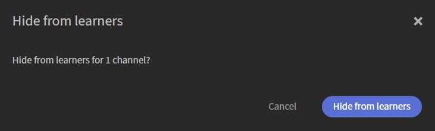

# Crear canales

Las organizaciones suelen almacenar sesiones de intercambio de conocimientos, grabaciones de formación y otros contenidos de vídeo en contenido de aprendizaje informal seleccionado en páginas web y de Confluence Cloud. Los canales conectan Adobe Learning Manager con estas fuentes de contenido, lo que facilita la detección y el consumo de vídeos sin necesidad de que los alumnos naveguen por varios sistemas. Los canales le ayudan a organizar y compartir contenido de aprendizaje basado en vídeo desde páginas web empresariales y páginas de Confluence Cloud en una única ubicación en la que se pueden realizar búsquedas. En lugar de buscar en varios sitios internos, los alumnos pueden descubrir grabaciones relevantes y acceder a ellas directamente desde Adobe Learning Manager. Visualiza [Descubre canales e interactúa con ellos](../../learners/feature-summary/discover-and-engage-with-channels.md) para obtener más información.

Como administrador, puede crear y administrar canales, configurar opciones de visibilidad, sincronizar contenido con su origen y comprobar que los vídeos estén disponibles antes de que los alumnos puedan acceder al canal. En este artículo se explica cómo realizar estas tareas de administración de canales.

**Principales ventajas**

- Consolida contenido de aprendizaje basado en vídeo de varias fuentes internas en una ubicación.
- Conserva contenido de vídeo de varias ubicaciones de la intranet en páginas web, que luego se muestran como canales en ALM.
- Permite a los alumnos encontrar contenido, reproducirlo e interactuar con él sin tener que desplazarse a varios sitios.
- Mantén el contenido sincronizado con su origen.

## Habilitar canales

Canales es una función que los administradores activan para la cuenta. Una vez activada, puede crear canales que se conecten a páginas web empresariales y a páginas de Cloud Confluence que contengan contenido de vídeo.

El rastreador de canales extrae vídeos de forma fiable de las páginas de origen que presentan su contenido en los siguientes formatos:

- Tablas
- Listas con viñetas
- Artículos

Para habilitar la característica **Canales**:

1. Inicie sesión en Adobe Learning Manager como administrador.

1. Seleccione **Canales** en la barra de navegación izquierda.
     Se abre la página **Canales**.

1. Seleccione la ficha **Configuración**.

   

   *Habilite la característica Canal en la ficha **Configuración**&#x200B;para permitir que los administradores creen canales para la cuenta.*

1. Habilitar **característica de canal**.

     Los canales están habilitados para la cuenta.

## Crear un canal

Cree un canal para definir el origen de contenido en el que Adobe Learning Manager buscará los vídeos y personalice el aspecto del canal y de la página de vídeo.

1. Vaya a la pestaña **Canales** y seleccione **Agregar canal**.
     Se abre la página **Crear canal**.

   

   *Definir el origen de contenido y configurar las opciones de visibilidad y sincronización al crear un canal.*

1. En la sección **Canal**, escriba el **nombre de canal** y la **Descripción**.

1. Seleccione un **tipo de origen** en el menú desplegable. Están disponibles las siguientes opciones:

   1. **Página web**: Seleccione esta opción para rastrear una página web e importar vínculos de vídeo junto con sus metadatos asociados.

   1. **Página de confluencia**: Seleccione esta opción para recuperar vínculos de vídeo y metadatos de una página de Confluence Cloud. Para conectarse a Confluence Cloud, proporcione los siguientes detalles:
      - **Dirección de correo electrónico de Atlassian**: Introduzca la dirección de correo electrónico asociada a su cuenta de Atlassian.
      - **token de API Atlassian**: Introduzca el token de API generado desde su cuenta de Atlassian. Seleccione **Cómo crear un token de API** para obtener instrucciones sobre cómo generar uno. Este distintivo se utiliza para la autenticación al rastrear el origen y se almacena cifrado.

      

      *Introduzca la dirección de correo electrónico y el token de API de Atlassian que se usaron para autenticarse con Confluence Cloud.*

1. Especifique la **URL de origen** del contenido de tipo de origen seleccionado.

1. En la sección **Estado**, configure las siguientes opciones:

   1. **Visible para los alumnos**: Active esta opción para que el canal esté disponible para los alumnos. Desactívelo para ocultar el canal mientras sigue configurándolo o probándolo.

   1. **Sincronizar automáticamente**: Active esta opción para actualizar automáticamente el canal cuando se añadan nuevos vídeos a la fuente. Desactívelo si desea sincronizar manualmente el canal.

1. (Opcional) Seleccione **Mostrar configuración avanzada** y, a continuación, configure las siguientes opciones según sea necesario:

   1. **Color del tema del canal**: Seleccione un color para personalizar la apariencia visual del canal.

   1. **Profundidad de rastreo**: Especifique la profundidad de rastreo de las páginas vinculadas para buscar contenido de vídeo. Admite una profundidad de rastreo máxima de **2**.

   1. **Frecuencia de rastreo (en horas)**: Especifique la frecuencia con la que Adobe Learning Manager debe comprobar el contenido nuevo o actualizado en la fuente.

      

      *Seleccione Mostrar configuración avanzada para configurar el color del tema del canal, la profundidad de rastreo y la frecuencia de rastreo.*

1. Seleccione **Probar ahora** para validar el origen. Los vídeos de ejemplo se recuperan y se muestran desde el origen configurado.

   

   *Prueba ahora **para confirmar que se recuperan vídeos de la fuente antes de crear el canal.***

1. Seleccione **Crear canal**. El canal se crea y se agrega a la lista **Canales**.

## Buscar un canal

Utilice el cuadro de búsqueda para localizar rápidamente un canal por nombre.

1. Seleccione la pestaña **Canales**.
1. Seleccione el cuadro **Buscar canales**.
1. Escriba el nombre del canal o parte de él en el cuadro **Buscar canales**.
     La lista filtra para mostrar solo los canales que coinciden con su búsqueda.

   

   *Escriba un nombre de canal en el cuadro de búsqueda para filtrar la lista **Canales**.*

## Administrar la visibilidad de canales

Use el menú **Acciones** para deshabilitar u ocultar uno o más canales al mismo tiempo.

### Desactivar canales

Desactive uno o más canales para evitar que los alumnos accedan a su contenido mientras conservan la configuración de canales.

Para desactivar canales:

1. Vaya a **Canales**.
1. Seleccione la casilla de verificación junto a uno o varios canales y, a continuación, seleccione **Acciones**.

   
   *Seleccione Deshabilitar en el menú Acciones para deshabilitar uno o más canales seleccionados.*
1. Seleccione **Deshabilitar**.  Aparece la ventana emergente **Deshabilitar canales**.
1. Seleccione **Deshabilitar**.  Los canales seleccionados están desactivados.

### Ocultar los canales a los alumnos

Oculte uno o varios canales para que no estén disponibles para los alumnos sin eliminarlos.

Para ocultar canales a los alumnos:

1. Vaya a **Canales**.
1. Seleccione la casilla de verificación junto a uno o varios canales y, a continuación, seleccione **Acciones**.
1. Seleccione **Ocultar de los alumnos**.  Aparece la ventana emergente **Ocultar de alumnos**.

   
   *Ocultar los canales a los alumnos sin eliminar la configuración de canales.*

1. Seleccione **Ocultar de los alumnos**.
     Los canales seleccionados están ocultos para los alumnos.

## Editar un canal

Puede editar un canal existente para actualizar su configuración y sus ajustes.

Para editar un canal:

1. Seleccione el canal requerido de la lista **Canales**.
     Se abre la página **Editar canal** y se muestra la configuración de canal actual.

1. Actualice la configuración de canal según sea necesario.

   

   *Actualizar el nombre, la descripción, el origen y la configuración de un canal desde la página **Editar canal**.*

1. (Opcional) Seleccione **Probar ahora**.

1. Seleccione **Guardar cambios**.
     Se guarda la configuración de canal actualizada.

## Eliminar un canal

Puede eliminar uno o varios canales que ya no sean necesarios.

1. Vaya a la pestaña **Canales**.

1. Seleccione la casilla de verificación junto a cada canal que desee eliminar.

1. Seleccione **Eliminar** en la parte inferior derecha de la lista de canales.   Aparece la ventana emergente **Eliminar canales**.

   

   *Un cuadro de diálogo de confirmación muestra los canales seleccionados.*

1. Seleccione **Eliminar**.
     Los canales seleccionados se eliminan permanentemente. Esta acción no se puede deshacer.
