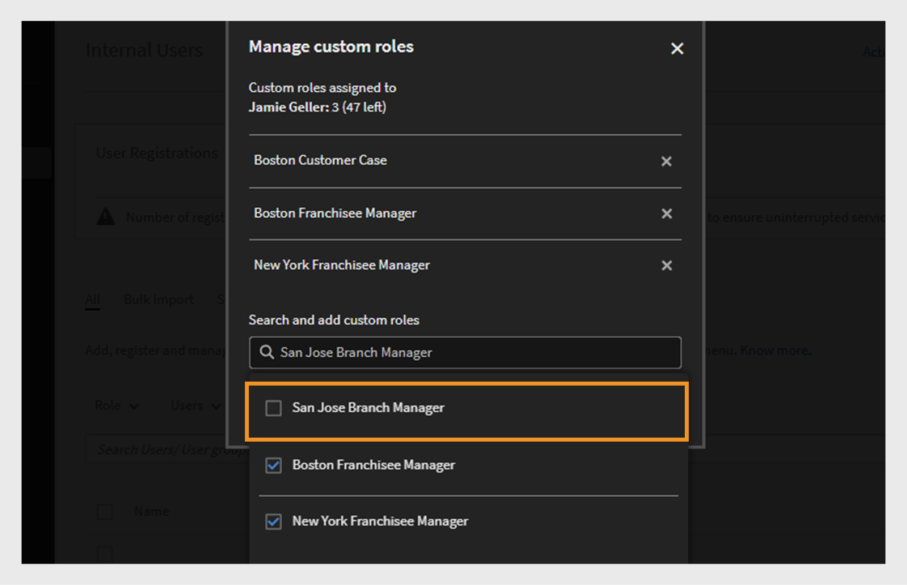
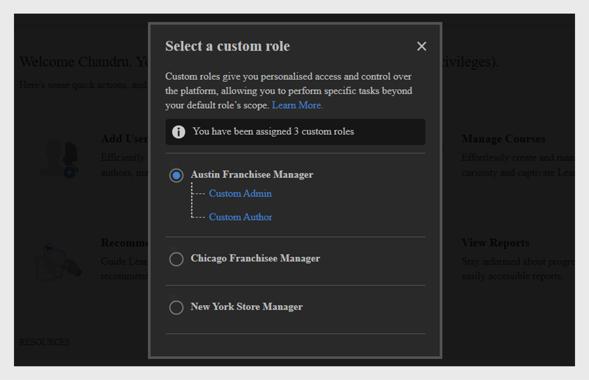

# Funciones personalizadas

Esta función le ayuda a definir funciones personalizadas y a asignar responsabilidades específicas a un conjunto de usuarios. Esta función le permite asignar responsabilidades fuera del ámbito de la función existente de la persona.

Puede crear una función personalizada para proporcionar capacidades de autoría limitadas a un catálogo en particular. También puede crear una función destinada a gestionar informes. Dichas funciones después pueden asignarse a las personas que, se supone, asumirán estas responsabilidades.

>[!NOTE]
>
>La adición de una nueva función personalizada no afectará a los grupos de usuarios personalizados existentes ni a ningún grupo basado en funciones, como Todos los administradores, Todos los autores, etc.

El administrador puede crear funciones de administrador y autor personalizadas con permisos personalizados para cada función. A continuación se muestra una descripción general de los permisos asociados a cada función:

**Permisos de función de autor personalizados**

Los autores personalizados pueden realizar las siguientes tareas:

* Accede a la biblioteca de contenido para añadir, editar o eliminar contenido principal.
* Crear, editar y eliminar:
   * Cursos
   * Ayudas de trabajo
   * Certificaciones
   * Rutas de aprendizaje
   * Planes de aprendizaje

Los administradores y autores, incluidos los administradores personalizados y los autores personalizados, podrán compartir objetos de aprendizaje (LO) en catálogos compartidos externamente. Los administradores y los autores deben poder buscar catálogos compartidos externamente al crear objetos de aprendizaje (LO).

**Permisos de funciones de administrador personalizadas**

La función de administrador personalizada replica un conjunto de responsabilidades de administración, incluido el acceso a los privilegios de nivel de cuenta. A los administradores personalizados se les conceden permisos para administrar las funciones clave relacionadas con las actividades de aprendizaje, como:

* Planes de aprendizaje
* Catálogos
* Informes
* Etiquetas

Además, los administradores personalizados pueden:

* Administrar cursos y ayudas de trabajo, incluida la inscripción y eliminación de usuarios.
* Cree, edite y elimine certificaciones, rutas de aprendizaje y planes de aprendizaje.
* Accede a las funciones de informes e inscripción para todos los objetos de aprendizaje (LO).

Ahora los administradores pueden ver los permisos creados mediante CSV en Adobe Learning Manager. La opción filtrar por filtra las funciones personalizadas por administrador creadas y las importadas mediante CSV. Después de seleccionar una función personalizada, puede ver sus permisos.

_Filtrar funciones personalizadas_

## Crear una función personalizada {#create-role}

1. Inicie sesión como administrador. Abra **[!UICONTROL Usuarios]** > **[!UICONTROL Función personalizada]**.
2. Seleccione **[!UICONTROL Crear rol]**. Se abre la ficha **[!UICONTROL Crear función]**.

   

   *Crear una función personalizada*

3. Escriba el nombre en el campo **[!UICONTROL Nombre del rol]**.
4. **[!UICONTROL Privilegios de cuenta]**: estos privilegios dan a los propietarios de roles acceso a aspectos específicos de la configuración del sistema y que actúan en toda la cuenta. Elija los permisos de acceso. El usuario tiene control total sobre los permisos asignados.

   Los administradores pueden conceder permisos detallados para la sección Usuario, que tiene usuarios internos/externos, grupos de usuarios y usuarios avanzados.

   >[!NOTE]
   >
   >   El ámbito no es aplicable a estos privilegios.

   

   *Establecer el ámbito*

5. **Privilegios de funciones - Funciones principales**: Se utiliza para conceder acceso a funciones específicas para administrar actividades de aprendizaje. Mediante esta opción se pueden otorgar permisos a las funciones siguientes.

   Los administradores pueden proporcionar permisos detallados, como permisos de solo lectura, de creación, de edición y de eliminación para los catálogos.

   * Catálogos
   * Informes
   * Etiquetas

   

   *Establecer ámbito para catálogos, informes y etiquetas*

6. **Privilegios de funciones: objetos de aprendizaje:** Utilice esta opción para proporcionar acceso a funciones relacionadas con objetos de aprendizaje. Los administradores pueden proporcionar permisos detallados para todos los objetos de aprendizaje, incluidos cursos, rutas de aprendizaje, certificaciones y ayudas de trabajo. Pueden asignar permisos a los usuarios como crear, editar, eliminar o acceso de solo lectura.

   * Certificaciones
   * Cursos
   * Ayudas de trabajo
   * Programas de aprendizaje

   También puede otorgar un control de operación específico para los objetos de aprendizaje. El permiso puede ser uno de los siguientes:

   * Solo lectura
   * Crear
   * Editar
   * Eliminar
   * Inscripción
   * Informe

   También puede otorgar control total a los objetos de aprendizaje.

   

   *Conceder permisos específicos*

7. **Ámbito de los privilegios de funciones:** El ámbito de los privilegios de funciones asignados a esta función se puede restringir a un grupo de usuarios específico o a uno o varios catálogos.

   Catálogos: utilice el botón de opción para proporcionar control sobre **[!UICONTROL Todos los catálogos]**; también puede utilizar la opción **[!UICONTROL Definir acceso por catálogo]** para conceder acceso a determinados catálogos. También puede seleccionar varios catálogos.

   Grupos de usuarios: proporcione acceso a **[!UICONTROL Todos los grupos de usuarios]**; también puede utilizar la opción **[!UICONTROL Definir acceso por grupo de usuarios]** a fin de otorgar acceso a determinados grupos de usuarios. Únicamente puede especificarse un grupo de usuarios.

   >[!NOTE]
   >
   >Si ha seleccionado Anuncio, Interacción, Plantillas de correo electrónico, Aptitudes y Usuarios en Privilegios de cuenta, el acceso a los grupos de usuarios se proporciona a todos los grupos de usuarios de forma predeterminada, y esta opción está desactivada.

   Si ya ha seleccionado Planes de aprendizaje en Privilegios de cuenta, el acceso a todos los catálogos y grupos de usuarios se proporciona de forma predeterminada y estas opciones de Ámbito están deshabilitadas.

   

   *Definir ámbito de privilegios*

>[!NOTE]
>
>   En Learning Manager 27.6, es posible crear una función personalizada con un ámbito que abarque varios catálogos, y que cada catálogo tenga asignado su propio conjunto de permisos.

Para conceder varios permisos a los catálogos, siga los pasos que se indican a continuación:

1. Haga clic en la opción **[!UICONTROL Definir acceso por catálogo]**.
1. Seleccione los catálogos y podrá ver el nivel de permiso de cada catálogo. Estos son los permisos:

   <table>
        <tbody>
        <tr>
          <td>
          
<b>Permiso</b>
</td>
          <td>
          
<b>Descripción</b>
</td>
        </tr>
        <tr>
          <td>
          
Control total
</td>
          <td>
          
Concede el control total de todos los objetos de aprendizaje. Los permisos son para añadir, editar, eliminar, leer, inscribir e informes. 
</td>
        </tr>
        <tr>
          <td>
          
Informe
</td>
          <td>
          
Otorga acceso a la pestaña Informes solo del objeto de aprendizaje.
</td>
        </tr>
        <tr>
          <td>
          
Inscribir
</td>
          <td>
          
Otorga permiso solo para inscribir para el objeto de aprendizaje.
</td>
        </tr>
        <tr>
          <td>
          
Solo lectura
</td>
          <td>
          
Otorga permiso solo para ver los objetos de aprendizaje del catálogo.
</td>
        </tr>
        </tbody>
      </table>

1. Active o desactive los permisos según necesite.
1. Para guardar los cambios, haga clic en **[!UICONTROL Aceptar]**. A continuación, para guardar los cambios de la función personalizada, haga clic en **[!UICONTROL Guardar]**.

Por ejemplo, podría darse el caso siguiente:

El permiso resultante que un usuario personalizado tiene sobre un objeto de aprendizaje es una combinación del permiso del objeto de aprendizaje y el permiso del catálogo.

Un usuario personalizado tiene permiso completo para cursos y de acceso de solo lectura para Catálogo A, y tiene permiso completo para Catálogo B. El resultado es el acceso de solo lectura en los cursos de Catálogo A y el control total en los cursos de Catálogo B.

Un usuario con una función personalizada puede:

* Ver contenido solo de los catálogos a los que tiene acceso.
* Tener acceso a cualquier objeto de aprendizaje conforme a los permisos del catálogo del que forma parte el objeto de aprendizaje.

  Como administrador, puede:

* Seleccionar más de un catálogo para una función personalizada.
* Modificar los permisos de un catálogo en cualquier momento.
* Eliminar los catálogos de un ámbito para el que ya no desea conceder permisos.
* Otorgar implícitamente el permiso de solo lectura para un catálogo al otorgar permisos al catálogo.

  En la tabla siguiente, se muestra cómo se otorgan permisos.

  <table>
    <tbody>
     <tr>
      <td>
       
<strong> </strong>
</td>
      <td>
       
<strong>Permiso de nivel de catálogo</strong>
</td>
     </tr>
     <tr>
      <td>
       
<strong>Permiso de nivel de objeto de aprendizaje</strong>

       
<strong>(Ejemplo: Cursos)</strong>
</td>
      <td>
       
Control total
</td>
      <td>
       
Inscribir
</td>
      <td>
       
Informe
</td>
      <td>
       
Solo lectura
</td>
     </tr>
     <tr>
      <td>
       
Control total
</td>
      <td>
       
Control total
</td>
      <td>
       
Inscribir
</td>
      <td>
       
Informe
</td>
      <td>
       
Solo lectura
</td>
     </tr>
     <tr>
      <td>
       
Inscribir
</td>
      <td>
       
Inscribir
</td>
      <td>
       
Inscribir
</td>
      <td>
       
Solo lectura
</td>
      <td>
       
Solo lectura
</td>
     </tr>
     <tr>
      <td>
       
Editar y eliminar
</td>
      <td>
       
Editar y eliminar
</td>
      <td>
       
Solo lectura
</td>
      <td>
       
Solo lectura
</td>
      <td>
       
Solo lectura
</td>
     </tr>
     <tr>
      <td>
       
Informe
</td>
      <td>
       
Informe
</td>
      <td>
       
Solo lectura
</td>
      <td>
       
Informe
</td>
      <td>
       
Solo lectura
</td>
     </tr>
    </tbody>
   </table>

1. **Usuarios:** utilice esta opción para determinar los usuarios a los que se asigna esta función. Puede elegir uno o varios usuarios mediante el cuadro de búsqueda.

   **Agregar usuarios a la carga de CSV de funciones personalizadas:** Para agregar usuarios mediante la carga de CSV, agregue una columna CustomRole al archivo .csv que el administrador usó para importar usuarios. Introduzca la función del usuario en la columna Función personalizada para los usuarios a los que desea asignar una función personalizada. Para cargar el archivo CSV, haga clic en **[!UICONTROL Agregar > Cargar un CSV]**.

   * No puede buscar grupos de usuarios
   * No puede buscar usuarios que ya tengan asignada la función de administrador.
   * La asignación de una nueva función personalizada a un usuario anula la función personalizada anterior del usuario.

   <!---->

   * Un administrador personalizado con permiso en Configuración podrá configurar la programación para sincronizar o sincronizar usuarios desde la fuente de datos aunque no tenga permiso para la entidad Usuarios.
   * Si un administrador personalizado tiene permiso en la entidad Usuarios, los usuarios se pueden asignar a sí mismos la función de administrador y convertirse en administradores estándar.

## Asignar varias funciones personalizadas a un usuario

Puede asignar varias funciones personalizadas a los usuarios de las siguientes maneras:

* Uso de la interfaz de usuario: puede asignar más de una función personalizada a un usuario directamente desde la interfaz de Adobe Learning Manager.
* Mediante la carga de CSV: puede cargar un archivo CSV para asignar varias funciones personalizadas a varios usuarios a la vez.

Esto facilita la administración del acceso de los usuarios y los permisos de control en todo el sistema.

### Asignar varias funciones personalizadas mediante la interfaz de usuario

La asignación de varias funciones personalizadas a través del Admin Console en Adobe Learning Manager es una opción rápida e intuitiva, ideal para la incorporación, los ajustes de permisos o las actualizaciones más pequeñas. Las funciones se pueden asignar visualmente, sin necesidad de cargar archivos CSV, lo que reduce el riesgo de errores y proporciona visibilidad en tiempo real. Este método admite actualizaciones rápidas a medida que cambian las responsabilidades y permite el cambio de funciones y la delegación según sea necesario.

Para asignar varias funciones personalizadas a un usuario, siga estos pasos:

1. Inicie sesión como administrador y seleccione **[!UICONTROL Usuarios]**.
2. Seleccione **[!UICONTROL Funciones personalizadas]** en el panel izquierdo.
3. Cree una nueva función personalizada y agregue privilegios de cuenta, catálogos, objetos de aprendizaje o ámbitos. Consulte los pasos que se indican [aquí](#create-a-custom-role).
4. Agregar usuarios a la función personalizada.

   
   _Asignar usuarios a una función personalizada_

5. Seleccione **[!UICONTROL Guardar]**.

Seleccione varias funciones personalizadas para un usuario según sea necesario. Cada usuario puede tener hasta 50 asignaciones de funciones personalizadas. El número de funciones disponibles disminuye con cada asignación.

Después de asignar usuarios a una función personalizada adicional, puede ver cuántas asignaciones de funciones quedan disponibles para cada usuario.

>[!NOTE]
>
>Puede asignar hasta 50 funciones a cada usuario y añadir hasta 500 usuarios a cada función.

### Asignar varias funciones personalizadas mediante CSV

La carga de un archivo CSV en Adobe Learning Manager permite la asignación eficiente de funciones personalizadas en bloque. Este proceso resulta especialmente beneficioso para incorporar a un gran número de empleados, reorganizar los equipos o actualizar el acceso a la nueva formación. Las importaciones de CSV ahorran esfuerzo manual, garantizan asignaciones uniformes y reducen errores. Este método resulta especialmente útil durante fusiones, actualizaciones de todo el departamento o despliegues globales de formación. Este método ayuda a los administradores a ahorrar tiempo, estandarizar funciones y mantener la gobernanza.

Ahora puede asignar varias funciones a un usuario mediante la importación de CSV cargando dos archivos en Box:

* role.csv
* user_role.csv.

El archivo user_role.csv incluye los campos Función personalizada e ID de usuario.

El archivo role.csv incluye los campos, Función personalizada, Origen de la creación e información detallada para catálogos, usuarios, cursos, rutas de aprendizaje, etc.

Si el archivo CSV tiene datos incorrectos o supera los límites (50 funciones por usuario y 500 usuarios por función), aparecerá un mensaje que muestra los errores.

_Notificación de error para funciones personalizadas_
Los usuarios reciben notificaciones por correo electrónico cuando se asignan funciones, incluido el nombre de la función.

### Administrar funciones personalizadas

Los administradores pueden actualizar, añadir o eliminar funciones personalizadas para los usuarios de Adobe Learning Manager a medida que cambian las responsabilidades. Esto garantiza que el acceso se alinea con las funciones actuales sin que esto afecte al historial de aprendizaje o los datos de inscripción. Desde la página **[!UICONTROL Usuarios]**, el administrador puede buscar usuarios, ver sus funciones y ajustarlos mediante la opción Administrar funciones personalizadas. Esta interfaz guiada permite añadir o quitar funciones fácilmente, al tiempo que mantiene la gobernanza y la seguridad.

>[!NOTE]
>
>Los administradores personalizados no pueden administrar funciones personalizadas (agregar o quitar funciones personalizadas) ni ascender a la función de administrador.

Después de asignar funciones personalizadas a los usuarios, puede agregar o quitar funciones personalizadas de la página **[!UICONTROL Usuarios]**.

1. Busque un usuario en la página **[!UICONTROL Usuarios]**.

   
   _Buscar un usuario en la página Usuarios_

2. Seleccione la flecha desplegable al final de la fila donde se muestra el nombre de usuario y, a continuación, seleccione **[!UICONTROL Administrar funciones personalizadas]**.

   
   _Seleccione Administrar funciones personalizadas en la página de usuario_

3. Aparece un cuadro de diálogo que muestra la lista de funciones personalizadas asignadas al usuario. Seleccione **[!UICONTROL Agregar o quitar roles]** para agregar o quitar roles personalizados asignados al usuario.

   
   _Seleccione Agregar o quitar funciones en el aviso Administrar funciones personalizadas_

4. Busque otras funciones personalizadas que se vayan a asignar al usuario. Después de buscar una, seleccione la función personalizada.

   
   _Seleccionar la función personalizada_

5. Seleccione **[!UICONTROL Guardar]**. Aparece un cuadro de diálogo de confirmación para el cambio en la función personalizada. Seleccione **[!UICONTROL Sí]**.

   
   _Seleccione Sí en el mensaje de confirmación_

Se asigna una tercera función personalizada al usuario.

Para eliminar las funciones personalizadas, siga estos pasos:

1. Busque un usuario en la página **[!UICONTROL Usuarios]**.
2. Seleccione el menú desplegable cerca del usuario y seleccione **[!UICONTROL Administrar funciones personalizadas]**.
3. Seleccione **[!UICONTROL Agregar o quitar roles]** para agregar o quitar roles personalizados.
4. Seleccione el **[!UICONTROL icono de eliminación]** para eliminar la función personalizada.

   
   _Quitar funciones personalizadas_

### Cambiar funciones personalizadas

Para ver y seleccionar cualquier función personalizada que tenga asignada, use la opción **[!UICONTROL Cambiar función personalizada]**.

_Seleccionar funciones personalizadas_

Los usuarios reciben notificaciones por correo electrónico cuando se les asignan las funciones personalizadas. Los correos electrónicos ahora incluyen nombres de funciones para una mayor claridad.

## Descargar el informe de funciones personalizadas

Los administradores pueden descargar un informe CSV que enumere todas las funciones personalizadas y sus permisos asociados. El informe indica si cada función se ha creado manualmente o mediante carga de CSV y proporciona un resumen del acceso y los privilegios asignados a cada función.

Para descargar el informe, siga estos pasos:

1. Inicie sesión como **[!UICONTROL administrador]**.
2. Seleccione **[!UICONTROL Usuarios]** > **[!UICONTROL Funciones personalizadas]**.
3. Seleccione la opción **[!UICONTROL Descargar]** para descargar el informe CSV.

_Descargar informe de funciones personalizadas_

El informe tiene dos archivos CSV: role.csv y user_role.csv. El archivo role.csv incluye:

* Función personalizada
* ID de usuario
* Fuente de creación.

El archivo user_role.csv incluye los campos Función personalizada, Origen de la creación e información detallada para catálogos, usuarios, cursos, rutas de aprendizaje, etc.

## Seguimiento de auditoría para funciones personalizadas

Los administradores pueden descargar el informe de auditoría de funciones personalizadas para realizar un seguimiento de todos los cambios realizados en las funciones personalizadas, incluida la creación, modificación y eliminación de funciones personalizadas y su acceso a funciones asociado.

Consulte este artículo [Seguimiento de auditoría de funciones personalizadas](/help/migrated/administrators/feature-summary/reports.md#audit-trail-for-custom-roles) para obtener más información.

## Restringir el acceso a las carpetas a los autores personalizados {#folder-custom-author}

Learning Manager ya admite la posibilidad de conceder acceso a la biblioteca de contenido mediante funciones personalizadas. Todos los autores personalizados que ya tengan acceso a la biblioteca de contenido seguirán teniendo acceso a todos los archivos de contenido incluso después de configurar las carpetas de contenido. Esto es para mantener el comportamiento heredado. Los administradores no necesitan realizar ningún cambio en caso de que deseen continuar con el comportamiento actual.

En caso de que deseen restringir el acceso a estos autores personalizados, los administradores deben editar la función personalizada existente y configurarla proporcionando acceso solo a carpetas de contenido específicas.

*Restringir el acceso a las carpetas a los autores personalizados*

Al crear un autor personalizado, ahora puede asignarle carpetas de contenido. Elija la opción **Carpetas seleccionadas**.

Después de hacer clic en la opción, se abre un nuevo cuadro de diálogo en el que puede asignar las carpetas al autor personalizado.

*Seleccionar las carpetas del autor personalizado*

Elija las carpetas y haga clic en **[!UICONTROL Aceptar]**.

## Tablero de resumen de aprendizaje para administrador personalizado {#custom-admin-dashboard}

Los administradores personalizados pueden ver la misma vista que un administrador. Un administrador personalizado puede tener datos fuera de su ámbito. Esto solo es aplicable si el administrador personalizado tiene ámbito completo. Para conceder el ámbito completo, al crear un administrador personalizado, habilite la opción **[!UICONTROL Control total]** en el informe de resumen de cuenta.

*Crear una función personalizada*

Como resultado, se seleccionarán las opciones **[!UICONTROL Todos los catálogos]** y **[!UICONTROL Todos los grupos de usuarios]** y se deshabilitará el resto.

*Definir ámbito de privilegios*

## Permisos implícitos {#implicitpermissions}

Cuando a un usuario se le asigna una función con una entidad específica, puede haber casos en los que también necesite acceso a otras entidades para poder realizar tareas en la entidad concedida. Por ejemplo, si se concede a un usuario el acceso Crear en la entidad Curso, este necesita acceder a las entidades Aptitud y Etiqueta para poder asociarlas al curso que se está creando. Esta tabla proporciona información sobre estos permisos implícitos.

<table>
 <tbody>
  <tr>
   <th>Tipo de acceso</th>
   <th>Permiso de entidad otorgado por el administrador</th>
   <th>Permiso implícito de entidad</th>
   <th>Acceso implícito</th>
  </tr>
  <tr>
   <td>Gestionar</td>
   <td>Usuario</td>
   <td>Grupo</td>
   <td>CRUD</td>
  </tr>
  <tr>
   <td>Inscribir</td>
   <td>Todos los objetos de aprendizaje (curso, ayuda de trabajo, programa de aprendizaje, certificación)</td>
   <td>Usuario 
     Plan de aprendizaje</td>
   <td>Leer</td>
  </tr>
  <tr>
   <td>Crear</td>
   <td>
    
Grupo de contenido 
      Ayuda de trabajo 
</td>
   <td>Etiqueta</td>
   <td>Leer</td>
  </tr>
  <tr>
   <td>Crear</td>
   <td>Curso</td>
   <td>Grupo de contenido 
     Etiqueta 
     Aptitud 
     Insignia 
     Ayuda de trabajo</td>
   <td>Leer en todos</td>
  </tr>
  <tr>
   <td>Crear</td>
   <td>Programa de aprendizaje 
     Certificación </td>
   <td>Curso 
     Etiqueta 
     Aptitud 
     Insignia</td>
   <td>Leer</td>
  </tr>
  <tr>
   <td>Crear</td>
   <td>Plan de aprendizaje</td>
   <td>Catálogo 
     Grupo 
     Aptitud 
     Todos los objetos de aprendizaje (curso, ayuda de trabajo, programa de aprendizaje, certificación)</td>
   <td>Leer</td>
  </tr>
  <tr>
   <td>Crear</td>
   <td>Anuncio</td>
   <td>Usuario 
     Grupo 
     Todos los objetos de aprendizaje (curso, ayuda de trabajo, programa de aprendizaje, certificación)</td>
   <td>Leer</td>
  </tr>
  <tr>
   <td>Crear</td>
   <td>Interacción</td>
   <td>Marca</td>
   <td>Escribir</td>
  </tr>
  <tr>
   <td>*</td>
   <td>Usuario</td>
   <td>Facturación</td>
   <td>Leer</td>
  </tr>
  <tr>
   <td>*</td>
   <td>Catálogo</td>
   <td>Grupo 
     Todos los objetos de aprendizaje (curso, ayuda de trabajo, programa de aprendizaje, certificación)</td>
   <td>Leer</td>
  </tr>
  <tr>
   <td>*</td>
   <td>Configuración</td>
   <td>Marca 
     Usuario</td>
   <td>Leer</td>
  </tr>
  <tr>
   <td>*</td>
   <td>Marca</td>
   <td>Configuración</td>
   <td>Leer</td>
  </tr>
  <tr>
   <td>*</td>
   <td>Facturación 
     Interacción</td>
   <td>Usuario</td>
   <td>Leer</td>
  </tr>
 </tbody>
</table>

## Acceder a una función personalizada {#accessacustomrole}

Cuando un administrador asigna una función personalizada, se recibe una notificación por correo electrónico.

Nota: Si ya ha iniciado sesión en Learning Manager con una función personalizada, deberá volver a iniciar sesión en Learning Manager para acceder a la función nueva.

Para alternar entre funciones, haga clic en el icono de su perfil en la esquina superior derecha de Learning Manager; a continuación, seleccione la función.

## Planes de aprendizaje definidos por funciones configurables {#scopeconfigure}

En versiones anteriores de Learning Manager, cualquier función personalizada con permiso para crear planes de objetos de aprendizaje podía definir el ámbito del plan de aprendizaje para todos los tipos de grupos de usuarios y objetos de aprendizaje

La configuración del ámbito solía estar desactivada cuando se concedía acceso al plan de aprendizaje, lo que de forma predeterminada proporcionaba al usuario acceso a todos los catálogos y grupos de usuarios.

Todos los planes de aprendizaje creados por un administrador se aplican de forma predeterminada a todos los usuarios. También se puede asignar cualquier objeto de aprendizaje a los usuarios. Por otro lado, los usuarios con funciones personalizadas tienen acceso a todos los ámbitos, por ejemplo todos los catálogos, objetos de aprendizaje o grupos de usuarios. Esto significaba que los administradores no podían crear funciones personalizadas de la forma prevista que permitieran el acceso a planes de aprendizaje a usuarios con un ámbito limitado.

En esta actualización de Learning Manager, puede crear funciones personalizadas para planes de aprendizaje que permiten definir el ámbito de usuarios y objetos de aprendizaje. En otras palabras, los Planes de aprendizaje se pueden crear con un ámbito limitado que se deriva del ámbito de la función de un administrador personalizado.

Ahora, un administrador puede definir o restringir el ámbito mientras otorga acceso a la administración del plan de aprendizaje.

Los administradores personalizados pueden crear planes de aprendizaje con un ámbito limitado, determinado por el ámbito de la función configurable del administrador personalizado. Solo pueden acceder a estos planes de aprendizaje los administradores personalizados con la misma función, además de los administradores regulares. Además, los administradores personalizados no pueden ver ningún otro plan de aprendizaje en la cuenta.

Los administradores personalizados existentes que tengan acceso a planes de aprendizaje siempre tendrán ámbito completo (por definición). Tendrán acceso a todos los planes de aprendizaje de la cuenta, al igual que un administrador normal. Las nuevas funciones personalizadas creadas con ámbito completo y los nuevos administradores personalizados añadidos a dichas funciones seguirán teniendo acceso a todos los planes de aprendizaje.

Los planes de aprendizaje creados por el administrador y los administradores personalizados de ámbito completo se crearán de la forma habitual y no estarán limitados por el ámbito.

En la sección **Ámbito de los privilegios de funciones**, conceda acceso a grupos de usuarios y a catálogo para la función personalizada.

*Conceder acceso a grupos de usuarios o a catálogos para la función personalizada*

Asigne un usuario a la función personalizada.

*Asignar un usuario a una función personalizada*

El usuario ahora inicia sesión en Learning Manager como administrador personalizado y añade un plan de aprendizaje.

Cuando se añade un nuevo alumno, el administrador personalizado puede seleccionar un curso de formación únicamente en los catálogos del ámbito de la función configurable.

Este plan de aprendizaje ahora se aplica al alumno solo si el usuario también se añade al grupo dentro del grupo de usuarios del ámbito del plan de aprendizaje. Todos los demás alumnos quedan exentos de este plan de aprendizaje.

## Se añade el alumno al grupo {#learnergetsaddedtothegroup}

<!---->

El administrador personalizado puede seleccionar cualquier grupo de usuarios que tenga usuarios dentro del grupo de usuarios del ámbito de la función.

Cuando un usuario se añade a un determinado grupo, solo los usuarios que ya forman parte del grupo de usuarios del ámbito del plan de aprendizaje y que se añadieron al grupo de usuarios especificado se asignarán al objeto de aprendizaje.

## Cambio de ámbito {#changeinscope}

Cuando el administrador cambia el ámbito de la función personalizada, el cambio también se aplica en cascada al administrador personalizado. Cuando el administrador personalizado elige un plan de aprendizaje que ya tenía el ámbito de una función personalizada anterior, se muestra un mensaje como el siguiente:

*Mensaje después de que cambie el ámbito*

El administrador personalizado ahora debe actualizar o actualizar el ámbito anterior al nuevo ámbito.

Si se hace clic en **[!UICONTROL Actualizar ámbito]**, el ámbito se actualiza. Se muestra un mensaje de advertencia.

*Mensaje de advertencia después de actualizar un ámbito*

Si se hace clic en **[!UICONTROL Sí]**, el ámbito se actualiza.

## Añadir informe de interacción a una función personalizada {#gamification-custom}

Un administrador puede activar los informes de interacción para un usuario personalizado.

1. En la página **[!UICONTROL Funciones personalizadas]**, escriba el nombre de la función personalizada.
1. En la sección **[!UICONTROL Privilegios de características principales: características principales]**, habilite la opción **[!UICONTROL Control total]** para la categoría **[!UICONTROL Informes]**.

1. En la sección **[!UICONTROL Usuarios]**, seleccione el usuario al que se asignará la función personalizada que se acaba de crear.
1. Haga clic en **[!UICONTROL Guardar]**.

Cuando un usuario inicia sesión como administrador personalizado y hace clic en **[!UICONTROL Informes]** en el panel izquierdo, aparecen las transcripciones, como se muestra a continuación:

*Descargar las transcripciones de interacciones*

Haga clic en **[!UICONTROL Transcripciones de interacciones]**, elija un usuario y genere el informe.

Si un administrador cambia los puntos de nivel, los informes muestran niveles de acuerdo con los puntos actuales.

El restablecimiento de la interacción no restablece la fecha de nivel alcanzado.

## Preguntas más frecuentes {#frequentlyaskedquestions}

+++Cómo crear una función personalizada

Una función personalizada es como un subconjunto de la función de autor o administrador. Permitir uno o varios privilegios, definir el ámbito y asignar la función a un usuario.

Haga clic en **[!UICONTROL Usuarios]** > **[!UICONTROL Funciones personalizadas]**. En la página Roles personalizados, haga clic en **[!UICONTROL Crear función]**. Introduzca el nombre de la función personalizada y establezca los privilegios de la función. Para obtener más información, consulte [Creación de una cuenta personalizada](custom-role.md#create-role).
+++

