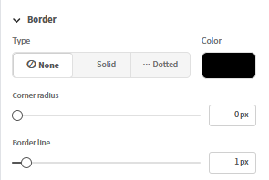
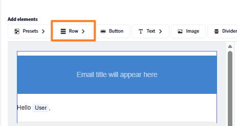
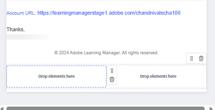
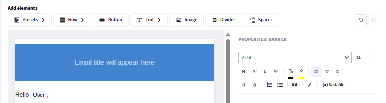
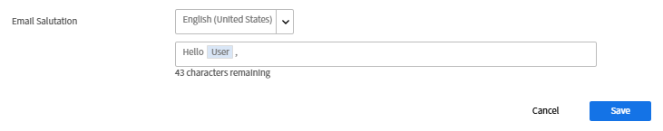
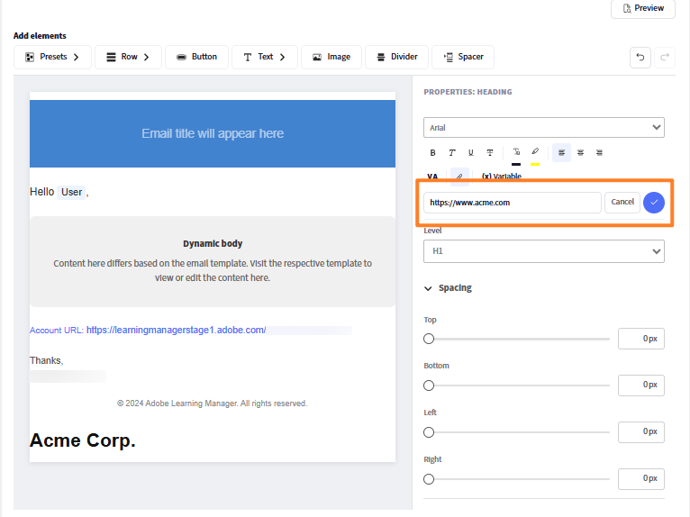
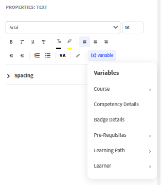
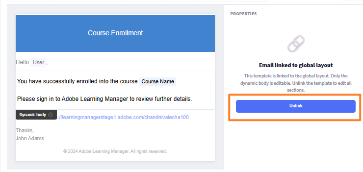

## Generador de correo electrónico basado en componentes

Adobe Learning Manager incluye un generador de correo electrónico basado en componentes que permite a los administradores y autores crear correos electrónicos de nivel empresarial y totalmente de marca mediante un editor visual moderno, sin necesidad de escribir un HTML. Todos los correos electrónicos que envía tu organización, desde las confirmaciones de inscripción hasta los recordatorios de sesiones, pueden reflejar con precisión la apariencia de tu marca.

**Para administradores:** Diseña un diseño global una vez*, un encabezado y pie de página reutilizable que ajuste cada correo electrónico automáticamente y, a continuación, personaliza plantillas individuales según sea necesario. Redacte correos electrónicos en un editor de arrastrar y soltar en línea utilizando componentes enriquecidos: texto con formato de texto enriquecido completo, imágenes, banners, botones, vínculos de redes sociales, divisores y mucho más.

**Para autores:** Aplique las mismas funciones del editor a los correos electrónicos con ámbito para cursos e instancias específicos, de modo que las comunicaciones de formación se puedan adaptar a cada experiencia de aprendizaje sin que esto afecte a la configuración de toda la cuenta.

El generador admite un modelo jerárquico: se puede configurar la misma plantilla de correo electrónico en el nivel de instancia, curso o cuenta. Cuando una plantilla no se ha editado individualmente, hereda automáticamente la configuración de su nivel primario. Cuando necesite un diseño completamente personalizado, desvincule la plantilla y tome el control completo. Una vista previa integrada le permite comprobar exactamente cómo aparecerá un correo electrónico en las bandejas de entrada de los destinatarios antes de que se envíe.

## Cómo funciona el sistema de plantillas de correo electrónico

Cada correo electrónico saliente en Adobe Learning Manager se compone de tres partes estructurales:

* **Encabezado:** la imagen o el color del banner y el nombre de la organización
* **Cuerpo:** la zona de contenido dinámico exclusiva para cada tipo de correo electrónico; contiene el texto del mensaje y los marcadores de posición de variable
* **Pie de página:** la dirección URL de la cuenta, la firma del correo electrónico, el vínculo de ayuda y otros elementos

El **diseño global** es el diseño principal aplicado a más de 130 plantillas de correo electrónico simultáneamente. Al actualizar el diseño global, cada plantilla que siga vinculada a él reflejará el cambio automáticamente. Las plantillas se pueden desvincular del diseño global en cualquier momento para una personalización independiente.

### La jerarquía de correo electrónico

La configuración y el diseño fluyen desde un nivel superior a niveles inferiores a través de la herencia. Cada nivel puede anular o personalizar completamente lo que hereda.

| Nivel | Quién lo configura | Estado predeterminado | Qué se puede editar |
| --- | --- | --- | --- |
| **Diseño global** | Administrador | Raíz; sin padre | Diseño completo: todas las piezas, todos los componentes |
| **Plantilla de correo electrónico de cuenta** | Administrador | Vinculado a diseño global | Solo cuerpo (vinculado); diseño completo (sin vincular) |
| **Diseño de objeto de aprendizaje de autor** | Autor | Vinculado a plantilla de cuenta | Diseño completo en el ámbito LO |
| **Autor: plantilla de correo electrónico de objeto de aprendizaje** | Autor | Vinculado al diseño de objetos de aprendizaje | Solo cuerpo (vinculado); diseño completo (sin vincular) |
| **Autor: plantilla de correo electrónico de instancia** | Autor | Vinculado a la plantilla de objeto de aprendizaje | Solo cuerpo (vinculado); diseño completo (sin vincular) |

### Reglas principales de herencia

* Cada nivel comienza vinculado a su nivel principal inmediato hasta que se modifique explícitamente.
* La edición del **cuerpo** de una plantilla no la desvincula. El encabezado y el pie de página siguen reflejando el elemento principal.
* Al editar el **diseño** o seleccionar **Desvincular**, se rompe la conexión principal solo para esa plantilla.
* **Volver al original** vuelve a vincular la plantilla a su elemento principal y restablece el diseño y el cuerpo a la versión principal.
* La desvinculación en un nivel no tiene efecto en los niveles superiores o inferiores a él.

## Configurar el diseño global

El diseño global define el encabezado, el pie de página y el contenedor estructural compartidos que se incluyen en todos los correos electrónicos vinculados. Configúrelo primero para que todas las plantillas comiencen con una construcción de marca coherente.

### Abra el Editor de diseño global

1. Inicie sesión en Adobe Learning Manager como administrador.
2. En la barra de navegación izquierda, seleccione **Plantillas de correo electrónico**.
3. Seleccione la ficha **Diseño global**.

   El lienzo del editor se carga con el diseño global actual. La zona **Dynamic Body**, que se muestra como marcador de posición en el centro, representa el área en la que aparece el contenido de mensaje único de cada plantilla. No se puede editar el cuerpo dinámico desde el diseño global.

   

### Configurar el contenedor de correo electrónico

El contenedor de correo electrónico es el contenedor más externo de todos los correos electrónicos. Su configuración afecta al marco visual que rodea todo el contenido.

1. Seleccione **Editar** cerca de **Diseño global de correo electrónico**
2. Seleccione el contenedor de correo electrónico en el lienzo.
3. En el panel **Propiedades** de la derecha, establezca:
   * **Color de fondo:** el color detrás de todo el contenido del correo electrónico

   

   * **Borde:** estilo, ancho y color del borde exterior

   

   * **Espaciado:** relleno alrededor de las direcciones del contenido del correo electrónico

   

   * **Espaciado entre filas:** el espacio vertical aplicado entre todas las filas del diseño

   

### Trabajar con filas y columnas

Todo el contenido del editor de correo electrónico se coloca dentro de **filas**. Cada fila contiene una o más **columnas**, y cada columna contiene uno o más **componentes**.

Para añadir una fila:

1. Seleccione **Fila** en la parte superior del lienzo.

   

2. Seleccione un diseño de columna: **1 columna**, **2 columnas**, **3 columnas** o **4 columnas**.

   

   La nueva fila aparece en el lienzo lista para los componentes.

Para configurar una fila:

1. Seleccione la fila en el lienzo.

   

2. En el panel **Propiedades**, establezca:
   * **Color de fondo:** fondo de nivel de fila, anula el color del contenedor de esta fila
   * **Borde:** estilo, ancho y color de borde de fila
   * **Espaciado:** espacio horizontal entre las columnas de esta fila

   

**Para reordenar filas:**

* Arrastre cualquier fila por su controlador (que se muestra al pasar el borde izquierdo por encima) para moverla hacia arriba o hacia abajo.

**Para eliminar una fila:**

* Seleccione la fila y seleccione el icono **Delete** en la barra de herramientas de la fila.

### Agregar y organizar componentes

Los componentes son bloques de creación de contenido de correo electrónico. Arrástralos desde el panel **Componentes** en la parte superior y suéltalos en cualquier celda de columna. Use el panel **Propiedades** de la izquierda para personalizar el componente seleccionado.

Al arrastrar y soltar un componente, un indicador &quot;+&quot; azul muestra dónde se puede colocar el componente.

**Para agregar un componente:**

1. En el panel de componentes, localice el componente que desee.

   

2. Arrástrela a una celda de columna del lienzo.

   

3. El componente se agrega a esa celda. Selecciónelo para abrir sus propiedades en el panel derecho.

   

**Para mover un componente:**

* Arrastre el componente por su controlador a una posición de columna o fila diferente.

**Para eliminar un componente:**

* Seleccione el componente y seleccione el icono **Delete** en la barra de herramientas del componente.

### Editar componentes preestablecidos

El **diseño global** incluye componentes preestablecidos integrados que corresponden a los campos compartidos configurados en la configuración de correo electrónico. Los componentes preestablecidos se pueden editar directamente en el lienzo o eliminar por completo.

| Componente de ajustes preestablecidos | Contenido predeterminado | ¿Se puede quitar? |
| --- | --- | --- |
| **Banner** | Imagen o color del banner predeterminado | Sí |
| **Saludo** | &quot;Hola, {{user}}&quot; | Sí |
| **Cuerpo dinámico** | Marcador de posición para contenido por plantilla | No, obligatorio |
| **URL de cuenta** | URL de plataforma de su cuenta | Sí |
| **Firma** | El texto de firma configurado | Sí |

**Para editar un componente preestablecido:**

1. Añada el componente de ajuste preestablecido, por ejemplo, banner.

   

2. Seleccione el banner en el lienzo.
3. En el panel **Propiedades**, cambie la fuente, el tamaño de fuente y otras propiedades visuales del titular y.

   

**Para quitar un componente preestablecido de todos los mensajes de correo electrónico:**

1. Seleccione el componente preestablecido en el lienzo.
2. Seleccione **Eliminar** en la barra de herramientas del componente.

Al eliminar un componente preestablecido del diseño global, se elimina de todos los correos electrónicos vinculados. Las plantillas no vinculadas conservan el componente hasta que se elimina manualmente de cada una.

### Guardar el diseño global

Seleccione **Guardar** cuando se complete el diseño. El diseño actualizado se aplica inmediatamente a todas las plantillas de correo electrónico que aún están vinculadas al diseño global.

## Configurar ajustes preestablecidos globales de correo electrónico

Define elementos comunes como el banner, el saludo y la firma para reutilizarlos en tus correos electrónicos. Se pueden utilizar en el diseño global o en plantillas de correo electrónico individuales basadas en eventos dentro de Adobe Learning Manager. Los cambios realizados aquí se reflejan automáticamente siempre que se utilicen estos ajustes preestablecidos. También puede optar por anular estos ajustes preestablecidos y diseñar elementos personalizados directamente en el generador de correo electrónico.

Configure lo siguiente:

### Banner de correo electrónico

1. Seleccione **Editar** junto a **Banner de correo electrónico.**
2. Cargue una imagen de titular o defina un color de fondo sólido.

   

3. Seleccione **Guardar.**

### Saludo del correo electrónico

1. Seleccione **Editar** junto a **Saludo por correo electrónico**
2. El valor predeterminado es &quot;Hello {{user}}&quot;: la variable {{user}} se rellena con el nombre del destinatario en tiempo de ejecución.

   

3. Modifique el texto del saludo o elimínelo por completo.
4. Seleccione **Guardar**.

### URL de cuenta

1. Seleccione **Editar** junto a **URL de cuenta.**
2. Introduzca la URL de su plataforma de aprendizaje; aparece en todos los correos electrónicos salientes.

   

3. Seleccione **Guardar**.

### Firma de correo electrónico

1. Seleccione **Editar** junto a **Firma por correo electrónico**
2. Escriba el texto de cierre.

   

3. Seleccione **Guardar**.

## Agregar y configurar componentes individuales

### Componente de texto

El componente de texto admite la edición completa de texto enriquecido.

1. Arrastre un componente **Text** a una celda de columna.
2. Selecciónelo para entrar en el modo de edición.

   

3. Escriba o pegue el contenido.
4. Aplique las siguientes opciones de formato:
   * **Fuente:** selecciona entre fuentes seguras para la web (Arial, Helvetica, Georgia y otras) o fuentes personalizadas configuradas para tu cuenta
   * **Tamaño:** tamaño de fuente en puntos
   * **Negrita**, **Cursiva**, **Subrayado**, **Tachado**
   * **Superíndice** y **Subíndice**
   * **Color del texto** y **Color de fondo** (resaltado de texto)
   * **Alineación:** izquierda, central, derecha o justificar
   * **Interlineado:** multiplicador de altura de línea
   * **Relleno horizontal y vertical:** espaciado interno dentro del bloque de texto
5. Para agregar un hipervínculo:
   * Seleccione el texto que desea vincular
   * Seleccione el icono **Vínculo** en la barra de herramientas
   * Introduzca la URL de destino

   

6. Seleccione **Aplicar**

### Componente de imagen

1. Arrastre un componente **Image** a una celda de columna.
2. Selecciona **Cargar** para cargar un nuevo archivo de imagen (compatible con el JPEG y el GIF) o selecciona **Examinar** para elegir una imagen de tu biblioteca.
3. Con la imagen seleccionada, configure:

   

   * **Cambiar imagen:** Carga una nueva imagen o reemplaza la imagen seleccionada actualmente.
   * **URL de imagen:** Especifica la dirección URL de origen de la imagen que se va a mostrar. La imagen se carga desde esta ubicación.
   * **Vínculo:** Agrega un hipervínculo en el que se puede hacer clic a la imagen. Se redirige a los usuarios a la dirección URL especificada al hacer clic en la imagen.
   * **Tipo de borde:** Define el estilo del borde de la imagen. Las opciones disponibles son Ninguno, Sólido y Punto.
   * **Color de borde:** Establece el color del borde de la imagen cuando se aplica un estilo de borde.
   * **Radio de vértice:** Controla la redondez de los vértices de la imagen. Los valores más altos crean esquinas más redondeadas.
   * **Línea de borde:** Ajusta el grosor (ancho) del borde de la imagen.
   * **Espaciado superior:** Agrega espacio encima de la imagen.
   * **Espaciado inferior:** Agrega espacio debajo de la imagen.
   * **Espaciado izquierdo:** Agrega espacio al lado izquierdo de la imagen.
   * **Espaciado derecho:** Agrega espacio al lado derecho de la imagen.
   * **Alineación horizontal:** Determina la posición de la imagen dentro de su contenedor. Las opciones suelen incluir la alineación a la izquierda, al centro y a la derecha.

### Componente Button

1. Arrastre un componente **Button** a una celda de columna.
2. Selecciónelo y configúrelo:

   

   * **Etiqueta:** el texto del botón
   * **Vincular:** la dirección URL de destino al hacer clic en el botón
   * **Fuente:** familia de fuentes y tamaño para la etiqueta del botón
   * **Color de texto:** color de etiqueta
   * **Color de fondo:** color de relleno de botón
   * **Tamaño:** ancho y alto del botón
   * **Estilo de vértice:** Redondeado, Cuadrado o Circular
   * **Alineación:** izquierda, central o derecha en la columna
   * **Relleno:** espaciado interno entre el texto de la etiqueta y los bordes del botón

### Componentes divisores y separadores

**Divisor:** agrega una línea horizontal visible entre las secciones de contenido.

1. Arrastre un componente **Divider** a una columna.
2. Establezca el **estilo de línea** (sólido, discontinuo, punteado), **color**, **ancho** y **alto** (espacio vertical por encima y por debajo de la línea) en el panel de propiedades.

   **Espaciador:** agrega espacio vertical invisible entre elementos sin una línea visible.

3. Arrastre un componente **Spacer** y establezca su **Alto** en el panel de propiedades.

## Insertar y administrar variables

Las variables son marcadores de posición dinámicos reemplazados por datos reales cuando se envía un correo electrónico. Las variables disponibles dependen del tipo de plantilla específico. Un correo electrónico de confirmación de inscripción tiene variables diferentes de un recordatorio de sesión.

### Inserción de una variable mediante el selector

1. Coloque el cursor en un componente de texto donde desee que aparezca la variable.
2. Seleccione **Insertar variable** en la barra de herramientas del editor de texto. Se abre el selector de variables, que muestra todas las variables disponibles para este tipo de plantilla.
3. Seleccione una variable. Por ejemplo, **Nombre del curso**, **Nombre del alumno** o **Nombre de la ruta de aprendizaje**.

   

### Inserte una variable escribiendo

Escriba el nombre de la variable directamente entre llaves dobles: {\{variable_name}\}. El editor lo reconoce automáticamente y lo resalta como un distintivo de variable.

**Ejemplos de variables comunes:**

| Variable | Reemplazado por |
| --- | --- |
| Nombre completo del destinatario | {\{learnerName}\} |
| Correo electrónico del destinatario | {\{learnerEmail}\} |
| Nombre de usuario del destinatario | {\{user}\} |
| Tipo de usuario | {\{userType}\} |
| Nombre de la organización | {\{organizationName}\} |
| Nombre del curso | {\{courseName}\} |
| Descripción del curso | {\{courseDescription}\} |
| Autor del curso | {\{courseAuthor}\} |
| Vínculo del curso | {\{courseLink}\} |
| Aptitudes necesarias para el curso | {\{courseSkillDetails}\} |
| Insignias en el curso | {\{courseBadge}\} |
| Plazo de inscripción de cursos | {\{courseEnrollmentDeadline}\} |
| Fecha límite de finalización del curso | {\{courseCompletionDeadline}\} |
| Fecha de finalización del curso | {\{courseCompletionDate}\} |
| Nombre de la ruta de aprendizaje | {\{LPName}\} |
| Vínculo de ruta de aprendizaje | {\{LPLink}\} |
| Fecha límite de inscripción en ruta de aprendizaje | {\{LPEnrollmentDeadline}\} |
| Fecha límite de finalización de ruta de aprendizaje | {\{LPCompletionDeadline}\} |
| Fecha de finalización de ruta de aprendizaje | {\{LPCompletionDate}\} |
| Nombre de certificación | {\{certificationName}\} |
| Plazo de inscripción de certificación | {\{certificationEnrollmentDeadline}\} |
| Fecha de finalización de certificación | {\{certificationCompletionDate}\} |
| Duración del plazo del curso | {\{deadlineDuration}\} |
| Duración del curso | {\{expiryDuration}\} |
| Fecha de vencimiento del curso | \{\{expiryDate\}\} |
| Nombre de la sesión | \{\{sessionName\}\} |
| Fecha de inicio de sesión | \{\{sessionDate\}\} |
| Fecha de finalización de sesión | \{\{endSessionDate\}\} |
| Hora de inicio de sesión | \{\{sessionTime\}\} |
| Hora de finalización de sesión | \{endSessionTime\}\&rbrace; |
| Nombre del lugar | \{\{venueName\}\} |
| Información del lugar | \{\{venueInfo\}\} |
| URL del lugar | \{\{venueURL\}\} |
| Región Lugar | \{\{venueRegion\}\} |
| URL de clase virtual | \{\{vcUrl\}\} |
| Se requiere una cuenta de proveedor de clase virtual | \{\{VCProviderAccountReq\}\} |
| Nombre del instructor | \{\{instructorName\}\} |
| Nombre del módulo | \{\{moduleName\}\} |
| Nombre del objeto de aprendizaje | \{learningObjectName\}\&rbrace; |
| Fecha de finalización del objeto de aprendizaje | \{\{loCompletionDate\}\} |
| Nombres de objetos de aprendizaje alternativos | \{\{alternativeLoNameList\}\} |
| Vínculos de objetos de aprendizaje alternativos | \{\{alternativeLoNameListLinks\}\} |
| Objeto de aprendizaje alternativo eliminado | \{\{removedAlternateLo\}\} |
| Texto necesario | \{\{preRequisiteText\}\} |
| Recuento de requisitos previos | \{\{preRequisiteCountText\}\} |
| Nombre de CI | \{\{ciName\}\} |
| Nombre del tablero de informes | \{reportDashboardName\}\&rbrace; |
| Nombre de ayuda de trabajo | \{jobAidName\}\&rbrace; |
| Contenido del anuncio | \{\{advertisingContentText\}\} |
| Nombre de perfil | \{profileName\}\&rbrace; |
| Límite de plazas para el curso | \{\{seatLimit\}\} |
| Vínculo a la página principal del documento de ayuda | \{\{captivatePrimeHelp\}\} |
| Vínculo a la página de Ayuda | \{helpPageLink\}\&rbrace; |
| Recuento | \{\{count\}\} |

>[!NOTE]
>
>Las variables son específicas de la plantilla. No todas las variables están disponibles en todas las plantillas. Utilice el selector **Insertar variable** para ver solo las variables que se aplican a la plantilla que está editando. Escribir un nombre de variable no reconocido entre llaves no generará un error en el editor, pero aparecerá como texto literal en el correo electrónico enviado.

### Variables en el banner

1. La línea de asunto del correo electrónico también admite variables. Para agregar una variable al asunto:
2. Abra una plantilla y busque el campo **Asunto de correo electrónico**.
3. Escriba directamente la variable. Por ejemplo, &quot;Se ha confirmado tu inscripción en {\{course_name}\}&quot;. La variable se procesa con el nombre real del curso cuando se envía el correo electrónico.
4. También puede seleccionar **Agregar variable** y, a continuación, seleccionar **Curso**.

   

### Variables y diseño global

Las variables del diseño global son independientes de la plantilla y se resuelven de forma diferente según el contexto. Utilice únicamente variables aplicables universalmente, como {\{user}\} y {\{account_url}\}, en el diseño global. Las variables específicas de la plantilla (como {\{course_name}\}) deben colocarse en cuerpos de plantilla individuales, no en el diseño global.

## Vincular y desvincular plantillas

### Estado vinculado frente a no vinculado

Cada plantilla está **vinculada** a su plantilla principal o **desvinculada** y es totalmente independiente.

**Cuando está vinculado:**

* El encabezado y el pie de página aparecen **atenuados** en el editor. Este es el indicador visual de que la plantilla está vinculada

* Solo el cuerpo es editable
* Los cambios en el diseño principal se transfieren automáticamente a esta plantilla

**Cuando está desvinculado:**

* El encabezado y el pie de página se pueden editar por completo. No hay zonas atenuadas en gris
* La plantilla es totalmente independiente; los cambios principales no lo afectan
* La plantilla comienza en el diseño del elemento principal en el momento de la desvinculación

**Regla de clave:** La edición del **cuerpo** nunca desvincula una plantilla. La edición del **diseño** o la selección explícita de **Desvincular** interrumpe la conexión principal.

### Cuándo vincular (permanecer vinculado)

* Quieres que la construcción de marca global siga funcionando automáticamente
* Solo necesita cambiar el texto o las variables del mensaje en esta plantilla
* Está manteniendo una gran biblioteca de plantillas y desea un control de marca centralizado

### Cuándo desvincular

* Necesita un banner, combinación de colores o diseño estructural diferente para una plantilla específica
* Está creando una experiencia de marca diferenciada para un curso, certificación o audiencia específicos
* Usted es un autor que desea un control de diseño completo para un objeto de aprendizaje o una instancia

### Desvincular una plantilla de nivel de cuenta: administrador

1. Seleccione **Plantillas de correo electrónico** y abra una plantilla. Por ejemplo, Curso - Inscripción automática.
2. Seleccione **Desvincular**.

   

3. Lea el mensaje de confirmación y seleccione **Sí**.
4. El encabezado y el pie de página se pueden editar por completo.
5. Personalice cualquier parte de la plantilla.
6. Seleccione **Guardar**.

La plantilla conserva el diseño del elemento principal como punto de partida, pero ya no recibe actualizaciones de elementos principales en el futuro.

### Revertir una plantilla a su versión principal

Volver al original vuelve a vincular la plantilla y la restablece exactamente a lo que proporciona la plantilla principal.

* Si la plantilla **solo se ha editado el cuerpo** (sigue vinculada): revierte el mensaje de cuerpo al valor predeterminado del elemento principal. El encabezado y el pie de página no cambian porque ya procedían del elemento principal.
* Si la plantilla estaba **totalmente desvinculada**: reemplaza todo, encabezado, cuerpo y pie de página, por la versión principal. Todas las personalizaciones independientes se eliminan de forma permanente.

>[!CAUTION]
>
>La vuelta al original no se puede deshacer. Copie el contenido que desee conservar antes de revertirlo.

**Para revertir:**

1. Abra la plantilla en el editor.
2. Seleccione **Volver al original**.

   

### Desvincular un autor de plantilla de nivel de instancia

1. Abra un curso y seleccione **Plantillas de correo electrónico**.
2. Abra una plantilla, por ejemplo, Finalización del curso.
3. Seleccione **Desvincular** y confirme.
4. Haz cambios y selecciona **Guardar**.

Esto solo afecta a esta instancia. Otras instancias no se ven afectadas. La plantilla de instancia comienza en el diseño de plantilla de nivel de objeto de aprendizaje en el momento de la desvinculación, no en el diseño global.

Las plantillas de administrador vuelven a la versión de diseño global y se vinculan de nuevo al diseño global. Las plantillas de objetos de aprendizaje de autor vuelven a la versión de plantilla de cuenta de administrador. Las plantillas de instancia de autor vuelven a la versión de plantilla de objeto de aprendizaje (o la plantilla de cuenta si la plantilla de objeto de aprendizaje está vinculada).

## Personalizar una plantilla individual

### Desplazarse a una plantilla

1. En **Plantillas de correo electrónico**, seleccione una categoría de la lista. Por ejemplo, **General**, **Actividad de aprendizaje** o **Recordatorios y actualizaciones**.
2. Busque la plantilla por su nombre. Las plantillas se muestran con su evento de activación y su estado actual de activación/desactivación.
3. Seleccione el nombre de la plantilla para abrirla en el editor.

### Editar el cuerpo (plantilla vinculada)

Cuando una plantilla está vinculada, solo se puede editar el cuerpo. El encabezado y el pie de página aparecen atenuados.

1. Abra la plantilla. Confirme que el encabezado y el pie de página están atenuados (estado vinculado).
2. Seleccione cualquier parte del cuerpo para entrar en el modo de edición.
3. Edite el texto del mensaje, el formato, las variables y cualquier componente del cuerpo.
4. Seleccione **Guardar**.

### Editar una plantilla totalmente personalizada (desvinculada)

Después de la desvinculación, las tres partes, encabezado, cuerpo y pie de página, se pueden editar utilizando el mismo editor de arrastrar y soltar que el diseño global.

1. Agregar, quitar o reorganizar filas y componentes en cualquier artículo.
2. Edite los componentes preestablecidos (banner, saludo, firma, URL de cuenta) de forma independiente.
3. Inserte variables específicas para este tipo de plantilla.
4. Seleccione **Guardar**.

### Edición de plantillas en varios idiomas

Todas las plantillas admiten todos los idiomas de contenido configurados para su cuenta.

1. Abra la plantilla.
2. Seleccione el menú desplegable **Idioma**. Muestra todos los idiomas disponibles para su cuenta.
3. Seleccione el idioma que desea editar.
4. Edite el cuerpo (y el diseño, si está desvinculado) de ese idioma.
5. Seleccione **Guardar**.

Cada versión de idioma se almacena de forma independiente. La edición de un idioma no afecta a otros. Si no se ha personalizado una versión de idioma, los alumnos recibirán el contenido predeterminado de ese idioma.

>[!NOTE]
>
>Si una plantilla está desvinculada y edita su diseño en un idioma, el cambio de diseño se aplicará únicamente a esa versión de idioma. Las versiones en otros idiomas conservan sus propios estados.

### Vista previa en el editor (comprobación visual)

1. Seleccione **Vista previa** en la barra de herramientas del editor.
2. Se abre un modo de vista previa que muestra el correo electrónico tal y como se mostrará a los destinatarios.
3. Revisar el diseño, el espaciado, las imágenes y los tokens de marcador de posición variable.
4. Cierre la vista previa para continuar editándola.

## Retrocompatibilidad

### Cuentas existentes

Todas las plantillas de correo electrónico configuradas anteriormente se conservan exactamente como estaban. El nuevo generador está disponible junto con el editor existente. Las plantillas configuradas antes de la actualización no se migran automáticamente al nuevo formato. Siguen funcionando como antes.

### Nuevas cuentas

Empiece con el nuevo generador y un diseño global predeterminado y limpio. El diseño predeterminado utiliza un diseño simplificado que evita los problemas de procesamiento conocidos (como errores de visualización de imágenes de titular) presentes en configuraciones anteriores.

Si su cuenta tiene plantillas de formato antiguo y de formato nuevo, ambas coexisten sin conflicto. Puede migrar plantillas individuales al nuevo formato a su propio ritmo abriéndolas en el nuevo editor y guardándolas.

## Solución de plantillas de correo electrónico

**Los cambios de diseño global no aparecen en una plantilla**

La plantilla se ha desvinculado. Para confirmar y corregir:

1. Abra la plantilla.
2. Si el encabezado y el pie de página son **editables** (no están atenuados), la plantilla está desvinculada.
3. Para restaurar la herencia de diseño global, seleccione **Volver al original** y confirme.

**Una plantilla tiene un aspecto diferente del diseño global**

La misma causa que la anterior. La plantilla se desvinculó deliberadamente o debido a una edición de diseño anterior. Vuelva al original para volver a vincularlo.

**Las variables se están representando como texto literal en los correos electrónicos enviados**

El nombre de la variable está mal escrito o no está disponible para este tipo de plantilla.

1. Abra la plantilla y busque la variable.
2. Elimínelo y vuelva a insertarlo mediante el selector **Insertar variable**.
3. El selector solo muestra las variables válidas para esta plantilla. Seleccione una opción de la lista para evitar errores tipográficos.
