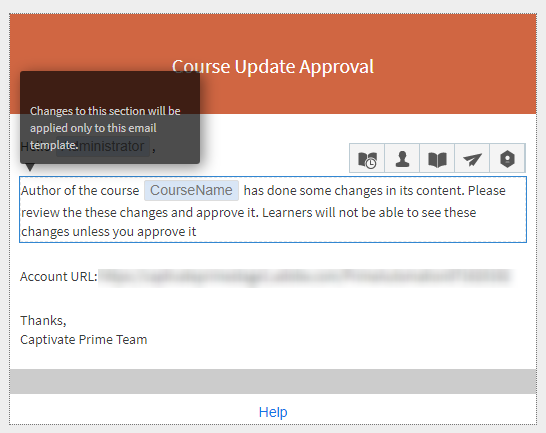
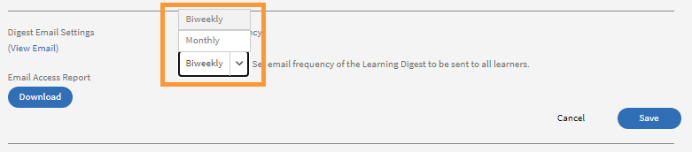

# Plantillas de correo electrónico

Los eventos de su actividad de formación activan los mensajes de correo electrónico que se envían a los alumnos. Como administrador, puede activar, desactivar o modificar fácilmente estas plantillas de correo electrónico.

La aplicación Learning Manager envía notificaciones por correo electrónico a varios roles de usuarios en función de los eventos.

Como administrador, puede personalizar las plantillas de correo electrónico añadiendo o modificando el contenido y enviando notificaciones a los usuarios para varios eventos activados por alumnos, responsables y autores.

Los administradores también pueden optar por no enviar notificaciones por correo electrónico sobre determinados eventos.

## Configurar plantillas de correo electrónico {#configureemailtemplates}

Como administrador, puede activar, desactivar o modificar fácilmente estas plantillas de correo electrónico.

1. Para acceder a las plantillas, haga clic en **[!UICONTROL Plantillas de correo electrónico]** en el panel izquierdo. En esta página puede ver tres categorías diferentes de plantillas: **[!UICONTROL General]**, **[!UICONTROL Actividad de aprendizaje]**, y **[!UICONTROL Recordatorios y actualizaciones]**. Hay una cuarta pestaña, **[!UICONTROL Configuración]**, donde puede configurar las plantillas.

   

   *Seleccione la ficha General*

1. Para ver la lista de plantillas de correo electrónico, haga clic en cualquier ficha.

   

   *Ver la lista de plantillas de correo electrónico*

   Puede activar o desactivar fácilmente cualquiera de estas alertas de correo electrónico haciendo clic en el botón de alternancia.

1. Para modificar el contenido de la plantilla, haga clic en su nombre. Aquí puede ver que para diferentes tipos de usuarios tiene diferentes plantillas.

   

   *Ver la plantilla de un correo electrónico*

1. Para modificar el contenido de esta plantilla de correo electrónico, haga clic en el cuerpo del correo electrónico. A continuación, realice los cambios en la plantilla. Puede modificar el texto y utilizar una de estas variables en su correo electrónico. Los cambios realizados en la sección de cuerpo solo se pueden aplicar a esta plantilla de correo electrónico. Sin embargo, si realiza cambios en la firma de este correo electrónico, se puede aplicar de forma global a todas las plantillas.

   Pase el ratón por cada icono para ver los nombres.

   

   *Modificar la plantilla de correo electrónico*

   Puede restablecer el contenido predeterminado del cuerpo del mensaje haciendo clic en el vínculo **[!UICONTROL Volver al original]** encima de la plantilla.

1. Para confirmar los cambios aplicados a esta plantilla, haga clic en Guardar. Ahora los usuarios pueden recibir notificaciones por correo electrónico mediante la plantilla de correo electrónico modificada.

## Personalizar la configuración de una plantilla de correo electrónico {#customizesettingsofanemailtemplate}

1. Para abrir la página de configuración, haga clic en **[!UICONTROL Configuración]**. Ahora puede personalizar sus plantillas de correo electrónico.
1. Para personalizar el nombre y el ID de correo electrónico del que reciben los mensajes los alumnos, edite el **[!UICONTROL Nombre y dirección del remitente].**

   Contacto [***Compatibilidad con Adobes***](https://helpx.adobe.com/contact/enterprise-support.other.html#learning-manager) para configurar o cambiar estos detalles.

1. Personalizar el banner de correo electrónico del **[!UICONTROL Banner de correo electrónico]** opción. Cambie el color del banner seleccionando **[!UICONTROL Fondo del banner]**.

   Puede utilizar una imagen personalizada como banner seleccionando la **[!UICONTROL Imagen personalizada]** opción. Haga clic en **[!UICONTROL Guardar]** después de realizar los cambios.

    

   *Personalizar la imagen de un banner*

   El tamaño de imagen personalizado debe ser de 1240 x 200 px y admitir .jpg, .jpeg y .png.

1. Edite su firma de correo electrónico haciendo clic en **[!UICONTROL Editar]**. Realice los cambios necesarios y guárdelos.

   

   *Personalizar la firma del correo electrónico*

1. Edite la URL de su cuenta haciendo clic en Editar en la opción **[!UICONTROL URL de cuenta]**.

   El vínculo de URL de la cuenta se muestra en todos los correos electrónicos, justo antes de la firma. Introduzca la URL necesaria y haga clic en **[!UICONTROL Guardar]**. Tenga en cuenta que esta dirección URL solo la podrán ver los usuarios internos.

   

   *Personalizar la URL de la cuenta*

1. Configure si los responsables también deben recibir los mensajes de correo electrónico enviados a sus subordinados directos mediante la casilla de verificación bajo **[!UICONTROL Correo electrónico del responsable opcional]** opción.

## Establecer la frecuencia de los mensajes de correo electrónico de resumen {#setfrequencyofdigestemails}

En la **[!UICONTROL Plantillas de correo electrónico]** > **[!UICONTROL Configuración]** , el administrador puede cambiar la frecuencia de los mensajes de correo electrónico de resumen que se envían a los alumnos.

En la **[!UICONTROL Configuración de correo electrónico de resumen]** , haga clic en **[!UICONTROL Editar]**.

En el menú desplegable, elija una de las siguientes opciones **[!UICONTROL Quincenal]** o **[!UICONTROL Mensual]**.

* **[!UICONTROL Quincenal]:** Si establece la frecuencia en **[!UICONTROL Quincenal]**, los alumnos reciben el correo electrónico una vez cada dos semanas.

* **[!UICONTROL Mensual]:** Si establece la frecuencia en **[!UICONTROL Mensual]**, los alumnos reciben el correo electrónico una vez al mes.

*Establecer la frecuencia de los mensajes de correo electrónico de resumen*

Al activar esta opción, la frecuencia se establece en **[!UICONTROL Quincenal]** para cuentas activas existentes o nuevas de forma predeterminada.

### Lista No molestar de alumnos

Los alumnos de una lista No molestar no pueden ver la configuración de usuario para los mensajes de correo electrónico de resumen. La opción permanecerá desactivada y los alumnos no recibirán ningún correo electrónico.

## Correo electrónico de resumen de muestra para alumnos {#digest-email}

Los ejemplos siguientes representan el correo que recibe un alumno.

*Correo electrónico de muestra*

### Actividad de formación

*Correo electrónico de la actividad de formación*

### Cursos de formación recomendados

*Correo electrónico de la formación recomendada*

### Tabla de posiciones

*Correo electrónico de la tabla de clasificación*

### Últimas publicaciones

*Correo electrónico de las últimas publicaciones*

### Descargar informe de acceso al correo electrónico

Puede descargar el informe de acceso al correo electrónico haciendo clic en **[!UICONTROL Descargar]** botón. Este informe contiene el número de usuarios que han recibido el correo electrónico y el número de usuarios que han abierto los vínculos y han hecho clic en ellos.

## Personalizar dominio de correo electrónico {#customizeemaildomain}

Para personalizar el dominio y el ID del correo electrónico desde el que los alumnos reciben las notificaciones, póngase en contacto con el [***Asistencia de Learning Manager***](https://helpx.adobe.com/contact/enterprise-support.other.html#learning-manager) y proporcione los detalles del dominio que desea agregar, y su nuevo id de correo electrónico.

Su solicitud se procesará y se le enviará un correo electrónico con un vínculo de confirmación a la nueva dirección de correo electrónico que especifique. Haga clic en el vínculo de verificación proporcionado en el correo electrónico para confirmar y completar el proceso de verificación.

## Configurar el correo electrónico de No molestar {#dnd}

Como administrador, puede seleccionar usuarios que pueden recibir correos electrónicos de Learning Manager y que no pueden.

Para ello, utilice el comando **[!UICONTROL No molestar]** opción bajo la **[!UICONTROL Configuración]** . Los usuarios se pueden añadir a esta lista mediante su nombre, ID de correo electrónico o ID de usuario único.

Busque un usuario para agregarlo a la lista.

<!---->

## Correos electrónicos bloqueados {#blockedemails}

Desde el **Correos electrónicos bloqueados** lista desplegable para que cada usuario seleccione los tipos de correo electrónico que se les bloqueará.

<!---->

Estas son las opciones disponibles:

* **Dirigir correo electrónico al alumno:** Esta opción restringe o permite el envío de correos electrónicos al alumno.
* **Correos electrónicos de escalación a responsables de alumnos:** Esta opción restringe o permite el envío de correos electrónicos al responsable del alumno.
* **Sobre subordinados directos:** Esta opción restringe o permite la escalación de mensajes de correo entrante que se envían a los usuarios sobre sus informes directos.
* **Sobre subordinados de omisión de nivel:** Esta opción restringe o permite la escalación de mensajes de correo entrante que se envían a los usuarios sobre los informes de segundo nivel.

Si desea eliminar a un usuario de la lista, puede utilizar la opción Eliminar disponible individualmente para cada usuario en la ficha Usuario.

Puede añadir usuarios a la lista No molestar mediante CSV. Incluya valores Verdadero/Falso/En blanco para cada una de las siguientes columnas:

* Bloquear correos electrónicos directos
* Bloquear escalaciones de usuarios
* Bloquear escalaciones directas entrantes
* Bloquear escalaciones de omisión entrantes

Introduzca true en el campo valor para impedir que los usuarios reciban mensajes de correo electrónico para la opción seleccionada. Si se especifica false como valor, los usuarios bloqueados se desbloquean. No se realizan cambios en las selecciones anteriores si la columna se deja en blanco.

## Flexibilidad en la personalización de las plantillas

Las plantillas de correo electrónico de Learning Manager ahora incluyen secciones totalmente editables, lo que proporciona una mayor flexibilidad para personalizar las comunicaciones por correo electrónico en función de las preferencias de mensajería y marca.

Entre las mejoras clave para personalizar las plantillas de correo electrónico se incluyen las siguientes:

### Personalizar el saludo por correo electrónico en el nivel de cuenta

Seleccionar **[!UICONTROL Plantillas de correo electrónico]** > **[!UICONTROL Configuración]**. Seleccionar **[!UICONTROL Editar]** en el **[!UICONTROL Saludo por correo electrónico]** sección.

*Personalizar saludo por correo electrónico*

También puede personalizar lo siguiente:

* El banner de correo electrónico y la firma de correo electrónico tanto en el nivel del curso como en el nivel de instancia.
* Edite el pie de página del correo electrónico. El área del pie de página contiene variables predefinidas para la dirección URL de la cuenta, la firma y cualquier texto de formato libre que el usuario agregue.

Las plantillas también admiten funciones de edición avanzadas, como que el formato se conserva cuando el contenido se copia y se pega desde y en Microsoft Word.

## Invitaciones en línea {#inlineinvitations}

Los usuarios de Learning Manager ahora recibirán invitaciones por correo electrónico en línea. Los archivos adjuntos ICS ya no se utilizan para enviar invitaciones. Cualquier cambio en la invitación se reflejará automáticamente en su calendario.

<!---->

## Preguntas más frecuentes {#frequentlyaskedquestions}

+++Cómo deshabilitar la Ayuda en las plantillas de correo electrónico

De momento, en Learning Manager no es posible desactivar **Ayuda** en plantillas de correo electrónico.

+++

+++¿Cómo se modifican las plantillas de correo electrónico?

1. Inicie sesión como administrador en su cuenta de Learning Manager.
1. En el panel izquierdo, haga clic en **[!UICONTROL Plantillas de correo electrónico]** y seleccione la plantilla de correo electrónico que desea modificar.
1. Para personalizar cada plantilla, haga clic en el texto del cuerpo de la plantilla. Puede insertar variables en el texto haciendo clic en los iconos correspondientes, como se muestra en la captura de pantalla. Pase el ratón por cada icono para ver los nombres y aplicarlos a la plantilla.
1. Después de realizar cambios en la plantilla, haga clic en **[!UICONTROL Guardar]**.

+++

+++Cómo crear sus propias plantillas de correo electrónico

En la actualidad, no es posible crear plantillas de correo electrónico personalizadas. Sin embargo, puede editar y modificar las plantillas existentes.

+++

+++Cómo desactivar las plantillas de correo electrónico

Para desactivar la plantilla de correo electrónico, seleccione la plantilla que debe desactivarse y haga clic en el botón circular Sí/No.

+++

+++Cómo cambiar el nombre y la dirección del remitente en la plantilla?

Para cambiar el nombre y la dirección de correo electrónico del remitente, póngase en contacto con [Compatibilidad con Adobe Learning Manager](https://helpx.adobe.com/contact/enterprise-support.other.html#learning-manager).

+++
