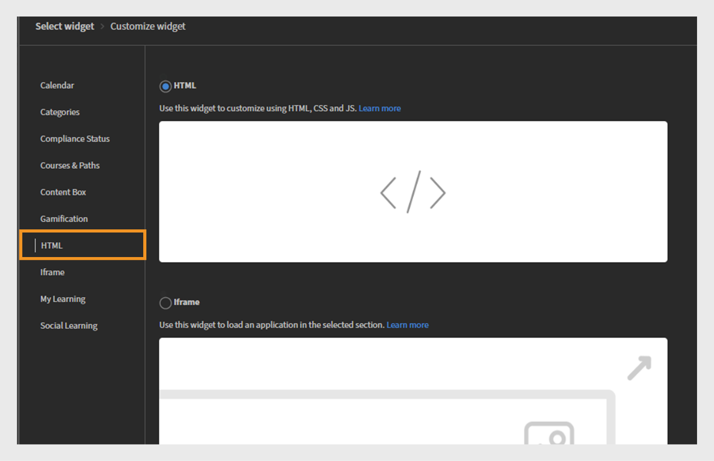

# Añadir y configurar widgets

## Widget Calendario

El widget Calendario muestra las sesiones y la formación programadas. Puede examinar el calendario para ver la formación planificada para los próximos meses. Permite ver las sesiones de formación por mes con la capacidad de desplazarse hacia la izquierda o la derecha.

Un administrador puede añadir el widget Calendario a una página para mostrar los programas de formación. Los alumnos pueden interactuar con el calendario desplazándose por meses para ver las próximas sesiones. Pueden filtrar las sesiones para encontrar rápidamente la formación pertinente.

### Agregar un widget de calendario

En una empresa financiera con equipos de Sales and Customer Success Manager (CSM) independientes, los administradores pueden utilizar este widget para resaltar las sesiones de formación específicas del equipo. Por ejemplo:

* El equipo de ventas puede ver las próximas sesiones sobre actualizaciones de productos, formación sobre cumplimiento y talleres de presentación.
* El equipo de CSM puede ver los talleres de incorporación de clientes, la formación en comunicación con los clientes y los programas de excelencia en el servicio.

Para configurar el widget de calendario:

1. Inicie sesión en Adobe Learning Manager como administrador.
2. Seleccione **[!UICONTROL Marca]** en el panel de navegación izquierdo.
3. Seleccione **[!UICONTROL Páginas personalizadas]**.
4. Seleccione la página requerida y, a continuación, seleccione **[!UICONTROL Diseño de página]**.
5. Seleccione **[!UICONTROL Editar]** y, a continuación, seleccione el diseño.
6. Seleccione **[!UICONTROL Agregar widget]**.
7. Seleccione **[!UICONTROL Calendario]** y, a continuación, **[!UICONTROL Continuar]**.

   
   _Pantalla de selección de widget que resalta la opción de widget de calendario para mostrar sesiones de formación en un calendario_

8. Escriba un **[!UICONTROL título del widget]** y una **[!UICONTROL descripción del widget]**.

   
   _Pantalla de personalización del widget de calendario, donde los administradores pueden establecer el título del widget, la descripción y seleccionar catálogos_

9. Seleccione un catálogo buscando para mostrar sus cursos y rutas de aprendizaje en el widget **[!UICONTROL Calendar]**.
10. Seleccione **[!UICONTROL Agregar widget]**.

El widget Calendario se agregará a la página. El administrador puede añadir otros widgets y publicar la página.

>[!NOTE]
>
>Si no se selecciona ningún catálogo, se mostrarán las sesiones de todos los catálogos.

## Widget de categorías

El widget Categorías muestra el contenido de aprendizaje organizado por catálogos, productos o funciones como categorías. Ayuda a los alumnos a examinar y encontrar fácilmente formación agrupada por temas, departamentos, aptitudes u otras clasificaciones relevantes.

Los administradores añaden el widget Categorías a una página para mostrar las opciones de aprendizaje por categorías. Los alumnos utilizan el widget para explorar la formación al seleccionar una categoría de interés y, a continuación, mostrar los cursos o rutas relacionados.

Consulte [Catálogos](/help/migrated/administrators/feature-summary/catalogs.md) y [Recommendations](/help/migrated/recommendations-adobe-learning-manager.md) artículos para obtener más información sobre la configuración de catálogos y recomendaciones.

<b>Nota</b>: En el widget Categorías, cuando se selecciona Catálogo, la lista se ordena por fecha de creación de forma predeterminada. Los catálogos creados más recientemente aparecen primero.

### Agregar un widget de categoría

En una empresa de servicios financieros, los diferentes equipos suelen necesitar acceso a formación específica de la función. El widget Categorías ayuda a organizar el contenido de aprendizaje en mosaicos claros en los que se puede hacer clic, lo que facilita que los equipos de ventas y CSM encuentren rápidamente lo que necesitan.

Para configurar el widget Categorías:

1. Inicie sesión en Adobe Learning Manager como administrador.
2. Seleccione **[!UICONTROL Marca]** en el panel de navegación izquierdo.
3. Seleccione **[!UICONTROL Páginas personalizadas]**.
4. Seleccione la página requerida y, a continuación, seleccione **[!UICONTROL Diseño de página]**.
5. Seleccione **[!UICONTROL Editar]** y, a continuación, seleccione el diseño.
6. Seleccione **[!UICONTROL Agregar widget]**.
7. Seleccione **[!UICONTROL Categorías]** y, a continuación, seleccione **[!UICONTROL Continuar]**.

   
   _Pantalla de selección de widget que resalta la opción del widget Categorías para organizar el contenido de aprendizaje por catálogo, producto o función para facilitar la navegación_

8. Seleccione los detalles que se mostrarán en las tarjetas de categoría:

   * **[!UICONTROL Imagen de categoría]**
   * **[!UICONTROL Descripción de categoría]**

9. Escriba un **[!UICONTROL título del widget]** y una **[!UICONTROL descripción del widget]**.
10. Busque y elija un catálogo del **[!UICONTROL origen de categoría]**.

   
   _Configure las opciones del widget Categorías para establecer el título y la descripción del widget, y seleccione la categoría de origen_

11. Seleccione **[!UICONTROL Agregar widget]**.

El widget Categorías se agregará a la página. Los administradores pueden añadir otros widgets y publicar la página.

## Widget de cumplimiento

El widget Estado de cumplimiento muestra el progreso de un alumno hacia el cumplimiento de los requisitos de cumplimiento o certificación. Muestra el estado de la formación obligatoria asignada al usuario, incluidos los cursos completados, pendientes o vencidos.

Los administradores añaden el widget Estado de cumplimiento a las páginas para proporcionar visibilidad sobre el progreso de la formación sobre cumplimiento. Los alumnos lo utilizan para comprobar rápidamente qué cursos obligatorios han completado y cuáles siguen requiriendo atención.

### Añadir un widget de estado de cumplimiento

En una empresa de servicios financieros, tanto el equipo de ventas como el equipo del administrador de éxito de clientes (CSM) deben completar la formación sobre cumplimiento a tiempo. El widget Estado de cumplimiento facilita a los alumnos el seguimiento de las fechas límite próximas y el progreso de su formación directamente desde las páginas específicas del equipo.

Para configurar el widget de cumplimiento:

1. Inicie sesión en Adobe Learning Manager como administrador.
2. Seleccione **[!UICONTROL Marca]** en el panel de navegación izquierdo.
3. Seleccione **[!UICONTROL Páginas personalizadas]**.
4. Seleccione la página requerida y, a continuación, seleccione **[!UICONTROL Diseño de página]**.
5. Seleccione **[!UICONTROL Editar]** y, a continuación, seleccione el diseño.
6. Seleccione **[!UICONTROL Agregar widget]**.
7. Seleccione **[!UICONTROL Estado de cumplimiento]** y, a continuación, **[!UICONTROL Continuar]**.

   
   _La pantalla de selección del widget resalta el widget Estado de cumplimiento que se usa para mostrar las inscripciones de alumnos con fechas límite e indicadores de estado_

8. Escriba un **[!UICONTROL título del widget]** y una **[!UICONTROL descripción del widget]**.

   
   _Pantalla del widget Estado de cumplimiento normativo, donde los administradores pueden establecer el título y la descripción del widget para mostrar las fechas límite de inscripción y el estado de los alumnos_

9. Seleccione **[!UICONTROL Agregar widget]**.

El widget de estado de cumplimiento se agregará a la página. Los administradores pueden añadir otros widgets y publicar la página.

## Widget de cursos y trazados

El widget Cursos y rutas muestra las rutas de aprendizaje y los cursos recomendados, adaptados a la función, los intereses o las necesidades de formación del alumno.

Los administradores añaden el widget Cursos y trazados a las páginas para resaltar el contenido de aprendizaje clave para audiencias específicas. Los alumnos utilizan el widget para examinar los cursos o rutas recomendados y pueden inscribirse directamente en los cursos.

### Añadir un widget de cursos y trazados

Una empresa financiera desea crear páginas de formación específicas para cada función para sus dos equipos: Sales y Customer Success Managers (CSM). El widget Cursos y trazados se puede utilizar para mostrar los programas de aprendizaje más relevantes para cada equipo.

Para configurar el widget Cursos y trazados:

1. Inicie sesión en Adobe Learning Manager como administrador.
2. Seleccione **[!UICONTROL Marca]** en el panel de navegación izquierdo.
3. Seleccione **[!UICONTROL Páginas personalizadas]**.
4. Seleccione la página requerida y, a continuación, seleccione **[!UICONTROL Diseño de página]**.
5. Seleccione **[!UICONTROL Editar]** y, a continuación, seleccione el diseño.
6. Seleccione **[!UICONTROL Agregar widget]**.
7. Seleccione **[!UICONTROL Cursos y rutas]**.

   
   _Pantalla de selección de widget que resalta el widget Cursos y rutas para mostrar cursos, rutas de aprendizaje, certificaciones y ayudas de trabajo como tarjetas interactivas para alumnos_

8. Seleccione **[!UICONTROL Continuar]**.
9. Escriba **[!UICONTROL Título del widget]** y **[!UICONTROL Descripción del widget]**.
10. Seleccione los catálogos o elija manualmente un máximo de 25 cursos para mostrar.

_Widget de cursos y rutas donde los administradores establecen el título del widget, la descripción y seleccionan Cursos o Rutas de aprendizaje para mostrarlos como tarjetas interactivas_
11. Seleccione **[!UICONTROL Agregar widget]**.

El widget Cursos y trazados se añadirá a la página. Los administradores pueden añadir otros widgets y publicar la página.

## Widget de cuadro de contenido

El widget Cuadro de contenido permite a los administradores agregar contenido personalizado como texto, imágenes, anuncios o vínculos a una página. Proporciona un espacio flexible para compartir información importante, sugerencias, actualizaciones o mensajes promocionales directamente dentro del entorno de aprendizaje.

### Agregar un widget de cuadro de contenido

Una empresa financiera desea crear páginas de formación específicas para cada función para sus dos equipos: Sales y Customer Success Managers (CSM). El widget Cuadro de contenido se puede utilizar para agregar secciones personalizadas con títulos, descripciones, imágenes y botones de llamada a la acción que comparten recursos específicos, actualizaciones y mensajes motivacionales.

Para configurar el widget de cuadro de contenido:

1. Inicie sesión en Adobe Learning Manager como administrador.
2. Seleccione **[!UICONTROL Marca]** en el panel de navegación izquierdo.
3. Seleccione **[!UICONTROL Páginas personalizadas]**.
4. Seleccione la página requerida y, a continuación, seleccione **[!UICONTROL Diseño de página]**.
5. Seleccione **[!UICONTROL Editar]** y, a continuación, seleccione el diseño.
6. Seleccione **[!UICONTROL Agregar widget]**.
7. Seleccione **[!UICONTROL Cuadro de contenido]** y, a continuación, seleccione **[!UICONTROL Continuar]**.

   
   _Pantalla de selección de widget que resalta el widget de cuadro de contenido para mostrar imágenes personalizadas, texto y botones de acción para mejorar la participación del alumno_

8. Escriba **[!UICONTROL Title]** y **[!UICONTROL Description]**.
9. Escriba el texto en la **[!UICONTROL etiqueta del botón Acción]** y proporcione un vínculo.
10. Seleccione cualquiera de las opciones de Relleno de fondo:

   * **[!UICONTROL Color]**: seleccione el color en el selector de color o escriba el código de color en el campo de texto.
   * **[!UICONTROL Imagen]**: examine y cargue una imagen.

11. Ajuste la altura del cuadro mediante la opción **[!UICONTROL Altura del cuadro de contenido]**.
12. Seleccione las opciones de formato de texto.

   
   _Pantalla de personalización del widget de cuadro de contenido, donde los administradores pueden introducir un título, descripción, etiqueta de botón de acción y vínculo_

13. Seleccione **[!UICONTROL Agregar widgets]**.

El widget Cuadro de contenido se agregará a la página. Los administradores pueden añadir otros widgets y publicar la página.

## Widget de interacción

Los administradores añaden el widget Interacción a las páginas personalizadas para mostrar los logros de los alumnos, como las insignias obtenidas, los puntos acumulados y las clasificaciones de la tabla de clasificación. Los alumnos pueden hacer un seguimiento de su progreso y comparar los resultados con sus compañeros, lo que fomenta la motivación y la participación sostenida.

### Añadir un widget de interacción

Una empresa financiera quiere aumentar la participación y la motivación de los alumnos en sus dos equipos principales: los gestores de ventas y de éxito del cliente (CSM). El widget Interacción se puede utilizar para recompensar a los alumnos con puntos, insignias y clasificaciones en la tabla de clasificación por completar la formación y participar activamente.

Para el equipo de ventas, la interacción lúdica podría centrarse en recompensar los logros relacionados con las habilidades de ventas, el conocimiento del producto y la formación de compromiso con el cliente. Para el equipo de CSM, podría hacer hincapié en las certificaciones de servicio al cliente, la formación de cumplimiento y las habilidades de gestión de clientes.

Para configurar el widget Interacción:

1. Inicie sesión en Adobe Learning Manager como administrador.
2. Seleccione **[!UICONTROL Marca]** en el panel de navegación izquierdo.
3. Seleccione **[!UICONTROL Páginas personalizadas]**.
4. Seleccione la página requerida y, a continuación, seleccione **[!UICONTROL Diseño de página]**.
5. Seleccione **[!UICONTROL Editar]** y, a continuación, seleccione el diseño.
6. Seleccione **[!UICONTROL Agregar widget]**.
7. Seleccione **[!UICONTROL Interacción]** y luego **[!UICONTROL Continuar]**.

   
   _Pantalla de selección de widgets que destaca el widget de interacción lúdica utilizado para mostrar las actividades de aprendizaje y los logros en la tabla de posiciones_

8. Escriba el **[!UICONTROL título del widget]** y la **[!UICONTROL descripción del widget]**.
9. Seleccione **[!UICONTROL Agregar widgets]**.

El widget Interacción se agregará a la página. Los administradores pueden añadir otros widgets y publicar la página.

## Widget HTML

El widget de HTML permite a los administradores insertar código de HTML personalizado directamente en una página. Esto proporciona flexibilidad para añadir contenido personalizado, integrar herramientas de terceros o incluir elementos interactivos que van más allá de la funcionalidad de widget estándar. Admite una personalización sofisticada a través de HTML, CSS e incluso JavaScript, lo que permite diseños únicos e integraciones externas en la plataforma de aprendizaje.

### Añadir un widget de HTML

Una empresa financiera desea proporcionar contenido personalizado e interactivo adaptado a sus dos equipos principales: los gestores de ventas y de éxito del cliente (CSM). El widget de HTML se puede utilizar para incrustar recursos personalizados basados en HTML, como paneles financieros, visualizaciones de datos, formularios interactivos o herramientas de análisis de mercado, directamente en las páginas de formación o de equipo.

Para configurar el widget de HTML:

1. Inicie sesión en Adobe Learning Manager como administrador.
2. Seleccione **[!UICONTROL Marca]** en el panel de navegación izquierdo.
3. Seleccione **[!UICONTROL Páginas personalizadas]**.
4. Seleccione la página requerida y, a continuación, seleccione **[!UICONTROL Diseño de página]**.
5. Seleccione **[!UICONTROL Editar]** y, a continuación, seleccione el diseño.
6. Seleccione **[!UICONTROL Agregar widget]**.
7. Seleccione **[!UICONTROL HTML]** y, a continuación, **[!UICONTROL Continuar]**.

   
   _Pantalla de selección de widget que resalta el widget de HTML para personalizar páginas con código de HTML, CSS y JavaScript_

8. Escriba el código **[!UICONTROL HTML]**, **[!UICONTROL CSS]** y **[!UICONTROL JavaScript]** en los campos correspondientes.
9. Seleccione **[!UICONTROL Agregar widget]**.

El widget HTML se agregará a la página. Los administradores pueden añadir otros widgets y publicar la página.

## Widget IFrame

El widget de Iframe muestra el contenido de una dirección URL externa directamente en una página de la plataforma de aprendizaje. Integra un sitio web, una herramienta o una aplicación externos dentro de un marco, lo que permite a los alumnos ver e interactuar con ese contenido sin salir del LMS.

### Añadir un widget de Iframe

Una empresa financiera desea incorporar herramientas y recursos externos sin problemas en sus páginas internas de formación y colaboración para sus equipos de Sales y Customer Success Managers (CSM). El widget de Iframe se puede utilizar para mostrar paneles financieros de terceros, plataformas de análisis de mercado o portales de administración de clientes directamente dentro de la interfaz de LMS.

Para configurar el widget de Iframe:

1. Inicie sesión en Adobe Learning Manager como administrador.
2. Seleccione **[!UICONTROL Marca]** en el panel de navegación izquierdo.
3. Seleccione **[!UICONTROL Páginas personalizadas]**.
4. Seleccione la página requerida y, a continuación, seleccione **[!UICONTROL Diseño de página]**.
5. Seleccione **[!UICONTROL Editar]** y, a continuación, seleccione el diseño.
6. Seleccione **[!UICONTROL Agregar widget]**.
7. Seleccione **[!UICONTROL Iframe]** y, a continuación, seleccione **[!UICONTROL Continuar]**.

   
   _Pantalla de selección de widgets que resalta el widget de Iframe para incrustar aplicaciones o páginas web externas en una sección seleccionada_

8. Escriba la dirección URL en la opción **[!UICONTROL Página vinculada al botón Acción]**.
9. Ajuste la altura de iframe mediante la opción **[!UICONTROL Altura de iframe]**.

   
   _Pantalla de personalización del widget de iframe, donde los administradores pueden introducir una URL de página y especificar la altura de iframe para incrustar contenido externo_

10. Seleccione **[!UICONTROL Agregar widget]**.

El widget Iframe se agregará a la página. Los administradores pueden añadir otros widgets y publicar la página.

Los administradores deben incluir el token de acceso como parámetro de consulta en la dirección URL de iframe para recuperar los detalles correctos. Por ejemplo, para mostrar información de Adobe Learning Manager dentro de un iframe, la dirección URL debe incluir los siguientes parámetros:

* userId: el identificador único del alumno.
* accountId: el identificador de cuenta asociado al alumno.
* token: token de autenticación necesario para las llamadas de API
* configuración regional: idioma o configuración regional del alumno.

## Widget Mi aprendizaje

El widget Mi aprendizaje proporciona a los alumnos una vista personalizada de todos los cursos, programas de aprendizaje y certificaciones que tienen asignados o en los que se inscriben. Organiza el contenido de aprendizaje por tipo y plazo, lo que permite a los alumnos realizar un seguimiento sencillo de su progreso y acceder a los materiales de aprendizaje. Este widget ayuda a los alumnos a centrarse en la formación que necesitan y a ver brevemente los próximos plazos.

### Añadir un widget de Mi aprendizaje

Una empresa financiera quiere ofrecer experiencias de aprendizaje personalizadas adaptadas a sus dos equipos principales: los gestores de ventas y de éxito del cliente (CSM). El widget Mi aprendizaje se puede utilizar para ofrecer a cada miembro del equipo una vista consolidada de los cursos asignados, las rutas de aprendizaje en curso y las certificaciones.

Para configurar el widget Mi aprendizaje:

1. Inicie sesión en Adobe Learning Manager como administrador.
2. Seleccione **[!UICONTROL Marca]** en el panel de navegación izquierdo.
3. Seleccione **[!UICONTROL Páginas personalizadas]**.
4. Seleccione la página requerida y, a continuación, seleccione **[!UICONTROL Diseño de página]**.
5. Seleccione **[!UICONTROL Editar]** y, a continuación, seleccione el diseño.
6. Seleccione **[!UICONTROL Agregar widget]**.
7. Seleccione **[!UICONTROL Mi aprendizaje]** y, a continuación, **[!UICONTROL Continuar]**.

   
   _Pantalla de selección de widget, que resalta el widget Mi aprendizaje utilizado para mostrar la lista personalizada de cursos inscritos del alumno_

8. Escriba el **[!UICONTROL título del widget]** y la **[!UICONTROL descripción del widget]**.
9. Seleccione **[!UICONTROL Agregar widget]**.

El widget Mi aprendizaje se agregará a la página. Los administradores pueden añadir otros widgets y publicar la página.

## Widget de Aprendizaje social

El widget de Aprendizaje social permite a los alumnos interactuar, compartir ideas y colaborar en la plataforma de aprendizaje. Admite la publicación de diversos tipos de contenido, como texto, vídeos, audio, capturas de pantalla, preguntas y encuestas. Los alumnos pueden comentar, responder, votar a favor o votar en contra de las publicaciones, lo que fomenta el intercambio de conocimientos y la participación entre pares. Este widget crea un espacio de aprendizaje informal que complementa la formación formal fomentando la interacción social y el aprendizaje continuo.

### Añadir un widget de aprendizaje social

Una empresa financiera quiere colaboración e intercambio de conocimientos entre sus dos equipos principales: Sales y Customer Success Managers (CSM). El widget de Aprendizaje social se puede utilizar para crear espacios interactivos donde los miembros del equipo pueden publicar preguntas, compartir prácticas recomendadas, cargar contenido útil y participar en debates.

Para configurar el widget de Aprendizaje social:

1. Inicie sesión en Adobe Learning Manager como administrador.
2. Seleccione **[!UICONTROL Marca]** en el panel de navegación izquierdo.
3. Seleccione **[!UICONTROL Páginas personalizadas]**.
4. Seleccione la página requerida y, a continuación, seleccione **[!UICONTROL Diseño de página]**.
5. Seleccione **[!UICONTROL Editar]** y, a continuación, seleccione el diseño.
6. Seleccione **[!UICONTROL Agregar widget]**.
7. Seleccione **[!UICONTROL Aprendizaje social]** y, a continuación, **[!UICONTROL Continuar]**.

   
   _Pantalla de selección de widget que resalta el widget de Aprendizaje social para mostrar publicaciones que alienten la colaboración y la participación_

8. Escriba el **[!UICONTROL título del widget]** y la **[!UICONTROL descripción del widget]**.
9. Seleccione **[!UICONTROL Agregar widget]**.

El widget de Aprendizaje social se agregará a la página. Los administradores pueden añadir otros widgets y publicar la página.

## Pasos siguientes

Después de configurar los widgets en las páginas, utilice los menús para organizar y agrupar las páginas.
