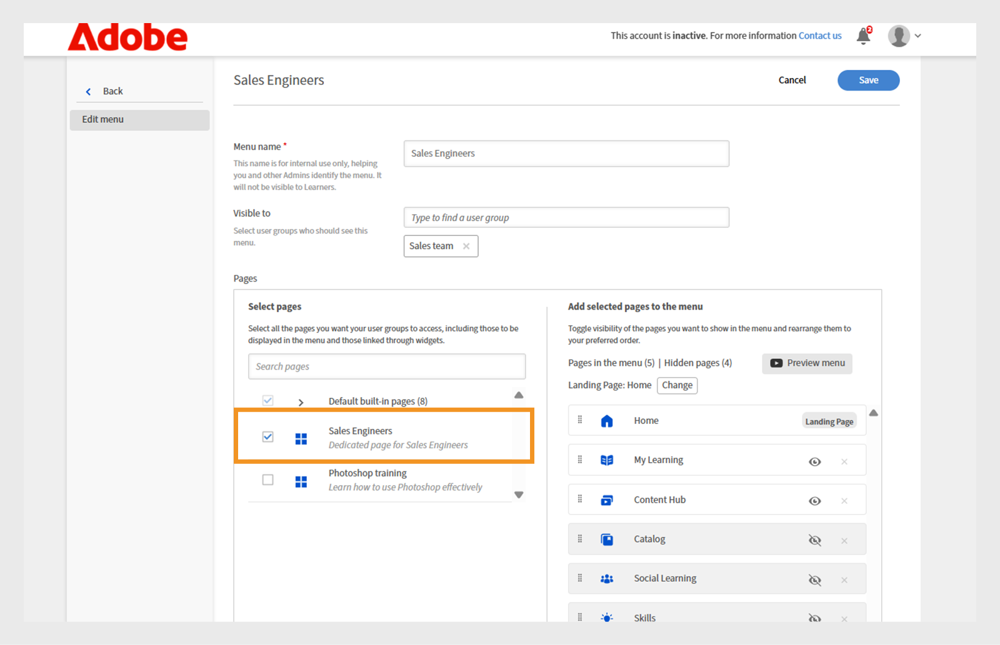

# Crear un menú

Como administrador de una empresa financiera con dos equipos principales, los gestores de ventas y de éxito de clientes (CSM), debe crear menús independientes con sus respectivas páginas. Esto permite a los alumnos encontrar fácilmente en su propio menú cursos relevantes para sus funciones.

De forma predeterminada, los administradores pueden ver el menú predeterminado en la página **[!UICONTROL Menú]**, que no se puede eliminar. Este menú incluye todas las páginas integradas visibles actualmente en la aplicación del alumno.

Para crear un menú:

1. Inicie sesión en Adobe Learning Manager como administrador.
2. Seleccione **[!UICONTROL Marca]** en el panel de navegación izquierdo.
3. Seleccione **[!UICONTROL Menú]** y, a continuación, seleccione **[!UICONTROL Crear]**.

   
   _Pantalla Menú que muestra opciones para ver, organizar y crear menús personalizados para diferentes grupos de alumnos_

4. Escriba el **[!UICONTROL nombre del menú]** (por ejemplo, Formación de productos) y seleccione el grupo de usuarios en la opción **[!UICONTROL Visible para]**.

   
   _Pantalla Crear menú, donde los administradores pueden introducir un nombre de menú para uso interno y especificar grupos de usuarios para controlar la visibilidad del menú_

5. A continuación se muestra el tipo de páginas disponibles en el menú:
   * **[!UICONTROL Páginas integradas]**: estas son las páginas predeterminadas que se incluyen en Adobe Learning Manager, como Inicio, Mi aprendizaje y Catálogo. Los administradores no pueden quitar las páginas integradas del menú. Pueden ocultar las páginas del menú.
   * **[!UICONTROL Páginas personalizadas]**: estas son páginas creadas por el administrador mediante Experience Builder. Las páginas personalizadas permiten a las organizaciones diseñar experiencias de marca, específicas de funciones o basadas en eventos, añadiendo widgets, diseños y menús personalizados para diferentes grupos de alumnos.
6. Seleccione **[!UICONTROL Cambiar]** junto a **[!UICONTROL Página de destino]** para actualizar la página de destino del alumno.

   
   _Pantalla de configuración del menú que muestra la opción de seleccionar páginas para cambiar la página de destino de la interfaz del alumno_

7. Elige la página personalizada de la opción **[!UICONTROL Seleccionar páginas]**. Los administradores deben poder seleccionar solo las páginas personalizadas publicadas, no las que estén en estado Borrador.

   
   _Pantalla de selección de página, resaltando la opción de incluir la página personalizada para grupos de usuarios y personalizar el orden del menú_

8. Arrastra y suelta para reorganizar las páginas del menú.
9. Seleccione **[!UICONTROL Menú de vista previa]** para ver el menú antes de guardarlo.
10. Seleccione **[!UICONTROL Guardar]**.

El menú creado estará visible para los alumnos seleccionados. Pueden acceder a las páginas personalizadas a través de su interfaz de usuario de alumno.

_La interfaz de usuario del alumno muestra la página personalizada con módulos de formación destacados y navegación sencilla desde el menú de la barra lateral_

## Crear un submenú

Los administradores pueden crear un submenú dentro del menú y agregarle páginas personalizadas. Los submenús no tienen una página de destino.

Para crear un submenú:

1. Seleccione **[!UICONTROL Crear submenú]** en la página **[!UICONTROL Configuración de menú]**.

   
   _Páginas de configuración de menú que resaltan la opción Crear submenú para crear submenús para los alumnos_

2. Seleccione el idioma y escriba el título del submenú.
3. Seleccione un icono para mostrar junto al submenú.
4. Seleccione **[!UICONTROL Agregar nuevo idioma]** para crear el mismo submenú para diferentes configuraciones regionales. Por ejemplo, si añade inglés y francés, los alumnos con el idioma de interfaz inglés seleccionado verán el submenú inglés, mientras que los alumnos con francés seleccionado verán el submenú francés.

   
   _Mensaje de submenú que muestra opciones para seleccionar el título, el idioma y el icono del submenú para mostrarlos en el menú_

5. Seleccione **[!UICONTROL Continuar]**.
6. Arrastra y suelta las páginas bajo el submenú.

## Configurar páginas ocultas

La opción **[!UICONTROL Ocultar páginas]** permite a los administradores mantener limpia la interfaz de usuario del alumno al mostrar menos páginas. Los administradores pueden ocultar páginas en el menú para que los alumnos no las vean en la interfaz de usuario del alumno, pero los alumnos pueden llegar a esas páginas de otras formas. Por ejemplo, la página Catálogo se puede ocultar en el menú, pero se puede acceder a ella a través de la página de inicio del alumno.

_Pantalla de configuración de menú que muestra páginas ocultas como Catálogo, Aprendizaje social, Aptitudes e Insignias_

>[!NOTE]
>
>Las páginas de un submenú no se pueden ocultar directamente. Para ocultar una página, primero arrástrela fuera del submenú y, a continuación, ocúltela.

## Pasos siguientes

Después de configurar las páginas, los widgets y los menús, mejore la experiencia general del alumno añadiendo personalizaciones mediante JavaScript y CSS.

