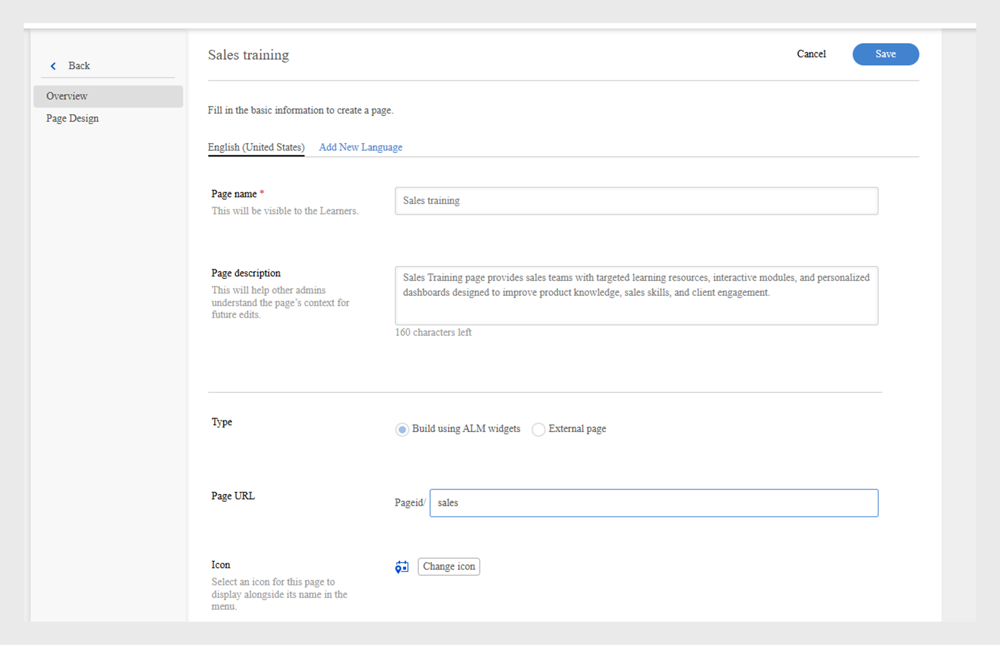
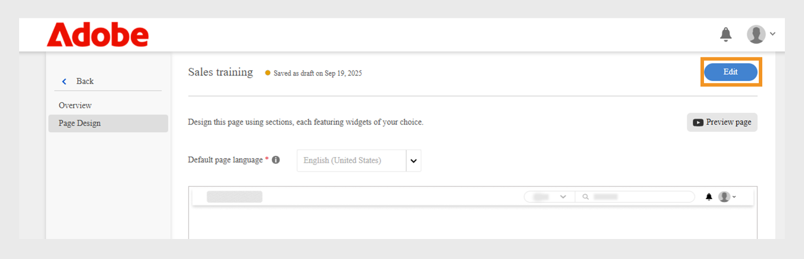

# Crear una página personalizada en Experience Builder

Como administrador de una empresa de servicios financieros, administra dos equipos: Ventas y Éxito del cliente. Cada equipo tiene requisitos de aprendizaje únicos, pero ambos han estado utilizando el mismo portal de aprendizaje estándar. Esto ha provocado confusión, desorden y poca participación de los alumnos.
Para resolver este desafío sin tener que invertir en una compilación descentralizada o esperar a que haya una solución personalizada para desarrolladores, puedes usar Experience Builder en Adobe Learning Manager. Con las páginas, los widgets y los menús, puedes diseñar portales de marca y específicos para cada función en solo unos pasos, sin necesidad de código.

Para crear una página personalizada para el equipo de ingeniería de ventas en Adobe Learning Manager:

1. Inicie sesión en Adobe Learning Manager como administrador.
2. Seleccione **[!UICONTROL Marca]** en el panel de navegación izquierdo.
3. Seleccione **[!UICONTROL Páginas personalizadas]**.
4. Seleccione **[!UICONTROL Crear página]**.

   
   Pantalla _Páginas personalizadas que muestra la opción Crear página para diseñar nuevas experiencias de aprendizaje personalizadas_

5. Escriba el **[!UICONTROL nombre de página]** (por ejemplo, Formación de ventas para el equipo de ventas).
6. Escriba la **[!UICONTROL descripción de la página]**.

   
   _Configuración de la página de formación de ventas en Adobe Learning Manager, que muestra los campos de nombre de página, descripción, tipo, URL y configuración de icono para crear un portal de formación de ventas de destino_

7. Seleccione el tipo de página de las siguientes:

   * **[!UICONTROL Generar usando widgets de ALM]**: el administrador puede crear una página usando los widgets de Adobe Learning Manager existentes. Escriba la cadena personalizada en el campo URL de página. Esta cadena se anexará a la dirección URL de la página personalizada.
   * **[!UICONTROL Página externa]**: el administrador puede agregar una dirección URL para la página externa. Si selecciona el tipo de página como externa, escriba la dirección URL de la página externa en el campo de texto URL de página.

8. Seleccione **[!UICONTROL Cambiar icono]** para cambiar el icono de la página.
9. Seleccione **[!UICONTROL Agregar nuevo idioma]** para agregar el idioma predeterminado para la página.
10. Seleccione **[!UICONTROL Guardar]**.

La página se ha creado y guardado como borrador en la sección Páginas personalizadas . Los administradores pueden editar y diseñar las páginas de borrador con los widgets.

El siguiente paso es agregar un diseño a la página personalizada, donde puede agregar y configurar widgets.

## Diseño de página en Experience Builder

Diseñe la página seleccionando el diseño de sección adecuado en el menú desplegable. El ancho máximo de cualquier diseño es de 1212 píxeles. Elija una de las siguientes opciones de sección en función del número de widgets que desee añadir y su tamaño deseado:

* Columna **[!UICONTROL 1 - Ancho completo de sección]**: el contenido abarca todo el ancho de la sección, lo que proporciona el máximo espacio.
* **[!UICONTROL 2 columnas - 1/2 ancho de sección cada una]**: la sección se divide uniformemente en dos columnas de igual ancho.
* **[!UICONTROL 2 columnas - 2/3 y 1/3 ancho de sección]**: El contenido principal ocupa dos tercios del ancho, mientras que el contenido lateral utiliza un tercio.
* **[!UICONTROL 2 columnas - ancho de sección 1/3 y 2/3]**: El contenido de lados ocupa un tercio y el contenido principal dos tercios de la sección.
* **[!UICONTROL 3 columnas - 1/3 de ancho de sección cada una]**: La sección se divide en tres columnas de igual ancho.

>[!NOTE]
>
>Se puede añadir un máximo de 10 widgets verticalmente en todos los diseños, excepto el diseño de 1 columna - Ancho de sección completo.

Para seleccionar el diseño de la página de formación de ventas en Experience Builder:

1. Inicie sesión en Adobe Learning Manager como administrador.
2. Seleccione **[!UICONTROL Marca]** en el panel de navegación izquierdo.
3. Seleccione **[!UICONTROL Páginas personalizadas]** y, a continuación, seleccione la página requerida.
4. Seleccione **[!UICONTROL Diseño de página]**.
5. Seleccione **[!UICONTROL Editar]**.

   
   _Pantalla de edición de diseño de página para una página personalizada de formación de ventas, resaltando el botón Editar para agregar secciones de página, widgets y diseño_

6. Elija las opciones del menú desplegable **[!UICONTROL Seleccionar diseño de sección]**.

   
   El cuadro de diálogo de selección de diseño de sección _permite a los administradores elegir arreglos de widget de una o varias columnas para el diseño de página personalizado_

7. Seleccione **[!UICONTROL Continuar]**.

El diseño añadido tiene las siguientes opciones:

* **[!UICONTROL Eliminar fila]**: quite la fila del diseño.
* **[!UICONTROL Ajustar ancho de pantalla]**: Ajusta el diseño para que cambie de tamaño automáticamente y se ajuste a tu pantalla para mejorar la visibilidad.
* **[!UICONTROL Reordenar]**: cambia el orden de los diseños arrastrándolos y soltándolos en la posición deseada.

_Diseño de página que muestra las opciones de diseño para reordenar, expandir o eliminar la sección_

El siguiente paso es agregar y configurar widgets en la página personalizada.

## Agregar y configurar un widget

Añada los widgets necesarios a las páginas personalizadas de formación de ventas en función de los requisitos.

Para configurar un widget en la página personalizada Formación de ventas:

1. Seleccione **[!UICONTROL Agregar widget]** en el diseño.

   
   _La pantalla de diseño de página permite a los administradores seleccionar y agregar widgets para personalizar las páginas de sus cursos_

2. Elija el widget de **[!UICONTROL cuadro de contenido]** y, a continuación, seleccione **[!UICONTROL Continuar]**.

   
   _Pantalla de selección de widget que resalta el widget de cuadro de contenido para mostrar imágenes personalizadas, texto y botones de acción para mejorar la participación del alumno_

3. Escriba **[!UICONTROL Title]** y **[!UICONTROL Description]**.
4. Escriba el texto en la **[!UICONTROL etiqueta del botón Acción]** y proporcione un vínculo.
5. Configure las opciones restantes. Vea esta [sección](/help/migrated/administrators/feature-summary/experience-builder/add-a-widget.md#content-box-widget) para obtener más información sobre el widget de **[!UICONTROL cuadro de contenido]**.

   
   Pantalla de widgets de _cuadro de contenido que muestra las opciones para configurar el widget_

6. Escriba el título, la descripción y la etiqueta del botón de acción en la pantalla de configuración del widget **[!UICONTROL Content Box]** para los ingenieros de ventas
7. Seleccione **[!UICONTROL Agregar widget]**.
8. Seleccione **[!UICONTROL Guardar]** y elija una de las siguientes opciones:
a. **[!UICONTROL Guardar como borrador]**: la página se guardará como borrador. El administrador puede editar la página más adelante.
b. **[!UICONTROL Guardar y Publish]**: La página se publicará y el administrador podrá agregarla al menú.

   
   _Las opciones de guardado permiten a los administradores elegir entre guardar una página como borrador para editarla en el futuro o publicarla para que el alumno tenga acceso a ella_

La página se puede guardar como borrador o publicar. Los administradores pueden editar borradores antes de publicar y también pueden actualizar y volver a publicar páginas publicadas.

Siga los mismos pasos para crear páginas para el equipo de Customer Success Manager.

## Vista previa de la página

Para previsualizar las páginas:

1. Inicie sesión en Adobe Learning Manager como administrador.
2. Seleccione **[!UICONTROL Marca]** en el panel de navegación izquierdo.
3. Seleccione **[!UICONTROL Páginas personalizadas]**.
4. Seleccione la página requerida y, a continuación, seleccione **[!UICONTROL Diseño de página]**.
5. Seleccione **[!UICONTROL Editar]** y, a continuación, seleccione **[!UICONTROL Vista previa de la página]** para ver la vista previa del portal.

   
   _Vista previa de página que muestra un diseño de página personalizado con un banner, cursos destacados_

6. Seleccione Modo Inspect para ver el alto y el ancho del widget.

   
   _Pantalla de vista previa de página en Experience Builder con el conmutador de modo Inspect resaltado, lo que permite a los administradores revisar e inspeccionar los widgets_

## Crear una página en otro idioma

Los administradores pueden crear varias páginas personalizadas específicas de la configuración regional seleccionando los idiomas necesarios en Añadir nuevo idioma al crear la página. Cuando se añaden varios idiomas, los detalles del widget deben configurarse por separado para cada idioma en su pestaña correspondiente, situada junto a la pestaña de idioma predeterminado.

_Los administradores pueden agregar detalles de widget para idiomas adicionales, como el francés, junto con el idioma predeterminado_

## Administrar el ciclo de vida de las páginas

Los administradores pueden utilizar la sección Páginas personalizadas para editar, eliminar y duplicar las páginas.

### Editar la página

Para editar las páginas personalizadas:

1. Inicie sesión en Adobe Learning Manager como administrador.
2. Seleccione Marca en el panel de navegación izquierdo.
3. Seleccione Páginas personalizadas.
4. Seleccione la página correspondiente y, a continuación, seleccione Editar.
5. Seleccione Guardar.

La página se actualizará con los cambios.

_Edita la página personalizada, lo que permite a los administradores actualizar el nombre de la página, la descripción y el tipo_

### Eliminar la página

Para eliminar la página:

1. Inicie sesión en Adobe Learning Manager como administrador.
2. Seleccione Marca en el panel de navegación izquierdo.
3. Seleccione Páginas personalizadas.
4. Seleccione la página correspondiente.
5. Seleccione Acción y, a continuación, seleccione Eliminar.

La pantalla _Páginas personalizadas muestra opciones para eliminar páginas personalizadas creadas para la formación sobre productos_

### Duplicar la página

Para duplicar la página:

1. Inicie sesión en Adobe Learning Manager como administrador.
2. Seleccione Marca en el panel de navegación izquierdo.
3. Seleccione Páginas personalizadas.
4. Seleccione la página correspondiente.
5. Seleccione Acción y, a continuación, seleccione Duplicar.

La pantalla _Páginas personalizadas muestra opciones para duplicar las páginas personalizadas creadas para la formación sobre productos_

## Pasos siguientes

Después de crear la página, añada y configure widgets en las páginas personalizadas según sus necesidades de formación.
