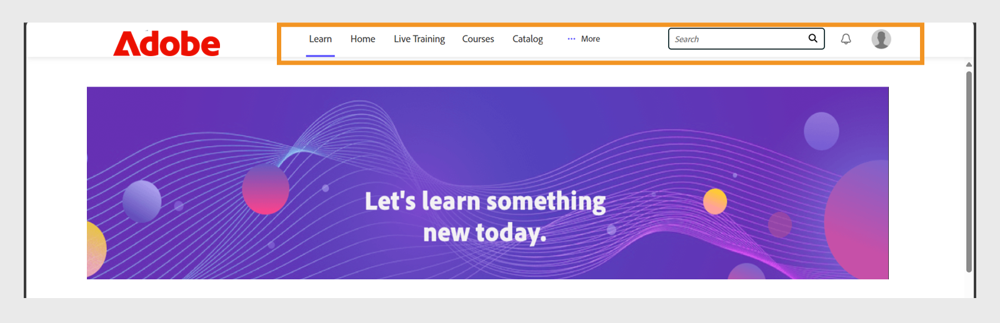

# Personalizar Experience Builder

## Personalizar un pie de página

El pie de página se muestra en la parte inferior de la interfaz del alumno y, por lo general, muestra la información predeterminada configurada en la configuración del administrador. Los administradores pueden reemplazar esto por un pie de página personalizado para crear una experiencia de marca. Con HTML y CSS, pueden definir el diseño, la composición y el contenido del pie de página para que se ajusten a los requisitos de la organización.

Como administrador de una compañía financiera, puede configurar el pie de página mediante la opción personalizada. Esta opción le permite agregar su propio HTML y CSS, lo que le proporciona una flexibilidad completa para diseñar el pie de página.

Para personalizar el pie:

1. Inicie sesión en Adobe Learning Manager como administrador.
2. Seleccione **[!UICONTROL Marca]** y, a continuación, seleccione **[!UICONTROL General]**.
3. Seleccione **[!UICONTROL Editar]** junto a la opción **[!UICONTROL Personalización del pie de página]**.

   
   _Pantalla Configuración general en Adobe Learning Manager, que muestra opciones para habilitar la personalización del pie de página_

4. Seleccione el botón conmutador para habilitar la **[!UICONTROL personalización del pie de página]**.

   
   _Configuración de personalización de pies de página en Adobe Learning Manager, que muestra el conmutador para habilitar el pie de página y los campos personalizados para agregar HTML o CSS para la marca personalizada_

5. Escriba su **[!UICONTROL HTML]** y **[!UICONTROL CSS]** en las pestañas respectivas.

   
   _Pantalla de personalización del pie de página en Adobe Learning Manager, que muestra una sección de HTML personalizada para agregar, editar o aplicar estilo al pie de página de la interfaz del alumno_

6. Seleccione **[!UICONTROL Vista previa]** para ver el pie de página personalizado antes de guardarlo.

   
   _Vista previa de un pie de página de interfaz de alumno personalizado en Adobe Learning Manager, con vínculos categorizados_

7. Seleccione **[!UICONTROL Guardar]**.

El pie de página personalizado se mostrará a todos los alumnos.

## Personalizar los mosaicos del curso

En una empresa financiera, los administradores pueden configurar los mosaicos de los cursos para decidir qué detalles ven los alumnos. Por ejemplo, pueden mostrar la descripción del curso y el nombre de la aptitud para el curso de formación sobre cumplimiento, pero ocultar las calificaciones o el nombre del autor para mantener el enfoque en los requisitos obligatorios.

Para personalizar los mosaicos del curso:

1. Inicie sesión en Adobe Learning Manager como administrador.
2. Seleccione **[!UICONTROL Marca]** y, a continuación, seleccione **[!UICONTROL Título del curso]**.
3. Seleccione **[!UICONTROL Editar]**.

   
   _Pantalla Configuración del mosaico del curso en Adobe Learning Manager, que muestra la opción Editar para personalizar el mosaico_

4. Seleccione las opciones siguientes para mostrar u ocultar los detalles relacionados con la información del curso:

   a. **[!UICONTROL Formato]**: Combinado/ Personalizado/ Clase/ Clase virtual: Tipo del objeto de aprendizaje.
b. **[!UICONTROL Duración]**: duración del objeto de aprendizaje.
c. **[!UICONTROL Aptitud/ Producto]**: muestra la aptitud o el producto clave que cubre el curso.
d. **[!UICONTROL Valoración]**: muestra la valoración del alumno del curso.
e. **[!UICONTROL Nombre del autor]**: muestra el nombre del autor del curso
f. **[!UICONTROL Descripción (aparece al pasar el cursor por encima)]**: muestra un breve resumen del curso cuando los alumnos pasan el cursor sobre la tarjeta.
g. **[!UICONTROL Fecha de publicación/fecha de vencimiento (aparece al pasar el ratón por encima)]**: muestra cuándo se publicó el curso o la fecha límite de finalización.

5. Seleccione las opciones siguientes para mostrar u ocultar los detalles relacionados con las acciones del curso:

   a. **[!UICONTROL Botón Añadir a la lista de aprendizaje]**: permite a los alumnos guardar el curso en su lista de aprendizaje personal para futuras referencias.
b. **[!UICONTROL Botón Guardar]**: guarda los cambios realizados en la configuración o las preferencias del curso.
c. **[!UICONTROL Botón Inscribir / Continuar]**: Permite a los alumnos inscribirse en un nuevo curso o continuar un curso que ya han iniciado. Si oculta esta opción, también se eliminarán las acciones No recomendar y Descargar que aparecen junto a ella.

   
   _Pantalla de configuración del icono del curso en Adobe Learning Manager, donde los administradores seleccionan la información y las acciones que se mostrarán a los alumnos_

6. Se muestra una vista previa del mosaico del curso en el lado derecho de la pantalla.

   
   _Pantalla de configuración del icono del curso en Adobe Learning Manager, en la que se resalta la vista previa del icono del curso_

7. Seleccione **Guardar**.

El icono del curso personalizado se mostrará a todos los alumnos.

**Antes de la personalización**


_Mosaico del curso en Adobe Learning Manager antes de la personalización_

**Después de la personalización**


_Mosaico del curso en Adobe Learning Manager después de la personalización_

## Personalización mediante JavaScript y CSS

Como administrador de una empresa financiera, puede personalizar la aplicación del alumno inyectando CSS y JavaScript para adaptarla a la marca y los requisitos normativos de la empresa, lo que le proporciona un control total sobre la apariencia, el diseño y las funciones interactivas de la aplicación.

Para personalizar la interfaz del alumno mediante CSS y JS:

1. Inicie sesión en Adobe Learning Manager como administrador.
2. Seleccione **[!UICONTROL Marca]** y, a continuación, seleccione **[!UICONTROL Configuración de CSS y JS]**.
3. Seleccione **[!UICONTROL Editar]**.
4. Escriba su CSS y JS personalizados en las pestañas correspondientes.

   
   _Pantalla Configuración de CSS y JS en Adobe Learning Manager, donde los administradores pueden agregar CSS y JS personalizados_

5. Seleccione Guardar.

La personalización se mostrará a todos los alumnos.

**Antes de la personalización**

El diseño del menú de inicio del alumno se basa en el diseño predeterminado de Adobe Learning Manager.


_Página de inicio del alumno de Adobe Learning Manager antes de la personalización_

**Después de la personalización**

Después de añadir el siguiente CSS y JS, el menú de la página de inicio del alumno se ha actualizado en función de la personalización.

CSS de ejemplo:

```
p{
display:block;
}

.withExtraMargin{
margin-right: 100px!important;
}
.alm-footer-extraMargin{
margin-top:0;
}

.alm-layout-almLayoutContainer{
margin: 0;
    margin-bottom: 5rem;
}
#page-756 #category-970151 .alm-category-card-cardLink
{
    height: 400px;

}
#page-756 #category-970151 .alm-category-card-header
{
height: 240px!important;
}
#page-656 .alm-category-card-cardLink{
    height: 380px;
background: white;
}
#page-656 .alm-category-card-header{
height: 200px!important;
}

#page-746 #html-636797 {
    background-color: #f7f9fc;
}

#page-746 .alm-layout-almLayoutContainer{
row-gap:0;
margin-bottom:0;
}

.alm-category-card-cardLink{
transition: border .3s ease;
}
.navText{
       font-size: 16px;
    cursor: pointer;
}
.submenuDownCaret{
display:none;}
.alm-catalog-container-pageContainer{
max-width: 1720px;
    width: 100%;
    padding: 0 40px;
    padding: 0 40px;
}


.pagenavbarcontainer.newNavbarContainer{
width: 1230px;
    margin: 0 auto;
}
div[automationid="learner-menu-inside-header"]{
margin-right:100px!important;
}
#searchScope,.searchSeparator,#searchInDropdown{
display:none!important;
}
#right-navbar{
    margin-right: 0;
}
#companyLogoImg{
cursor:pointer;
max-width:190px;
}
.alm-catalog-container-filtersContainer{
width:340px;
}
.alm-training-card-v2-imageFlipContainer{
border:none;
}
.newSearchBoxContainer{
border-radius: 5px !important;
    border-width: 2px !important;
    border-color: rgb(5, 32, 34) !important;
}
.searchBoxFlex{
width:250px!important;
flex-direction: row-reverse;
    padding-right: 10px;
}
.searchPlaceholderIcon svg{
    height: 16px;
    width: 16px;
}
.searchPlaceholderIcon svg path{
fill: black;
}
#page-656 .alm-layout-almLayoutContainer {
    padding-bottom: 5rem;
margin-bottom:0!important;
}
#page-656 .alm-strip-widget-header-stripHeaderContainer{
display:none;
}
#page-656 .content-wrapper{
padding-bottom:50px;
}
.myspan{
position: absolute;
    bottom: 10px;
    display: block;
    width: 85%;
    margin-left: 20px;
    margin-right: 20px;
    border-top: 1px solid #efefef !important;
    color: #5a697c !important;
    text-align: right;
    padding-top: 5px;
}
.alm-app-wrapperComponent{
padding-bottom:100px;}


@media (max-width: 768px) {
#page-656 .alm-category-widget-cardRow{
   flex-direction: column;
gap: 40px;
 }
#page-656 .alm-category-widget-stripCardContainerRow{
    width: 100%;
    display: flex;
    justify-content: center;
  }
}

@media (max-width: 768px) {
    .container2-right {
        display: none!important;
    }
.container-1 .content-wrapper{
    padding: 0 20px!important;
 }
}
```

Ejemplo de JS:

```
console.error("Hello Error")

setTimeout(() =>{
// Step 1: Check if #category-284977 is present
const categoryElement = document.querySelector('#category-284977');

if (categoryElement) {
  // Step 2: Find all elements with .alm-category-card-cardLink
  const cardLinks = categoryElement.querySelectorAll('.alm-category-card-cardLink');

  // Step 3: Loop over them and append span with random calculation
  cardLinks.forEach((link, index) => {
    const span = document.createElement('span');


    // Calculate number = (index+1) * 5
    let number = (index + 1) * 5;
if(index === 2){
number = number +2;
}
if(index == 3){
number = number - 7;
}

    span.textContent = `${number} courses`;
    span.classList.add('myspan');
    link.appendChild(span);
  });
}

},2000)
```


_Página de inicio del alumno de Adobe Learning Manager tras la personalización_

## Personalizar un widget

Los administradores pueden personalizar los widgets de las páginas personalizadas aplicando clases CSS. Por ejemplo, pueden alinear el texto en un widget de cuadro de contenido o ajustar el espaciado entre los mosaicos del curso en el widget Curso y trazados.

>[!TIP]
>
>Inspect abre la página del alumno para identificar los estilos que desea modificar. Copie las clases CSS correspondientes y péguelas en la página Configuración de CSS y JS para aplicar las personalizaciones.

**Antes de la personalización**

La siguiente pantalla es la página de formación de ingenieros de ventas antes de añadir la personalización de CSS.


_Página del alumno del ingeniero de ventas antes de la personalización_

**Después de la personalización**

Después de añadir las siguientes clases de CSS, la página del alumno se actualiza según los estilos definidos en dichas clases. En función del CSS, el texto del widget Cuadro de contenido se ha alineado a la izquierda y los mosaicos del curso ahora tienen un mayor espaciado entre ellos.

```
.alm-custom-content-box-center {
    align-items: baseline;
    text-align: initial;
}
.alm-training-card-v2-imageContainer {
    border: 14px solid var(--prime-color-white);
    border-radius: -1px;
    height: 106%;
    position: relative;
    transition: all .1s ease-in-out;
}
.alm-course-path-widget-cardRow {
    display: flex;
    gap: 135px;
    margin: 0 0 21px;
    padding: 10px;
}
```


_Página del alumno del ingeniero de ventas después de la personalización_

### Clases CSS predefinidas para widgets

A continuación se indican algunas clases CSS predefinidas disponibles para los widgets.

| Nombre del widget | CSS de contenedor |
|---|---|
| Calendario | alm-calendar-widget-container |
| Categoría | alm-category-widget-container |
| Tarjetas de categoría | alm-category-card-container |
| Cumplimiento | alm-compliance-container |
| Cursos y trazados | alm-course-path-widget-container |
| Curso y rutas Tarjetas LO | alm-training-card-v2-card |
| Cuadro de contenido | alm-custom-content-box-container |
| Interacción | alm-leaderboard-container |
| Aprendizaje social | alm-social-learning-container |


