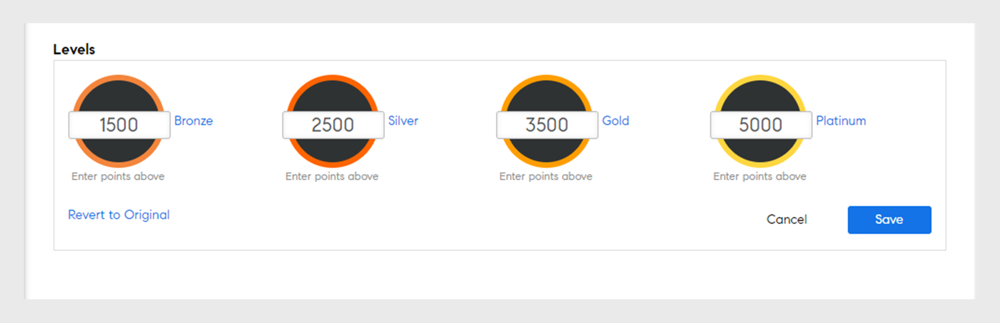

# Interacción

La interacción es el uso del pensamiento lúdico y la mecánica del juego en contextos no lúdicos para atraer a usuarios a ganar puntos mientras aprenden.

## Información general {#overview}

La Adobe Learning Manager incluye una función denominada Interacción, que está diseñada para motivar a los alumnos y fomentar el aprendizaje a través de elementos de juego interactivos. Fomenta el comportamiento deseado de los alumnos mediante recompensas y les permite ganar puntos y competir con sus compañeros. Esta función mejora la participación y la motivación del usuario en la plataforma de aprendizaje.

De forma predeterminada, hay algunos datos y puntos de interacción de muestra para que los usuarios entiendan el patrón. Puede modificar los puntos como corresponda.

<!--A sample illustration is provided below that shows all the tasks and points.

-->

## Configuración de interacción {#gamificationsettings}

Para acceder a la configuración, siga los pasos que se indican a continuación:

1. Inicie sesión como administrador y, en el panel izquierdo, haga clic en **[!UICONTROL Interacción]**.
1. Al crear una nueva cuenta de Learning Manager, la interacción se desactiva de forma predeterminada. Para activarla, haga clic en **[!UICONTROL Activar]** en la esquina superior derecha de la página.

## Establecer puntos {#setuppoints}

Los administradores pueden configurar los puntos de interacción para los alumnos siguiendo los pasos a continuación:

1. Haga clic en **[!UICONTROL Interacción]** después de iniciar sesión como administrador.\
   Aparece una página con una lista de los niveles de bronce, plata, oro y platino y los puntos necesarios para alcanzar cada nivel. Hay una lista de tareas con sus puntos correspondientes.
1. Haga clic en el icono Editar junto a cada tarea para configurar los puntos.
1. Modifique la frecuencia de las tareas, por ejemplo la finalización de un número concreto de cursos por mes, trimestre o año.
1. Haga clic en **[!UICONTROL Guardar]**.

*Configurar puntos*

## Tareas {#tasks}

Hay cinco tareas de interacción de alumnos para las que el administrador puede establecer los puntos. Una ilustración que describe todas las tareas y puntos de los alumnos se muestra a continuación:

>[!NOTE]
>
>Los puntos de interacción para los alumnos de una tarea concreta no son acumulativos. Sin embargo, los puntos se añaden a la cuenta de alumno de forma acumulativa si los alumnos obtienen estos puntos en diferentes tareas.

Mientras asigna cursos a los puntos, el administrador debe asegurarse de que los alumnos obtengan los puntos de manera progresiva.

**Para el alumno que aprende rápido** 

Esta tarea se aplica cuando un alumno finaliza un número específico de cursos en el transcurso de un mes/trimestre/año. Esta tarea es para motivar a los alumnos que aprenden rápido.

Puede ver las posibles situaciones siguientes:

1. Cuando los alumnos completan dos cursos en el transcurso de un mes/trimestre/año, obtienen 20 puntos.
1. Cuando los alumnos completan cuatro cursos en el transcurso de un mes/trimestre/año, obtienen 100 puntos.
1. Cuando los alumnos terminan ocho cursos, obtienen 300 puntos.
1. Cuando los alumnos terminan diez cursos, obtienen 500 puntos.

>[!NOTE]
>
>El administrador puede modificar el período y el número de cursos que se deben completar para obtener los puntos correspondientes.

Dentro de una tarea, los puntos no se otorgan a los alumnos de manera acumulativa. Por ejemplo, supongamos que un alumno completa dos cursos y obtiene 20 puntos. Cuando los alumnos completan cuatro cursos, obtienen 100 puntos, pero los 20 puntos existentes no se tienen en cuenta.

**Para el alumno con motivación propia (a)**

Esta tarea se aplica cuando los alumnos se inscriben en el número prescrito de cursos y se completan en el transcurso de un mes/trimestre/año. En este caso, el administrador puede activar esta tarea para asignar puntos y animarlos.

Situaciones posibles:

1. Cuando los alumnos se inscriben en un curso en el transcurso de un mes/trimestre/año, obtienen 50 puntos.
1. Cuando los alumnos se inscriben en dos cursos en el transcurso de un mes/trimestre/año, obtienen 150 puntos.

>[!NOTE]
>
>El administrador puede modificar el período de tiempo y el número de cursos.

**Para el alumno con motivación propia (b)**

Esta tarea se aplica cuando los alumnos se inscriben y finalizan más cantidad de cursos que los obligatorios para completar en un mes/trimestre/año. En estos casos, el administrador puede activar esta tarea para asignar puntos y motivarlos.

Situaciones posibles para la suscripción de alumnos en cursos además de los cursos asignados:

1. Cuando los alumnos se inscriben en un curso en el transcurso de un mes/trimestre/año, obtienen 20 puntos.
1. Cuando los alumnos se inscriben en dos cursos en el transcurso de un mes/trimestre/año, obtienen 100 puntos.
1. Cuando los alumnos se inscriben en tres cursos en el transcurso de un mes/trimestre/año, obtienen 300 puntos.
1. Cuando los alumnos se inscriben en cuatro cursos en el transcurso de un mes/trimestre/año, obtienen 500 puntos.

>[!NOTE]
>
>El administrador puede modificar el período de tiempo y el número de cursos. Por ejemplo, la tercera situación puede modificarse a cinco cursos en lugar de tres para obtener 80 puntos.

**Para mejorar las aptitudes (a)**

Esta tarea se aplica cuando los alumnos completan un número determinado de competencias. El administrador puede escoger esta tarea para motivar a los alumnos a obtener tantas competencias como sea posible.

Posibles escenarios para mejorar las aptitudes en competencias:

1. Cuando el alumno adquiere una competencia, obtiene 100 puntos.
1. Cuando un alumno adquiere dos competencias, obtiene 300 puntos.
1. Cuando un alumno adquiere tres competencias, obtiene 600 puntos.
1. Cuando un alumno adquiere cuatro competencias, obtiene 900 puntos.

>[!NOTE]
>
>El período de tiempo no es aplicable a esta tarea. El administrador puede modificar el número de cursos para cada situación.

**Para mejorar las aptitudes (b)**

Esta tarea se aplica cuando los alumnos completan cada nivel superior dentro de una competencia.

Situaciones posibles para mejorar las aptitudes en niveles en una competencia particular:

1. Cuando los alumnos logran un nivel, obtienen 100 puntos.
1. Cuando los alumnos logran dos niveles, obtienen 200 puntos.
1. Cuando los alumnos logran tres niveles, obtienen 500 puntos.

>[!NOTE]
>
>El período de tiempo no es aplicable a esta tarea. Si los alumnos obtienen un nivel superior y luego un nivel inferior de una competencia, obtienen puntos solo para el nivel superior.

**Para referencia**

Esta tarea se aplica a los alumnos que hacen referencia a su curso completado en los N días posteriores a su finalización.

Escenario posible: cuando un alumno hace referencia al curso completado en los 30 días siguientes a su finalización, recibe 50 puntos.

**Puntos de finalización anticipada**

Esta tarea se aplica a los alumnos que hacen referencia al curso marcado en un plazo de N días para completarlo.

Escenario posible:\
Cuando un alumno se convierte en uno de los 10 primeros alumnos en completar el curso, obtiene 100 puntos.

**Puntos de finalización a tiempo** 

Esta tarea se aplica a los alumnos que completan un curso en el plazo de un número estipulado de días después de inscribirse en el curso.

Escenario posible:\
Cuando los alumnos completan un curso en los 10 días siguientes al comienzo del curso, obtienen 100 puntos.

**Alumno completo**

Esta tarea se aplica a los alumnos que consumen material de aprendizaje opcional como trabajos previos, recursos y ayudas de trabajo al mes.

Situaciones posibles:

1. Cuando los alumnos completan uno o varios aprendizajes al mes, obtienen 20 puntos.
1. Cuando los alumnos completan dos aprendizajes al mes, obtienen 40 puntos.
1. Cuando los alumnos completan tres aprendizajes al mes, obtienen 80 puntos.

**Aprendizaje coherente**

Esta tarea se aplica a los alumnos que realizan actividades de aprendizaje durante un número específico de días a la semana, al mes o al trimestre. Las actividades incluyen el uso de contenido de aprendizaje, la descarga de recursos y ayudas de trabajo.

Situaciones posibles:

1. Cuando los alumnos realizan actividades de aprendizaje durante un día de la semana, obtienen 20 puntos.
1. Cuando los alumnos realizan actividades de aprendizaje durante dos días a la semana, obtienen 40 puntos.
1. Cuando los alumnos realizan actividades de aprendizaje durante un día de la semana, obtienen 80 puntos.

**Comentarios**

Esto se aplica a los alumnos que proporcionan comentarios sobre los cursos.

Situaciones posibles:

1. Para empezar a valorar los comentarios, obtienen 20 puntos.
1. Para comentarios de reacción, obtienen 20 puntos.
1. Para los comentarios del responsable, obtienen 20 puntos.

## Acciones del administrador {#administratoractions}

El administrador puede crear una lista de usuarios confidenciales, restablecer los puntos de interacción y deshabilitar o habilitar la función de interacción para los alumnos. Seleccione la **[!UICONTROL Configuración]** en la página interacción para ver las acciones como se muestra en la captura de pantalla siguiente.

*Opciones de interacción para un administrador*

## Configuración de confidencialidad {#confidentialitysettings}

Si es necesario, puede hacer que algunos usuarios de administración superiores sean usuarios confidenciales. Las actividades de interacción del usuario confidencial no son visibles para otros alumnos en la Tabla de posiciones.

La configuración de confidencialidad se puede aplicar a usuarios internos y externos.

1. Haga clic en **[!UICONTROL Interacción]** > **[!UICONTROL Configuración]** > **[!UICONTROL Configuración de confidencialidad]**.

*Ver configuración de confidencialidad*

1. En la lista de usuarios, haga clic en la casilla junto al nombre de usuario y seleccione Ocultar para que el usuario se convierta en usuario confidencial.

   >[!NOTE]
   >
   >Puede identificar a los usuarios confidenciales de los usuarios de la lista marcando la casilla de verificación correspondiente al nombre de usuario.

1. Haga clic en la ficha Usuarios confidenciales para ver la lista de usuarios confidenciales. De forma predeterminada, no son visibles. Haga clic en el icono de la flecha desplegable para ver la lista.
1. Haga clic en la casilla de verificación junto al nombre de usuario en la lista de usuarios confidenciales y seleccione Añadir para eliminar a los usuarios de la lista confidencial.

## Restablecer la interacción {#resetgamification}

Puede restablecer los puntos de interacción obtenidos por el alumno y las opciones de configuración. Si elige restablecer la puntuación de los usuarios, todos los puntos que hayan obtenido se borran y se restablecen a cero. Si elige restablecer la puntuación de los usuarios y las opciones de configuración, se restablecen a cero todos los puntos predeterminados asignados a los niveles y las tareas.

El restablecimiento de la configuración de interacción se puede aplicar tanto a usuarios internos como externos.

Para restablecer la configuración y la puntuación del alumno, haga clic en Restablecer interacción y elija una opción según lo que se necesite. Puede elegir entre Restablecer solo las puntuaciones del alumno y Restablecer las puntuaciones del alumno y los parámetros de configuración. Una vez que se haya seleccionado, haga clic en Aceptar.

*Restablecer los puntos de interacción*

## Deshabilitar la interacción {#disablegamification}

Haga clic en [!UICONTROL **Interacción**] > **[!UICONTROL Configuración]** > [!UICONTROL **Función de interacción**]. Podrá habilitar la función Interacción y la Tabla de posiciones por separado para sus alumnos. Seleccione entre Activar para alumnos internos y Activar para alumnos externos según lo que necesite, y haga clic en Aceptar. Se conservan todos los puntos cuando habilita de nuevo la interacción.

*Desactivar interacción*

Puede deshabilitar la interacción para usuarios internos y externos.

## Interacción de niveles de grupo {#grouplevelgamification}

Los administradores pueden definir el ámbito de la interacción cambiando la configuración del ámbito. Puede habilitar la interacción de forma selectiva entre usuarios, grupos o ubicaciones de perfil similares.

1. En el inicio de sesión del administrador, haga clic en **[!UICONTROL Interacción]** en el panel izquierdo.
1. Abrir **[!UICONTROL Interacciones]** > **[!UICONTROL Configuración]** > **[!UICONTROL Configuración del ámbito]**. La [!UICONTROL Configuración del ámbito de interacción] se abre.

   

   *Ver el cuadro de diálogo Configuración del ámbito de interacción*

1. Haga clic en la opción **[!UICONTROL Habilitar configuración de ámbito]**.

1. Seleccione la característica de usuario en la lista desplegable.

   <!---->

1. Seleccione el valor correspondiente a la característica de usuario que ha elegido. Por ejemplo, si seleccionó la característica de usuario como perfil, debe seleccionar el valor de la lista desplegable. Los valores de perfil de ejemplo se muestran en la captura de pantalla siguiente.

   <!---->

1. Haga clic en **[!UICONTROL Guardar].**
