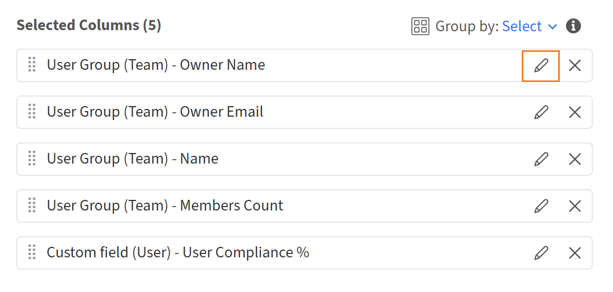

# Introducción a Report Builder

## Información general

Report Builder incluye 15 plantillas prediseñadas diseñadas diseñadas para los casos prácticos de creación de informes de datos de aprendizaje más comunes. Cada plantilla es una configuración de informe lista para usar con columnas, filtros, opciones de agrupación y ordenación ya aplicadas. Las plantillas son de solo lectura. Puede previsualizarlos o duplicarlos para crear una copia editable.

## Acerca de las plantillas

Las plantillas son configuraciones de informes listas para usar proporcionadas por Adobe Learning Manager. Cada plantilla está diseñada para un caso de uso específico, como el seguimiento de la inscripción y la finalización, los informes de cumplimiento o el rendimiento del instructor. Las plantillas aparecen en la pestaña **Plantillas** del Report Builder. Cada plantilla se genera a partir de uno o varios conjuntos de datos y produce un tipo específico de resultados. Para personalizar una plantilla, selecciona **Duplicar** para crear una copia editable en la pestaña **Informes** sin cambiar el original.

## Catálogo de plantillas

### Transcripciones de aprendizaje de usuarios

**Categoría:** Transcripciones, Seguimiento de finalización y progreso

**Descripción:** Rellena el historial de aprendizaje de cada alumno, y muestra todas las inscripciones, los estados, las puntuaciones, las fechas límite y el tiempo empleado en todos los tipos de objetos de aprendizaje.

**Usar cuando:** Necesitas una exportación completa y lista para auditar de la actividad del alumno para auditorías de cumplimiento, casos de asistencia al alumno o la integración de datos de ALM en un sistema externo.

**Audiencias aplicables:** Educación del cliente, formación de socios, formación de empleados, capacitación de ventas.

**Conjuntos de datos usados:** usuario, objeto de aprendizaje, transcripción (objeto de aprendizaje)

**Columnas de claves:** ID de usuario, nombre de usuario, correo electrónico de usuario, nombre del responsable, estado del usuario, nombre del objeto de aprendizaje, tipo de objeto de aprendizaje, fecha de inscripción, fecha de finalización, estado, porcentaje de progreso, puntuación más alta del usuario, fecha límite de finalización, vencido, tiempo empleado (minutos)

**Filtros aplicados:** Fecha de inscripción en el último año; Catálogo = Catálogo predeterminado

### Resumen del progreso del alumno

**Categoría:** Transcripciones, Seguimiento de finalización y progreso

**Descripción:** Realiza un seguimiento del progreso de cada alumno en relación con las rutas de aprendizaje y los cursos asignados, incluida la asignación de jerarquías mediante el ID de objeto de aprendizaje principal.

**Usar cuando:** Quieres ver dónde se encuentra cada alumno en una ruta de aprendizaje:* quién está en curso, quién ha vencido y quién corre el riesgo de perder una fecha límite.

**Audiencias aplicables:** Educación del cliente, formación de socios, formación de empleados, capacitación de ventas.

**Conjuntos de datos usados:** usuario, objeto de aprendizaje, transcripción (objeto de aprendizaje)

**Columnas de claves:** ID de usuario, nombre de usuario, correo electrónico de usuario, nombre del responsable, ID de objeto de aprendizaje, nombre de objeto de aprendizaje, tipo de objeto de aprendizaje, ID de objeto de aprendizaje principal, fecha de inscripción, fecha límite de finalización, estado, porcentaje de progreso, vencido, fecha de inicio, fecha de finalización

**Filtros aplicados:** Fecha de inscripción en el último año; Tipo de objeto de aprendizaje = Ruta de aprendizaje o curso; Catálogo = Catálogo predeterminado

### Tablero de alumnos activos

**Categoría:** Uso de plataforma y participación de alumnos

**Descripción:** resumen mensual de la participación en la plataforma por alumno, en el que se muestran los cursos a los que se ha accedido, las finalizaciones y el tiempo total dedicado.

**Utilízalo cuando:** Quieras identificar a tus alumnos más y menos comprometidos durante el último año y ver cómo las tendencias de participación cambian cada mes.

**Audiencias aplicables:** Educación del cliente, formación de socios, formación de empleados, capacitación de ventas.

**Conjuntos de datos usados:** usuario, transcripción (objeto de aprendizaje)

**Columnas de claves:** ID de usuario, nombre de usuario, correo electrónico de usuario, nombre del responsable, estado del usuario, fecha del último acceso (mes), cursos únicos a los que se ha accedido, inscripciones completadas, tiempo total dedicado (minutos)

**Filtros aplicados:** Fecha del último acceso del usuario en el último año; Estado de usuario = Activo; Catálogo = Catálogo predeterminado

**Agrupar por:** Campos de usuario + Mes de la fecha del último acceso

**Agregados:** Recuento Único en ID de objeto de aprendizaje (acceso a cursos únicos), Recuento si Estado = Completado (inscripciones completadas), Suma del tiempo empleado (tiempo total dedicado)

### Informe de alumnos inactivos

**Categoría:** Uso de plataforma y participación de alumnos

**Descripción:** Identifica a los usuarios activos sin acceso a la plataforma en el último año, y muestra sus últimas fechas de inscripción y finalización.

**Usar cuando:** Tienes que encontrar cuentas latentes para volver a comprometerte con las campañas, revisar licencias o limpiar cuentas.

**Audiencias aplicables:** Educación del cliente, formación de socios, formación de empleados, capacitación de ventas.

**Conjuntos de datos usados:** usuario, transcripción (objeto de aprendizaje)

**Columnas de claves:** ID de usuario, nombre de usuario, correo electrónico de usuario, nombre del responsable, fecha de creación del usuario, fecha de último acceso del usuario, fecha de la última inscripción, fecha de la última finalización

**Filtros aplicados:** Fecha de último acceso del usuario NO incluida en el último año; Estado de usuario = Activo; Catálogo = Catálogo predeterminado

**Agrupar por:** Id. de usuario, Nombre de usuario, Correo electrónico de usuario, Nombre del administrador, Fecha de creación del usuario, Fecha del último acceso del usuario

**Agregados:** Máximo en la fecha de inscripción (fecha de la última inscripción), Máximo en la fecha de finalización (fecha de la última finalización)

### Nueva adopción de alumno

**Categoría:** Uso de plataforma y participación de alumnos

**Descripción:** Realiza un seguimiento de la participación de incorporación de los usuarios creados en el último año, por ejemplo, las primeras inscripciones, las finalizaciones y el total de cursos a los que se ha accedido.

**Usar cuando:** Quieres medir la rapidez con la que los nuevos usuarios pasan de la creación de cuentas a su primera inscripción y finalización, una métrica clave de estado de incorporación.

**Audiencias aplicables:** Educación del cliente, formación de socios, formación de empleados, capacitación de ventas.

**Conjuntos de datos usados:** usuario, transcripción (objeto de aprendizaje)

**Columnas de claves:** ID de usuario, nombre de usuario, correo electrónico de usuario, nombre del responsable, fecha de creación del usuario, fecha del último acceso del usuario, fecha de la primera inscripción, fecha de la primera finalización, total de cursos a los que se ha accedido, cursos completados

**Filtros aplicados:** Fecha de creación del usuario en el último año; Estado de usuario = Activo; Catálogo = Catálogo predeterminado

>[!NOTE]
>
>Esta plantilla utiliza una unión a la izquierda entre los conjuntos de datos Usuario y Transcripción para que los usuarios con cero inscripciones sigan apareciendo en el informe. Esto permite identificar nuevos usuarios que aún no han iniciado su recorrido de aprendizaje.

**Agrupar por:** Id. de usuario, Nombre de usuario, Correo electrónico de usuario, Nombre del administrador, Fecha de creación del usuario, Fecha del último acceso del usuario

**Agregados:** mín. en la fecha de inscripción (fecha de primera inscripción), mín. en la fecha de finalización (fecha de primera finalización), recuento único en el ID de objeto de aprendizaje (total de cursos a los que se ha accedido), recuento si estado = completado (cursos completados)

### Aprendizaje por grupo de usuarios

**Categoría:** Usuarios, grupos y estructura de organización

**Descripción:** Compara la actividad de aprendizaje en los segmentos de la organización: alumnos activos, cursos a los que se tiene acceso, finalizaciones y tiempo dedicado por grupo.

**Usar cuando:** Deseas comparar la participación en todos los departamentos, funciones de trabajo o cualquier grupo de usuarios activo basado en campos.

**Audiencias aplicables:** Educación del cliente, formación de socios, formación de empleados, capacitación de ventas.

**Conjuntos de datos usados:** Grupo de usuarios (campo activo), Transcripción (objeto de aprendizaje)

**Columnas clave:** ID de grupo de usuarios, nombre de grupo de usuarios, recuento de miembros, alumnos activos, total de cursos únicos a los que se ha accedido, inscripciones completadas, tiempo total dedicado (minutos)

**Filtros aplicados:** Fecha de inscripción en el último año; Catálogo = Catálogo predeterminado; Nombre del grupo de usuarios (campo activo) = Perfil (campo activo)

**Agrupar por:** Id. de grupo de usuarios, nombre de grupo de usuarios, número de miembros

**Agregados:** Recuento Único en ID de usuario (alumnos activos), Recuento Único en ID de objeto de aprendizaje (total de cursos únicos a los que se ha accedido), Recuento si Estado = Completado (inscripciones completadas), Suma del tiempo empleado (tiempo total dedicado)

### Aprendizaje por ubicación

**Categoría:** Usuarios, grupos y estructura de organización

**Descripción:** Compara la actividad de aprendizaje en distintas ubicaciones geográficas: alumnos activos, cursos a los que se ha accedido, finalizaciones y tiempo dedicado por ubicación.

**Usar cuando:** Necesitas comparar el estado del aprendizaje en todas las regiones sin segmentar los datos manualmente. Resulta útil para organizaciones globales con alumnos distribuidos geográficamente.

**Audiencias aplicables:** Educación del cliente, formación de socios, formación de empleados, capacitación de ventas.

**Conjuntos de datos usados:** Grupo de usuarios (campo activo), Transcripción (objeto de aprendizaje)

**Columnas clave:** ID de grupo de usuarios, nombre de grupo de usuarios, recuento de miembros, alumnos activos, total de cursos únicos a los que se ha accedido, inscripciones completadas, tiempo total dedicado (minutos)

**Filtros aplicados:** Fecha de inscripción en el último año; Catálogo = Catálogo predeterminado; El nombre del grupo de usuarios (campo activo) contiene &quot;Ubicación&quot;

**Agrupar por:** Id. de grupo de usuarios, nombre de grupo de usuarios, número de miembros

**Agregados:** Recuento Único en ID de usuario (alumnos activos), Recuento Único en ID de objeto de aprendizaje (total de cursos únicos a los que se ha accedido), Recuento si Estado = Completado (inscripciones completadas), Suma del tiempo empleado (tiempo total dedicado)

### Aprendizaje por responsable

**Categoría:** Usuarios, grupos y estructura de organización

**Descripción:** Resume el rendimiento de aprendizaje de toda la jerarquía de equipos de cada responsable: alumnos activos, finalizaciones y tiempo dedicado.

**Utilícelo cuando:** Desee comparar la participación del equipo entre los jefes e identificar los equipos con tasas de finalización bajas o tiempo dedicado en relación con el tamaño del equipo.

**Audiencias aplicables:** Educación de los empleados, capacitación de ventas.

**Conjuntos de datos usados:** grupo de usuarios (equipo), transcripción (objeto de aprendizaje)

**Columnas clave:** ID de responsable, nombre del responsable, correo electrónico del responsable, recuento de miembros (equipo completo), alumnos activos, total de cursos únicos a los que se ha accedido, inscripciones completadas, tiempo total dedicado (minutos)

**Filtros aplicados:** Fecha de inscripción en el último año; Catálogo = Catálogo predeterminado

**Agrupar por:** Id. de propietario (Id. de responsable), Nombre de propietario, Correo electrónico de propietario, Recuento de miembros

**Agregados:** Recuento Único en ID de usuario (alumnos activos), Recuento Único en ID de objeto de aprendizaje (total de cursos únicos a los que se ha accedido), Recuento si Estado = Completado (inscripciones completadas), Suma del tiempo empleado (tiempo total dedicado)

>[!NOTE]
>
>Esta plantilla utiliza el conjunto de datos del grupo de usuarios (Equipo), que captura toda la jerarquía del equipo bajo cada responsable. No se necesita ningún filtro de grupo de usuarios adicional.

### Resumen de inscripción

**Categoría:** Transcripciones, Seguimiento de finalización y progreso

**Descripción:** recuentos de inscripción en el nivel del curso desglosados por estado: completado, en curso y no iniciado para cada objeto de aprendizaje.

**Usar cuando:** Desea una vista rápida del embudo de inscripción de cada curso: cuántos alumnos han comenzado, cuántos están en curso y cuántos han finalizado.

**Audiencias aplicables:** Educación del cliente, formación de socios, formación de empleados, capacitación de ventas.

**Conjuntos de datos usados:** objeto de aprendizaje, transcripción (objeto de aprendizaje)

**Columnas clave:** ID de objeto de aprendizaje, nombre de objeto de aprendizaje, tipo de objeto de aprendizaje, estado de objeto de aprendizaje, total de alumnos inscritos, inscripciones completadas, inscripciones en curso, inscripciones no iniciadas

**Filtros aplicados:** Fecha de inscripción en el último año; Catálogo = Catálogo predeterminado

**Agrupar por:** ID de objeto de aprendizaje, nombre, tipo, estado

**Agregados:** Recuento Único en el ID de usuario (total de alumnos inscritos), Recuento si el estado = Completado, Recuento si el estado = En curso, Recuento si el estado = No iniciado

### Análisis de tendencias de inscripción

**Categoría:** Transcripciones, Seguimiento de finalización y progreso

**Descripción:** recuentos de inscripciones y finalizaciones mensuales por objeto de aprendizaje, que muestran cómo evoluciona la aceptación del alumno a lo largo del tiempo.

**Usar cuando:** Deseas ver cuándo aumentan y disminuyen los picos de inscripción en cada curso y si las finalizaciones siguen a las inscripciones en el mismo mes.

**Audiencias aplicables:** Educación del cliente, formación de socios, formación de empleados, capacitación de ventas.

**Conjuntos de datos usados:** objeto de aprendizaje, transcripción (objeto de aprendizaje)

**Columnas clave:** nombre del objeto de aprendizaje, tipo de objeto de aprendizaje, fecha de inscripción (mes), total de alumnos inscritos, inscripciones completadas

**Filtros aplicados:** Fecha de inscripción en el último año; Catálogo = Catálogo predeterminado

**Agrupar por:** Nombre del objeto de aprendizaje, Tipo de objeto de aprendizaje, Fecha del mes de inscripción

**Agregados:** Recuento Único en el ID de usuario (total de alumnos inscritos), Recuento si Estado = Completado (inscripciones completadas)

### Informe de finalización del curso

**Categoría:** Transcripciones, Seguimiento de finalización y progreso

**Descripción:** desglose de finalización por curso con recuentos de estado, fecha de última finalización, progreso promedio y tiempo promedio empleado.

**Usar cuando:** Desea identificar contenido con bajo rendimiento: cursos con alta inscripción pero baja finalización, o cursos con un progreso medio bajo (lo que indica una entrega anticipada).

**Audiencias aplicables:** Educación del cliente, formación de socios, formación de empleados, capacitación de ventas.

**Conjuntos de datos usados:** objeto de aprendizaje, transcripción (objeto de aprendizaje)

**Columnas clave:** ID de objeto de aprendizaje, nombre de objeto de aprendizaje, tipo de objeto de aprendizaje, estado de objeto de aprendizaje, total de alumnos inscritos, inscripciones completadas, inscripciones en curso, inscripciones no iniciadas, fecha de última finalización, porcentaje de progreso medio, tiempo medio dedicado (minutos)

**Filtros aplicados:** Fecha de inscripción en el último año; Catálogo = Catálogo predeterminado

**Agrupar por:** ID de objeto de aprendizaje, nombre, tipo, estado

**Agregados:** Recuento Único en Id. de usuario, Recuento si Estado = Completado/En curso/No iniciado, Máximo en la fecha de finalización, Promedio en el porcentaje de progreso, Promedio en el tiempo empleado

### Tablero de tendencias de finalización

**Categoría:** Transcripciones, Seguimiento de finalización y progreso

**Descripción:** recuentos de finalizaciones mensuales por objeto de aprendizaje, con tiempo promedio dedicado y progreso, con un ámbito solo para las inscripciones completadas.

**Utilícelo cuando:** Desee realizar un seguimiento de si las tasas de finalización están creciendo mes tras mes y si los alumnos que finalizan lo están haciendo a fondo o se están apresurando a hacerlo.

**Audiencias aplicables:** Educación del cliente, formación de socios, formación de empleados, capacitación de ventas.

**Conjuntos de datos usados:** objeto de aprendizaje, transcripción (objeto de aprendizaje)

**Columnas clave:** nombre del objeto de aprendizaje, tipo de objeto de aprendizaje, fecha de finalización (mes), total de alumnos completados, tiempo medio dedicado (minutos), progreso medio %

**Filtros aplicados:** Fecha de finalización en el último año; Estado = Completado; Catálogo = Catálogo predeterminado

**Agrupar por:** Nombre del objeto de aprendizaje, Tipo de objeto de aprendizaje, Fecha del mes de finalización

**Agregados:** Recuento único en el ID de usuario (total de alumnos completados), promedio de tiempo empleado, promedio de progreso

>[!NOTE]
>
>Esta plantilla filtra el estado Completado antes de la agrupación, lo que garantiza que solo se incluyan los registros con una fecha de finalización válida y que las fechas nulas no distorsionen la tendencia mensual.

### Tiempo hasta la finalización

**Categoría:** Transcripciones, Seguimiento de finalización y progreso

**Descripción:** Mide el tiempo real dedicado a completar cada curso, promedio, mínimo y máximo, en comparación con la duración diseñada.

**Utilícelo cuando:** Desea identificar los cursos en los que los alumnos tardan mucho más o menos de lo esperado en completarse, lo que puede indicar problemas de longitud o dificultad del contenido.

**Audiencias aplicables:** Educación del cliente, formación de socios, formación de empleados, capacitación de ventas.

**Conjuntos de datos usados:** objeto de aprendizaje, transcripción (objeto de aprendizaje)

**Columnas clave:** ID de objeto de aprendizaje, nombre de objeto de aprendizaje, tipo de objeto de aprendizaje, duración (minutos, diseño), total de alumnos completados, tiempo medio dedicado (minutos), tiempo mínimo dedicado (minutos), tiempo máximo dedicado (minutos)

**Filtros aplicados:** Fecha de finalización en el último año; Estado = Completado; Catálogo = Catálogo predeterminado

**Agrupar por:** ID de objeto de aprendizaje, nombre, tipo, duración (minutos)

**Agregados:** Recuento Único en el Id. de usuario, Promedio/Mín/Máx en el tiempo empleado

**Nota:** La duración (la longitud del curso diseñada) se incluye en el grupo por lo que aparece en la misma fila que el tiempo real empleado, lo que permite la comparación directa sin un campo calculado. Una gran brecha entre el tiempo mínimo y máximo empleado sugiere experiencias de aprendizaje incoherentes.

### Asignaciones de aprendizaje vencidas

**Categoría:** Cumplimiento y certificación

**Descripción:** Enumera los usuarios activos con inscripciones obligatorias vencidas, mostrando la fecha límite, el estado actual y el progreso de cada uno.

**Usar cuando:** Necesitas una lista procesable de alumnos no compatibles para pasar a los responsables o desencadenar flujos de trabajo de reinscripción.

**Audiencias aplicables:** Educación de socios, formación de empleados, capacitación de ventas.

**Conjuntos de datos usados:** usuario, grupo de usuarios (campo activo), objeto de aprendizaje, transcripción (objeto de aprendizaje)

**Columnas de claves:** ID de usuario, nombre de usuario, correo electrónico de usuario, nombre del responsable, nombre de grupo de usuarios (campo activo), ID de objeto de aprendizaje, nombre de objeto de aprendizaje, tipo de objeto de aprendizaje, fecha de inscripción, fecha límite de finalización, estado, porcentaje de progreso, vencido

**Filtros aplicados:** vencidos = Sí; Estado = En curso O No iniciado; Plazo de finalización en el último año; Catálogo = Catálogo predeterminado; Estado de usuario = Activo; Nombre del grupo de usuarios (campo activo) = Perfil (campo activo)

**No se ha aplicado ningún grupo** El resultado es una fila por inscripción vencida, con lo que se conservan todos los detalles del alumno y del curso para la escalación.

>[!NOTE]
>
>El filtro Estado (En curso o No iniciado) actúa como medida de seguridad para excluir los registros marcados incorrectamente como vencidos a pesar de haberse completado.

### Estado de formación obligatorio

**Categoría:** Cumplimiento y certificación

**Descripción:** Vista de cumplimiento completo de todas las inscripciones con una fecha límite de finalización, con todos los estados incluidos, no solo vencidas.

**Utilícelo cuando:** Necesita una imagen de cumplimiento completa en lugar de simples infracciones, por ejemplo, para informar a los líderes sobre las tasas generales de finalización de formación obligatoria.

**Audiencias aplicables:** Educación de los empleados, capacitación de ventas.

**Conjuntos de datos usados:** usuario, grupo de usuarios (campo activo), objeto de aprendizaje, transcripción (objeto de aprendizaje)

**Columnas de claves:** ID de usuario, nombre de usuario, correo electrónico de usuario, nombre del responsable, nombre del grupo de usuarios (campo activo), ID del objeto de aprendizaje, nombre del objeto de aprendizaje, tipo de objeto de aprendizaje, fecha de inscripción, fecha límite de finalización, fecha de finalización, estado, porcentaje de progreso, vencido

**Filtros aplicados:** La fecha límite de finalización no está en blanco; Fecha de inscripción en el último año; Catálogo = Catálogo predeterminado; Estado de usuario = Activo; Nombre del grupo de usuarios (campo activo) = Perfil (campo activo)

**No se ha aplicado ningún grupo** Todos los estados incluidos (completado, en curso, no iniciado, vencido) proporcionan una imagen de cumplimiento completo.

**Nota:** El filtrado de &quot;La fecha límite de finalización no está en blanco&quot; es la lógica clave que identifica sistemáticamente la formación obligatoria en todos los tipos de cursos, independientemente de cómo se configure el estado obligatorio.

## Referencia rápida de plantillas

| **#** | **Nombre de plantilla** | **Categoría** | **Educación interna** | **Educación externa (cliente/socio)** |
|--------|------------------------------|-------------------------------------|------------------|-------------------------------------|
| 1 | Transcripciones de aprendizaje de usuarios | Transcripciones, finalización y progreso | ✓ | ✓ |
| 2 | Resumen del progreso del alumno | Transcripciones, finalización y progreso | ✓ | ✓ |
| 3 | Tablero de alumnos activos | Participación del alumno y uso de la plataforma | ✓ | ✓ |
| 4 | Informe de alumnos inactivos | Participación del alumno y uso de la plataforma | ✓ | ✓ |
| 5 | Nueva adopción de alumno | Participación del alumno y uso de la plataforma | ✓ | ✓ |
| 6 | Aprendizaje por grupo de usuarios | Usuarios, grupos y estructura de la organización | ✓ | ✓ |
| 7 | Aprendizaje por ubicación | Usuarios, grupos y estructura de la organización | ✓ | ✓ |
| 8 | Aprendizaje por responsable | Usuarios, grupos y estructura de la organización | ✓ | ✗ |
| 9 | Resumen de inscripción | Transcripciones, finalización y progreso | ✓ | ✓ |
| 10 | Análisis de tendencias de inscripción | Transcripciones, finalización y progreso | ✓ | ✓ |
| 11 | Informe de finalización del curso | Transcripciones, finalización y progreso | ✓ | ✓ |
| 12 | Tablero de tendencias de finalización | Transcripciones, finalización y progreso | ✓ | ✓ |
| 13 | Tiempo hasta la finalización | Transcripciones, finalización y progreso | ✓ | ✓ |
| 14 | Asignaciones de aprendizaje vencidas | Cumplimiento y certificación | ✓ | ✓ |
| 15 | Estado de formación obligatorio | Cumplimiento y certificación | ✓ | ✗ |

## Usar una plantilla de Report Builder

Da tus primeros pasos rápidamente en Adobe Learning Manager Report Builder personalizando una plantilla prediseñada para informar de casos prácticos habituales.

1. Inicie sesión en Adobe Learning Manager como administrador.
2. Selecciona **Informes** en el panel izquierdo y luego selecciona **Report Builder**.

3. Seleccione la ficha **Plantillas**.
4. Examine las plantillas disponibles. Cada plantilla recibe un nombre por su caso de uso.

   

5. Seleccione un nombre de plantilla para abrir su vista previa de solo lectura. Para este ejemplo, seleccione la plantilla **Compliance % for User&#39;s Team**. Revise las columnas, los filtros aplicados y el orden de clasificación.
6. Seleccione **Duplicar**.

   

Al duplicar una plantilla, Report Builder abre una copia editable con la configuración existente de la plantilla ya cargada. El nombre del informe, la descripción, las columnas, los filtros y la ordenación se pueden editar antes de guardar.

## Nombre y descripción del informe

1. En el campo **Nombre**, reemplace el nombre predeterminado (por ejemplo, *copia de Cumplimiento % para el equipo del usuario*) por un nombre único para el informe. Se requiere un nombre.
2. En el campo **Descripción**, escriba un breve resumen de lo que contiene el informe. Esto ayuda a otros administradores a comprender el propósito del informe cuando lo ven o editan.

## Agregar y configurar columnas

La sección **Columns** tiene dos paneles: **Seleccionar columnas** a la izquierda y **Columnas seleccionadas** a la derecha.

### Agregar una columna

1. En el panel **Seleccionar columnas**, expanda un conjunto de datos seleccionando su nombre. Por ejemplo, **Catalog** o **Active Field User Group**.
2. Seleccione el icono **+** junto a la columna que desea agregar. La columna aparece en el panel **Columnas seleccionadas** de la derecha.

   

3. Para agregar la misma columna más de una vez. Por ejemplo, para aplicar dos agregados diferentes al mismo campo. Vuelva a seleccionar **+** para esa columna.

### Reordenar columnas

Arrastre el controlador a la izquierda de cualquier fila de columna en el panel **Columnas seleccionadas** para moverlo a una posición diferente. El orden de las columnas del panel coincide con el del informe descargado.

### Cambiar el nombre de una columna

1. Seleccione el icono **edit** (lápiz) en una fila de columna.

   

2. Introduzca un alias. El alias aparece como encabezado de columna en el informe descargado en lugar del nombre de campo predeterminado.

   

### Quitar una columna

Seleccione el icono **x** en una fila de columna para quitarlo del informe.

## Aplicar grupo por

El control **Agrupar por** aparece en la parte superior del panel **Columnas seleccionadas**.

1. Seleccionar **Agrupar por: Seleccione**.

   

2. Seleccione las columnas por las que desea agrupar. Puede seleccionar más de uno. En la captura de pantalla, el informe se agrupa por nombre de grupo de usuarios (Equipo) y nombre de usuario (Equipo) y propietario.
3. Cada columna de agrupación seleccionada aparece como una etiqueta debajo del control **Agrupar por**. Para quitar una columna de agrupación, seleccione **x** en su etiqueta.

>[!NOTE]
>
>Cuando se aplica agrupar por, cada columna que no sea una columna de grupo debe tener aplicada una función de agregado. Una columna sin agregado producirá un error.

### Aplicación de un agregado a una columna

1. En cualquier columna que no sea agrupar por del panel **Columnas seleccionadas**, seleccione **Agregar por**.
2. Elija una función en el menú desplegable. En la captura de pantalla, **Recuento de objetos de aprendizaje** usa **Recuento distintivo**, con el alias count_of_courses.

   

Funciones agregadas disponibles:

| **Función** | **Lo que devuelve** |
|--------------------|---------------------------------------------|
| **Recuento** | Número total de filas del grupo |
| **Distintivo de recuento** | Número de valores únicos en el grupo |
| **Contar si** | Número de filas que coinciden con un valor especificado |
| **Suma** | Total de un campo numérico en el grupo |
| **Min** | Valor más bajo del grupo |
| **Máx.** | Valor más alto del grupo |
| **Promedio** | Valor medio en todo el grupo |

## Aplicar filtros

La sección **Filters** está debajo de la sección **Columns**. Los filtros restringen las filas que aparecen en el informe.

1. Para agregar un filtro, seleccione el icono **+** situado a la derecha de la sección Filtros.
2. Elija el campo por el que filtrar.

   

3. Seleccione un operador e introduzca o elija un valor.

Para editar un filtro existente, seleccione el icono **pencil** en la fila del filtro. Para agregar un grupo de filtros anidado, seleccione el icono **+** con corchetes a la derecha de una fila de filtros.

## **Configurar ordenación**

La sección **Sorting** está debajo de la sección **Filters**.

1. Seleccione **+ Agregar ordenación** para agregar una ordenación.
2. Elija la columna por la que desea ordenar y seleccione **Ascendente** o **Descendente**.

   

3. Repita el proceso para añadir ordenaciones secundarias. Arrastre el controlador a la izquierda de cada fila de ordenación para cambiar la prioridad.

>[!TIP]
>
>Aplique siempre al menos una ordenación. Sin la ordenación, el orden de las filas puede diferir entre las descargas del mismo informe.

## Guardar el informe

Seleccione **Guardar informe** en la esquina superior derecha. El informe se guarda en la pestaña **Informes** y está listo para su descarga.

## Prácticas recomendadas

* Utilice alias en cada columna para que el informe descargado tenga encabezados significativos en lugar de nombres de campo como Objeto de aprendizaje: ID de objeto de aprendizaje.
* Utilice **Count Distinct** en lugar de **Count** cuando desee registros únicos, por ejemplo, cursos distintos por catálogo en lugar de filas totales.

* Aplica la ordenación antes de guardar, especialmente en los informes que vas a compartir o a los que te suscribirás.
* Mantenga la descripción actualizada. Otros administradores confían en él para comprender el ámbito del informe sin abrirlo.
