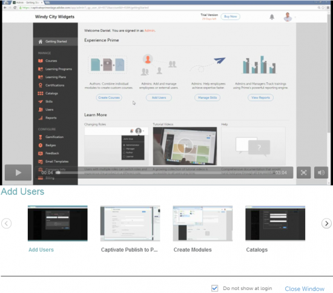

# Primeros pasos como administrador

La página Introducción le ayuda a recorrer las funciones clave de la aplicación.

Tan pronto como inicie sesión como administrador, podrá ver una ventana emergente con una lista de vídeos.

## Ver vídeos de muestra {#viewsamplevideos}

Examine los tutoriales de vídeo de muestra para comprender las funciones clave de su función como administrador. Si no desea que esta ventana emergente aparezca durante el inicio de sesión, puede desactivarla haciendo clic en **[!UICONTROL No mostrar al iniciar sesión]** en la esquina inferior derecha de la ventana emergente.

Haga clic en **[!UICONTROL Cerrar ventana]** para cerrar la ventana emergente.

<!---->

## Página de introducción {#gettingstartedpage}

Desde la página Introducción, puede realizar las siguientes actividades:

* Crear cursos
* Añadir usuarios
* Administrar usuarios
* Ver informes

También puede obtener más información sobre la aplicación Learning Manager viendo vídeos de tutoriales, contenido de ayuda y aprendiendo sobre las distintas funciones.

<!---->
