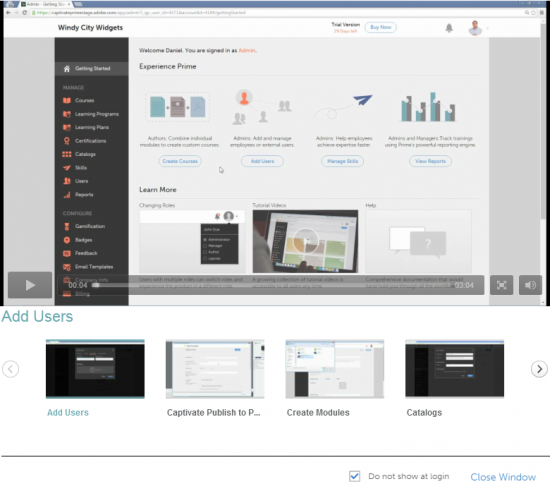

# Introducción a la función de administrador

La página Introducción le permite desplazarse por las funciones principales de la aplicación.

Tan pronto como inicia sesión como administrador, puede ver una ventana emergente con una lista de vídeos.

## Ver vídeos de muestra {#viewsamplevideos}

Examine los tutoriales de vídeo de muestra para comprender las funciones principales de su función como administrador. Si no desea que esta ventana emergente aparezca durante el inicio de sesión, puede desactivarla haciendo clic en **[!UICONTROL No mostrar al iniciar sesión]** en la esquina inferior derecha de la ventana emergente.

Haga clic en **[!UICONTROL Cerrar ventana]** para cerrar la ventana emergente.

## Página Introducción {#gettingstartedpage}

En la página Introducción, puede realizar las siguientes actividades:

* Crear cursos
* Cómo añadir usuarios
* Administrar usuarios
* Ver informes

También puede obtener más información sobre la aplicación Learning Manager al ver los tutoriales de vídeo y el contenido de ayuda y aprender sobre diferentes funciones.

