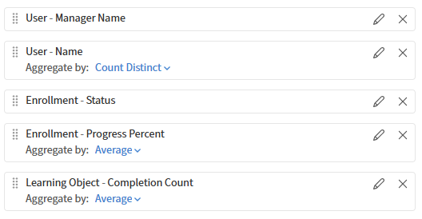

# Aplicar grupos por y agregaciones en Report Builder

## Información general

Agrupar por y agregación le permite generar informes de resumen, como el total de finalizaciones por instructor, el recuento de inscripciones por catálogo o el porcentaje de cumplimiento por región.

## Cuándo utilizar agrupar por

Utilice agrupar por cuando desee una fila por categoría en lugar de una fila por registro. Por ejemplo:

* Una fila por instructor, que muestra el número de sesiones que impartieron
* Una fila por catálogo, que muestra el total de inscripciones
* Una fila por grupo de usuarios, con porcentaje de cumplimiento

Si desea ver registros de alumnos individuales o filas de inscripción individuales, no aplique agrupar por.

Cuando se aplica agrupar por a una columna, todas las demás columnas del informe deben tener aplicada una función de agregado. No se puede mostrar un valor de campo sin formato junto a una columna agrupada; sólo se puede mostrar un valor calculado (recuento, suma, promedio, etc.).

Por ejemplo, si agrupa por **Nombre del instructor**, no puede mostrar valores individuales de **Nombre de sesión** junto a él. En su lugar, aplicaría **Count** al campo Id. de sesión para mostrar cuántas sesiones enseñó cada instructor.

## Aplicar agregaciones y agrupar por

En este ejemplo, comparará el progreso de inscripción de los alumnos. Utilice este informe para comprender el rendimiento de los distintos responsables en términos de progreso y finalización de la inscripción.

### Seleccionar columnas

1. Inicie Report Builder y seleccione **Crear informe**.
2. Escriba el nombre y la descripción del informe:

   * **Nombre:** Compare el progreso de inscripción entre los usuarios
   * **Descripción:** Este informe agrupa a los alumnos por responsable y calcula métricas de resumen como el total de alumnos, el progreso medio y los recuentos de finalización para el estado de inscripción=COMPLETADO

3. Seleccione las siguientes columnas: <dataset>:<column name>

   * Usuario: nombre del responsable
   * Usuario: nombre
   * Inscripción - Estado
   * Inscripción - Porcentaje de progreso
   * Objeto de aprendizaje: recuento de finalización

### Seleccionar Agrupar por columnas

1. Seleccione las siguientes columnas en la sección **Agrupar por**:

   * Inscripción - Estado
   * Usuario: nombre del responsable

   

2. Seleccione **Aplicar**.

### Seleccionar columnas para agregar

Las funciones agregadas resumen el rendimiento de inscripción de alumnos por responsable y estado de inscripción, mostrando recuentos de alumnos distintos, porcentajes medios de progreso de formación y recuentos medios de finalización de objetos de aprendizaje en los registros de formación agrupados.

1. Seleccione **Count Distinct** para User-Name.
2. Seleccione **Promedio** para Inscripción - Porcentaje de progreso.
3. Seleccione **Promedio** para Objeto de aprendizaje - Recuento de finalización.

   

### Aplicar filtros

Aplica filtros para incluir solo inscripciones completadas y excluir registros con nombres de responsables que faltan, lo que garantiza que el informe analice los datos válidos de los alumnos para obtener información precisa sobre el progreso de la formación y la finalización del responsable.

1. Aplique un filtro en el que Inscripción - Estado sea igual a Completado.
2. Aplique un segundo filtro si el nombre de usuario y responsable no está vacío.
3. Combine ambos filtros utilizando la condición Y para incluir solo registros de alumnos completados válidos.

### Guardar y descargar el informe

Seleccione **Guardar informe** y seleccione **Acciones** > **Descargar** para descargar el informe. Recibirás una notificación para descargar el informe (CSV) una vez que esté listo.

El archivo CSV contiene un resumen, a nivel de responsable, de las inscripciones de alumnos finalizadas y el progreso de la formación. Cada fila representa a un responsable e incluye recuentos de alumnos, estado de inscripción, porcentaje medio de progreso y recuentos medios de finalización.

En general, el informe compara la finalización de la formación y la actividad de aprendizaje entre los responsables, destacando las diferencias en la participación del alumno y el número de objetos de aprendizaje completados.
