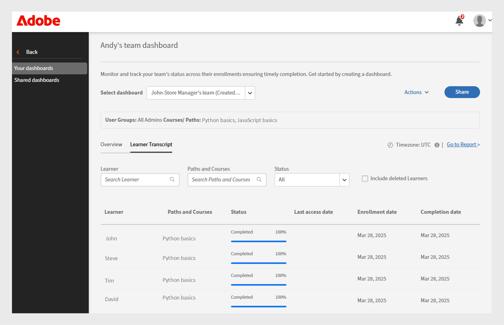
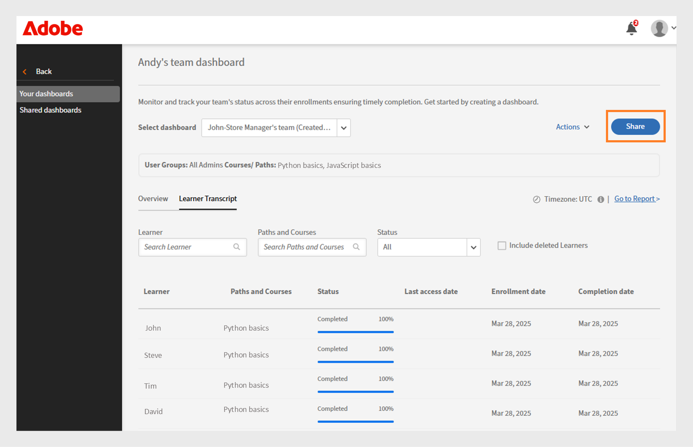

# Panel de éxito de grupo

## Visión General del Panel de Éxito de Grupo

El panel de éxito de grupo (GSD) de Adobe Learning Manager permite a los administradores y responsables supervisar el progreso del alumno en tiempo real (60 minutos de retraso desde la inscripción, el progreso o la finalización hasta la reflexión en el panel) entre departamentos o grupos de usuarios. Permite realizar un seguimiento proactivo de la finalización del curso, la inscripción y las acciones pendientes, lo que facilita la gestión del aprendizaje para equipos. Consulte este [artículo](/help/migrated/administrators/feature-summary/add-users-user-groups.md) para obtener más información sobre los grupos de usuarios.

## Principales casos prácticos

El Panel de éxito de grupo ofrece lo siguiente:

* **Simplifica el seguimiento del progreso del alumno**: el panel de éxito de grupo proporciona una vista fácil de usar y en tiempo real de los datos del alumno, lo que reduce la necesidad de transcripciones basadas en Excel. Los responsables y administradores pueden ver rápidamente las inscripciones de alumnos y el progreso de los cursos para admitir situaciones clave como:

   * **Preparación para la revisión del rendimiento**: los gerentes pueden evaluar el progreso del curso para los miembros del equipo antes de los ciclos de evaluación.
   * **Supervisión del cumplimiento**: identifica a los alumnos que no han completado los cursos de formación obligatorios.
   * **Seguimiento a nivel de equipo**: los gerentes de franquicia, tienda o región pueden asegurarse de que sus equipos completen el aprendizaje requerido a tiempo.

* **Facilita la administración de equipos**: El Panel de éxito de grupo es útil para gerentes con equipos pequeños (menos de 50 personas), como gerentes de tiendas, gerentes de franquicias, gerentes de concesionarios o equipos internos. Proporciona una vista de equipo y permite a los responsables comprobar rápidamente si su equipo ha completado el conjunto de cursos necesario para lograr los objetivos empresariales.

## Cómo utilizar el panel de éxito de grupo

Un administrador puede activar y crear los paneles asignándoles un nombre, seleccionando grupos de usuarios y eligiendo los cursos o las rutas de aprendizaje. Los paneles se pueden compartir con otros administradores o responsables.

### Habilitar el panel de éxito de grupo

El administrador debe habilitar el Panel de control de éxito de grupo para la cuenta. Para activar el panel de éxito de grupo, siga estos pasos:

1. Inicie sesión como administrador.
2. Seleccione **[!UICONTROL Configuración]**&#x200B;y, a continuación, seleccione **[!UICONTROL Informes]**.
3. Seleccione el conmutador **[!UICONTROL Visibilidad del panel]**.
4. Escriba el nombre del panel (por ejemplo, **[!UICONTROL Panel del Administrador de tiendas]**).
   
   _Campos para el nombre del panel, el grupo de usuarios y la selección de la ruta de aprendizaje_
5. Seleccione **[!UICONTROL Visibilidad general]** para habilitar la sección de información general en el panel. Esta sección le permite ver el progreso de hasta 50 alumnos.
6. Para la sección **[!UICONTROL Transcripciones de alumnos]**, seleccione las columnas obligatorias que desea ver.

   * Alumno
   * Trazados y cursos
   * Estado
   * Fecha de inscripción
   * Último acceso
   * Fecha de finalización

Después de habilitar esta función, los administradores pueden ver el panel de éxito de grupo en la sección **[!UICONTROL Informes]**.

### Crear un panel de éxito de grupo

Los administradores pueden crear hasta 100 paneles para ver el progreso de los alumnos. Para crear un tablero, siga estos pasos:

1. Inicie sesión como administrador y seleccione la página **[!UICONTROL Informes]**.

   
   _Seleccionar informes en la página principal del administrador_

2. Seleccione el panel de éxito de grupo. El nombre del panel es **[!UICONTROL Panel del Administrador de tiendas]**.

   
   _Seleccionar panel del Administrador de tiendas_

   >[!NOTE]
   >
   >El nombre que establezca al habilitar el panel de éxito de grupo aparecerá como el nombre del panel.

3. Seleccione **[!UICONTROL Crear nuevo panel]** en la lista desplegable Seleccionar panel.

   
   _Seleccione la opción para crear un GSD_

4. Escriba el nombre del tablero.
5. Seleccione un grupo de usuarios para que aparezca en el tablero.
6. Busque cursos o rutas de aprendizaje y selecciónelos en los resultados.

   
   _Seleccionar grupo de usuarios y cursos_

7. Seleccione **[!UICONTROL Crear panel]**.

Para equipos más grandes, crea un panel seleccionando el grupo de usuarios **Catálogo predeterminado** y **Todos los alumnos** en la pestaña **[!UICONTROL Transcripciones de alumnos]**. Esto incluye a todos los cursos y alumnos en la vista **[!UICONTROL Transcripciones de alumnos]**, lo que facilita la búsqueda y el seguimiento del progreso de cada alumno.

### Ver el panel de éxito de grupo

Después de crear un tablero, el administrador puede verlo siguiendo estos pasos:

1. Inicie sesión como administrador.
2. Seleccione **[!UICONTROL Informes]** y luego **[!UICONTROL Panel de éxito del grupo]**.
El nombre del tablero es Tablero del Administrador de tienda.
3. En la sección **[!UICONTROL Sus paneles]**, seleccione el panel creado en el menú desplegable **[!UICONTROL Seleccionar panel]**.
4. El tablero se divide en:
   * **[!UICONTROL Información general]**: Puedes ver rápidamente el progreso de los alumnos en cursos o rutas de aprendizaje individuales. Puede ver el progreso de hasta 50 cursos o rutas de aprendizaje y 50 alumnos a la vez. Si desea comprobar el progreso de un alumno específico, seleccione la sección **[!UICONTROL Transcripciones de alumnos]**.

   
   _Estado de aprendizaje de los alumnos del equipo del administrador de la tienda_

   * **[!UICONTROL Transcripción del alumno]**: Para ver el progreso del alumno, seleccione un alumno o curso específico. Busque un alumno en el tablero para comprobar su progreso de aprendizaje. Si ha creado el tablero utilizando el catálogo predeterminado y ha incluido a todos los alumnos, puede buscar cualquier alumno para revisar fácilmente su progreso.

   
   _Vista detallada de la transcripción del alumno con columnas para inscripción y finalización_

>[!NOTE]
>
>Para descargar la transcripción detallada del alumno, seleccione **[!UICONTROL Ir al informe]** en la pestaña **[!UICONTROL Transcripciones de alumnos]**.

### Compartir el panel de éxito del grupo

Los administradores pueden compartir paneles con otros administradores o responsables. Siga los pasos para compartir un tablero:

1. Seleccione **[!UICONTROL Informes]** y luego **[!UICONTROL Panel de éxito del grupo]**. El nombre del panel es **[!UICONTROL Panel del Administrador de tiendas]**.
2. Seleccione **[!UICONTROL Compartir]** en la opción **[!UICONTROL Sus paneles]**.

   
   _Seleccionar botón Compartir_

3. Busque usuarios o grupos de usuarios por nombre y selecciónelos.

   
   _Compartir panel con usuarios o grupos de usuarios_

4. Seleccione **[!UICONTROL Continuar]** para compartir el panel.

Puedes ver los detalles del panel compartido en **[!UICONTROL Informes]**, seleccionar **[!UICONTROL Panel de éxito del grupo]** (Panel del administrador de la tienda) y, a continuación, seleccionar **[!UICONTROL Paneles compartidos]**.

_Ver el panel compartido_

>[!NOTE]
>
>El administrador o el administrador personalizado solo pueden ver los catálogos activados en el panel de éxito de grupo que comparte el administrador.

### Limitaciones del panel de éxito de grupo

A continuación se muestra la limitación del Panel de control de éxito de grupo:

* Los certificados recurrentes no se admiten en el tablero.
* La columna **[!UICONTROL Fecha del último acceso]** de la pestaña **[!UICONTROL Transcripciones de alumnos]** muestra actualmente datos de rutas de aprendizaje y certificaciones. Está previsto actualizar en el futuro la asistencia para los cursos.

## Selección de alumnos en varios grupos de usuarios

Cuando selecciona más de un grupo de usuarios, Adobe Learning Manager utiliza reglas específicas para determinar qué alumnos incluir:

* **Grupos de usuarios con el mismo campo Activo**: si los grupos de usuarios usan el mismo campo (por ejemplo, Ubicación), el sistema incluye a todos los alumnos de ambos grupos. Combina los valores. Por ejemplo: **Location = Bangalore** y **Location = Chennai**. Incluye alumnos de ambas ubicaciones.
* **Grupos de usuarios con diferentes campos activos**: si los grupos de usuarios usan campos diferentes (por ejemplo, Ubicación y Función), el sistema incluye solo alumnos que cumplen todas las condiciones. Por ejemplo: **Location = Bangalore o Chennai** y **Role = Manager**. Solo se incluyen los alumnos con la función de responsable y que se encuentran en Bangalore o Chennai.

* Mismo campo activo: los alumnos se combinan (lógica OR)
* Diferentes campos activos: los alumnos deben cumplir todos los criterios (lógica AND)

Este enfoque le ayuda a orientar a los alumnos adecuados en función de las condiciones seleccionadas.
