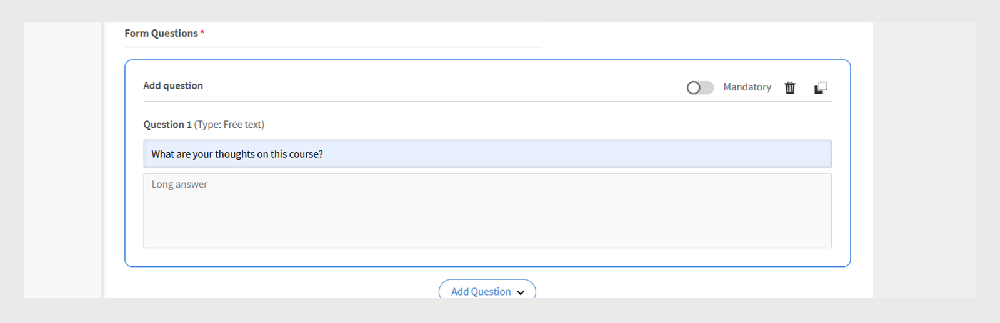

# Formulario de comentarios de L1

>[!IMPORTANT]
>
>La función Comentarios de L1 mejorada se está implementando para determinados clientes. Si no ves esta función en tu cuenta, consulta [Agregar comentarios de L1 y L3](/help/migrated/administrators/feature-summary/courses.md#add-l1-and-l3-feedback) para obtener más información sobre la función de comentarios existente.
>
>Póngase en contacto con el equipo del gestor de éxito del cliente (CSM) para activar el nuevo sistema de comentarios y obtener más información sobre los plazos de migración.

La función de comentarios de nivel 1 (L1) de Adobe Learning Manager permite a los alumnos compartir sus comentarios después de completar un curso o una ruta de aprendizaje. Estos comentarios ayudan a los administradores a evaluar la calidad del curso, la eficacia del instructor y la experiencia de aprendizaje general.

Los administradores ahora pueden crear y administrar varios formularios de comentarios reutilizables y asignarlos a cursos y rutas de aprendizaje específicos.

Esta función proporciona una mayor flexibilidad al permitir a los administradores:

* Crear formularios de comentarios reutilizables
* Personalizar comentarios para diferentes cursos o rutas de aprendizaje
* Asignar formularios personalizados según sea necesario

El **[!UICONTROL Informe de comentarios de L1]** y el **[!UICONTROL Informe de comentarios]** (Informe personalizado) ahora incluyen dos nuevas columnas: Nombre del formulario de comentarios y Versión de comentarios. Estas columnas proporcionan detalles sobre los formularios de comentarios utilizados.

## Crear formulario de comentarios de L1

Los administradores pueden crear varios formularios de comentarios de L1 en el nivel de cuenta y asignar el formulario adecuado a un curso, una ruta de aprendizaje o una certificación.

Para crear un formulario de comentarios de L1:

1. Inicie sesión en Adobe Learning Manager como administrador.
2. Seleccione **[!UICONTROL Formularios de comentarios]**.

   
   _Página principal del administrador que muestra la opción Formularios de comentarios para crear y administrar formularios de comentarios_
3. Seleccione **[!UICONTROL Agregar formulario]**.

   
   _Pantalla de formularios de comentarios que muestra el botón Agregar formulario para crear los formularios de comentarios_
4. Elija el **[!UICONTROL idioma de plantilla predeterminado]** y, a continuación, seleccione **[!UICONTROL Guardar]**.

   
   _Agregue una nueva plantilla que muestre la opción para seleccionar el idioma predeterminado_
5. Escriba el título y la descripción del formulario.

   
   _La página del formulario Agregar comentarios muestra el tipo de opción Título y descripción del formulario_
6. En el menú **[!UICONTROL Agregar pregunta]**, seleccione un tipo de pregunta de los siguientes:

   a. **[!UICONTROL Texto gratuito]**: Permite a los alumnos proporcionar respuestas con sus propias palabras.

   * Escriba su pregunta en el campo de texto **[!UICONTROL Pregunta]**.
   * Para que la pregunta sea obligatoria, seleccione el conmutador **[!UICONTROL Obligatorio]**.
     
     _Agregar una pregunta de texto gratuito al formulario de comentarios_

   b. **[!UICONTROL Escala numérica/NPS]**: los alumnos pueden valorar la satisfacción o probabilidad de recomendar el curso mediante una escala numérica (normalmente de 1 a 10).

   * Escriba su pregunta en el campo de texto **[!UICONTROL Pregunta]**.
   * Seleccione el rango de clasificación (1 a 10).
   * Para que la pregunta sea obligatoria, seleccione el conmutador **[!UICONTROL Obligatorio]**.
     \
     _Agregar una pregunta de escala numérica/NPS al formulario de comentarios_

   c. **[!UICONTROL Escala Likert]**: los alumnos pueden especificar en qué medida están de acuerdo con una afirmación, desde Muy en desacuerdo hasta Muy en acuerdo.

   * Escriba su pregunta en el campo de texto **[!UICONTROL Pregunta]**.
   * Para que la pregunta sea obligatoria, seleccione el conmutador **[!UICONTROL Obligatorio]**.
     
     _Agregar una pregunta de escala Likert al formulario de comentarios_

   d. **[!UICONTROL Puntuación de eficacia del curso]**: escala para medir la eficacia con la que un curso influye en los alumnos mediante un sistema de valoración relativo.

   * Una pregunta predefinida con una escala Likert del 1 al 10 se añadirá al formulario de comentarios.
   * Solo puede agregar una pregunta de **[!UICONTROL Puntuación de eficacia del curso]** y no se puede modificar
     
     _Agregar pregunta Puntuación de eficacia del curso al formulario de comentarios_
7. Seleccione **[!UICONTROL Guardar]**. Puede ver los formularios creados en la sección Comentarios de Forms .

### Vista previa del formulario de comentarios

Puede obtener una vista previa del formulario de comentarios seleccionando Vista previa en inglés (Estados Unidos). Si ha creado el formulario en varios idiomas, también puede obtener una vista previa en cada idioma respectivo. Consulte esta [sección](/help/migrated/administrators/feature-summary/l1-feedback-form.md#add-feedback-forms-in-other-languages) para obtener información sobre cómo agregar formularios de comentarios en otros idiomas.

_La pantalla de formularios de comentarios muestra la opción Vista previa para ver el formulario de comentarios en el idioma predeterminado_

### Añadir formularios de comentarios en otros idiomas

Cree traducciones para las preguntas en el formulario de comentarios en varios idiomas. Sin embargo, solo puede añadir o eliminar preguntas en el idioma predeterminado (como inglés). Para otros idiomas, solo puede traducir las preguntas que se añadieron inicialmente en el idioma predeterminado. No es posible añadir o eliminar preguntas directamente en las versiones traducidas.

1. Seleccione **[!UICONTROL Añadir nuevo idioma]** en el formulario de comentarios.

   
   _Agregar una nueva versión de idioma al formulario de comentarios_
2. Elija el idioma deseado y seleccione **[!UICONTROL Guardar]**.
3. Vaya a la pestaña correspondiente al idioma que haya añadido.
4. Selecciona **[!UICONTROL Traducir]** al lado de cada pregunta para agregar tu traducción.

   
   _La pantalla del formulario de comentarios muestra la opción Traducir para traducir las preguntas a los idiomas respectivos_

   >[!NOTE]
   >
   >La pregunta Puntuación de eficacia del curso se traduce automáticamente.

5. Después de agregar las traducciones, seleccione **[!UICONTROL Guardar]**.

## Establecer un formulario de comentarios como predeterminado

Los administradores pueden establecer formularios de comentarios predeterminados para cursos personalizados, de clase, virtuales y mixtos. Una vez configurado, este formulario predeterminado se presentará automáticamente a los alumnos al finalizar cualquier curso. Este formulario predeterminado se aplicará a todos los cursos, a menos que el administrador decida asignar un formulario de comentarios diferente para cursos específicos.

_La pantalla de formularios de comentarios muestra la opción para establecer el formulario de comentarios predeterminado_

## Configurar comentarios de alumnos

Los administradores pueden configurar las siguientes opciones en la sección Comentarios del alumno:

* **[!UICONTROL Habilitar formulario para capturar los comentarios de los alumnos de este curso]**: Habilite esta opción para recopilar comentarios de los alumnos del curso. Cuando se activa, se solicita a los alumnos que proporcionen comentarios después de completar el curso.
* **[!UICONTROL Configuración de formulario]**: cuando se habilita, el formulario de comentarios se abre automáticamente para los alumnos inmediatamente después de completar el curso, lo que facilita la recopilación de comentarios puntuales.

_La pantalla Comentarios del alumno muestra la configuración de los comentarios del alumno_

>[!NOTE]
>
>Las instancias de curso utilizan el formulario de comentarios predeterminado del nivel del curso. Al crear nuevas instancias, también utilizan la forma predeterminada de nivel de curso en lugar de la de nivel de cuenta.

### Cambiar el formulario de comentarios predeterminado de un curso

El formulario de comentarios predeterminado se aplica a todos los cursos. Como administrador, puede crear un nuevo formulario o elegir uno de la lista existente. Para cambiar los formularios de comentarios predeterminados, los comentarios de los alumnos deben estar activados para este curso.

Para cambiar el formulario de comentarios predeterminado:

1. Seleccione **[!UICONTROL Cursos]** en la página principal del administrador.
2. Seleccione cualquier curso en la sección **[!UICONTROL Curso]**.
3. Seleccione **[!UICONTROL Ver curso]** y, a continuación, seleccione **[!UICONTROL Comentarios de los alumnos]**.

   
   _Las pantallas de comentarios de los alumnos muestran la opción Editar para cambiar el formulario_
4. Seleccione **[!UICONTROL Editar]** en la sección **[!UICONTROL Comentarios del alumno]**.
5. Seleccione **[!UICONTROL Cambiar formulario]**.

   
   En la pantalla _Comentarios del alumno se muestra la opción Cambiar formulario para cambiar el formulario de comentarios del curso_
6. Elige otro formulario de comentarios del menú o selecciona **[!UICONTROL Empezar con un formulario en blanco]** para crear uno nuevo.

   
   _Agregue una pantalla de formulario que muestre la opción de seleccionar de la plantilla disponible o cree un nuevo formulario_
7. Seleccione **[!UICONTROL Guardar]** para aplicar los cambios.

Si un curso utiliza el formulario de comentarios predeterminado y el formulario predeterminado se actualiza en el nivel de cuenta, todos estos cursos reflejarán automáticamente el nuevo formulario. Sin embargo, si un administrador cambia el formulario o asigna un nuevo formulario en el nivel del curso, los cambios futuros en el formulario predeterminado no afectarán al formulario de comentarios de ese curso.

La instancia utilizará el formulario de comentarios de nivel de curso como su valor predeterminado. Si un administrador cambia el formulario de comentarios en el nivel del curso, no afectará al formulario ya establecido en el nivel de instancia. Sin embargo, cualquier nueva instancia creada después del cambio utilizará el formulario de comentarios de nivel de curso actualizado de forma predeterminada.

Siga los mismos pasos para cambiar los formularios de comentarios predeterminados de una ruta de aprendizaje.

>[!NOTE]
>
>Si no cambia el formulario, el curso utilizará el formulario de comentarios predeterminado.

