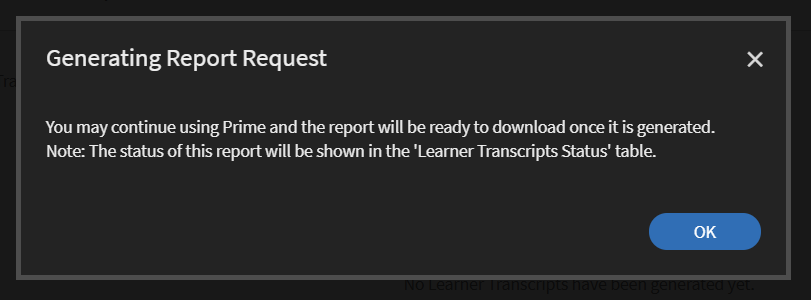
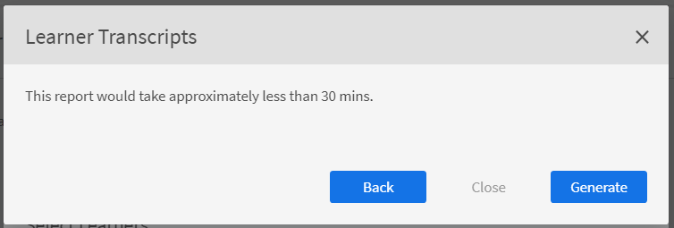

# Transcripciones de alumnos

Descargue la transcripción de alumnos y administre los informes con Learning Manager.

Adobe Learning Manager permite a los administradores de una empresa generar transcripciones asociadas a los alumnos.

## Generar transcripciones de alumnos {#generatelearnertranscripts}

1. Para generar transcripciones de alumnos, haga clic en **[!UICONTROL Informes]** en el panel izquierdo del inicio de sesión del administrador.

   El administrador accede a la ficha **[!UICONTROL Informes personalizados]** > **[!UICONTROL Informes de Excel]** dentro de la página **[!UICONTROL Informes]**.

1. Haga clic en el vínculo **[!UICONTROL Transcripciones de alumnos]**.

   Se muestra la página del historial de **[!UICONTROL transcripciones de alumnos]** con el mensaje: **Todavía no se han generado transcripciones de alumnos** o una lista de descargas que se han activado tras la implementación de la página del historial de transcripciones de alumnos.

   <!---->

   Aparece un cuadro de diálogo con las transcripciones de los alumnos. Elija el intervalo de fechas para el que necesita la transcripción generada.

   >[!NOTE]
   >
   >De forma predeterminada, la fecha de inicio es la fecha de registro del alumno y la fecha de finalización es siempre la fecha actual. Solo puede modificar la fecha de inicio &quot;desde&quot; cuando necesita los datos.

1. Elija los nombres de los alumnos en el campo **[!UICONTROL Seleccionar alumnos]** y haga clic en **[!UICONTROL Generar].**
1. Puede elegir un solo alumno o grupos de alumnos. Para añadir a más de un alumno, haga clic en **[!UICONTROL Añadir más alumnos]**.

   

   *Agregar más alumnos*

1. Puede elegir catálogos específicos activando la casilla de verificación. La transcripción solo se descarga para los catálogos especificados. Puede elegir catálogos específicos seleccionando el catálogo en la lista desplegable **[!UICONTROL Seleccionar catálogos]**.

   

1. Al exportar transcripciones de alumnos, existe una opción, **[!UICONTROL Estado de inscripción]**. Esta lista desplegable contiene las siguientes opciones:

   * Seleccionar todo
   * Completado
   * En curso
   * No iniciado
   * No inscrito

   

   *Seleccionar el catálogo*

1. También puede descargar transcripciones de alumnos que se han eliminado de una cuenta.

   Para descargar transcripciones de alumnos de usuarios eliminados, haga clic en la flecha **[!UICONTROL Opciones avanzadas]** y marque la casilla de verificación **[!UICONTROL Incluir datos de alumnos eliminados]**.

   

   *Descargar transcripciones de alumnos de alumnos eliminados*

1. Puede optar por descargar información del nivel Módulo en la transcripción del alumno marcando la casilla de verificación &quot;**[!UICONTROL Habilitar información del nivel de módulo]**&quot;. En este caso, los nombres de los módulos y el tiempo empleado en cada módulo se extraen como parte de la transcripción si esta opción está habilitada.
1. Puede optar por descargar datos de aptitudes y hojas de resumen marcando la casilla de verificación &quot;**[!UICONTROL Incluir datos de aptitudes y hojas de resumen]**&quot;.

   Las transcripciones se generan y se descargan en el equipo como archivos .zip cuando no se incluyen los datos de aptitudes. Si la casilla de verificación Aptitudes está seleccionada, las transcripciones se generan y se descargan en el equipo como archivos XLS.

## Generar una transcripción de alumno mediante copiar y pegar

La obtención de transcripciones de alumnos se convierte en un proceso tedioso, ya que solo se puede obtener para un alumno o un grupo de usuarios cada vez. Aquí, con la función de copiar y pegar, puede copiar la lista de ID de correo electrónico del alumno y pegarla de una sola vez.

1. Inicie sesión como **[!UICONTROL Administrador]** o **[!UICONTROL Administrador]**.
1. Ve a **[!UICONTROL Informes]** en **[!UICONTROL Administrar]**; se carga la página **[!UICONTROL Actividad de usuario]**.
1. Haga clic en **[!UICONTROL Informes personalizados]** en el panel izquierdo y seleccione **[!UICONTROL Transcripciones de alumnos]** en la lista.
1. En la página **[!UICONTROL Transcripciones de alumnos]**, haga clic en el botón **[!UICONTROL Generar nuevo]** en la esquina superior izquierda.
1. Seleccione las fechas que prefiera. Para ello, haga clic en el menú desplegable **[!UICONTROL Seleccionar intervalo de fechas]**. Haga clic en la pestaña **[!UICONTROL ID de correo electrónico]** para introducir la lista copiada de ID de correo electrónico únicos.

   

   *Copiar y pegar ID de correo electrónico*

1. Utilice **[!UICONTROL Validar ID de correo electrónico]** para verificar si el ID introducido es correcto.

   

   *Validar los ID de correo electrónico*

   En caso de que el ID de correo electrónico introducido sea incorrecto, se resaltará en rojo junto con un mensaje de validación como el anterior.

   El botón **[!UICONTROL Generar]** no estará disponible a menos que todos los ID de correo electrónico introducidos sean correctos.

   

   *Generar transcripciones de alumnos*

1. Haga clic en el botón **[!UICONTROL Generar]** para generar transcripciones de alumnos para todos los ID de correo electrónico mencionados. Recibirá un mensaje de confirmación como el anterior, en el que se indica que se ha generado el informe.

   

   *Mensaje de confirmación de la generación del informe*

   La generación de transcripciones de alumnos se puede combinar para los ID de correo electrónico introducidos en la ficha **[!UICONTROL Usuarios]** e **[!UICONTROL ID de correo electrónico]**.

## Historial de descargas de transcripciones de alumnos {#ltdownload}

En la página de descargas **[!UICONTROL Transcripciones de alumnos]**, para generar un informe, al hacer clic en el botón **[!UICONTROL Generar nuevo]**, se muestra el cuadro de diálogo Transcripciones de alumnos.

*Generar un informe de todas las transcripciones de alumnos*

Haga clic en **[!UICONTROL Opciones avanzadas]** y expanda el panel.

Elija los usuarios y el catálogo al que pertenecen. Después de hacer clic en el botón **[!UICONTROL Generar]**, aparece un cuadro de diálogo que indica el tiempo aproximado que se tardará en descargar el informe. Para generar el informe, haga clic en **[!UICONTROL Generar]**.

*Seleccione el botón Generar*

La transcripción se genera en segundo plano y puede continuar con sus tareas en Learning Manager. Una vez que se genera la transcripción, puede descargar la transcripción de la lista.

Como administrador, puede ver todas las transcripciones generadas por cualquier persona en el sistema.

*Ver historial de descargas*

La lista de descargas muestra los atributos siguientes:

* **Alumnos:** Los alumnos o grupos de alumnos cuyas transcripciones se van a descargar.
* **Datos adicionales incluidos:** Depende de los datos adicionales que el administrador desee descargar de la opción Avanzadas en el modo Agregar transcripción de alumno.
* **Estado:** Descargado, En Cola o En curso.
* **Desde** y **Hasta**: Duración de las transcripciones que se van a descargar.
* **Filtros aplicados:** Determina si ha aplicado los filtros del estado de inscripción.
* **Generado por:** Identificador de usuario del usuario de Learning Manager que ha solicitado la descarga.
* **Estado:** Descargado, En Cola o En curso.

Puede cancelar la descarga en cualquier momento. Si el administrador cancela un trabajo, Learning Manager envía una notificación integrada en la aplicación al usuario que activó la transcripción del alumno.

*Cola de descargas de transcripciones de alumnos*

Puedes **cancelar** la descarga en cualquier momento. Si se cancela un trabajo, Learning Manager envía una notificación integrada en la aplicación al usuario que ha cancelado el trabajo.

## Datos de alumnos eliminados {#dataofdeletedlearners}

Puede incluir los datos de los alumnos eliminados en la lista Transcripciones de alumnos. En el cuadro de diálogo Transcripciones de alumnos, habilite la opción **[!UICONTROL Incluir datos de alumnos eliminados]**.

Tras activar la opción y hacer clic en **[!UICONTROL Generar]**, los datos de los alumnos eliminados figuran en la página de descargas Transcripciones de alumnos, como se muestra a continuación:

*Ver datos de alumnos eliminados*

## Personalizar columnas {#customize-columns-lt}

Un administrador puede personalizar las columnas exportadas en un informe de transcripciones de alumnos. Los administradores, los administradores personalizados y los responsables pueden configurar las columnas antes de exportar el informe.

En el cuadro de diálogo **[!UICONTROL Transcripciones de alumnos]**, haga clic en **[!UICONTROL Opciones avanzadas]**. En la sección **[!UICONTROL Configurar formato de exportación]**, elija las columnas que desea exportar.

*Personalizar columnas para exportar*

La personalización solo se permite cuando un usuario descarga la transcripción del alumno en formato .CSV. Cuando se descarga en formato .XLSX, la selección de preferencias de columna no se respeta y se exportan todas las columnas predeterminadas.

## Contenido del archivo de transcripciones de alumnos {#learnertranscriptfilecontent}

Un archivo de transcripciones de alumnos típico se compone de seis hojas de cálculo en un solo archivo. Las hojas de transcripciones de alumnos proporcionan una visión general de los datos, incluido el número de alumnos que participan en cada curso, sus aptitudes, el porcentaje de finalización según el curso o alumno y un tablero de cumplimiento. Estos son los tableros disponibles en las transcripciones de alumnos:

**Transcripciones de alumnos**

En la hoja de cálculo de transcripción de alumno, además de los datos sobre el alumno, se proporciona información sobre el consumo del objeto de aprendizaje como la fecha de inscripción, la fecha de inicio, la nota conseguida o la puntuación de las pruebas. Si los cursos forman parte de un programa de aprendizaje, se enumeran por separado, además de los detalles de consumo de cada curso.

**1- Tablero de actividades de aprendizaje**

En este tablero específico de objetos de aprendizaje, puede ver la cantidad de alumnos de cada curso, programa de aprendizaje o certificación. Puede examinar la hoja de progreso de los alumnos respecto a un determinado objeto de aprendizaje. En esta hoja, se facilitan datos como la cantidad de alumnos que han completado el curso o el programa de aprendizaje, los alumnos que lo están realizando y las fechas de vencimiento de los alumnos.

El progreso de los usuarios del curso concreto se calcula a partir de los campos de Entrada en los que se especifican los umbrales de porcentaje de progreso y la fecha de vencimiento. Por ejemplo, si especifica 7 días y un 70 % en los valores del campo Entrada, se muestra el progreso de los cursos que vencen dentro de 7 días y los cursos que tienen un progreso de más del 70 %. También puede cambiar el período de tiempo en esta hoja, donde se muestran automáticamente en el tablero los datos modificados.

**2- Tablero de actividades de aprendizaje**

En este tablero de aprendizaje, se facilitan datos de un usuario determinado. En este tablero, puede ver los cursos, los programas de aprendizaje o las certificaciones en que se ha inscrito un usuario determinado. Asimismo, la tabla ofrece datos sobre los objetos de aprendizaje completados por el usuario, los objetos de aprendizaje en curso y las próximas fechas de vencimiento para el usuario.

El progreso de los usuarios de cada curso se calcula en función de las entradas que haya especificado. Es decir, los valores de porcentaje de progreso y la fecha de vencimiento. Por ejemplo, si especifica 7 días y un 70 % en los valores del campo Entrada, se muestra el progreso del usuario en los diferentes cursos que vencen dentro de 7 días y en los cursos que tienen un progreso de más del 70 %.

**Aptitud**

En esta hoja, se proporcionan, entre otros, datos como el nombre y el nivel de la aptitud, los créditos necesarios y los obtenidos, y el porcentaje de finalización. A continuación se muestra una captura de pantalla de hoja de cálculo de aptitudes de ejemplo.

*Ejemplo de la hoja de Excel de aptitudes*

**1- Tablero de aptitudes**

En este panel, podrá ver si su empresa está dotada de varias aptitudes. Para una aptitud concreta, puede consultar la cantidad de usuarios de una empresa que deben tener dicha aptitud frente a la cantidad que realmente la tienen. Este tablero también especifica los usuarios que podrían necesitar una actualización de sus aptitudes. Este valor se calcula en función de lo que se indique en el campo Entrada. Por ejemplo, si indica 50 días, el tablero proporciona información sobre los usuarios que podrían necesitar una actualización de sus aptitudes transcurridos 50 días.

**2- Tablero de aptitudes**

Este tablero de aptitudes es más específico del usuario. Puede filtrar uno o varios usuarios y ver su nivel de aptitud en forma de tablero. Con esta hoja, los responsables y los administradores realizan el seguimiento del nivel de aptitud de cada alumno en comparación con el nivel de aptitud que está previsto que adquieran. Asimismo, el tablero de aptitudes indica quiénes son los alumnos que deben poner al día sus aptitudes. La lista de actualización de alumnos se basa en el número de días que se especifican en el campo Entrada.

**Tablero de cumplimiento**

Este tablero tiene dos partes, el informe de cumplimiento de usuario y el informe de cumplimiento por formación. En el informe basado en usuario, el tablero de cumplimiento es válido para efectuar el seguimiento de los alumnos que tienen fechas de vencimiento inminentes relativas a iniciativas importantes de cumplimiento. En el caso del informe basado en formación, puede filtrar por programa de aprendizaje o certificación.

En los dos informes de cumplimiento, filtre por fecha de vencimiento para ver los datos correspondientes.

### Columnas de fecha y hora en la transcripción {#datetime}

Los valores de las columnas siguientes tienen minutos redondeados al minuto más próximo y los segundos a 00:

* Fecha de inscripción (zona horaria UTC)
* Fecha de inicio (zona horaria UTC)
* Fecha de finalización (zona horaria UTC)

*Columnas de fecha y hora en la hoja de Excel*

### Columnas de ID y duración del módulo en la transcripción {#moduledurationandidcolumnsinthetranscript}

La transcripción del alumno también muestra las columnas **[!UICONTROL Duración del módulo]** e **[!UICONTROL ID]**.

*Columnas ID y duración del módulo en la transcripción*

### OTRAS columnas de la transcripción {#ModuledurationandIDcolumnsinthetranscript-1}

| **Columna** | **Descripción** |
|---|---|
| Después | Número de alumnos que obtuvieron la aptitud antes del número de días introducido (valor) que debe actualizarse. |
| Aptitud | Los nombres de las aptitudes asignadas a los alumnos. |
| Nombre del responsable | El nombre del responsable cuyos datos de participación en aptitudes de los subordinados deben mostrarse en la tabla Resumen de la aptitud. |
| Etiquetas de fila | El nombre del alumno con la lista de aptitudes asignadas. |
| El número de aptitudes que debe tener cada usuario. | El número de aptitudes asignadas al alumno. |
| El número de aptitudes que tiene cada usuario. | El número de aptitudes obtenidas por el alumno. |
| El número de aptitudes que se deben actualizar. | El número de alumnos cuya aptitud se debe actualizar. |
| Porcentaje de cumplimiento | El porcentaje de progreso de la aptitud asignada. |
| Ruta incrustada | Estas filas mostrarán el nombre del programa de aprendizaje incrustado. |
| ID de ruta incrustada | Estas filas mostrarán los ID del programa de aprendizaje incrustado |
| Idioma de ruta incrustada | En estas filas, se mostrará el idioma en el que se ha creado el programa de aprendizaje. |
