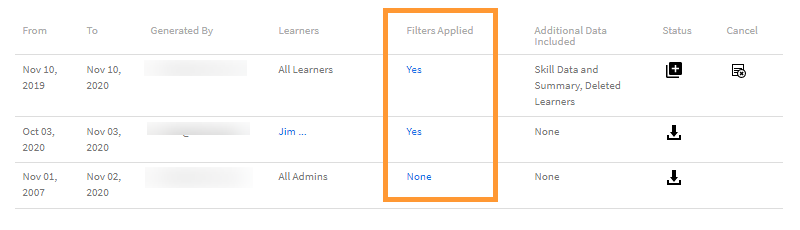

# Transcripciones de alumnos

Descargue la transcripción del alumno y administre informes con Learning Manager.

Adobe Learning Manager permite a los administradores de una empresa generar las transcripciones asociadas a los alumnos.

## Generar transcripciones de alumnos {#generatelearnertranscripts}

1. Para generar transcripciones de alumnos, haga clic en **[!UICONTROL Informes]** en el panel izquierdo del inicio de sesión del administrador.

   El administrador accede a la ficha Informes de Excel dentro de la **[!UICONTROL Informes]** página.

1. Haga clic en el vínculo **[!UICONTROL Transcripciones de alumnos]**.

   La **[!UICONTROL Transcripciones de alumnos]** se muestra la página del historial con el mensaje- **Aún no se han generado transcripciones de alumnos** o una lista de descargas que se han activado tras la implementación de la página de historial de transcripciones de aprendizaje.

   <!---->

   Aparece el cuadro de diálogo Transcripciones de alumnos. Elija el intervalo de fechas para el que necesita generar la transcripción.

   >[!NOTE]
   >
   >De forma predeterminada, la fecha de inicio es la fecha de registro del alumno y la fecha de finalización es siempre la fecha actual. Sólo se puede modificar la fecha de inicio desde el momento en que se necesitan los datos.

1. Elija los nombres de los alumnos en la **[!UICONTROL Seleccionar alumnos]** y haga clic en **[!UICONTROL Generar].**
1. Puede elegir un solo alumno o grupos de alumnos. Para añadir a más de un alumno, haga clic en **[!UICONTROL Añadir más alumnos]**.

   

   *Añadir más alumnos*

1. Puede elegir catálogos específicos activando la casilla de verificación. La transcripción solo se descarga para los catálogos especificados. Puede elegir catálogos específicos seleccionando el catálogo en la **[!UICONTROL Seleccionar catálogos]** lista desplegable.

   

1. Al exportar transcripciones de alumnos, existe una opción: **[!UICONTROL Estado de inscripción]**. Esta lista desplegable contiene las siguientes opciones:

   * Seleccionar todo
   * Completado
   * En curso
   * No iniciado
   * Dado de baja

   

   *Seleccione el catálogo*

1. También puede descargar transcripciones de alumnos que se han eliminado de una cuenta.

   Para descargar transcripciones de usuarios que se han eliminado, haga clic en **[!UICONTROL Opciones avanzadas]** y active la casilla de verificación **[!UICONTROL Incluir datos de alumnos eliminados]**.

   

   *Descargar transcripciones de alumnos de alumnos eliminados*

1. Puede optar por descargar información a nivel de módulo en la transcripción del alumno habilitando la opción &quot;**[!UICONTROL Habilitar información de nivel de módulo]**&quot; en la casilla de verificación. En este caso, los nombres de los módulos y el tiempo empleado en cada módulo se obtienen como parte de la transcripción si esta opción está activada.
1. Puede optar por descargar datos de aptitudes y hojas de resumen habilitando la opción &quot;**[!UICONTROL Incluir datos de aptitudes y hojas de resumen]**&quot; en la casilla de verificación.

   Las transcripciones se generan y se descargan en el equipo como archivos .csv cuando no se incluyen los datos de aptitudes. Si se activa la casilla de verificación Datos de aptitudes, se generan transcripciones y se descargan archivos .xls.

## Generar transcripciones de alumnos usando copiar y pegar

La obtención de transcripciones de alumnos se convierte en un proceso tedioso, ya que solo se puede obtener para un alumno o un grupo de usuarios de uno en uno. Aquí, con la función de copiar y pegar, puede copiar la lista de ID de correo electrónico del alumno y pegarla de una vez.

1. Inicie sesión como **[!UICONTROL Administrador]** o **[!UICONTROL Responsable]**.
1. Vaya a **[!UICONTROL Informes]** bajo **[!UICONTROL Gestionar]**, se carga el **[!UICONTROL Actividad de usuario]** página.
1. Haga clic en **[!UICONTROL Informes personalizados]** en el panel izquierdo y seleccione **[!UICONTROL Transcripciones de alumnos]** de la lista.
1. En la **[!UICONTROL Transcripciones de alumnos]** página, haga clic en **[!UICONTROL Generar nuevo]** en la esquina superior izquierda.
1. Seleccione las fechas preferidas haciendo clic en **[!UICONTROL Seleccionar intervalo de fechas]** desplegable. Haga clic en **[!UICONTROL ID de correo electrónico]** para introducir la lista copiada de ID de correo electrónico exclusivos.

   

   *Copiar y pegar ID de correo electrónico*

1. Uso **[!UICONTROL Validar ID de correo electrónico]** para comprobar si el id introducido es correcto.

   

   *Validar los ID de correo electrónico*

   En caso de que el ID de correo electrónico introducido sea incorrecto, se resaltará en rojo junto con un mensaje de validación como el anterior.

   **[!UICONTROL Generar]** El botón no estará disponible a menos que todos los ID de correo electrónico introducidos sean correctos.

   

   *Generar transcripciones de alumnos*

1. Haga clic en **[!UICONTROL Generar]** para generar transcripciones de alumnos para todos los ID de correo electrónico mencionados. Recibirá un mensaje de confirmación como el siguiente que indica la generación del informe.

   

   *Mensaje de confirmación del informe que se genera*

   La generación de transcripciones de alumnos se puede combinar para los ID de correo electrónico introducidos en ambos **[!UICONTROL Usuarios]** y **[!UICONTROL ID de correo electrónico]** .

## Historial de descargas de transcripciones de alumnos {#ltdownload}

En la **[!UICONTROL Transcripciones de alumnos]** página de descarga, para generar un informe, al hacer clic en **[!UICONTROL Generar nuevo]** , se muestra el cuadro de diálogo Transcripciones de alumnos.

*Generar un informe de todas las transcripciones de alumnos*

Haga clic en **[!UICONTROL Opciones avanzadas]** y expanda el panel.

Elija los usuarios y el catálogo al que pertenecen. Después de hacer clic en **[!UICONTROL Generar]** , aparece un cuadro de diálogo que indica el tiempo aproximado que se tardará en descargar el informe. Para generar el informe, haga clic en **[!UICONTROL Generar]**.

*Seleccione el botón Generar*

La transcripción se genera en segundo plano y puede continuar con sus tareas en Learning Manager. Una vez generada la transcripción, puede descargar la transcripción de la lista.

Como administrador, puede ver todas las transcripciones generadas por cualquier persona en el sistema.

*Ver el historial de descargas*

La lista de descargas muestra los siguientes atributos:

* **Alumnos:** Los alumnos/grupos de alumnos cuyas transcripciones se van a descargar.
* **Datos Adicionales Incluidos:** Depende de los datos adicionales que el administrador desee descargar de la opción Avanzadas en el modo Agregar transcripción de alumno
* **Estado:** Descargado, En Cola o En curso.
* **Desde** y **Para**: Duración de las transcripciones a descargar.
* **Filtros aplicados:** Si ha aplicado los filtros de Estado de inscripción.
* **Generado por:** El ID del usuario de Learning Manager que ha solicitado la descarga.
* **Estado:** Descargado, En Cola o En curso.

Puede cancelar la descarga en cualquier momento. Si el administrador cancela un trabajo, Learning Manager envía una notificación integrada en la aplicación al usuario que activó la transcripción del alumno.

*Cola de descargas Transcripciones de alumnos*

Puedes **rescindir** la descarga en cualquier momento. Si se cancela un trabajo, Learning Manager envía una notificación integrada en la aplicación al usuario que ha cancelado el trabajo.

## Datos de alumnos eliminados {#dataofdeletedlearners}

Puede incluir los datos de los alumnos eliminados en la lista Transcripciones de alumnos. En el cuadro de diálogo Transcripciones de alumnos , habilite la opción **[!UICONTROL Incluir datos de alumnos eliminados]**.

Después de activar la opción y hacer clic en **[!UICONTROL Generar]**, los datos de los alumnos eliminados figuran en la página de descargas Transcripciones de alumnos, como se muestra a continuación:

*Ver datos de alumnos eliminados*

## Personalizar columnas {#customize-columns-lt}

Un administrador puede personalizar las columnas exportadas en un informe de transcripciones de alumnos. Los administradores, los administradores personalizados y los responsables pueden configurar las columnas antes de exportar el informe.

En la **[!UICONTROL Transcripciones de alumnos]** , haga clic en **[!UICONTROL Opciones avanzadas]**. En la **[!UICONTROL Configurar formato de exportación]** , elija las columnas que desea exportar.

*Personalizar columnas para exportar*

La personalización solo se permite cuando un usuario descarga la transcripción del alumno en formato .CSV. Cuando se descarga en formato .XLSX, la selección de preferencias de columna no se respeta y se exportan todas las columnas predeterminadas.

## Contenido del archivo de transcripciones de alumnos {#learnertranscriptfilecontent}

Un archivo de transcripciones de alumnos típico consta de seis hojas de Excel en un único archivo. Las hojas de transcripciones de alumnos proporcionan una visión general de los datos, incluido el número de alumnos que participan en cada curso, sus aptitudes, el porcentaje de finalización según el curso o alumno y un tablero de cumplimiento. A continuación, se indican los paneles disponibles en las transcripciones de alumnos:

**Transcripciones de alumnos**

En la hoja de Excel de la transcripción del alumno, junto con los detalles del perfil del alumno, se proporcionan detalles de consumo del objeto de aprendizaje, como la fecha de inscripción, la fecha de inicio, la nota obtenida y la puntuación de la prueba obtenida. Si los cursos forman parte de un programa de aprendizaje, se enumeran por separado, además de los detalles de consumo de cada curso.

**1- Tablero de actividades de aprendizaje**

En este tablero específico de objetos de aprendizaje, puede ver el número de alumnos de cada curso, programa de aprendizaje o certificación. Puede ver la hoja de progreso de los alumnos para un objeto de aprendizaje concreto. Esta hoja muestra datos como el número de alumnos que han completado el curso o programa de aprendizaje, los alumnos en curso y las fechas de vencimiento de los alumnos.

El progreso de los usuarios para el curso específico se calcula en función de los campos de entrada en los que se especifican los umbrales de porcentaje de progreso y la fecha de vencimiento. Por ejemplo, si especifica 7 días y 70 % como valores en el campo Entrada, se muestra el progreso del curso para los cursos que vencen en 7 días y para los cursos que tienen un progreso superior al 70 %. También puede cambiar el período de tiempo en esta hoja, donde los datos modificados se muestran automáticamente en este panel.

**2 - Tablero de actividades de aprendizaje**

Este tablero de aprendizaje muestra los datos de un usuario específico. Desde este panel, puede ver los cursos, los programas de aprendizaje o las certificaciones en los que se ha inscrito un usuario determinado. La tabla también muestra los datos sobre los objetos de aprendizaje que el usuario ha completado, los objetos de aprendizaje en curso y las fechas de vencimiento próximas para el usuario.

El progreso de los usuarios para cada curso se calcula en función de las entradas que especifique. Es decir, la fecha de vencimiento y los valores de porcentaje de progreso. Por ejemplo, si especifica 7 días y 70 % como valores en el campo Entrada, se muestra el progreso del usuario para los diferentes cursos que vencen en 7 días y para los cursos que tienen un progreso superior al 70 %.

**Aptitud**

En la hoja de aptitudes, se proporciona el nombre de la aptitud, el nivel de aptitud, los créditos necesarios, los créditos ganados, el porcentaje de finalización y otros detalles del perfil. A continuación se proporciona una captura de pantalla de ejemplo de la hoja de cálculo de aptitudes como referencia.

*Ejemplo de la hoja de Excel de aptitudes*

**1- Tablero de aptitudes**

En este tablero, puede ver si su organización está equipada con varias aptitudes. Para una aptitud específica, puede comprobar el número de usuarios de una organización que se supone que tienen esta aptitud frente al número que realmente la tiene. Este tablero también especifica los usuarios que deben actualizar sus aptitudes. Este valor se calcula en función de la entrada que introduzca en el campo Entrada. Por ejemplo, si introduce 50 días como entrada, el tablero proporciona datos sobre los usuarios que necesitan actualizar sus aptitudes pasados 50 días.

**2- Tablero de aptitudes**

Este tablero de aptitudes es más específico del usuario. Puede filtrar uno o varios usuarios específicos y ver su nivel de aptitud como un tablero. Esta hoja puede ayudar a los gestores y administradores a realizar un seguimiento de la cualificación de cada alumno en comparación con la cualificación que se espera que tengan. El tablero de aptitudes también ilumina a los alumnos que deben actualizar sus aptitudes. La lista de actualización de alumnos se calcula en función del número de días que se especifican en el campo Entrada.

**Panel de cumplimiento**

El tablero de cumplimiento consta de dos partes: informe de cumplimiento por usuario e informe de cumplimiento por formación. En el caso del informe basado en usuario, puede utilizar el Panel de cumplimiento para realizar un seguimiento de los usuarios que tienen fechas de vencimiento próximas para iniciativas de cumplimiento importantes. En el informe basado en formación, puede filtrar por programa de aprendizaje o certificación.

Para ambos informes de conformidad, filtre por la fecha de vencimiento para ver los datos adecuados.

### Columnas de fecha y hora en la transcripción {#datetime}

Los valores de las siguientes columnas tienen minutos redondeados al minuto más próximo y segundos a 00:

* Fecha de inscripción (zona horaria UTC)
* Fecha de inicio (zona horaria UTC)
* Fecha de finalización (zona horaria UTC)

*Columnas de fecha y hora en la hoja de Excel*

### Columnas ID y duración del módulo en la transcripción {#moduledurationandidcolumnsinthetranscript}

La transcripción del alumno también muestra las columnas: **[!UICONTROL Duración del módulo]** y **[!UICONTROL ID]**.

*Columnas ID y duración del módulo en la transcripción*

### OTRAS columnas de la transcripción {#ModuledurationandIDcolumnsinthetranscript-1}

| **Columna** | **Descripción** |
|---|---|
| Después | Número de alumnos que obtuvieron la aptitud antes del número de días introducido (valor) que debe actualizarse |
| Aptitud | Los nombres de las aptitudes asignadas a los alumnos. |
| Nombre del responsable | El nombre del responsable cuyos datos de participación en aptitudes de los subordinados se mostrarán en la tabla Resumen de aptitudes |
| Etiquetas de fila | El nombre del alumno con la lista de aptitudes asignadas. |
| Número de aptitudes que debe tener cada usuario | Número de aptitudes asignadas al alumno |
| Número de aptitudes que tiene cada usuario | Número de aptitudes obtenidas por el alumno |
| Número de aptitudes que se deben actualizar | Número de alumnos cuya aptitud se debe actualizar |
| Porcentaje de cumplimiento | El porcentaje de progreso de la aptitud asignada |
| Ruta incrustada | Estas filas mostrarán el nombre del programa de aprendizaje incrustado. |
| ID de ruta incrustada | Estas filas mostrarán los ID del programa de aprendizaje incrustado |
| Idioma de ruta incrustada | En estas filas, se mostrará el idioma en el que se creó el programa de aprendizaje. |
