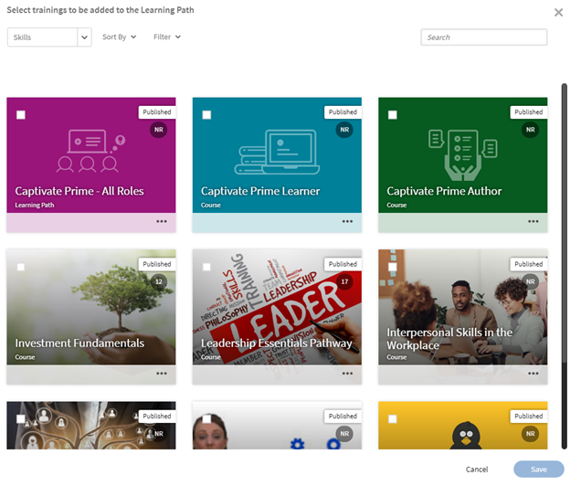

# Rutas de aprendizaje

## ¿Qué es una ruta de aprendizaje?

A menudo, los administradores están interesados en crear un plan de estudios detallado que ofrezca un conocimiento profundo de un tema en particular o un área de experiencia. También puede ser una secuencia de cursos de formación que se espera que completen los empleados o clientes. Esto requiere agrupar un conjunto de cursos y programas para crear un paquete completo de formación.

Aquí es donde la ruta de aprendizaje entra en escena. Una ruta de aprendizaje es un recorrido que un alumno debe recorrer para dominar algún tema a lo largo del tiempo. Los alumnos controlan su experiencia de formación y pueden adquirir y conservar conocimientos a su ritmo personalizado con mayor eficacia.

Por ejemplo, cuando se incorporan nuevos empleados, una organización imparte formación en políticas y procedimientos, cultura, historia, etc. Una ruta de aprendizaje configura los cursos según las necesidades de los empleados, de modo que éstos puedan inscribirse en los cursos según la ruta de aprendizaje establecida para ellos. puede elegir e inscribir usuarios en esta ruta para que puedan avanzar de un curso a otro.

## Crear y configurar rutas de aprendizaje

En este curso de formación, aprenderá a crear una ruta de aprendizaje, añadir un curso, publicar y retirar una ruta de aprendizaje, y configurar instancias dentro de una ruta de aprendizaje.

Si no puedes iniciar el entrenamiento, escribe a <almacademy@adobe.com>.

## Ventajas de una ruta de aprendizaje

Las rutas de aprendizaje hacen que la entrega de un programa de formación sea práctica y sencilla. Estas son algunas de las ventajas clave de una ruta de aprendizaje:

1. Asigne una aptitud y un nivel de aptitud a una ruta de aprendizaje directamente. No es necesario que coincidan los créditos de habilidades. Una vez que el alumno completa una ruta de aprendizaje, alcanza el nivel de aptitud mencionado.
1. Posibilidad de incrustar una ruta de aprendizaje existente en una nueva ruta de aprendizaje. La capacidad de incrustación solo está disponible para 1 nivel de incrustación. Por lo tanto, una ruta de aprendizaje que ya contenga una ruta incrustada no se puede incrustar en una nueva ruta.
1. Posibilidad de añadir requisitos previos, ayudas de trabajo y recursos en el nivel de ruta de aprendizaje.
1. Posibilidad de crear secciones. Cada sección puede tener un título.
1. Posibilidad de hacer que las secciones sean obligatorias y configurar los criterios de finalización.

## Adición de una ruta de aprendizaje en Learning Manager

En Learning Manager, en la aplicación de administración, haga clic en **[!UICONTROL Ruta de aprendizaje]** en el panel izquierdo.

En la página **[!UICONTROL Ruta de aprendizaje]**, haga clic en **[!UICONTROL Agregar]**. Introduzca los detalles.

*Agregar una nueva ruta de aprendizaje*

En la opción **Tipo de inscripción**, seleccione **Inscripción automática** o **Inscripción de administrador**.

>[!NOTE]
>
>Si seleccionas la opción **Inscripción de administrador**, los alumnos solo verán los cursos con nominación de responsable o aprobados por responsable. Los alumnos no podrán ver la ruta de aprendizaje en la sección de recomendaciones.

Después de crear la ruta de aprendizaje, seleccione la ruta de aprendizaje recién creada y añada los cursos en la ruta.

Puede añadir aptitudes y asignar una insignia a la ruta de aprendizaje. Para añadir una aptitud, selecciona la aptitud o aptitudes requeridas en la lista desplegable **[!UICONTROL Elegir una aptitud]**. Seleccione también el nivel de la aptitud o las aptitudes.

*Agregar una aptitud*

Asigne una insignia a la ruta de aprendizaje. Elija una insignia de la lista de insignias disponibles.

Seleccione los productos, roles y nivel de roles de la sección **[!UICONTROL Recomendar para]** para sugerir esta ruta de aprendizaje a los usuarios que hayan expresado interés en esos productos y roles.

*Recomendación*

Elija el tipo de secuencia para las secciones y el curso de formación como Ordenado o Sin ordenar según sus preferencias.

Si elige Ordenado, los cursos aparecen en la misma secuencia en que se crearon. Si elige Sin ordenar, los cursos no aparecen en orden. Los alumnos pueden completar los cursos en cualquier orden.

Para añadir un curso en la ruta de aprendizaje, haga clic en **[!UICONTROL Añadir cursos o rutas de aprendizaje]**.

En el cuadro de diálogo que aparece, seleccione la formación que desea añadir a la ruta de aprendizaje.

*Agregar formación a la ruta de aprendizaje*

Puede ordenar los cursos según las aptitudes asignadas, la fecha de modificación y la eficacia del curso.

Después de seleccionar los cursos o la ruta de aprendizaje, haga clic en **[!UICONTROL Guardar]**.

En la ruta de aprendizaje, puede realizar lo siguiente:

**Crear y configurar una sección:** Se crea una sección para agrupar varios cursos de formación que completen un área o componente sustancial de la formación. Cada sección puede tener un título. Cada sección también puede marcarse como Obligatoria con requisitos de finalización específicos.

**Convertir los cursos en obligatorios en cada sección:** Active o desactive la casilla de verificación Obligatorio si desea o no que los cursos de formación sean obligatorios en la ruta de aprendizaje. Si activa la casilla de verificación, puede hacer que todos los cursos de formación sean obligatorios o que algunos de ellos lo sean.

*Convertir los cursos en obligatorios en cada sección*

**Reorganizar el pedido:** Puede mover los cursos hacia arriba o hacia abajo y cambiar su orden.

*Reorganizar el orden del entrenamiento*

**Quitar un curso:** En la tarjeta del curso, haga clic en X y quite el curso de la ruta de aprendizaje.

*Quitar un curso de la ruta de aprendizaje*

Después de realizar los cambios, para publicar la ruta de aprendizaje, haga clic en Publish.

## Ruta de aprendizaje anidada o mejorada

Una ruta de aprendizaje anidada o mejorada es una ruta de aprendizaje que contiene varias rutas de aprendizaje. Para insertar una ruta de aprendizaje, siga el mismo proceso que para añadir un curso dentro de una ruta de aprendizaje.

*Ruta de aprendizaje anidada o mejorada*

## Configuración de ruta de aprendizaje

En la sección Configuración, puede agregar los requisitos previos y las ayudas de trabajo que un alumno debe realizar antes de iniciar la ruta de aprendizaje. También puede añadir recursos que sean útiles para el alumno.

*Cambiar la configuración de una ruta de aprendizaje*

## Instancias

Las instancias de Ruta de aprendizaje muestran un mosaico adicional, **[!UICONTROL Rutas de aprendizaje]**. El mosaico muestra el número de programas de aprendizaje añadidos a una ruta de aprendizaje.

En el icono **Cursos**, puede ver las instancias de curso que están visibles para los alumnos que se inscriben en esta instancia.

La casilla de verificación **[!UICONTROL Permitir a los alumnos elegir instancias (ruta de aprendizaje flexible)]** solo se aplica a cursos. Todas las rutas de aprendizaje secundarias tendrán la opción de asignar una instancia de programa de aprendizaje a una ruta de aprendizaje. De forma predeterminada, la asignación se establece en Instancia predeterminada.

*Instancias de ruta de aprendizaje*

Los alumnos pueden inscribirse en un curso mediante un plan de aprendizaje o un administrador, incluso si el curso es flexible y requiere que el alumno seleccione una sesión. En estos casos, el sistema permite a los alumnos inscribirse aunque se alcance el límite de puestos, pero no pueden iniciar el curso hasta que haya un puesto disponible.

La función de lista de espera solo se aplica cuando los alumnos se inscriben automáticamente. Cuando una sesión alcanza su límite de puestos, el instructor puede ver la lista de alumnos en lista de espera. Si hay puestos disponibles, el instructor puede añadir alumnos en lista de espera hasta que la sesión alcance su capacidad de nuevo.

## Notificaciones

Hay tres opciones:

1. **[!UICONTROL Cursos y rutas de aprendizaje de todos los niveles de aptitudes (seleccionados de forma predeterminada)]:** El alumno recibe notificaciones de cualquier curso incompleto, independientemente del nivel dentro de una ruta de aprendizaje.
1. **[!UICONTROL Ruta de aprendizaje raíz]:** El alumno recibe notificaciones de cualquier curso incompleto que pertenezca a una ruta de aprendizaje principal.
1. **[!UICONTROL Ruta de aprendizaje + solo elementos secundarios del primer nivel de aptitud]:** El alumno recibe notificaciones de cualquier curso incompleto que sea el primer elemento secundario de una ruta de aprendizaje principal.

Los recordatorios de notificación se activan en función de la opción. De forma predeterminada, la opción **[!UICONTROL Cursos de todos los niveles y rutas de aprendizaje]** está habilitada para una instancia.

## Suscripciones

Puede suscribirse a las rutas de aprendizaje individuales para recibir directamente en su bandeja de entrada datos completos que incluyan las puntuaciones de las pruebas y el estado de los alumnos.

Siga estos pasos:

1. Vaya a cualquier ruta de aprendizaje > Suscripciones.
1. Seleccione Añadir más.
1. Seleccione los detalles y escriba el ID de correo electrónico para recibir los informes.

*Suscribirse a la ruta de aprendizaje individual*

## Nota importante

Tenga en cuenta que la función existente de los programas de aprendizaje cambiará de nombre a Ruta de aprendizaje justo después de la publicación. Si desea continuar llamándolo Programas de aprendizaje, le recomendamos que utilice la función &quot;Terminologías&quot; para aplicar la terminología necesaria. De este modo, puede permitirse utilizar la palabra Programa de aprendizaje.

Las rutas de aprendizaje le ofrecen una amplia gama de funciones. Algunas de ellas están disponibles inmediatamente después de la versión. Los administradores o autores pueden empezar a utilizarlas. Capacidades ampliadas como &quot;Secciones&quot;, &quot;Añadir ruta de aprendizaje en otra ruta&quot;, etc. están desactivadas y se pueden activar marcando la casilla de verificación que se indica a continuación.

Los alumnos pueden seguir consumiendo programas de aprendizaje (ahora denominados rutas de aprendizaje) y los autores/administradores también pueden seguir creándolos. Para aprovechar las funcionalidades ampliadas de la ruta de aprendizaje mencionadas anteriormente, el administrador debe habilitar la configuración como se indica a continuación. Una vez habilitadas, estarán disponibles todas las nuevas funciones ampliadas de la ruta de aprendizaje.

La página **[!UICONTROL Configuración]** > **[!UICONTROL General]** tiene una nueva opción para habilitar las rutas de aprendizaje. Si esta opción está activada, puede añadir cursos y programas de aprendizaje en una ruta de aprendizaje. Una vez activada, no se puede cambiar la opción.

<!-- ## Other Learning Path-related details 

### Learning Path option is disabled/unchecked in Admin Settings

**Accounts using Native Web apps**

**Learners**

* By default, learners will notice a change in terminology from "Learning Program" to Learning Path". This has been done to make the interface more intuitive. If you do not want this change, refer to the below points.  

* This change however will not be reflected in the UI if you have already used the 'Custom Terminology" function to replace the terminology "Learning Programs" with some custom text. 
* In case you had not used the Custom Terminology function yet but now wish to retain "Learning Programs" as the terminology, you can do so via the 'Custom Terminology' feature post the release.

* The overall cosmetic look and feel of erstwhile 'Learning Programs' will get updated to a more visually rich look and feel.

**Authors and Admins**

* The terminology within the Admin/Author apps is the same as that of learners.
* The UI for Authors and Admins to create, update the erstwhile 'Learning Program' objects will now be updated to the new UI. There is no loss of functionality, just that the User Interface to do the operation will be much more intuitive. These UI changes will reflect in your account, even if you have chosen not to enable 'Extended Features of Learning Path', with no loss in functionality. 

* Note that any existing Learning Program objects will not change so there is no impact on learners (other than the terminology point noted above). Authors/Admins might notice a default grouping called "Section" within their existing objects, which would be of no material impact as far as functionality goes. Authors/Admins will also see added functionalities like Skills, Job Aids etc. But as you haven't used it yet, it will not create any impact on the learner side till you actually start using it.

**Reporting**

* If you do not enable the option, Learning Path , there are no changes in the Learner Transcript report structure due to Learning Path. But as communicated in earlier notice (refer to the table shared in earlier communication); one new column will get added to the extreme right of the Learner Transcript immediately after the release.

**Accounts using Headless LMS**

**Learners**

* There are no changes for learners in headless interface. APIs as well that are used to generate the reports does not have immediate changes. 

**Authors and Admins**

* Same changes as that of Authors/Admins stated above.

**Reporting**

* Same changes as that of Reporting stated above.

### Learning Paths option is enabled/checked in Admin Settings

**Accounts using Native Web apps**

**Learners**

* Same changes as that of Learners when the option is disabled.
* As you start using the extended functionality of Learning Paths, Learners will benefit from seeing more elaborate paths with embedded paths and sections, Skills and badges being earned on path completion, resources at path level, and other benefits.

**Authors and Admins**

* Same changes as that of Authors and Admins when the option is disabled.

* Users will get more functionality in crafting elaborate paths. You can define Skill-Levels that would automatically be achieved by a learner on completion of path (not have to focus on the arithmetic of Credits for the levels). Resources can be added at the path level (Not possible as of today). Sections can be created with each section having the ability to have X of Y options. One can embed a Learning Path within another Learning Path (one level of hierarchy supported)

**Reporting**

* A few new columns will get added to the 'Learner Transcript' and 'Content Report' structures to incorporate the new feature of embedding of paths within paths. This may impact integration code that you may have written to export this data to your custom data warehouse/DB outside Learning Manager. This information is communicated in the table provided in earlier communication.

**Accounts using Headless LMS**

**Learners**

* There is no change for your learners, unless you make changes to your headless LMS implementation, as the APIs on which you have built your headless interface will not be changing.
* If you do start using the extended features of Learning Paths by creating new Learning Paths, however you will have to make changes to the headless LMS implementation to reflect those on your learner app. The Learning Manager APIs will allow you to do that.

**Authors and Admins**

* Same changes as that of Authors/Admins stated above.

**Reporting**

* Same changes as that of Reporting stated above. -->
