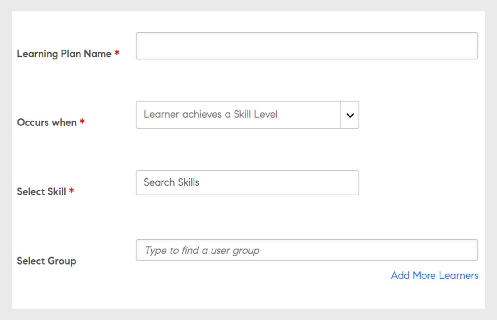

# Planes de aprendizaje

Creación de planes de aprendizaje para administradores de Learning Manager.

## Información general {#overview}

Un plan de aprendizaje es un conjunto de reglas por las que se inscribe a los alumnos en formaciones específicas según determinados criterios.

Un plan de aprendizaje permite que un administrador asigne automáticamente cursos, programas de aprendizaje y certificaciones, basándose en eventos como la incorporación de un nuevo empleado, o un cambio de designación o ubicación de empleados existentes.

Por ejemplo, cuando un empleado llega a una empresa, se le asigna el programa de orientación para empleados nuevos. O, si un empleado asciende a un puesto de responsable, se le asigna un programa de orientación para nuevos responsables.

Puede inscribir alumnos en cualquier curso y programa de aprendizaje de forma automática según un conjunto de eventos predefinidos. Puede crear rutas de aprendizaje para los alumnos asignando automáticamente una actividad de aprendizaje de seguimiento después de que un alumno complete una aptitud, un curso o un programa de aprendizaje.

## Crear planes de aprendizaje {#createlearningplans}

Para crear un plan de aprendizaje, debe iniciar sesión como administrador.

1. En el panel izquierdo, haga clic en **[!UICONTROL Planes de aprendizaje]**. Si hay algún evento, aparece en la página. Si es la primera vez que configura la función de planes de aprendizaje, vaya al siguiente paso.
1. En la esquina superior derecha de la página, haga clic en **[!UICONTROL Agregar]**. En el cuadro de diálogo **[!UICONTROL Añadir plan de aprendizaje]**, introduzca el nombre del plan que debe realizar un empleado.

   

1. En la lista desplegable **[!UICONTROL Se produce cuando]**, elija el evento requerido. Las opciones determinan cuándo realiza el curso un alumno. Después de seleccionar el tipo de evento, seleccione la formación, los cursos, el programa de aprendizaje o la certificación correspondientes.

   **Nota:** Tanto los administradores como los autores pueden crear eventos de inscripción automática.

   Los eventos son:

   **1 - Se añade un nuevo alumno:** Cuando un nuevo usuario o empleado se une a la organización.

   

   **2 - Se añade el alumno a un grupo:** Cuando un nuevo usuario o empleado se une a un grupo.  Introduzca y seleccione el grupo de usuarios de la lista desplegable a la que se aplica este evento. Puede elegir varios grupos. Además, puede asignar este evento a todos los miembros de estos grupos seleccionando la opción.

   

   Este plan de aprendizaje se ha diseñado específicamente para usuarios de un ***grupo personalizado***. Escriba el nombre del grupo en el campo y utilice la búsqueda de escritura anticipada para elegir el grupo (o grupos).

   **3 - El alumno finaliza un objeto de aprendizaje:** El evento se activa cuando un alumno completa cualquier objeto de aprendizaje, como un curso, un programa de aprendizaje, etc. Seleccione el objeto de aprendizaje al que corresponde este evento. Seleccione el estado de finalización para el evento. Si lo desea, también puede elegir el grupo de usuarios al que pertenece este alumno. Indique el número de días, después de completar el objeto de aprendizaje, en el que este evento se activa. Seleccione la opción si desea asignar este evento a los usuarios existentes que ya hayan completado este objeto de aprendizaje.

   

   **4 - El alumno adquiere un nivel de aptitud:** Introduzca el nombre de la aptitud y seleccione el nivel. También puede elegir el grupo de usuarios al que pertenece este alumno. Es opcional. Indique el número de días, después de obtener la aptitud, en el que este evento se activa. Seleccione la opción si desea asignar este evento a alumnos existentes que ya han obtenido esta aptitud.

   

   Especifique también el número de días tras el cual se debe asignar el plan de aprendizaje a los alumnos.

   

   **5 - En una fecha específica:** Cuando los eventos deben ocurrir en una fecha específica. Seleccione la fecha en la que se debe asignar el evento. Seleccione los grupos de usuarios a los que el evento debe asignarse automáticamente. Seleccione las instancias que se deben asignar y, si lo desea, indique después de cuántos días debe activarse el evento.

   

1. Para todos los eventos, puede seleccionar la instancia en la lista desplegable **[!UICONTROL Instancia]**. También puede seleccionar instancias del aprendizaje asignado a cualquier evento.

   

   En Learning Manager, un plan de aprendizaje crea su propia instancia, Automático. Cuando elige un grupo, por ejemplo, el de todos los alumnos, de forma predeterminada todos los alumnos del plan de aprendizaje se inscriben en la instancia Automático.

   Cuando guarde el plan de aprendizaje, la instancia Automático aparecerá como una opción en la lista desplegable **[!UICONTROL Seleccionar instancia]** en la sección de alumnos de un curso.

1. Para guardar el plan de aprendizaje, haga clic en **[!UICONTROL Guardar]**.

## Dar de baja de un curso de formación {#unenroll-training}

Al añadir un plan de aprendizaje, un administrador puede dar de baja a los usuarios de cursos de formación específicos en función de determinados activadores.

En la aplicación de administración, haga clic en **[!UICONTROL Planes de aprendizaje]** > **[!UICONTROL Añadir]**.

Las secciones siguientes representan los activadores en los que la opción **[!UICONTROL Dar de baja de formación]** se ha añadido.

## El alumno se elimina de un grupo {#learnergetsremovedfromagroup}

1. Añada uno o más grupos de usuarios. En el caso de que se seleccionen varios grupos, el plan se activará cuando un alumno se elimine de cualquiera de los grupos mencionados.
1. Elija la acción como **[!UICONTROL Dar de baja de formación]**.

   1. El administrador puede elegir los cursos de formación de los que se dará de baja al usuario cuando se elimine de un grupo de usuarios.
   1. La fecha de instancia y finalización no será aplicable en este escenario.

## El alumno completa un curso de formación {#learnercompletesatraining}

1. Añada uno o más grupos de usuarios. En el caso de que se seleccionen varios grupos, el plan se activará cuando un alumno complete el curso de formación especificado.
1. Elija la acción como **[!UICONTROL Dar de baja de formación]**.

   1. El administrador puede elegir los cursos de formación de los que se dará de baja al usuario cuando se añada a un grupo de usuarios.
   1. La fecha de instancia y finalización no será aplicable en este caso.

## Se añade el alumno a un grupo {#learnergetsaddedtoagroup}

1. Añada uno o más grupos de usuarios. En el caso de que se seleccionen varios grupos, el plan se activará cuando un alumno se añada a cualquiera de los grupos mencionados.
1. Elija la acción como Dar de baja del curso de formación.

   1. El administrador puede elegir los cursos de formación de los que se dará de baja al usuario cuando se añada a un grupo de usuarios.
   1. La fecha de instancia y finalización no será aplicable en este caso.

## El alumno adquiere un nivel de aptitud {#learnerachievesaskilllevel}

1. Especifique la aptitud que se va a obtener.
1. Añada uno o más grupos de usuarios. En el caso de que se seleccionen varios grupos, el plan se activará cuando un alumno adquiera la aptitud seleccionada.

## En una fecha específica {#onaspecificdate}

1. Elija la fecha en la que deben darse de baja los alumnos.
1. Añada uno o más grupos de usuarios. En el caso de que se seleccionen varios grupos, el plan se activará en la fecha y se dará de baja a los usuarios que formen parte de los grupos seleccionados.
1. Elija la acción como Dar de baja del curso de formación.

   1. El administrador puede elegir los cursos de formación de los que se dará de baja al usuario cuando se dé de baja en la fecha especificada.
   1. La fecha de instancia y finalización no será aplicable en este caso.

## Editar un plan de aprendizaje {#editalearningplan}

Después de crear un plan de aprendizaje, el administrador puede editar o actualizar el plan de aprendizaje en cualquier momento. Para editarlo, haga clic en el nombre del plan de aprendizaje y modifique los valores en el cuadro de diálogo **[!UICONTROL Editar plan de aprendizaje]** que aparece. Haga clic en **[!UICONTROL Guardar]**.

## Activar un plan de aprendizaje {#enablealearningplan}

De forma predeterminada, todos los planes de aprendizaje recién creados estarán en estado desactivado. Debe habilitar un plan para que se asigne un alumno. Cuando se activa la casilla de verificación **[!UICONTROL Alumnos actuales]**, el evento se activa por sí mismo.

Para activar un plan de aprendizaje:

1. En la lista Planes de aprendizaje, elija el que desea activar.

   

1. En la esquina superior derecha de la página, haga clic en **[!UICONTROL Acciones]** > **[!UICONTROL Habilitar]**. Así se activa el plan de aprendizaje.

## Eliminar un plan de aprendizaje {#deletealearningplan}

Para eliminar un plan de aprendizaje:

1. En la lista Planes de aprendizaje, elija el que desea eliminar.
1. En la esquina superior derecha de la página, haga clic en **[!UICONTROL Acciones]** > **[!UICONTROL Eliminar]**.

## Desactivar un plan de aprendizaje {#disablealearningplan}

Para desactivar un plan de aprendizaje:

1. Haga clic en la pestaña **[!UICONTROL Activado]**.
1. En la lista Planes de aprendizaje, elija el que desea desactivar.
1. En la esquina superior derecha de la página, haga clic en **[!UICONTROL Acciones]** > **[!UICONTROL Desactivar]**. El plan pasará a la pestaña **[!UICONTROL Desactivado]**.

## Filtrar un plan de aprendizaje {#filteralearningplan}

Puede filtrar planes de aprendizaje según el tipo de evento utilizado al crearlos. Haga clic en **[!UICONTROL Tipo]** y elija una opción para mostrar planes de aprendizaje que coincidan con el criterio.

## Preguntas más frecuentes {#frequentlyaskedquestions}

1. ¿Cómo configuro Learning Manager para configurar las inscripciones automáticas para la incorporación de nuevos empleados?

   En la **[!UICONTROL Se produce cuando]** lista desplegable, elija la opción **[!UICONTROL Se añade un nuevo alumno.]**. A continuación, asigne los objetos de aprendizaje, la instancia y la fecha de finalización para el alumno. Tanto los administradores como los autores pueden crear eventos de inscripción automática. Active el evento después de crearlo.

1. ¿Cómo configuro un plan de aprendizaje/inscripción automática para cursos de clase y clase virtual?

   Se recomienda configurar la instancia del curso con los datos de sesión necesarios. A continuación, configure un plan de aprendizaje y asígnelo a la instancia del curso, que ya se ha creado.

1. ¿Cómo puedo ver la lista de alumnos inscritos en un plan de aprendizaje específico?

   Cuando se cree la instancia Automático, haga clic en **[!UICONTROL Curso]** > **[!UICONTROL Alumnos]** y elija la instancia requerida en el **[!UICONTROL Instancia]** lista desplegable.
