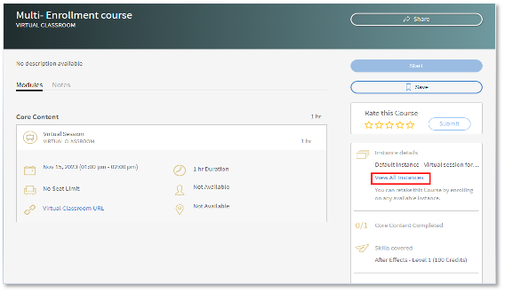

# Varias inscripciones en Adobe Learning Manager

En Adobe Learning Manager, cada curso puede presentar diferentes instancias. Como administrador de cuentas, una de sus tareas principales es crear diferentes instancias de sesiones VILT en diferentes zonas horarias y, llegado el caso, crear sesiones para grupos de usuarios específicos.

Antes de la versión de julio de 2023, cuando un administrador inscribía a un alumno, solo podía hacerlo en una instancia. Si un alumno deseaba realizar un curso en diferentes instancias, el administrador debía crear muchos cursos, uno para cada instancia.

La función Varias inscripciones de Adobe Learning Manager ayuda al administrador a evitar este tipo de situaciones.

## Administrar instancias

>[!INFO]
>
>En este curso de formación, aprenderá a editar los detalles de la instancia y las propiedades de la instancia.    

Si no puedes iniciar el entrenamiento, escribe a <almacademy@adobe.com>.

## ¿Qué es la función Varias inscripciones?

La función Varias inscripciones permite que un alumno se inscriba varias veces en un curso a través de las diversas instancias disponibles.  Un alumno puede inscribirse en varias instancias de curso, independientemente del estado en el que se haya inscrito, se haya completado o aún no se haya iniciado. Cuando el autor activa la función [!UICONTROL Varias inscripciones], un alumno puede inscribirse en varias instancias del curso.

*Iniciar inscripción múltiple desde configuración*

El progreso de cada instancia puede seguirse individualmente, y puede exportarse un informe para seguir el progreso de cada instancia.

## Aspectos importantes

* La función Varias inscripciones solo es aplicable cuando un curso tiene varias instancias.
* Una vez que se haya activado la función Varias inscripciones y los usuarios se hayan inscrito en varias instancias, se crearán nuevas filas para cada curso en el informe Transcripciones de alumnos (una fila para cada instancia y cada alumno).
* Si se ha configurado la automatización de informes que solo prevé una fila por curso, debe llevar a cabo los ajustes necesarios en la automatización de informes antes de activar la función Varias inscripciones.
* Las API de administración no admiten escenarios de inscripción múltiple. Póngase en contacto con su CSM si tiene algún requisito.

## ¿Cómo se activa la función Varias inscripciones?

1. Inicie sesión en su cuenta de Adobe Learning Manager como autor.
1. Seleccione el curso en el que desea que los alumnos se inscriban varias veces.
1. En el panel izquierdo, seleccione **[!UICONTROL Configuración]** > **[!UICONTROL Editar]** > **[!UICONTROL Configuración de instancia]** > **[!UICONTROL Habilitar inscripción múltiple]**.

*Habilitar inscripción múltiple*

>[!NOTE]
>
>Como autor, no puede habilitar el cambio de instancia y la inscripción múltiple simultáneamente.

## Vista de alumno

La opción Varias inscripciones resulta útil cuando un alumno desea inscribirse en un curso de clase o clase virtual, o desea volver a completar un curso antes de pasar a otro.

En el caso de los alumnos que no se hayan inscrito, cuando seleccionen un curso, verán la pantalla debajo del curso con varias instancias. A continuación, pueden seleccionar cada instancia e inscribirse.

*Ver las instancias*

Después de inscribirse en una instancia, pueden inscribirse en otras instancias seleccionando la opción Ver todas las instancias en el panel derecho.

*Inscribirse en una instancia*

El seguimiento del progreso de cada instancia puede realizarse como se indica a continuación:

*Realizar un seguimiento del progreso de cada instancia*

## Cambios de Varias instancias del administrador

**Inscripción:**

Al inscribir a los alumnos, puede marcar la siguiente casilla de verificación:

*&quot;Es posible que los alumnos seleccionados ya se hayan inscrito en otras instancias de este curso. Permita que estos alumnos se inscriban también en la instancia...&quot;*.

*Opción de inscripción para administradores*

Si el alumno ya está inscrito en una instancia y usted, como administrador, está intentando inscribir al alumno en una instancia de curso diferente, seleccione Sí.

## Informes

Para un alumno inscrito en dos instancias del mismo curso, se crean dos filas, una para cada instancia. El informe también muestra el progreso de las instancias.
