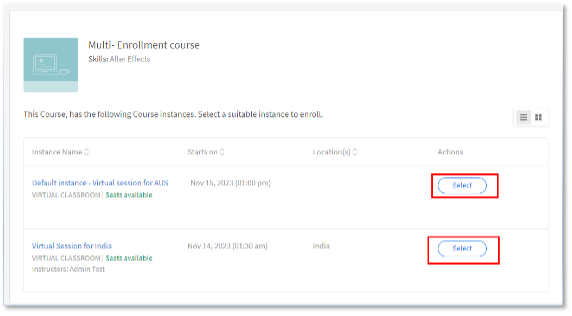

# Inscripción múltiple en Adobe Learning Manager

En Adobe Learning Manager, cada curso puede tener instancias diferentes. Como administrador de cuentas, una de sus principales tareas es crear diferentes instancias de sesiones VILT en diferentes zonas horarias y, posiblemente, crear sesiones para grupos de usuarios específicos.

Antes de la versión de julio de 2023, cuando un administrador inscribía a un alumno, solo podía inscribirse en una instancia. Si un alumno deseara realizar un curso en instancias diferentes, el administrador crearía muchos cursos, uno para cada instancia.

La función de inscripción múltiple de Adobe Learning Manager ayuda a un administrador a evitar estos escenarios.

## Qué es la inscripción múltiple

La inscripción múltiple inscribe a un alumno varias veces en un curso a través de varias instancias disponibles.  Un alumno puede inscribirse en varias instancias de curso, independientemente del estado en el que se haya inscrito, se haya completado o aún no se haya iniciado. Cuando el autor habilita la [!UICONTROL Inscripción múltiple] , un alumno puede inscribirse en varias instancias del curso.

*Iniciar inscripción múltiple desde configuración*

Se puede realizar un seguimiento individual del progreso de cada instancia y se puede exportar un informe para realizar un seguimiento del progreso de cada instancia.

## Aspectos importantes

* La inscripción múltiple solo se aplica cuando un curso tiene varias instancias.
* Una vez activada la opción de inscripción múltiple y inscritos los usuarios en varias instancias, se crean nuevas filas para cada curso en el informe Transcripciones de alumnos (una fila para cada instancia y cada alumno)
* Si se ha configurado la automatización de informes que solo prevé una fila por curso, debe realizar los ajustes necesarios en la automatización de informes antes de activar la función Inscripción múltiple.

## Cómo habilitar la inscripción múltiple

1. Inicie sesión como autor en su cuenta de Adobe Learning Manager.
1. Seleccione el curso en el que desea que los alumnos se inscriban varias veces.
1. En el panel izquierdo, seleccione **[!UICONTROL Configuración]** > **[!UICONTROL Editar]** > **[!UICONTROL Configuración de instancias]** > **[!UICONTROL Habilitar inscripción múltiple]**.

*Habilitar inscripción múltiple*

>[!NOTE]
>
>Como autor, no puede habilitar el cambio de instancia y la inscripción múltiple simultáneamente.

## Vista de alumno

Las inscripciones múltiples son útiles cuando un alumno desea inscribirse en un curso de clase o clase virtual, o bien desea completar un curso de nuevo antes de pasar a otro curso.

En el caso de los alumnos que no se inscribieron, cuando seleccionen un curso, verán la pantalla debajo del curso con varias instancias. Luego, pueden seleccionar cada instancia e inscribirse.

*Ver las instancias*

Después de inscribirse en una instancia, pueden inscribirse en otras instancias seleccionando la opción Ver todas las instancias en el panel derecho.

*Inscribirse en una instancia*

El progreso de cada instancia se puede seguir como se indica a continuación:

*Seguimiento del progreso de cada instancia*

## Cambios de inscripción múltiple en el administrador

**Inscripción:**

Al inscribir a los alumnos, puede marcar la siguiente casilla de verificación:

*&quot;Es posible que los alumnos seleccionados ya se hayan inscrito en otras instancias de este curso. Permitir que estos alumnos también se inscriban en la instancia ...&quot;*

*Opción de inscripción para administradores*

Si el alumno ya está inscrito en una instancia y usted, como administrador, está intentando inscribir al alumno en una instancia de curso diferente, seleccione Sí.

## Informes

Para un alumno que se inscribe en dos instancias del mismo curso, se crean dos filas para cada instancia del curso. El informe también muestra el progreso de las instancias.
