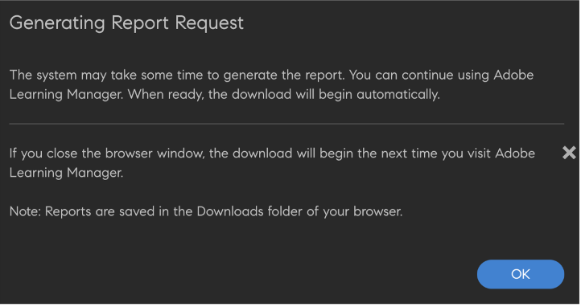

# Extensibilidad nativa

Puede configurar experiencias personalizadas en la versión nativa de Adobe Learning Manager, por lo que no será necesario que utilice una interfaz sin encabezado en casos de uso menos complicados. También puede crear aplicaciones personalizadas y colocarlas en distintos puntos de la versión nativa de los flujos de trabajo del alumno, el responsable, el administrador, el autor o el instructor.

Adobe Learning Manager admite 15 puntos de llamada en las aplicaciones de administrador, autor, alumno, responsable e instructor.

## Crear una extensión

1. Como administrador, en el panel izquierdo, seleccione **[!UICONTROL Extensiones nativas]**.
1. Seleccione Añadir una extensión.
1. Escriba el nombre de la extensión en el campo **[!UICONTROL Nombre]**.
1. Escriba la descripción de la extensión en el campo **[!UICONTROL Descripción]**.
1. Seleccione un punto de llamada. Un punto de llamada es cualquier ubicación de Adobe Learning Manager en la que se pueda insertar un enlace o un botón en una aplicación personalizada. Están disponibles los siguientes puntos de llamada:

   Para este ejemplo, seleccione **[!UICONTROL Administrador]**, **[!UICONTROL Autor: Curso]**, **[!UICONTROL Ruta de aprendizaje]** - **[!UICONTROL Instancias]** - **[!UICONTROL Fila de instancias]**.

   
   *Seleccionar punto de invocación*

1. Escriba la etiqueta de extensión que aparecerá en la interfaz de usuario en el campo **[!UICONTROL Etiqueta de extensión]**.
1. Escriba la dirección URL en la que desea alojar la extensión en el campo **[!UICONTROL URL]**.
1. En el menú desplegable Abrir en , seleccione si desea iniciar la extensión en un modo o en una nueva pestaña.
1. Seleccione el tamaño de la ventana modal. Las opciones están disponibles si ha seleccionado el modo *En la aplicación* en el paso anterior.

   Para mantener la accesibilidad dentro de la ventana emergente, la aplicación de extensión debe enviarse al evento una vez que se encuentren en el último elemento enfocable de su sitio web, y luego el usuario selecciona la tecla TAB. Esto es necesario para mantener el centro de atención en la ventana emergente y favorecer la accesibilidad.

   ```
   window.parent.postMessage({*}
   
   { type: 'ALM_EXTENSION_APP', eventType: 'trapFocusInModal' }
   
   ,{}'');
   ```

1. Establezca el ámbito de la extensión. Están disponibles los siguientes ámbitos:

   * **[!UICONTROL Todos los cursos, rutas de aprendizaje y certificaciones]**: esta extensión está habilitada para todos los cursos, rutas de aprendizaje y certificaciones. Junto con los administradores, los autores pueden desactivarla para algunos cursos, rutas de aprendizaje y certificaciones.
   * **[!UICONTROL Cursos seleccionados, rutas de aprendizaje y certificaciones]**: esta extensión está deshabilitada para todos los cursos, rutas de aprendizaje y certificaciones. Junto con los administradores, los autores pueden activarla para algunos cursos, rutas de aprendizaje y certificaciones.

1. Seleccione el conmutador **[!UICONTROL Activar]** para activar la extensión. Una vez activa, la extensión aparece en el punto de invocación especificado según el ámbito.
1. Seleccione **[!UICONTROL Guardar]** en la esquina superior derecha de la página para crear la extensión.

## Acceder a la extensión como administrador

1. Como administrador, seleccione **[!UICONTROL Rutas de aprendizaje]** en la barra de herramientas izquierda.
1. Seleccione un curso > **[!UICONTROL Ver ruta de aprendizaje]**.
1. Seleccione **[!UICONTROL Instancias]** en el panel izquierdo.
1. Seleccione **[!UICONTROL Más]** en la sección Instancias. La extensión aparece en la sección Instancias.

   
   *Seleccione la extensión*

   Al seleccionar la extensión, esta aparece en el modo.

## Acceder a la extensión como autor

1. Como administrador, seleccione **[!UICONTROL Rutas de aprendizaje]** en la barra de herramientas izquierda.
1. Seleccione un curso > **[!UICONTROL Ver ruta de aprendizaje]**.
1. Seleccione **[!UICONTROL Instancias]** en el panel izquierdo.
1. Seleccione **[!UICONTROL Más]** en la sección Instancias. La extensión aparece en la sección Instancias.

   
   *Extensión de acceso como autor*

   Al seleccionar la extensión, esta aparece en el modo.

## Ver todas las extensiones

Como administrador, puede ver todas las extensiones en la página Extensiones nativas . Para ver la lista, seleccione Extensiones nativas en el panel izquierdo de la aplicación.


*Ver todas las extensiones*

## Activar o desactivar una extensión

Como autor, en la página Configuración de un curso, puede activar o desactivar una extensión para un curso, una certificación o una ruta de aprendizaje.


*Activar una extensión*

## Compartir una clave de acceso

Si va a configurar una extensión de inscripción, deberá compartir la clave de acceso.

Esto es importante porque si esta clave no se genera y no se comparte entre los alumnos, la autenticación para la inscripción fallará y los alumnos no podrán inscribirse por sí mismos en los cursos.

La clave de acceso se debe compartir para inscribirse en el curso o la ruta de aprendizaje y los certificados.

En la ficha Configuración, genere la clave.


*Compartir la clave de acceso*

## Descargar informe de extensiones

Hay dos formas de descargar este informe.

**Informe de configuración de extensión**

1. En la página Extensiones nativas, seleccione **[!UICONTROL Informe de configuración de extensiones]**.

   
   *Descargar informe de extensión*

   Se genera el informe.

1. Seleccione Aceptar.

   
   *Generando el informe*

   El informe contiene los siguientes campos:

   * Nombre de la extensión
   * Punto de apelación
   * Etiqueta
   * Abrir en URL
   * Ámbito
   * Activar
   * ID exclusivo de objetos
   * ID de la formación
   * Tipo de formación
   * Nombre de la formación

**Página de informes**

1. En **[!UICONTROL Informes]** > **[!UICONTROL Informes personalizados]**, seleccione **[!UICONTROL Informe de configuración de extensión]**.

   
   *Descargar el informe de la página Informes*

El estado debe estar en el intervalo **0 - 4294967295**, al configurar el estado de inscripción.
