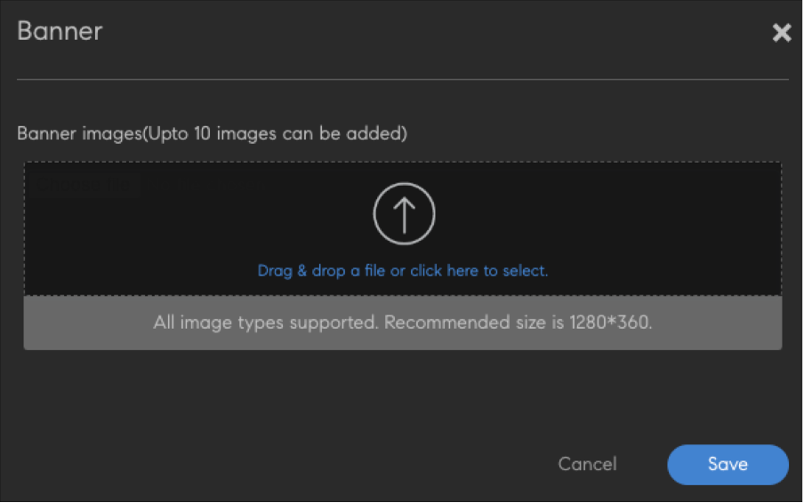
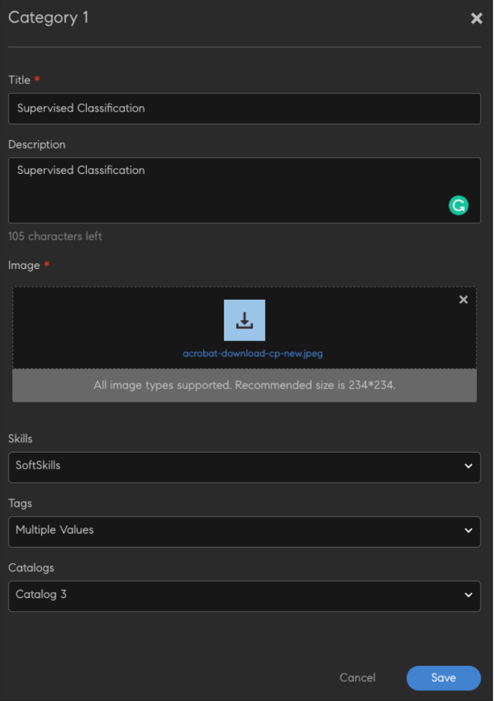

# Experiencia sin inicio de sesión para alumnos

El portal nativo de Adobe Learning Manager admitirá una forma no registrada de acceder al sitio de formación. Con este modo activado, los alumnos pueden descubrir y acceder al sitio de formación y consultar los distintos cursos y contenidos disponibles.

Esta experiencia permite a los alumnos examinar cursos sin haber iniciado sesión en un portal.

Para activar el acceso sin iniciar sesión en la página de inicio, el administrador de integración debe habilitar y configurar [Training Data Connector](/help/migrated/integration-admin/feature-summary/connectors.md#training-data-access).

A continuación, el curso de formación se puede exportar desde el conector.

>[!NOTE]
>
>Asegúrese de que la opción Native Learning Manager esté seleccionada.

El administrador puede modificar y configurar la página de inicio, que está destinada a los usuarios que no han iniciado sesión.

## API de alumno

Adobe Learning Manager: las API de alumno permiten crear una experiencia de aprendizaje personalizada para los usuarios. El uso de estas API requiere un token de usuario válido y solo se deben usar para los flujos de trabajo en los que haya un alumno con licencia o registrado completa.

>[!IMPORTANT]
>
>No se utilizarán, como está, para cualquier tipo de recuperación de datos para admitir a ningún usuario o usuario compartido no registrado, ni en ningún otro caso de este tipo.

Los casos prácticos no registrados requieren un tratamiento especial.

**Póngase en contacto con el equipo de Arquitectura de soluciones, en caso de que tenga alguna pregunta sobre el uso adecuado de estas API, y asegúrese de que un arquitecto de soluciones haya revisado una solución antes de implementarla**.

## Iniciar las opciones de la página de inicio

En la página principal de Adobe Learning Manager, seleccione **Branding**. A continuación, en el panel izquierdo, seleccione No registrado en la página de inicio.

*Seleccione la opción No registrado en la página de inicio*

## Añadir un banner

Añada un banner para incluir un anuncio de marketing o uno de los temas más popular del día. Seleccionar **Añadir banner**.

*Añadir un banner*

Busque la ubicación de la imagen que se utilizará como banner. A continuación, proporcione un vínculo como botón de acción en la imagen del banner.

## Añadir categorías

Este componente se puede utilizar para filtrar catálogos por etiquetas, aptitudes y catálogos. Esta sección contiene un encabezado y una descripción para cada categoría. Al hacer clic, se redirige al usuario a la página del catálogo con los filtros aplicados.

Seleccionar **[!UICONTROL Añadir categoría]**. A continuación, introduzca los detalles de la categoría.

*Agregar las categorías*

Guarde la categoría. La categoría se añade a la sección.

## Añadir un catálogo

Añada un catálogo para los usuarios que no hayan iniciado sesión, de modo que puedan examinar toda la formación en la plataforma.

*Añadir un catálogo*

Estarán presentes todos los cursos de formación exportados.

## Funciones no compatibles

* No se exportarán las ayudas de trabajo. Sin embargo, los alumnos pueden verlos después de iniciar sesión.
* Ordenar por en el componente de catálogo.
* Configuración de vista predeterminada utilizada en la aplicación de administración (Configuración > General > Vista de lista).
* Valoración basada en estrellas/eficacia.
* Ajuste del icono de tarjeta.
* Configuración de las etiquetas y las aptitudes pertinentes.
* Vista de la aplicación del alumno que se muestra en el catálogo.
* Páginas de información general de formación: al hacer clic en la tarjeta, se redirige a Registrarse, tras lo cual se redirige al usuario a la página de información general de formación/página de instancias.
* Estarán presentes todos los catálogos activados. Los alumnos que no tengan acceso a un catálogo no podrán verlo ni consultar los cursos de formación incluidos en él después de iniciar sesión.
