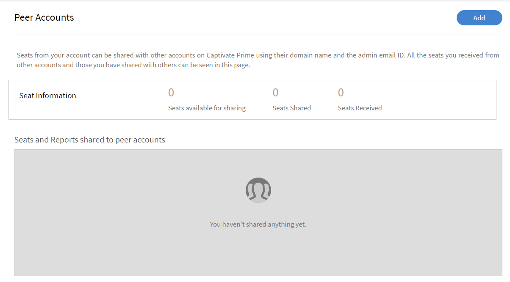

# Cuentas de igual a igual

Lea este artículo para saber cómo crear y administrar cuentas de igual a igual en Learning Manager.

Learning Manager ofrece la posibilidad de compartir puestos adquiridos mediante la función Cuenta de igual a igual. Con las cuentas de igual a igual en Learning Manager, un administrador puede compartir los puestos adquiridos con las cuentas de igual a igual a las que está asociado el administrador. Asimismo, el administrador que ha iniciado el uso compartido de puestos puede ver los informes de las cuentas de igual a igual.

## Añadir una cuenta de igual a igual {#addapeeraccount}

1. En el panel de administración, haga clic en **[!UICONTROL Configuración]** > **[!UICONTROL Cuentas de igual a igual]**.
1. En la esquina superior derecha, haga clic en **[!UICONTROL Agregar]**.

   

   *Agregar cuenta de igual a igual*

1. En el campo **[!UICONTROL Subdominio de cuenta]**, especifique el subdominio con el que desea establecer una cuenta de igual a igual.

   

   *Agregar un subdominio*

1. Indique el ID de correo electrónico del administrador que acepta o rechaza la solicitud de cuenta de igual a igual.
1. Especifique la cantidad de puestos que desea compartir con su igual. Cuando comparte puestos con la cuenta de igual a igual, la cuenta de igual a igual pasa al estado Activo con los puestos recibidos o con los puestos adquiridos por el propio igual.

   Si indica un número mayor que el de los puestos disponibles, el sistema muestra una advertencia.

1. Seleccione la casilla de verificación si desea ver los informes de inscripción y los informes de catálogo compartido de sus iguales.
1. Haga clic en Añadir para añadir la cuenta de igual a igual.

   Si un administrador comparte puestos con un igual, este no puede compartirlos con nadie más. Sin embargo, el igual puede adquirir algunos puestos por separado y compartirlos.

## Ver informes asociados a cuentas de igual a igual {#viewreportsassociatedwithpeeraccounts}

Después de establecer una cuenta de igual a igual, también puede generar informes para las cuentas de igual a igual. Como administrador, si inicia la solicitud de cuenta de igual a igual, puede ver los informes de la cuenta de igual a igual.

Si el igual también desea ver los informes del administrador, el igual debe enviar una solicitud de cuenta de igual a igual al administrador.

Para obtener información sobre cómo generar y ver los catálogos compartidos, consulte [Ver informes de igual a igual](reports.md#main-pars_header_894271250).

## Eliminar cuentas de igual a igual {#deletingpeeraccounts}

Si ya no desea compartir puestos o adquisiciones con una cuenta, puede eliminar la cuenta de igual a igual.

1. En la aplicación de administrador de Learning Manager, haga clic en Configuración > Cuentas de igual a igual.
1. Seleccione la cuenta o cuentas de igual a igual que desee eliminar.
1. Elija una de las opciones siguientes:

   * Haga clic en Eliminar en la esquina superior derecha de la página.
   * Haga clic en el icono Eliminar junto a la cuenta de igual a igual que desea eliminar.

   Después de eliminarse una cuenta de igual a igual, los puestos recibidos ya no están disponibles. Si la cuenta de igual a igual solo recibió puestos y no se adquirieron puestos, la cuenta pasa a estado Inactivo.

## Informe de usuarios para cuentas de igual a igual {#download-peer-account}

El administrador puede ver el informe de usuario de la cuenta de igual a igual. El administrador de la cuenta principal puede solicitar acceso al informe y, una vez que el administrador de la cuenta de igual a igual lo acepte, el administrador principal podrá ver el número de usuarios registrados en la cuenta de igual a igual y descargar el informe de usuarios para la cuenta de igual a igual.

1. En la página Cuentas de igual a igual, haga clic en **[!UICONTROL Añadir]**.
1. Habilite la opción **[!UICONTROL Solicitar permiso para descargar informes de usuarios para toda la cuenta]**.

*Ver informe de usuario de una cuenta de igual a igual*

Para descargar los informes de cuentas de igual a igual, haga clic en **[!UICONTROL Descargar]**.

## Preguntas más frecuentes {#frequentlyaskedquestions}

+++¿Cómo compartir puestos de una cuenta a otra?

Al añadir una cuenta de igual a igual, especifique el número de puestos que puede compartir con otra cuenta de igual a igual.

*Compartir puestos de una cuenta a otra*
+++
