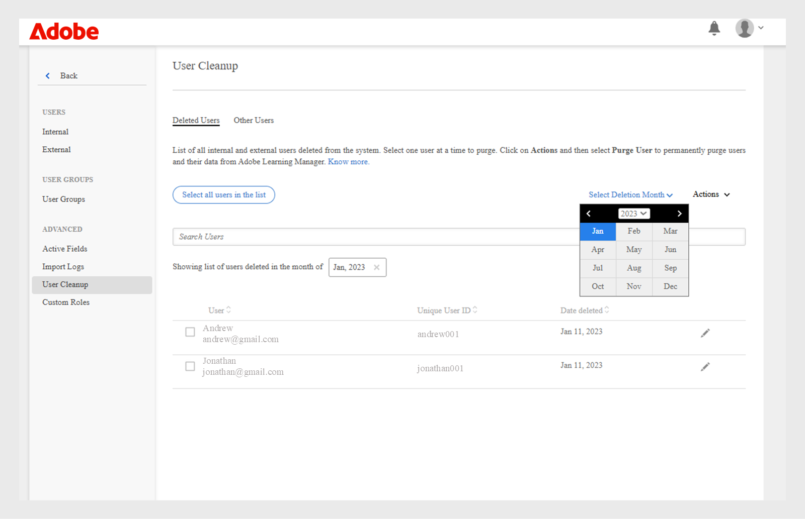

# Purgar usuarios

Obtenga más información sobre la purga de datos de usuarios en Learning Manager.

## Información general {#overview}

Utilice la función de purgar usuario para eliminar la información de identificación personal y los registros de aprendizaje del usuario de Learning Manager. Tenga en cuenta que Eliminar y Purgar usuario son dos funciones diferentes. Mientras que es posible restaurar un usuario eliminado, no es posible restaurar todos los datos de usuario y los registros de aprendizaje asociados con un usuario purgado.

La acción Purgar usuario puede tener los siguientes resultados:

* Si se purga un usuario, los vínculos de los registros de importación no funcionan para evitar la descarga de archivos CSV antiguos y la recuperación de los datos del usuario en el sistema.
* Si se purga un autor, su nombre se sustituye por el nombre del administrador que purgó ese usuario.
* Si se purgan instructores, estos se eliminan de las sesiones. El administrador debe reemplazar o agregar instructores para estas sesiones.
* Purgar a un usuario en Learning Manager no elimina al usuario en ninguna aplicación externa (sistemas de terceros u otras aplicaciones escritas por usted). Póngase en contacto con los propietarios de aplicaciones externas para que eliminen a los usuarios de dichas aplicaciones.
* Si se hace referencia a un usuario purgado en la configuración de un conector, el conector se deshabilita. El administrador debe volver a configurar el conector para reanudarlo.

<!---### Manage users

In this training, you will learn how to assign and remove roles, send a welcome email, and delete and purge users. 

If you're unable to launch the training, write to <almacademy@adobe.com>.-->

## Cómo purgar usuarios

Para purgar usuarios, siga estos pasos:

1. Como administrador, seleccione **[!UICONTROL Usuarios]** del panel izquierdo. Se abre la página **[!UICONTROL Usuarios internos]**.
1. Elimine los usuarios que desea purgar. Para eliminarlos, seleccione uno o más usuarios usando la casilla de verificación. Abra el menú desplegable **[!UICONTROL Acción]** y seleccione **[!UICONTROL Eliminar usuario.]**
1. En el panel izquierdo seleccione **[!UICONTROL Limpieza de usuarios]**. Aparece la página **[!UICONTROL Limpieza de usuarios]** con la lista de usuarios eliminados. Use los botones de selección para seleccionar un usuario para purgar. Solo puede purgar un usuario a la vez.

   

   *Seleccionar un usuario para purgar*

1. Abra el menú desplegable **[!UICONTROL Acciones]** y seleccione **[!UICONTROL Purgar usuario]**.

   

   *Seleccione la opción Purgar usuario*

1. Aparece un cuadro de diálogo que solicita la confirmación. Una vez purgados, todos los datos del usuario y los registros de aprendizaje asociados con el usuario seleccionado se eliminan de forma permanente. Después de la purga, la acción no se puede deshacer. Para confirmar, haga clic en **[!UICONTROL Purgar]**.

   

   *Mensaje de confirmación después de purgar un usuario*

1. Una vez que confirme y haga clic en Purgar, se acepta la solicitud de purga. Recibe una notificación una vez que se completa la acción. También se proporciona un ID de solicitud de purga. Puede proporcionar este ID al CSM para rastrear la solicitud.

>[!NOTE]
>
>Una vez que el usuario eliminado se vuelva a añadir al sistema, no se conservarán las funciones anteriores (por ejemplo, administrador, responsable, autor, instructor, etc.). Se añadirán con la función de alumno.

## Purga masiva de usuarios

Puede seleccionar los primeros 50 usuarios y purgarlos simultáneamente. Esto permite a los administradores seleccionar 50 usuarios a la vez y purgarlos juntos. Esto ayuda a los administradores cuando desean purgar usuarios en bloque. Siempre es recomendable comprobar los usuarios seleccionados para la purga. Esto es importante para garantizar que solo se purgue el conjunto correcto de usuarios.

*Purgar usuarios en bloque*

## Filtrar usuarios eliminados antes de purgar

Adobe Learning Manager permite a los administradores eliminar de forma permanente de la plataforma a los usuarios que ya se hayan eliminado. Este proceso, denominado purgar, ayuda a las organizaciones a mantener una base de datos de alumnos limpia, cumplir con las políticas de retención de datos y evitar el acceso no autorizado a los datos de usuario.
Esto resulta especialmente útil para mantener la higiene de los datos y garantizar que se eliminen del sistema los datos antiguos y no utilizados de los usuarios.
La purga de usuarios es esencial para cumplir con las directrices de privacidad de datos o para mantener un almacén de datos saneado mediante la eliminación de registros redundantes.

### Filtrar usuarios eliminados por mes

Puede filtrar los usuarios eliminados seleccionando un mes específico y, a continuación, eliminarlos permanentemente.

Para filtrar los usuarios eliminados usando el mes de eliminación:

1. Seleccione **[!UICONTROL Usuarios]** en la página principal del administrador y, a continuación, seleccione **[!UICONTROL Limpieza de usuarios]**.
2. Seleccione el selector de fecha **[!UICONTROL Seleccionar mes de eliminación]** y elija la fecha.

   
   _Seleccione el mes en que se eliminaron los usuarios_

   Aparecerá la lista de usuarios eliminados en el mes seleccionado.

   
   _Lista de usuarios eliminados mostrada para el mes seleccionado_

### Ordenar usuarios eliminados por mes

Puede ordenar los usuarios filtrados por su **[!UICONTROL ID de usuario único]** y su **[!UICONTROL fecha de eliminación]**.

1. En la lista de usuarios eliminados, ordene los usuarios según sus ID de usuario o fecha de eliminación.

   
   _Lista de usuarios filtrada por Id. de usuario único_

2. Seleccione uno o varios usuarios.
3. Seleccione **[!UICONTROL Acciones]** y, a continuación, seleccione **[!UICONTROL Purgar usuario]**.
4. Seleccione Purgar en el mensaje de confirmación para eliminar los registros de usuario de forma permanente de Adobe Learning Manager.

   
   _Confirmación final antes de purgar usuarios de forma permanente_

>[!NOTE]
>
>Al purgar usuarios, se eliminan sus datos de forma permanente. Compruebe su selección antes de continuar.

+++Leer acerca de los resultados de la acción Purgar usuario

<table>
 <tbody>
  <tr>
   <th><strong>Purgar con la interfaz de usuario empresarial de Learning Manager</strong></th>
   <th> </th>
  </tr>
  <tr>
   <td>Eliminar el usuario seleccionado de la cuenta empresarial solicitante. </td>
   <td>Sí</td>
  </tr>
  <tr>
   <td>Eliminar todos los usuarios de todas las cuentas de prueba cuyo correo electrónico o Adobe ID coincida con el correo electrónico de los usuarios seleccionados.</td>
   <td>Sí</td>
  </tr>
  <tr>
   <td>Eliminar todos los usuarios de todas las cuentas de prueba cuyo correo electrónico o Adobe ID coincida con el correo electrónico de los usuarios seleccionados y el usuario sea el creador de la cuenta de prueba.</td>
   <td>No</td>
  </tr>
  <tr>
   <td>Eliminar el correo electrónico del usuario de todos los demás campos de la cuenta empresarial solicitante y de todas las cuentas de prueba.</td>
   <td>Sí</td>
  </tr>
  <tr>
   <td>Notificar al usuario sobre la confirmación de eliminación.</td>
   <td>Sí</td>
  </tr>
  <tr>
   <td><strong>Purgar con una interfaz de usuario no empresarial de Learning Manager</strong></td>
   <td> </td>
  </tr>
  <tr>
   <td>Eliminar el usuario seleccionado de la cuenta de prueba solicitante.</td>
   <td>Sí</td>
  </tr>
  <tr>
   <td>Eliminar todos los usuarios de todas las cuentas de prueba cuyo correo electrónico o Adobe ID coincida con el correo electrónico de los usuarios seleccionados.</td>
   <td>Sí</td>
  </tr>
  <tr>
   <td>Eliminar todos los usuarios de todas las cuentas de prueba cuyo correo electrónico o Adobe ID coincida con el correo electrónico de los usuarios seleccionados y el usuario sea el creador de la cuenta de prueba.</td>
   <td>No</td>
  </tr>
  <tr>
   <td>Eliminar el correo electrónico del usuario de todos los demás campos de todas las cuentas de prueba.</td>
   <td>Sí</td>
  </tr>
  <tr>
   <td>Notificar al usuario sobre la confirmación de eliminación.</td>
   <td>Sí</td>
  </tr>
  <tr>
   <td><strong>Purgar otros usuarios empresariales (individuos que no son usuarios internos o externos de Learning Manager)</strong></td>
   <td> </td>
  </tr>
  <tr>
   <td>Eliminar el usuario seleccionado de todos los demás campos de la cuenta empresarial solicitante y de todas las cuentas de prueba.</td>
   <td>Sí</td>
  </tr>
  <tr>
   <td>Eliminar el usuario de las cuentas.</td>
   <td>No</td>
  </tr>
  <tr>
   <td>Notificar al usuario sobre la confirmación de eliminación. </td>
   <td>Sí</td>
  </tr>
  <tr>
   <td><strong>Purgar</strong> <strong>otros usuarios no empresariales (individuos que no son usuarios internos o externos de Learning Manager)</strong></td>
   <td> </td>
  </tr>
  <tr>
   <td>Eliminar el usuario seleccionado de todos los demás campos de todas las cuentas de prueba.</td>
   <td>Sí</td>
  </tr>
  <tr>
   <td>Eliminar el usuario de las cuentas.</td>
   <td>No</td>
  </tr>
  <tr>
   <td>Notificar al usuario sobre la confirmación de eliminación.</td>
   <td>Sí</td>
  </tr>
  <tr>
   <td><strong>Purgar con IMS empresarial de Adobe</strong></td>
   <td> </td>
  </tr>
  <tr>
   <td>Notifique la solicitud al administrador de la empresa.</td>
   <td>Sí</td>
  </tr>
  <tr>
   <td>Comprobar los campos de correo electrónico para enviar notificaciones.</td>
   <td>No</td>
  </tr>
  <tr>
   <td><strong>Purgar con IMS no empresarial de Adobe</strong></td>
   <td> </td>
  </tr>
  <tr>
   <td>Eliminar todos los usuarios que tengan el Adobe ID o correo electrónico proporcionado de todas las cuentas de prueba.</td>
   <td>Sí</td>
  </tr>
  <tr>
   <td>Eliminar todos los usuarios de la cuenta de prueba si el correo electrónico o Adobe ID proporcionado fue el creador de la cuenta.</td>
   <td>Sí</td>
  </tr>
  <tr>
   <td>Eliminar el ID de correo electrónico seleccionado de todos los demás campos de las cuentas de prueba.</td>
   <td>Sí</td>
  </tr>
 </tbody>
</table>

+++

## Preguntas más frecuentes {#frequentlyaskedquestions}

+++¿Cuántos días tarda en completarse una solicitud de purga?

Una solicitud para purgar usuarios tarda un máximo de 30 días en completarse.
+++

+++¿Se puede realizar una purga masiva en Adobe Learning Manager?

Sí, se puede realizar una purga masiva. Sin embargo, solo se puede realizar una purga masiva de 50 usuarios.
+++

+++¿Puedo restaurar un usuario purgado?

No. Una vez purgados, todos los datos del usuario se eliminan de forma permanente y no se pueden recuperar.

+++
