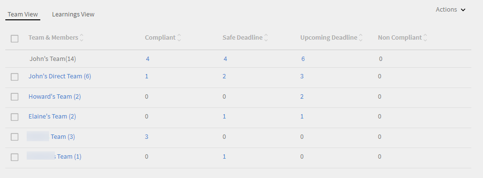
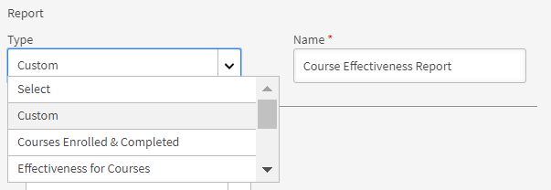
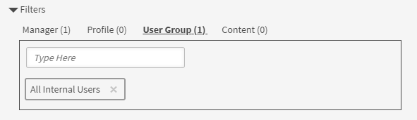

# Informes

Obtenga información sobre los informes asociados a la función de administrador en la aplicación Learning Manager.

Adobe Learning Manager le permite crear diversos informes para supervisar y controlar las actividades de los alumnos. Las actividades de los alumnos se supervisan y se capturan automáticamente en la base de datos. Los informes del responsable y el administrador se generan a partir de la base de datos.

## Información general {#overview}

El proceso de generación de informes es similar para el administrador y el responsable. Los responsables pueden ver los informes correspondientes a sus subordinados, mientras que el administrador puede ver todos los informes en toda la empresa.

Los informes se añaden en un tablero. Un informe debe estar dentro de un tablero. A **[!UICONTROL Panel predeterminado]** existe de forma predeterminada en la página informes. Cualquier informe añadido por usted se añade a este tablero predeterminado. Para agregar informes a paneles individuales, utilice la flecha desplegable y elija **[!UICONTROL Agregar informe]**. Para obtener más información sobre cómo crear tableros, consulte la sección Tableros en esta página.

## Tableros de resumen del aprendizaje {#dashboards}

Consulte un informe resumido de todas las actividades de aprendizaje en la plataforma. En esta página, puede ver la siguiente información de resumen del equipo y los perfiles externos del usuario raíz seleccionado. También se puede seleccionar el intervalo de tiempo:

* Resumen de aprendizaje en forma de inscripciones, vistas y finalizaciones
* Aptitudes principales
* Resumen del cumplimiento

*Gráficos de resumen*

Si hay administradores internos de nivel raíz, se mostrarán uno tras otro.

Todos los perfiles externos se enumerarán después de los perfiles internos (usuarios internos de nivel raíz).

Si un perfil externo tiene un responsable, la jerarquía de responsables se mostrará en el **[!UICONTROL Mostrar datos para]** lista desplegable. - El usuario aparecerá en la jerarquía de responsables en la página de todos los detalles (resumen del aprendizaje, cumplimiento y estado de aptitudes).

Si no es así, todos los detalles de los usuarios individuales se mostrarán en la lista.

Para ver información más detallada de las inscripciones de varios equipos internos, haga clic en **[!UICONTROL Detalles del resumen de aprendizaje]**.

*Detalles del resumen de aprendizaje*

Al hacer clic en cualquier inscripción, puede ver los alumnos de cada responsable y las inscripciones a cada objeto de aprendizaje. También puede ver los detalles de progreso y finalización de cada alumno.

*Ver alumnos asignados a un responsable*

Haga clic en cualquier equipo y exporte la informe como un archivo csv. Un administrador puede exportar el informe para cualquier grupo de usuarios o usuario individual seleccionando el grupo de usuarios o usuario individual y, a continuación, exportando detalles desde la lista desplegable Acción.

Además, puede ver un gráfico de barras con las aptitudes que están en curso y las que se han alcanzado. Puede añadir o quitar las aptitudes que desee incluir en el gráfico.

*Gráfico de barras apiladas de estado de aptitudes*

En la visualización final, puede comprobar el estado de cumplimiento de los alumnos y tomar las medidas adecuadas.

Además, un administrador puede ver datos de formación individuales en el tablero de cumplimiento.

Por ejemplo, el administrador ha identificado tres cursos de formación en los que realizar un seguimiento del cumplimiento. Learning Manager proporciona la información de cumplimiento de los tres cursos de formación a la vez.

Ahora, un administrador puede hacer clic en cualquier curso de formación y ver rápidamente el cumplimiento del curso de formación solicitado.

*Ver tablero de cumplimiento*

También puede ver el estado de cumplimiento de cada equipo interno.

Haga clic en el vínculo **[!UICONTROL Detalles del estado de cumplimiento]** en la parte inferior de la visualización.

Puede comprobar si, en un equipo, algunos alumnos están infringiendo o respetando el cumplimiento de aprendizaje.

*Estado de cumplimiento de un equipo*

## Compartir formación con responsables

Learning Manager ofrece un panel de cumplimiento a todos los administradores y responsables. A los gestores les resulta muy útil realizar un seguimiento del cumplimiento de los miembros de su equipo para una formación concreta. Al mismo tiempo, los administradores desean que todos los responsables añadan cursos de formación sobre cumplimiento a su panel y realicen un seguimiento.

En Learning Manager, el **[!UICONTROL Compartir con responsables]** El flujo de trabajo permite a los administradores compartir la formación con los responsables para que puedan ser añadidos al tablero de cumplimiento de un responsable. Por lo tanto, los responsables no necesitan realizar ninguna acción y pueden empezar a realizar un seguimiento del cumplimiento de forma inmediata.

Un administrador puede compartir un conjunto de cursos de formación con responsables de forma individual o en grupo. Este uso compartido puede ayudar a un responsable a realizar un seguimiento sencillo del cumplimiento de su equipo para la formación especificada.

El administrador puede insertar una lista predeterminada de cursos de formación sobre cumplimiento para que se visualice en el panel de cumplimiento del responsable.

### Compartir formación

1. En **[!UICONTROL Informes]** > **[!UICONTROL Resumen del aprendizaje]**, desplácese hacia abajo y haga clic en la ficha **[!UICONTROL Compartir con responsables]**.

   
   *Compartir formación con responsables*

1. Para añadir formación o formación múltiple, haga clic en **[!UICONTROL Compartir más]**.

1. En la **[!UICONTROL Compartir con responsables]** , elija los cursos de formación y el responsable.

   
   *Seleccione la formación que desea compartir con los responsables*

1. Haga clic en **[!UICONTROL Compartir]**.

El curso de formación ahora se comparte con el responsable especificado.

### Ver formación

En la lista de formación compartida, haga clic en **[!UICONTROL Ver]**. Puede ver la formación asignada a un responsable o a algunos responsables.

### Retirar formación

1. Para retirar la formación de un responsable, haga clic en **[!UICONTROL Retirar]**.

1. Haga clic en **[!UICONTROL Continuar]**. Esto retira la formación previamente compartida del tablero de cumplimiento del responsable.

## Tableros de actividad de usuario {#useractivitydashboards}

Vea un resumen de toda la actividad de los usuarios en la plataforma a lo largo del tiempo. Configure grupos de usuarios y aplique filtros.

En el tablero de actividad de usuario, se muestra la actividad de los usuarios de la cuenta. Los tres informes que se enumeran son:

* **Usuarios registrados:** Este informe proporciona información sobre el número de usuarios registrados en su cuenta semanalmente. En el caso de las cuentas con licencias de unidades activas mensuales, el informe presenta en su lugar las unidades MAU.

* **Informe de visitas de usuarios:** Este informe proporciona información sobre el número de usuarios que acceden diariamente a la plataforma. También está disponible el informe mensual.

* **Informe de tiempo dedicado al aprendizaje:** Este informe proporciona información sobre el tiempo de aprendizaje empleado en la plataforma diariamente. También está disponible el informe mensual.

## Usuarios registrados {#registeredusers}

Learning Manager realiza un recuento del número de usuarios registrados en el sistema cada semana. Los administradores pueden ver este informe para conocer el número de usuarios registrados ese día de la semana. Una vez almacenado, el recuento semanal de usuarios registrados no cambia. Por lo tanto, el recuento registrado histórico no está relacionado con el conjunto actual de alumnos del sistema.

Este informe proporciona información sobre el número de usuarios registrados en la cuenta semanalmente.

En el caso de las cuentas con licencias de unidades activas mensuales, el informe presenta en su lugar las unidades MAU.

*Informe de usuarios registrados*

***Para las cuentas de unidad de acceso mensual:***

**Informe mensual de usuarios activos**

En este informe, se muestra el recuento de alumnos activos en la plataforma de aprendizaje cada mes. Un usuario se considera activo durante el mes si realiza cualquiera de las acciones de aprendizaje mencionadas aquí. Es el mismo método utilizado para el recuento de las unidades activas mensuales.

Una vez realizado y almacenado, el recuento activo mensual no cambia. Por lo tanto, el recuento histórico mostrado no está relacionado con el conjunto actual de alumnos del sistema.

## Visitas de usuarios {#uservisits}

En este informe, se muestra el total de alumnos que acceden al sistema en un día o un mes. Explorar la plataforma de aprendizaje sin consumir ningún elemento de aprendizaje también se considera como un &quot;acceso&quot; a la plataforma de aprendizaje. Esto ayuda al administrador a conocer el conjunto total de usuarios que acceden al sistema. El primer día del mes, Learning Manager crea un registro del número total de usuarios que acceden a la plataforma durante el mes anterior. También captura la información de estos usuarios por grupo de usuarios.

Solo se registran los grupos de usuarios configurados por el administrador. Esto permite también que los administradores apliquen filtros en grupos de usuarios para conocer los datos mensuales históricos. Tenga en cuenta que, en caso de que se modifique la configuración de grupos de usuarios y Learning Manager no haya registrado datos para ese grupo de usuarios en meses anteriores, Learning Manager no podrá mostrar los datos de meses anteriores de esos grupos recién configurados.

Este informe contiene usuarios que acceden a la plataforma mediante todos los formatos, como la Web, la aplicación para dispositivos móviles, las soluciones personalizadas sin encabezado, etc. El gráfico de uso de la aplicación para dispositivos menciona específicamente solo a los usuarios que acceden a la plataforma mediante la aplicación de Learning Manager para dispositivos. Esto ayuda a los administradores a identificar el uso de la aplicación para dispositivos móviles en la cuenta.

*Informe de visitas de usuarios*

## Informe de tiempo dedicado al aprendizaje {#learningtimespentreport}

Aquí puede ver un gráfico de líneas de doble eje que muestra el tiempo total de aprendizaje dedicado por todos los alumnos durante un periodo de 12 meses. El segundo eje representa el tiempo medio dedicado al aprendizaje por parte de un individuo.

El tiempo dedicado a diferentes objetos de aprendizaje, como programas de aprendizaje y certificaciones, se calcula para lo siguiente:

* Curso a ritmo personalizado con contenido estático e interactivo.
* Cursos de actividad con URL.
* Sesiones de fin de semana con el indicador de fin de semana activado.
* Sesión de conexión de clase virtual donde la asistencia se marca automáticamente.
* Tiempo empleado en diferentes objetos de aprendizaje, como programas de aprendizaje y certificaciones.
* Instrucciones xAPI para un curso de actividad xAPI.

Puede exportar el gráfico como una hoja de cálculo de Excel.

Se proporciona un filtro para elegir la configuración de grupos de usuarios, que le ayudará a ver los datos en relación con los diferentes grupos de usuarios.

El filtro de fecha y grupo de usuarios seleccionado se aplica a todos los gráficos pertinentes del tablero.

>[!NOTE]
>
>En los informes **[!UICONTROL Visitas de usuarios]** y **[!UICONTROL Tiempo de aprendizaje empleado]**, se mostrarán los datos predeterminados (cuando no se ha configurado ningún grupo de usuarios) de toda la cuenta.

## Tablero de contenido de formación {#trainingcontentdashboard}

El tablero de contenido de formación ofrece información sobre los cursos disponibles en la plataforma. Puede ver los cursos de formación más populares o realizar un seguimiento de todos los cursos disponibles.

## Informe de cursos de formación {#trainingsreport}

Este informe proporciona información sobre el total de cursos de formación disponibles en la plataforma (con el estado Publicado) mensualmente. En él, se indica el número de cursos de formación que se ofrecen a lo largo del tiempo.

*Informe de formación*

## Informe de cursos de formación activos {#activetrainingsreport}

Este informe proporciona información sobre los cursos de formación que están activos durante el intervalo de tiempo seleccionado. Los cursos de formación activos son aquellos que permiten la inscripción, su visualización en un reproductor o su finalización en un periodo determinado.

En los cursos de formación activos, se pueden seleccionar todos los datos de los grupos de usuarios raíz (con función de responsable) si no se ha configurado ningún grupo de usuarios. Además de los grupos de usuarios de usuario raíz, puede configurar otros 10 grupos de usuarios si es necesario.

*Informe de cursos de formación activos*

>[!NOTE]
>
>Los datos no se muestran del modo esperado cuando **[!UICONTROL Todos los usuarios]** y **[!UICONTROL 12 meses]** se seleccionan filtros, pero los datos se muestran al seleccionar **[!UICONTROL Todos los grupos de usuarios internos].**

<table>
 <tbody>
  <tr>
   <td>
    
<b>Referencia</b>
</td>
   <td>
    
<b>Estadística</b>
</td>
   <td>
    
<b>Descripción</b>
</td>
  </tr>
  <tr>
   <td>
    
1
</td>
   <td>
    
Porcentaje del índice de inicio
</td>
   <td>
    
Relación entre el número de alumnos que han iniciado el curso y el número de inscripciones.
</td>
  </tr>
  <tr>
   <td>
    
2
</td>
   <td>
    
Porcentaje del índice de finalización
</td>
   <td>
    
Relación entre el número total de usuarios que han completado el curso y el número total de usuarios que lo han iniciado. 
</td>
  </tr>
  <tr>
   <td>
    
3
</td>
   <td>
    
Comentarios del alumno
</td>
   <td>
    
Promedio de todas las respuestas a los comentarios de L1 recibidas en una escala del 1 al 10, redondeado al entero más próximo. 
</td>
  </tr>
  <tr>
   <td>
    
4
</td>
   <td>
    
Comentarios del responsable
</td>
   <td>
    
Promedio de todas las respuestas a los comentarios de L3 recibidas en una escala del 1 al 5, redondeado al entero más próximo. 
</td>
  </tr>
 </tbody>
</table>

El informe de formación tiene dos columnas adicionales:

1. Valoración media basada en estrellas de un curso.
1. Número de alumnos que han valorado el curso.
1. Ruta incrustada
1. ID de ruta incrustada
1. ID de curso incrustado

>[!NOTE]
>
>El índice de inicio y de finalización, y los comentarios del alumno y del responsable no se ven afectados por los filtros aplicados. Los filtros solo afectan a la inscripción, las vistas y las finalizaciones.

>[!NOTE]
>
>En ambos informes (Contenido de formación y Actividad de usuario), puede configurar un máximo de 10 grupos de usuarios. Pueden transcurrir hasta 24 horas hasta que se complete el procesamiento y se faciliten los filtros recién configurados.

## Informes de tableros {#dashboardreports}

Un tablero es una colección de informes. Los informes se pueden agrupar en un tablero según su elección.

## Informes de muestra {#samplereports}

La ficha **[!UICONTROL Informes de muestra]** presenta algunos informes indicativos que se basan en puntos de datos de muestra. Explore estos informes para tener una idea de los distintos tipos de informes repletos de funciones que puede generar con los datos de su cuenta.

## Informes de tableros {#DashboardReports-1}

Para ver todos los tableros creados, haga clic en esta ficha del tablero. Desde el **[!UICONTROL Ver panel]** , puede seleccionar el tablero predeterminado o un tablero que haya creado.

## Crear un tablero {#createadashboard}

1. Para comenzar a crear sus propios tableros, haga clic en Agregar tablero en el lado derecho de la página.

   
   *Añadir paneles*

1. Proporcione un nombre y una descripción para el tablero.
1. Si desea compartir el tablero con cualquier responsable, elíjalo en **[!UICONTROL Compartir con]** campo. Puede usar cualquier criterio de selección normal para esta operación.
1. Haga clic en **[!UICONTROL Guardar].**

Puede ver el tablero creado recientemente en la ficha **[!UICONTROL Informes de tableros]**.

Para añadir informes a su tablero, haga clic en el menú desplegable situado en la esquina superior derecha de la ventana de su tablero y haga clic en **[!UICONTROL Agregar informe]**. El informe que crea de este modo se asocia con su tablero.

>[!NOTE]
>
>Los informes que cree haciendo clic en Agregar en la esquina superior derecha de la página Informes se agregan al panel predeterminado.

## Tableros compartidos {#shareddashboards}

Los tableros compartidos son una colección de informes que otros usuarios de la empresa han compartido con usted. Cualquier informe que añada a un tablero compartido se comparte automáticamente con otros usuarios que tengan acceso a dicho tablero.

Puede compartir el tablero de dos formas:

* Introduciendo usuarios en **[!UICONTROL Compartir con]** con el que se comparte el tablero.
* Elija Editar tablero en la lista desplegable e indique los detalles del usuario para compartir el tablero.

>[!NOTE]
>
>Un responsable solo puede ver los informes de los miembros de su equipo desde un tablero compartido.

## Descargas {#downloads}

La hoja exportada de informes del tablero proporciona información detallada en lugar de un resumen del informe. El informe descargado tiene el formato de una transcripción de alumno.

## Crear informes {#report}

1. Haga clic en Informes en el panel de la izquierda. Aparece la página Resumen de informes.

   >[!NOTE]
   >
   >De manera predeterminada, aparecen al menos tres informes de muestra en la ficha del tablero de ejemplo. Solo puede ver estos informes de muestra para hacerse una idea de cómo los crearía y los personalizaría.

1. En la esquina superior derecha de la página, haga clic en **[!UICONTROL Agregar]**.
1. En el cuadro de diálogo **[!UICONTROL Añadir informe]**, en la lista desplegable Tipo, puede seleccionar uno de los informes predefinidos o bien **[!UICONTROL Personalizado]**. Si selecciona un informe predefinido, verá que el formulario ya está rellenado. Puede efectuar cambios en algunos campos y hacer clic en **[!UICONTROL Guardar]**. Esta acción incorpora el informe a su tablero predeterminado.

   
   *Crear informe*

   En **[!UICONTROL Tipo de informe]**, puede seleccionar un conjunto de informes predefinidos o valores personalizados. Puede ver los siguientes informes como parte del conjunto de informes predefinidos:

   * Aptitudes asignadas y obtenidas
   * Cursos en los que me inscribí y que finalicé
   * Eficacia de los cursos
   * Programas de aprendizaje en los que me inscribí y que finalicé
   * Tiempo de aprendizaje dedicado a cada curso
   * Tiempo de aprendizaje dedicado por trimestre
   * Finalización de la certificación

1. En las opciones desplegables, seleccione **[!UICONTROL Eje Y]** para su informe. En algunos de los criterios seleccionados, puede elegir uno o varios estados en las opciones de Estados. Por ejemplo, para el criterio principal Estadísticas de inscripción en el curso, los estados pueden ser Finalizado, Incompleto e Inscrito. Los datos del intervalo principal se representan en forma de gráfico de barras en el informe.

   
   *Ejes para informes*

1. En las opciones desplegables, seleccione el criterio o intervalo **[!UICONTROL Eje Y]** para su informe. Por ejemplo, en la opción de inscripción en programas de aprendizaje, elija uno o varios estados de la lista Estados. Los datos del intervalo secundario se representan en forma de gráfico de líneas.
1. Seleccione los criterios del eje X**** apropiados para el informe en las opciones desplegables. Si se selecciona la fecha como eje X, está disponible la opción de agrupar los criterios del eje X por día, mes, trimestre y año.
1. En la sección Intervalo, seleccione la opción correspondiente en la lista desplegable. Opciones disponibles:

   * Último mes
   * Trimestre
   * Año
   * Trimestre hasta la fecha (últimos 90 días)
   * Año hasta la fecha (últimos 365 días)
   * Intervalo de fecha En los campos de fecha **[!UICONTROL Desde]** y **[!UICONTROL Hasta]**, proporcione valores.

   

1. **Sección Filtros**

   Los filtros aparecen en el cuadro de diálogo Añadir informe en la parte inferior en función de los tipos de informes que ha seleccionado. Algunos de los filtros prominentes se mencionan a continuación.

   * **Responsable:** Puede elegir cualquiera de los responsables según la jerarquía. Algunos responsables pueden tener responsables subordinados y varios empleados que informen a cada responsable subordinado.
   * **Perfil:** Seleccione la designación de su empleado. Ayudaría en la visualización de informes de empleados según su perfil/designación. Por ejemplo, técnico informático o ingeniero.
   * **Grupo de usuarios:** Seleccione el grupo de usuarios teniendo en cuenta para cuál desea filtrar informes. Learning Manager busca los grupos de usuarios definidos para su cuenta según la función Usuarios.
   * **Contenido:** Puede filtrar su informe por cualquier curso si lo selecciona en la lista desplegable.

   Expanda esta sección y elija los filtros necesarios.

   
   *Elegir filtros*

1. Haga clic en **[!UICONTROL Guardar]** para completar la creación de un informe.

   
   *Ejemplo de informe*

## Editar un informe {#editareport}

En el informe, haga clic en la flecha desplegable y seleccione la opción **[!UICONTROL Editar informe]**.

*Editar un informe*

Realice los cambios necesarios en el informe. Para guardar los cambios, haga clic en **[!UICONTROL Guardar]**.

## Mover un informe a un tablero {#moveareporttoadashboard}

Seleccione esta opción para trasladar un informe a un tablero. Para mover el informe, haga clic en la opción **[!UICONTROL Mover al tablero]**.

*Mover un informe a un tablero*

Seleccione el tablero al que desea trasladar el informe; a continuación, haga clic en **[!UICONTROL Mover]**.

## Crear una copia de un informe {#createacopyofareport}

Para crear una copia del informe, seleccione la opción **[!UICONTROL Crear una copia]**.

*Crear una copia de un informe*

Seleccione el tablero en el que desea copiar el informe. Para comenzar a copiar, haga clic en **[!UICONTROL Copiar]**.

## Eliminar un informe {#deleteareport}

Para eliminar un informe, seleccione la opción **[!UICONTROL Eliminar informe]**. Después de eliminar el informe, no puede restaurarlo. El proceso es irreversible. Vaya con precaución al eliminar un informe.

*Eliminar un informe*

## Descargar un informe {#downloadareport}

Para descargar un informe, seleccione la opción **[!UICONTROL Descargar informe]**.

*Descargar un informe*

## Cambiar el tamaño de un informe {#resizeareport}

El tamaño de los informes se puede cambiar a 1×1 (medio) y 1×2 (grande). De esta manera, podrá visualizar mejor los informes. Además, los informes se pueden encuadrar y ampliar fácilmente.

## Filtros {#filters}

Los filtros aparecen en el cuadro de diálogo **[!UICONTROL Añadir]** informe en la parte inferior en función de los tipos de informes que ha seleccionado. Algunos de los filtros prominentes se mencionan a continuación.

**Responsable** Puede elegir cualquiera de los responsables según la jerarquía. Algunos responsables pueden tener responsables subordinados y varios empleados que informen a cada responsable subordinado.

**Perfil** Seleccione la designación de su empleado. Ayudaría en la visualización de informes de empleados según su perfil/designación. Por ejemplo, técnico informático o ingeniero.

**Grupo de usuarios** Seleccione el grupo de usuarios teniendo en cuenta para cuál desea filtrar informes. Learning Manager busca los grupos de usuarios definidos para su cuenta según la función Usuarios.

**Curso** Puede filtrar su informe según cualquier curso si lo selecciona de la lista desplegable.

*Filtrar un informe*

Sobre la leyenda del gráfico, puede ver un cuadro para aumentar el tamaño. Mueva el cursor sobre él, haga clic y arrastre el cursor sobre cualquier parte del área gráfica del cuadro que desee aumentar.

Puede ver los valores secundarios del eje Y en forma de línea a través de las barras del gráfico. Por ejemplo, en la muestra especificada anteriormente, puede ver los valores de Eficacia en una línea gris a través del gráfico.

## Informes de grupos de usuarios {#user-group-reporting}

Controle la manera en que los grupos de usuarios, como los departamentos, los socios externos y las funciones, se desempeñan en comparación con otros grupos de usuarios u otros objetivos del aprendizaje.

### Grupos de usuarios {#usergroups}

Para generar informes basados en grupos de usuarios, elija **[!UICONTROL Grupo de usuarios]** en el eje x desde la lista de opciones desplegables como se muestra en la captura de pantalla a continuación.

*Informes de grupos de usuarios*

Para seleccionar un grupo de usuarios, escriba el nombre del grupo. Puede ver los grupos sugeridos que se muestran conforme a la cadena de texto que escribe. Cuando vea una lista de grupos, seleccione el grupo de usuarios apropiado.

También puede seleccionar varios grupos de usuarios mediante la búsqueda de escritura anticipada.

Una vez que guarda y genera este informe, si ha seleccionado varios grupos de usuarios, el informe se genera con todos los grupos de usuarios representados en el gráfico de barras uno al lado del otro en el eje X.

Este informe del grupo de usuarios le permite comparar el rendimiento de un departamento/división/función con otro para evaluar sus logros de aprendizaje.

### Atributos personalizados de los usuarios/grupos de usuarios {#customusergroupsuserattributes}

También puede crear grupos de usuarios personalizados con la función Añadir usuarios/grupos de usuarios en Learning Manager. Después de crear los grupos de usuarios, puede generar informes para los grupos de usuarios personalizados con la ayuda de una lista de atributos, por ejemplo ubicación o sucursal.

En el eje X, elija la opción Atributos de usuario y seleccione el atributo en la **seleccionar** situado junto a él. Para crear un informe de grupo de usuarios personalizado basado en estos atributos, también debe elegir el grupo de usuarios adecuado en el filtro.

## Tipos de informes {#typesofreports}

Adobe Learning Manager admite cuatro tipos principales de informes: de finalización, tiempo dedicado, aptitudes y eficacia. Puede utilizar los siguientes tipos de informe para generar informes de más de 300 variaciones:

* Estadísticas de entrega del curso para alumnos
* Informe sobre la eficacia de los cursos
* Informe basado en las aptitudes del alumno
* Estadísticas de inscripción en el programa de aprendizaje para alumnos
* Tiempo de aprendizaje dedicado por los alumnos
* Recuento de alumnos
* Finalización de la certificación

## Visualización de informes {#viewingreports}

En la página Informes, puede ver todos los informes. Puede minimizar cada informe si hace clic en el icono menos (-) situado en la esquina superior derecha de cada informe. Haga clic en el icono (+) para ver su informe nuevamente.

## Vista rápida con fechas diferentes {#quickviewwithdifferentdates}

Puede cambiar el intervalo/valor de fecha para cualquier informe y obtener una vista rápida de una fecha diferente sin tener que modificar y guardar el informe. Haga clic en el icono de edición (como se muestra con una flecha en la captura de pantalla siguiente) junto al intervalo de fechas, como SAT, del último año. Seleccione el nuevo valor en el menú emergente y haga clic en la marca de verificación para confirmar el cambio. Para cancelar el cambio, haga clic en la marca X.

>[!NOTE]
>
>Los valores de fecha que utiliza para ver el informe son temporales. Esta vista del informe no se descarga cuando selecciona la opción Descargar. Esta vista solo es temporal.

*Ver recuento de alumnos*

## Vista rápida con responsables diferentes {#quickviewwithdifferentmanagers}

Si varios responsables le informan a usted, podrá ver los informes rápidamente para cada responsable. Seleccione el nombre del responsable en la lista desplegable a fin de ver un informe único para cada responsable.

>[!NOTE]
>
>Los valores de responsable que utiliza para ver el informe son temporales. Esta vista del informe no se descarga cuando selecciona la opción Descargar. Esta vista solo es temporal.

## Ver informes de cursos {#viewcoursereports}

Puede ver los informes específicos de cada curso siguiendo estos pasos:

1. Haga clic en **[!UICONTROL Ver informes de cursos]** en la ficha Mis paneles de la página Informes.\
   Aparecerá un cuadro de diálogo emergente. Aparece un campo de entrada de texto donde puede introducir el curso requerido y los nombres de los cursos sugeridos aparecen en la lista desplegable. Elija el curso de la lista que se muestra.

   

   *Ver informes de cursos*

1. Seleccione el curso que desee en la lista desplegable y haga clic en Mostrar.
1. Se le redirige a la página de resultados Puntuación de prueba del curso seleccionado para ver el informe del curso en cuestión.

**Editar/Mover al tablero/Crear una copia/Eliminar/Cambiar el tamaño de informes**

Haga clic en la flecha desplegable en la esquina superior derecha de cada informe para ver opciones desplegables como Editar/Mover al tablero/Crear una copia/Eliminar/Cambiar el tamaño de informes.

*Editar/Mover al tablero/Crear una copia/Eliminar/Cambiar el tamaño de informes*

**[!UICONTROL Editar]** Para volver a los valores iniciales al modificar los datos, haga clic en Restablecer. Haga clic en Guardar después de modificar los valores.

**[!UICONTROL Mover al panel]** Puede mover el informe actual a otro tablero, que se selecciona de la lista de tableros.

**[!UICONTROL Crear una copia]** Puede copiar el informe en el mismo tablero o en otro, que se selecciona de la lista de tableros.

**[!UICONTROL Eliminar]** Haga clic en Eliminar para eliminar el informe. Aparece un mensaje de advertencia/confirmación antes de que se elimine el informe.

**[!UICONTROL Redimensionar]** Puede cambiar el tamaño de los informes en tamaños 1×1 (medio) y 2×2 (grande).

## Generar y ver informes para cuentas de igual a igual {#generateandviewreportsforpeeraccount}

Como administrador, además de generar informes para su cuenta, puede generar y ver informes para cuentas de igual a igual que haya definido.

Cuando ha definido una cuenta de igual a igual con otro usuario, puede ver los informes de esa cuenta de igual a igual desde la página **[!UICONTROL Informes]**. Cuando crea un informe, buscará el campo **[!UICONTROL Seleccionar cuenta]**. En la lista desplegable que enumera todas las cuentas de igual a igual a las que está asociado, seleccione la cuenta cuyos informes compartidos desea ver.

Al crear una cuenta de igual a igual, si no se había seleccionado la opción Compartir catálogo, no puede ver esa cuenta de igual a igual en esta lista.

*Administrar informes para cuentas de igual a igual*

1. Seleccione el eje X y el eje Y de este informe, y seleccione la fecha de este informe.
1. Observe el campo de filtros: el botón Catálogos compartidos se habilita automáticamente. Es obligatorio. Si el botón Catálogos compartidos no está habilitado, implica que no puede generar ni ver informes para la cuenta de igual a igual.
1. En la lista desplegable debajo de Catálogos compartidos, seleccione el catálogo compartido cuyo informe desea ver.
1. Haga clic en [!UICONTROL **Guardar**].

   
   *Seleccionar Catálogo compartido para cuenta de igual a igual*

1. Después de hacer clic **[!UICONTROL Guardar]**, puede ver la representación gráfica de los informes en el panel predeterminado. En este tablero, puede filtrar aún más el informe por responsable para la cuenta de igual a igual en cuestión.
1. Si en su lado se realizan cambios en el catálogo, se reflejan inmediatamente en los informes y en el tablero generados por el igual. Ahora bien, si el igual modifica el catálogo, los cambios no se muestran automáticamente en su tablero.
1. Si desea que su tablero se actualice automáticamente, el igual debe enviarle una nueva solicitud de igual.

   >[!NOTE]
   >
   >Los responsables no pueden ver los informes de los iguales.

## Suscripciones de correo electrónico {#emailsubscriptions}

Puede recibir sus informes favoritos por correo electrónico mediante una suscripción.

En **[!UICONTROL Informes]** , haga clic en el  **[!UICONTROL Suscripción]** . Aparece la página de suscripción a informes.

Para seleccionar el nombre del informe en la lista desplegable, empiece a escribir el nombre del informe en el campo Informes. Seleccione la frecuencia del correo electrónico en la lista desplegable. Puede añadir el asunto del correo electrónico y proporcionar un ID de correo electrónico alternativo.

Puede editar y eliminar las suscripciones.

## Informes de Excel {#excelreports}

La ficha **[!UICONTROL Informes de Excel]** permite exportar informes con formato de archivo XLS.

A continuación, se muestran los tipos de informes disponibles para la descarga.

* Informes del curso
* Transcripciones de alumnos
* Informe de anuncios
* Informe de ayudas de trabajo
* Registro de auditoría de contenido
* Registro de auditoría de usuarios
* Informe de inicio de sesión o de acceso
* Transcripciones de interacciones

## Transcripciones de alumnos {#learnertranscripts}

Las transcripciones de alumnos en informes de Excel muestran las columnas Créditos necesarios y Créditos obtenidos en números decimales.

## Informes del curso {#coursereports}

Como administrador, puede descargar informes de cursos. Siga estos pasos:

1. Abrir **[!UICONTROL Informes]** > **[!UICONTROL Informes de Excel]** > **[!UICONTROL Informes del curso]**.
1. Se muestra el cuadro de diálogo **[!UICONTROL Informe del curso]**. Seleccione el curso, cuyo informe quiere obtener y haga clic en **[!UICONTROL Mostrar]**.

   
   *Informes del curso*

1. Se le redirige a la página del curso. Puede exportar la puntuación de la prueba por usuario y por pregunta en función de cada inscripción seleccionando el tipo de inscripción específico.
1. Seleccione **[!UICONTROL Exportar puntuación de prueba]** para exportar el informe. Aparece el cuadro de diálogo **[!UICONTROL Generando solicitud de informe]**. Haga clic en **[!UICONTROL OK]** para confirmar.

   
   *Generando solicitud de informe*

   >[!NOTE]
   >
   >El informe de puntuaciones de pruebas exportado contendrá datos de puntuación de cualquier intento si el módulo tiene activada la opción Varios intentos.

## Transcripciones de alumnos {#LearnerTranscripts-1}

Adobe Learning Manager permite a los administradores de una empresa generar transcripciones asociadas a los alumnos. El informe de transcripciones de alumnos muestra lo siguiente:

1. Transcripciones de alumnos: Tablero de actividades de aprendizaje
1. Aptitud: Tablero de aptitudes
1. Tablero de cumplimiento

Las transcripciones de alumnos en informes de Excel muestran las columnas Créditos necesarios y Créditos obtenidos en números decimales.

Para obtener información sobre cómo generar informes de transcripciones de alumnos y más información, consulte [Transcripciones de alumnos](learner-transcripts.md).

## Informes de anuncios {#announcementsreports}

Como administrador, puede generar un informe de todos los anuncios que envíe. El informe contiene datos relativos a los aspectos siguientes:

* Tipo de anuncio
* Nombre del anuncio
* Fecha del anuncio
* Estado del anuncio
* Nombre del alumno

Para descargar un informe, siga cualquiera de estos pasos:

1. Abrir **[!UICONTROL Informes]** > **[!UICONTROL Informes de Excel]** > **[!UICONTROL Informe de anuncios]**. Se abre el cuadro de diálogo **[!UICONTROL Generando solicitud de informe]**. Haga clic en Aceptar.
1. [!UICONTROL **Anuncios**] > [!UICONTROL **Acciones**] > [!UICONTROL **Exportar informe**].

   
   *Informe de anuncios*

1. Puede extraer un informe de un anuncio específico haciendo clic en Exportar informe debajo del icono de configuración.

   
   *Informe de anuncios específicos*

## Informe de ayudas de trabajo {#jobaidsreport}

Las ayudas de trabajo consisten en contenido de formación al que puede tener acceso un alumno sin inscribirse en ningún objeto de aprendizaje concreto como un curso o un programa de aprendizaje. Los administradores puedan extraer y descargar el informe de ayudas de trabajo.

El informe extraído incluye información sobre lo siguiente:

* Nombre
* Tipo de ayuda de trabajo
* Estado de la ayuda de trabajo (publicado o retirado)
* Fecha de inscripción
* Fecha de finalización
* Fecha de descarga
* Nombre del alumno
* Nombre del responsable
* Autor

Para descargar un informe, realice una de las siguientes acciones:

* Abrir  **[!UICONTROL Informes]** > **[!UICONTROL Informes de Excel]** > **[!UICONTROL Informes de ayudas de trabajo]**. Aparece el cuadro de diálogo **[!UICONTROL Generando solicitud de informe]**. Haga clic en **[!UICONTROL Aceptar]**.
* Abrir **[!UICONTROL Ayuda de trabajo]** > **[!UICONTROL Acciones]** > **[!UICONTROL Exportar informe]**.

*Informe de ayudas de trabajo*

* También puede extraer un informe de una ayuda de trabajo específica haciendo clic en **[!UICONTROL Exportar informe]** debajo del icono de configuración.

*Informe de ayuda de trabajo específica*

### Informe de ayudas de trabajo

Después de seleccionar **[!UICONTROL Informe de ayudas de trabajo]** en la lista, aparecen dos opciones:

*Descargar ayudas de trabajo USer Enrollment Report*

**Todas las ayudas de trabajo**: si el número de ayudas de trabajo de la cuenta es inferior a 10 millones, el informe generado contendrá la información de inscripción de todas las ayudas de trabajo. Esta será la selección predeterminada. Si el número de filas supera los 10 millones, se mostrará un error y deberá seleccionar manualmente las ayudas de trabajo necesarias.

**Ayudas de trabajo seleccionadas**: Si selecciona esta opción, puede introducir las ayudas de trabajo para las que desea generar el informe. Puede seleccionar un máximo de 10 ayudas de trabajo. Adobe Learning Manager comprueba si el número de ayudas de trabajo supera los 10 millones.

*Seleccionar una ayuda de trabajo*

**Informe de ayudas de trabajo**

Si selecciona esta opción, se descargarán los detalles de todas las ayudas de trabajo presentes en el sistema, junto con sus metadatos y formación.

El informe descargado consta de los siguientes campos:

* Nombre de ayuda de trabajo
* Idioma(s)
* ID
* Tipo
* Duración (minutos)
* Estado
* Fecha de publicación (zona horaria UTC)
* Creado por nombre
* Creado por correo electrónico
* Creado por ID exclusivo de usuario
* Catálogo(s)
* Ruta(s) de aprendizaje
* Curso(s)
* Etiqueta(s)
* Aptitud(es)

**Informe de inscripción de usuarios de ayudas de trabajo**

El informe de inscripción contiene detalles sobre la inscripción de usuarios y otra información.

El informe descargado consta de los siguientes campos:

* Nombre de ayuda de trabajo
* Tipo
* Estado
* Fecha de inscripción (zona horaria UTC)
* Fecha de finalización (zona horaria UTC)
* Fecha de descarga (zona horaria UTC)
* Nombre del alumno
* Correo electrónico
* ID exclusivo de usuario
* Nombre del responsable
* Correo electrónico del responsable
* ID exclusivo de usuario responsable
* Asignado por nombre
* Asignado por correo electrónico
* Asignado por ID exclusivo de usuario
* Creado por nombre
* Creado por correo electrónico
* Creado por ID exclusivo de usuario
* Código de trabajo
* Nuevo campo
* Perfil

### Informes de registro de auditoría de contenido {#contentaudittrailreports}

Utilice la **[!UICONTROL Registro de auditoría de contenido]** generador de informes para generar un informe de todos los cambios y ediciones realizados en un curso durante su duración en el sistema. El informe generado muestra la información siguiente recopilada:

* ID de objeto
* Nombre del objeto
* Tipo de objeto
* Tipo de modificación
* Descripción
* ID de objeto de referencia
* Nombre de objeto de referencia
* Modificado por nombre de usuario
* Modificado por UUID de usuario
* Fecha de modificación (zona horaria UTC)

La información relativa a metadatos no se recopila en el informe generado.

Para generar un informe de registro de auditoría de un curso, siga estos pasos.

1. Seleccionar **[!UICONTROL Informe]** > **[!UICONTROL Informes de Excel]** > **[!UICONTROL Seguimiento de auditoría del curso]**. Aparece el cuadro de diálogo **[!UICONTROL Registro de auditoría de contenido]**.

   
   *Registro de auditoría del curso*

1. Seleccione el curso, el programa de aprendizaje y la certificación de los que desea descargar el informe. Si no se especifica, de manera predeterminada se descargan todos los informes.
1. Seleccione un intervalo de fechas para el informe y haga clic en **[!UICONTROL Generar]**.
1. El informe se genera y se le notifica que el informe de auditoría de contenido está listo. Puede descargar el informe.

## Informes de registro de auditoría de usuarios {#useraudittrailreports}

El seguimiento de auditoría de usuarios captura el ciclo de vida de los usuarios, los grupos de usuarios y los perfiles de registro automático. Se captura la adición y eliminación de usuarios, y los cambios del responsable. Se registra la creación y eliminación de perfiles de registro automático. El registro automático también se puede pausar y reanudar.

Durante el registro automático puede añadir, habilitar, deshabilitar, pausar o reanudar en perfiles externos. También se capturan las cargas de CSV.

1. Seleccionar  **[!UICONTROL Informe > Informe de Excel > Registro de auditoría de usuarios]**. Aparece el cuadro de diálogo Registro de auditoría de usuarios.
1. Se muestra el cuadro de diálogo Registro de auditoría de usuarios. Seleccione el intervalo de fechas en el menú emergente. Puede elegir entre generar el informe de la última semana, el último mes o seleccionar una fecha personalizada.

   
   *Registro de auditoría de usuarios*

1. Haga clic en **[!UICONTROL Generar]** para generar el informe.

Hay dos filtros en el cuadro de diálogo **[!UICONTROL Informe de seguimiento de auditoría de usuarios]**.

**Filtro de intervalo de fechas:** Elija el intervalo de fechas para el que desea generar el informe. Hay tres opciones:

* Última semana
* Último mes
* Fecha personalizada

Seleccionar filtro de alumnos: Buscar un usuario o un grupo de usuarios.

El informe exportado contendrá datos de los usuarios que cumplan los dos criterios de búsqueda especificados.

*Registro de auditoría de usuarios*

>[!NOTE]
>
>Cuando se asigna o se elimina una aptitud, se puede realizar un seguimiento de la aptitud en el Informe de auditoría de usuarios, tanto si se asigna como si se elimina.

## Informes de interacciones {#gamification}

Los administradores pueden descargar la transcripción de interacción en formato .csv. Puede descargar el informe para usuarios individuales o grupos de usuarios. El nombre de usuario, el correo electrónico del usuario, el UUID del usuario, el total de puntos de usuario obtenidos, la agrupación de puntos recopilados, el nombre de los grupos en los que el usuario interviene, el nombre del responsable y los valores de los campos activos se obtienen en el informe. Los administradores pueden usar este informe para evaluar y comprender las clasificaciones de usuarios en el nivel de la empresa o para un grupo específico.

1. Seleccione Informe > Informe de Excel > Informe de interacción.

   
   *Informe de interacción*

1. Aparece el cuadro de diálogo Transcripciones de interacciones. Seleccione alumnos usando su nombre, perfil, grupos de usuarios, ID de correo electrónico o UUID.

   
   *Diálogo Transcripciones de interacciones*

1. Haga clic en  **[!UICONTROL Generar]** para generar el informe.

   Después de generar el informe de un alumno, debe poder exportar la información actual y del nivel alcanzado para todos los usuarios (internos, externos o eliminados) de la cuenta. También puede consultar las fechas de los niveles alcanzados por un alumno:

   * Fecha de obtención de Bronce
   * Fecha de obtención de Plata
   * Fecha de obtención de Oro
   * Fecha de obtención de Platino

   Estas columnas contienen las fechas en que se alcanzó el nivel por primera vez. La columna **[!UICONTROL Nivel actual]** muestra el nivel actual del alumno.

   Cuando el administrador restablece la interacción, todos los puntos del alumno se restablecen en consecuencia.

## Informe de inscripción y baja {#enrollmentandunenrollmentreport}

Los administradores y responsables pueden extraer un informe de los alumnos que se han inscrito y se han dado de baja. Como administrador, puede ver a cualquier alumno, administrador o responsable que se ha inscrito o dado de baja de una instancia de curso, programa de aprendizaje o certificación, y exportar el informe. Mientras que, como responsable, solo puede obtener un informe de los miembros del equipo. Como responsable, no puede ver a los alumnos eliminados ni su propio nombre en la aplicación del responsable como alumno inscrito o que se ha dado de baja.

Para descargar un informe, siga estos pasos: Abra el  **[!UICONTROL Curso/ Programa de aprendizaje/ Certificación]** > **[!UICONTROL Alumnos]** > **[!UICONTROL Acción]** > **[!UICONTROL Exportar informe]**.

*Informe de cancelación de inscripción*

## Informe de comentarios {#feedback-report}

Como administrador, ahora puede obtener comentarios del alumno (L1) y del responsable (L3) en relación con los cursos de formación seleccionados durante un periodo especificado.

Puede exportar los datos desde la interfaz de usuario o a través del conector de Power BI para realizar un análisis más detallado.

Los informes de comentarios de L1 y L3 ofrecen la opción de descargar un informe de comentarios consolidado para las respuestas de L1 y L3 de los cursos de formación seleccionados para un **de un año** o de hasta 10 cursos de formación seleccionados para cualquier intervalo de fechas.

Inicie sesión como administrador y haga clic en **[!UICONTROL Informes]** > **[!UICONTROL Informes personalizados]** y, en la lista de informes, haga clic en **[!UICONTROL Informe de comentarios]**.

*Descargar informe de comentarios*

Al hacer clic en Descargar después de seleccionar los filtros, recibirá una notificación para descargar el informe en formato CSV.

El informe descargado incluirá detalles como el nombre y el tipo de curso de formación, el nombre de la instancia, el nombre y el correo electrónico del alumno, el tipo de comentarios: L1 o L3, las fechas de los comentarios enviados para los nuevos datos.

Para los datos existentes antes de la implementación de esta función, se mostrará la fecha de finalización del objeto de aprendizaje, el texto real de ritmo personalizado de la pregunta de comentarios de L1 y el texto de clase en diferentes columnas, las respuestas respectivas de los comentarios de L1, el nombre y el correo electrónico del responsable, el valor de los comentarios de L3 y la fecha de envío, y los campos activos.

También puede exportar los datos desde la interfaz de usuario o en Power BI, que admite todos los cursos de formación de cualquier intervalo de fechas, para realizar un análisis más detallado

## Informe de cursos de formación {#training-report}

Learning Manager admite el informe de formación, que permite a los administradores descargar detalles de formación y sus metadatos asociados, como el autor, la fecha de publicación, las aptitudes, las etiquetas de catálogo, etc.

En la aplicación de administración, haga clic en **[!UICONTROL Informes]** > **[!UICONTROL Informes personalizados]** > **[!UICONTROL Informes de Excel]** > **[!UICONTROL Informe de formación]**.

Puede descargar informes para lo siguiente:

* Cursos de formación seleccionados (límite de 10): permite elegir uno o varios cursos de formación (hasta 10) de cualquier catálogo
* Cursos de formación de los catálogos seleccionados (límite de 5): se pueden seleccionar hasta cinco catálogos.
* Todos los cursos de formación: todos los cursos de formación de la cuenta.

*Descargar informe de formación*

En la sección Opciones avanzadas, están disponibles las siguientes opciones:

* Incluir asignaciones de cursos con programa de aprendizaje/certificación
* Incluir información en el nivel de módulo

Después de seleccionar los filtros y hacer clic en Descargar, recibirá una notificación para descargar el informe en formato CSV.

El informe tendrá los siguientes campos:

*Nombre del catálogo, Tipo de curso de formación, ID del curso de formación, ID exclusivo del curso de formación, Nombre del curso de formación, Subcursos de formación, Módulos, Duración del curso de formación o el módulo, Formato, Estado del curso de formación, Aptitudes, Autor, Fecha de la última publicación, Fecha de la última finalización, Recuento de inscripciones de instructores, Cantidad de iniciados, Cantidad de finalizaciones, Puntuación L1 media, Puntuación L2 media, Puntuación L3 media, Respuestas L1 recibidas, Respuestas L2 recibidas, Respuestas L3 recibidas, Etiquetas de catálogo y Etiquetas.*

*Opciones adicionales*

## Informe de resumen de sesión

El informe de resumen de sesión contiene todas las sesiones planificadas para un alumno en una fecha especificada.

Esto permite al administrador exportar todos los detalles de la sesión virtual y de clase que estén dentro del intervalo de fechas especificado. El administrador también puede exportar el informe de la sesión con respecto a determinados instructores o formadores.

Esto también ayudará al administrador a comprender las sesiones programadas mensualmente e identificar el horario de los instructores y las sesiones ya realizadas.

Como administrador, haga clic en **[!UICONTROL Informes personalizados]** > **[!UICONTROL Informe de resumen de sesión]**.

En el cuadro de diálogo que aparece a continuación, elija el intervalo de fechas y el instructor o la formación para un resumen.

*Informe de resumen de sesión*

El informe csv contiene los siguientes campos:

* Fecha y hora de inicio
* Fecha y hora de finalización

* Nombre de módulo
* Duración de la sesión (en minutos)
* Recuento de puestos
* Ubicación
* Nombre de la instancia

* Nombre del curso
* Id. del curso
* Nombre del instructor
* Correo electrónico del instructor
* Recuento de inscripciones

* Tipo de sesión
* Límite de lista de espera
* N.º en lista de espera
* Mensajes de correo electrónico de usuario de la lista de espera

## Informe de utilización del instructor

Este informe captura el tiempo (en minutos) que un instructor dedica diariamente a impartir las sesiones asignadas. El informe se puede descargar durante un período de tres meses a partir de la fecha de inicio seleccionada.

Para descargar el informe, haga clic en **[!UICONTROL Informes]** > **[!UICONTROL Informes personalizados]** > **[!UICONTROL Informe de utilización del instructor]**.

Seleccione uno o varios instructores y el intervalo de fechas.

*Descargar informe de utilización del instructor*

El informe descargado contiene los siguientes campos:

* Nombre del instructor
* ID del instructor
* Nivel de competencia
* Fechas como columnas. Si el instructor se utiliza en una fecha, se muestra el número de sesiones. Si no se utiliza el instructor en un día, el valor muestra cero.

El informe contiene registros de tres meses a partir del mes seleccionado.

Para recuperar los registros de todos los instructores, deje el campo Instructor en blanco.

Además, un administrador personalizado con permiso para generar informes puede recuperar este informe.

## Informe de registro de auditoría de usuarios

Este informe captura información sobre los alumnos que cambiaron instancias, &quot;de instancia&quot; a &quot;instancia&quot;, cambiaron por hora, fecha, etc.

Seleccione los alumnos o un grupo de usuarios.

Para descargar el informe, haga clic en **[!UICONTROL Informes]** > **[!UICONTROL Informes personalizados]** > **[!UICONTROL Informe de seguimiento de auditoría de usuarios]**.

*Descargar informe de seguimiento de auditoría de usuarios*

## Informe de plan de aprendizaje

Este informe contiene información detallada sobre todos los planes de aprendizaje de una cuenta, por ejemplo, los grupos de usuarios relacionados, el estado y la información sobre activadores.

El informe contiene los siguientes campos:

* Nombre del plan de aprendizaje
* Tipo (se produce cuando)
* Formación (finalizada)
* Aptitud (conseguida)
* Fecha (en fecha)
* Acción
* Estado, creado por
* Fecha de creación
* Fecha de la última modificación
* Grupo de usuarios (se aplica a)
* Grupo de usuarios (añadir a)
* Inscribirse después de
* Tipos de elemento de aprendizaje
* Elementos de aprendizaje
* Instancias de elemento de aprendizaje
* Elemento de aprendizaje
* Fecha de finalización
* Recordatorio de elemento de aprendizaje
* Ámbito: catálogo
* Ámbito: grupo de usuarios

## Preguntas más frecuentes {#frequentlyaskedquestions}

+++Cómo compartir un panel personalizado con un responsable

Al crear un tablero, introduzca el nombre y la descripción. Para compartirlo con responsables, introduzca el nombre del responsable en el campo **[!UICONTROL Compartir con]**.

*Compartir un tablero*
+++
