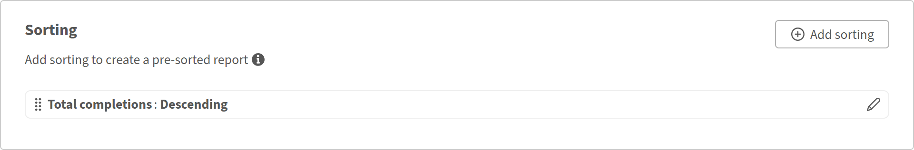

# Revisar el rendimiento del instructor con Report Builder

## Información general

Este informe ayuda a los responsables de formación a identificar los instructores más activos, a cuántos alumnos llegan y cuántos alumnos completan los cursos que imparten.

## Crear un informe de eficiencia del instructor

1. Inicie Report Builder y seleccione **Crear informe**.
2. Escriba un nombre como **Eficacia del instructor**.
3. Agregue **Nombres de instructores** del conjunto de datos **Module**.
4. Agregue el **ID de módulo** del conjunto de datos **Module**. Agregará esto para contar las sesiones.
5. Agregue **Status** del conjunto de datos **Module Transcript**. Usarás la cuenta si quieres contar las finalizaciones.
6. Seleccione **Agrupar por** en **Nombres de instructores**.
7. Aplique **Count** al **ID de módulo**. Escriba el alias Total de sesiones.
8. Aplique **Count if** a **Status** y seleccione Completado. Escriba el alias **Total de finalizaciones**.
9. Para mostrar también el total de inscripciones, agregue **Status** por segunda vez. Aplicar **Count if** a No iniciado. Escriba el alias Inscripciones totales.

   

10. Filtrar **nombres de instructor** para que no estén vacíos.

    

11. Ordene por **Total de finalizaciones**, empezando por los instructores de mayor rendimiento.

    

12. Seleccione **Guardar informe** y seleccione **Acciones** > **Descargar** para descargar el informe.

El informe descargado resume la eficacia del instructor comparando el total de sesiones de formación, las finalizaciones de los alumnos y las inscripciones no iniciadas de cada instructor, lo que permite evaluar el compromiso, el rendimiento de finalización y las posibles necesidades de seguimiento de la formación.

## Prácticas recomendadas

* Utilice etiquetas de catálogo para definir los informes del instructor a una unidad de negocio, ubicación o programa específicos. Esto es más preciso que filtrar solo por nombre de catálogo.
* Agregue un filtro de fecha, como **Fecha de inscripción** en los últimos 90 días, para establecer el ámbito del informe a un período reciente en lugar de a datos de todos los tiempos.
* Ordene por una métrica significativa, como **Complementos totales,** en lugar de por el nombre del instructor, por lo que las diferencias de rendimiento son visibles inmediatamente.
