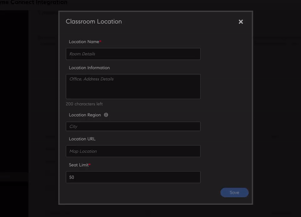

# Configuración

Obtenga información sobre la configuración de la cuenta de Learning Manager que puede efectuar como administrador.

Puede cambiar la configuración de su perfil de administrador y actualizar la configuración de su cuenta. Visualiza tu información de perfil, añade o cambia fotos de perfil y modifica el contenido de **[!UICONTROL Acerca de mí]**. Actualice la información de su empresa, establezca los métodos de inicio de sesión para los usuarios y configure la integración de la conexión a través de la configuración de la cuenta.

## Configurar el Adobe Learning Manager

Este curso de formación describe los aspectos básicos de la configuración de nivel de cuenta.

Si no puedes iniciar el entrenamiento, escribe a <almacademy@adobe.com>.

## Configuración de la cuenta {#accountsettings}

Para actualizar la configuración de la cuenta de su organización, haga clic en **[!UICONTROL Configuración]** en el panel izquierdo.

**Información básica (información de la empresa)**

Haga clic en **[!UICONTROL Cambiar]** en la página y edite la configuración de país, zona horaria, configuración regional y año financiero.

**Configurar los administradores de contactos**

Si desea añadir o cambiar las direcciones de correo electrónico de los administradores que ofrecen asistencia en la empresa, haga clic en **[!UICONTROL General]** en el panel izquierdo. Haga clic en **[!UICONTROL Cambiar]** junto a **[!UICONTROL ID de correo electrónico de asistencia]** y agregue los ID de correo electrónico. Se envía un correo electrónico a estos administradores cuando el alumno hace clic en **[!UICONTROL Contactar con el administrador]** en el pie de la página.

Añada ID de correo electrónico adicionales con punto y coma como separador.

**Métodos de inicio de sesión**: los administradores pueden elegir el modo mediante el cual los usuarios internos o externos pueden acceder a la cuenta.

* **Usuarios internos:** Para los usuarios internos, puede establecer Adobe ID o el inicio de sesión único como modo de inicio de sesión.
* **Usuarios externos:** Para usuarios externos, puede establecer el ID de Adobe ID o de inicio de sesión único o de administrador de aprendizaje.

Si elige ID de Learning Manager, los usuarios externos pueden iniciar sesión en esta cuenta después de crear su nombre de usuario y contraseña de Learning Manager.

>[!NOTE]
>
>Si hay varios perfiles externos definidos, todos los perfiles pueden tener cualquier tipo de inicio de sesión. Por ejemplo, si el tipo de inicio de sesión es el de Adobe ID, todos los perfiles deben iniciar sesión únicamente con el Adobe ID. No es posible que cada perfil tenga su propio tipo de inicio de sesión.

Puede acceder a la aplicación Learning Manager mediante Adobe ID o el inicio de sesión único. El inicio de sesión único es un mecanismo que permite a un usuario autenticarse una vez y obtener acceso a varias aplicaciones muchas veces. Esta configuración no es obligatoria para la empresa. Si su empresa tiene un proveedor de inicio de sesión único basado en SAML 2.0, puede usarlo para configurar la aplicación Learning Manager. La configuración es necesaria en su empresa y en la aplicación Learning Manager. Si elige usar inicio de sesión único, póngase en contacto con la asistencia de Adobe para recibir instrucciones sobre configuración.

**Comentarios**

Haga clic en **[!UICONTROL Comentarios]** en el panel izquierdo para configurar el cuestionario a fin de que los usuarios opinen una vez completado un curso. Consulte [contenido de ayuda sobre la función de cursos](/help/migrated/administrators/feature-summary/courses.md#add-l1-and-l3-feedback) al crear comentarios de L1 y L3.

**Varios intentos**

Seleccione **[!UICONTROL Configuración]** > **[!UICONTROL General]** > **[!UICONTROL Varios Intentos]**.

Si activa la casilla de verificación &quot;Varios intentos&quot;, los autores pueden definir &quot;Varios intentos&quot; para módulos o cursos de aprendizaje electrónico interactivos. Al seleccionar la segunda casilla, los administradores pueden definir &quot;Intentos infinitos&quot; de forma predeterminada para cualquier curso de aprendizaje electrónico interactivo recién creado.

*Seleccione la casilla de verificación Varios intentos*

**Moderación de los cursos**

Haga clic en **[!UICONTROL General]** en el panel izquierdo y seleccione la opción Moderación de los cursos para activarla. Para obtener más información sobre esta función, consulte [Moderación de los cursos](courses.md#main-pars_header_1879001177).

**Foro de debate**

Si habilita la casilla de verificación Foro de debate, los alumnos e instructores pueden publicar comentarios para cursos usando la ficha Debate de la página Cursos en la aplicación del alumno. Sin embargo, si la configuración del nivel del curso indica que esta función no está seleccionada, la configuración del nivel del curso prevalecerá sobre la del administrador.

**Tablero del alumno**

En el panel izquierdo, haga clic en Tablero del alumno. Esta página le permite elegir los widgets que desea mostrar en la página del alumno. Seleccione los widgets que estarán activos en la página del alumno. Los widgets no seleccionados no aparecerán en dicha página.

**Adobe Connect**

Haga clic en **[!UICONTROL Adobe Connect]** en el panel izquierdo a fin de configurar la cuenta de Adobe Connect para alojar sesiones de clase virtual. Para obtener más información, consulte la ayuda sobre la característica [Adobe Connect](adobeconnect-integration.md).

## Configuración general {#general}

Active o desactive las opciones siguientes:

<table>
 <tbody>
  <tr>
   <th>
    
<b>Nombre</b>

    </th>
   <th>
    
<b>Descripción</b>

   </th>
  </tr>
  <tr>
   <td>Mostrar eficacia del curso</td>
   <td>Si se ha activado, los alumnos pueden ver la eficacia actual del curso en el icono del curso. Esta función solo está disponible para los cursos. La valoración basada en estrellas no es compatible con programas de aprendizaje ni certificados. Está disponible para cursos y programas de aprendizaje, pero no para certificaciones.</td>
  </tr>
  <tr>
   <td>Moderación de los cursos</td>
   <td>Si la opción está activada, los cambios en los cursos necesitarán la aprobación del administrador antes de que sean visibles para los alumnos.</td>
  </tr>
  <tr>
   <td>Foro de debate</td>
   <td>Si habilita la casilla de verificación Foro de debate, los alumnos e instructores pueden publicar comentarios para cursos usando la ficha Debate de la página Cursos en la aplicación del alumno. Sin embargo, si la configuración del nivel del curso indica que esta función no está seleccionada, la configuración del nivel del curso prevalecerá sobre la del administrador.</td>
  </tr>
  <tr>
   <td>Varios intentos</td>
   <td>Si la opción está activada, un autor puede configurar varios intentos para los módulos de curso.</td>
  </tr>
  <tr>
   <td>Opción Explorar aptitudes</td>
   <td>Si la opción está activada, los alumnos pueden explorar las aptitudes de igual a igual y liderazgo, y suscribirse a las aptitudes de su elección.</td>
  </tr>
  <tr>
   <td>Visibilidad de aptitudes/etiquetas</td>
   <td>Se muestran todas las aptitudes y etiquetas a los alumnos. Se pueden mostrar todas las aptitudes y etiquetas, solo las aptitudes y etiquetas que se asignan, o las que son parte de los catálogos visibles para el alumno.</td>
  </tr>
  <tr>
   <td>ID exclusivos de objetos de aprendizaje</td>
   <td>Si la opción está activada, un administrador o un autor pueden agregar un identificador único para cada objeto de aprendizaje.</td>
  </tr>
  <tr>
   <td>Mostrar paneles de filtro</td>
   <td>
    
Controle los paneles de filtro que están disponibles en la aplicación del alumno para ajustar sus resultados de búsqueda. Estas son las opciones:

    <ul>
     <li>Catálogos</li>
     <li>Tipo</li>
     <li>Formato</li>
     <li>Duración</li>
     <li>Aptitudes</li>
     <li>Niveles de aptitudes</li>
     <li>Etiquetas</li>
    </ul>
    
Cuando el alumno inicia la aplicación del alumno, en las secciones Mi Aprendizaje y Catálogo, puede ver los filtros en sus respectivos paneles.

    
<b>Nota: </b>los filtros <b>Formato </b>y <b>Duración </b>están desactivados de forma predeterminada y no se muestran a los alumnos después de la publicación. El administrador debe activarlos.  
</td>
  </tr>
  <tr>
   <td>Mostrar lista del catálogo</td>
   <td>Si la opción está activada, los alumnos pueden ver la lista de todos los catálogos disponibles para ellos. Los alumnos pueden usarla para ajustar la visualización de objetos de aprendizaje.</td>
  </tr>
  <tr>
   <td>Terminología del producto</td>
   <td>Learning Manager tiene una terminología estándar que se utiliza en todo el producto. Modifique esta terminología para adecuarla a los requisitos de su empresa.</td>
  </tr>
  <tr>
   <td>Actualización de la versión del módulo</td>
   <td>Configure la opción predeterminada para actualizar el contenido. La configuración se puede modificar para cada contenido en la página del curso.</td>
  </tr>
  <tr>
   <td>Registro automático de usuarios</td>
   <td>Si la opción está activada, los usuarios recién importados se registran automáticamente. De forma predeterminada, los usuarios deben registrarse manualmente antes de poder empezar a utilizar Learning Manager.</td>
  </tr>
  <tr>
   <td>Eliminar automáticamente usuarios internos</td>
   <td>Si la opción está activada, los usuarios internos se eliminan automáticamente si no acceden al sistema durante un determinado número de días. Esta opción solo es aplicable a usuarios que tienen la función <b>Alumno</b>. Para restaurar el acceso, los usuarios deben ponerse en contacto con el administrador. </td>
  </tr>
  <tr>
   <td>Mostrar etiquetas de catálogo</td>
   <td>Si está activada, los administradores y los autores pueden definir etiquetas de catálogo y valores, y vincularlos a objetos de aprendizaje. Al seleccionar esta opción, los autores también pueden añadir cursos, rutas de aprendizaje, certificaciones o ayudas de trabajo a los catálogos.</td>
  </tr>
  <tr>
   <td>Los alumnos pueden ver sus puntuaciones</td>
   <td>Si la opción está activada, los alumnos pueden ver sus puntuaciones en la transcripción de alumno.</td>
  </tr>
  <tr>
   <td>Correo electrónico de resumen</td>
   <td>
    
Un administrador puede activar o desactivar el envío de un mensaje de correo electrónico a los alumnos. El administrador también podrá controlar la frecuencia de los mensajes de correo electrónico enviados.

    <ul>
     <li>En el caso de las <b>cuentas activas</b>, los mensajes de resumen se desactivarán de forma predeterminada, lo que el administrador puede activar manualmente.</li>
     <li>En el caso de las <b>cuentas de prueba</b>, la opción de mensajes de correo electrónico de resumen permanecerá desactivada y el administrador no podrá activarla.</li>
    </ul>
    
Si la función está desactivada:

    <ul>
     <li>Se desactivará la opción <b>Correo electrónico de resumen</b>.</li>
     <li>Un alumno no puede ver la configuración de usuario para la suscripción al correo electrónico de resumen.</li>
    </ul>
    
 Si la función está activada:

    <ul>
     <li>El administrador puede activar y modificar la opción Correo electrónico de resumen.</li>
     <li>En la <b>Configuración de perfil </b>de la aplicación de alumno, un alumno (que no se haya incluido en la lista No molestar) puede optar por suscribirse o cancelar su suscripción al correo electrónico de resumen.</li>
    </ul></td>
  </tr>
  <tr>
   <td>Activar iconos de las tarjetas de aprendizaje </td>
   <td>Si se ha activado, los iconos aparecerán en las tarjetas de aprendizaje de la aplicación del alumno. </td>
  </tr>
  <tr>
   <td>Vínculos de pie de página</td>
   <td>
    
Agregue vínculos o identificadores de correo electrónico que aparecen como pies de página. Solo puede añadir un máximo de tres vínculos de pie de página.

    
Para personalizar los vínculos del pie de página, efectúe los pasos siguientes:

    <ol>
     <li>Haga clic en <b>Añadir más</b>; a continuación, indique el nombre y la dirección URL o el ID de correo electrónico en los campos correspondientes. Agregue el prefijo http:// o https:// a la URL.</li>
     <li>Para aplicar el cambio en cascada en todas las configuraciones regionales, haga clic en <b>Replicar</b>. De este modo, se garantiza que todos los idiomas obtengan el nombre y la URL.</li>
     <li>Para guardar los cambios, haga clic en <b>Guardar</b>. Aparecerá un mensaje con la confirmación del cambio. Tras hacer clic en Aceptar, el pie de página se rellena con los vínculos recién agregados.</li>
    </ol>
    
Además, puede llevar a cabo las acciones siguientes:

    <ul>
     <li>Haga clic en el icono <b>Restablecer</b> para restablecer los valores predeterminados en los campos <b>Ayuda</b> y <b>Contactar con el administrador</b>.</li>
     <li>Personalizar el vínculo del pie de página para todos los idiomas. Haga clic en la lista desplegable <b>Idioma</b>; a continuación, seleccione el idioma y agregue los valores de <b>Nombre</b> y <b>URL</b> en los campos correspondientes. Después de guardar los cambios, los vínculos actualizados aparecen en el pie de página. </li>
    </ul></td>
  </tr>
  <tr>
   <td>Zona horaria del informe </td>
   <td>
    
Establezca una preferencia de nivel de cuenta para exportar la transcripción de aprendizaje en las siguientes zonas horarias:

    <ul>
     <li>UTC (comportamiento predeterminado)</li>
     <li>Preferencia de zona horaria en el nivel de cuenta</li>
    </ul>
    
La transcripción del alumno descargada mediante la API de trabajos también descarga los datos en la zona horaria seleccionada.

    
<b>Nota: </b>No se espera ningún cambio en la transcripción del alumno de forma predeterminada justo después de la publicación. Los administradores pueden configurar este ajuste desde Administración &gt; Configuración &gt; General &gt; Zona horaria del informe.
</td>
  </tr>
 </tbody>
</table>

<table border="0" cellpadding="0" cellspacing="0" width="1709">
 <tbody>
  <tr>
   <td height="20" width="147">Nombre</td>
   <td>Descripción</td>
  </tr>
  <tr>
   <td height="20">Mostrar eficacia del curso</td>
   <td>Si la opción está activada, los alumnos pueden ver la eficacia actual del curso en el mosaico del curso.</td>
  </tr>
  <tr>
   <td height="20">Moderación de los cursos</td>
   <td>Si la opción está activada, los cambios en los cursos necesitarán la aprobación del administrador antes de que sean visibles para los alumnos.</td>
  </tr>
  <tr>
   <td height="20">Foro de debate</td>
   <td>Si habilita la casilla de verificación Foro de debate, los alumnos e instructores pueden publicar comentarios para cursos usando la ficha Debate de la página Cursos en la aplicación del alumno. Sin embargo, si la configuración del nivel del curso indica que esta función no está seleccionada, la configuración del nivel del curso prevalecerá sobre la del administrador.</td>
  </tr>
  <tr>
   <td height="20">Varios intentos</td>
   <td>Si la opción está activada, un autor puede configurar varios intentos para los módulos de curso.</td>
  </tr>
  <tr>
   <td height="20">Opción Explorar aptitudes</td>
   <td>Si la opción está activada, los alumnos pueden explorar las aptitudes de igual a igual y liderazgo, y suscribirse a las aptitudes de su elección.</td>
  </tr>
  <tr>
   <td height="20">Visibilidad de aptitudes/etiquetas</td>
   <td>Se muestran todas las aptitudes y etiquetas a los alumnos. Se pueden mostrar todas las aptitudes y etiquetas, solo las aptitudes y etiquetas que se asignan, o las que son parte de los catálogos visibles para el alumno.</td>
  </tr>
  <tr>
   <td height="20">ID exclusivos de objetos de aprendizaje</td>
   <td>Si la opción está activada, un administrador o un autor pueden agregar un identificador único para cada objeto de aprendizaje.</td>
  </tr>
  <tr>
   <td rowspan="10" height="191">Mostrar paneles de filtro</td>
   <td>Controle los paneles de filtro que están disponibles en la aplicación del alumno para ajustar sus resultados de búsqueda. Estas son las opciones:</td>
  </tr>
  <tr>
   <td height="19">Catálogos</td>
  </tr>
  <tr>
   <td height="19">Tipo</td>
  </tr>
  <tr>
   <td height="19">Formato</td>
  </tr>
  <tr>
   <td height="19">Duración</td>
  </tr>
  <tr>
   <td height="19">Aptitudes</td>
  </tr>
  <tr>
   <td height="19">Niveles de aptitudes</td>
  </tr>
  <tr>
   <td height="19">Etiquetas</td>
  </tr>
  <tr>
   <td height="19">Cuando el alumno inicia la aplicación del alumno, en las secciones Mi Aprendizaje y Catálogo, puede ver los filtros en sus respectivos paneles.</td>
  </tr>
  <tr>
   <td height="20">Nota: los filtros Formato y Duración están desactivados de forma predeterminada y no se muestran a los alumnos después de la publicación. El administrador debe activarlos. </td>
  </tr>
  <tr>
   <td height="20">Mostrar lista del catálogo</td>
   <td>Si la opción está activada, los alumnos pueden ver la lista de todos los catálogos disponibles para ellos. Los alumnos pueden usarla para ajustar la visualización de objetos de aprendizaje.</td>
  </tr>
  <tr>
   <td height="20">Terminología del producto</td>
   <td>Learning Manager tiene una terminología estándar que se utiliza en todo el producto. Modifique esta terminología para adecuarla a los requisitos de su empresa.</td>
  </tr>
  <tr>
   <td height="20">Actualización de la versión del módulo</td>
   <td>Configure la opción predeterminada para actualizar el contenido. La configuración se puede modificar para cada contenido en la página del curso.</td>
  </tr>
  <tr>
   <td height="20">Registro automático de usuarios</td>
   <td>Si la opción está activada, los usuarios recién importados se registran automáticamente. De forma predeterminada, los usuarios deben registrarse manualmente antes de poder empezar a utilizar Learning Manager.</td>
  </tr>
  <tr>
   <td height="20">Eliminar automáticamente usuarios internos</td>
   <td>Si la opción está activada, los usuarios internos se eliminan automáticamente si no acceden al sistema durante un determinado número de días. Esta función se aplica a los usuarios que solo tienen la función Alumno. Para restaurar el acceso, los usuarios deben ponerse en contacto con el administrador.</td>
  </tr>
  <tr>
   <td height="20">Mostrar etiquetas de catálogo</td>
   <td>Si la opción está activada, los administradores y los autores pueden definir etiquetas de catálogo y valores, y vincularlos a objetos de aprendizaje.</td>
  </tr>
  <tr>
   <td height="20">Los alumnos pueden ver sus puntuaciones</td>
   <td>Si la opción está activada, los alumnos pueden ver sus puntuaciones en la transcripción de alumno.</td>
  </tr>
  <tr>
   <td rowspan="9" height="172">Correo electrónico de resumen</td>
   <td>Un administrador puede activar o desactivar el envío de un mensaje de correo electrónico a los alumnos. El administrador también podrá controlar la frecuencia de los mensajes de correo electrónico enviados.</td>
  </tr>
  <tr>
   <td height="19">En el caso de las cuentas activas, los mensajes de resumen se desactivarán de forma predeterminada, lo que el administrador puede activar manualmente.</td>
  </tr>
  <tr>
   <td height="19">En el caso de las cuentas de prueba, la opción de mensajes de correo electrónico de resumen permanecerá desactivada y el administrador no podrá activarla.</td>
  </tr>
  <tr>
   <td height="19">Si la función está desactivada:</td>
  </tr>
  <tr>
   <td height="19">Se desactivará la opción Correo electrónico de resumen .</td>
  </tr>
  <tr>
   <td height="19">Un alumno no puede ver la configuración de usuario para la suscripción al correo electrónico de resumen.</td>
  </tr>
  <tr>
   <td height="19"> Si la función está activada:</td>
  </tr>
  <tr>
   <td height="19">El administrador puede activar y modificar la opción Correo electrónico de resumen.</td>
  </tr>
  <tr>
   <td height="20">En la Configuración de perfil de la aplicación de alumno, un alumno (que no se haya incluido en la lista No molestar) puede optar por suscribirse o cancelar su suscripción al correo electrónico de resumen.</td>
  </tr>
  <tr>
   <td height="20">Activar iconos de las tarjetas de aprendizaje</td>
   <td>Si se ha activado, los iconos aparecerán en las tarjetas de aprendizaje de la aplicación del alumno.</td>
  </tr>
  <tr>
   <td rowspan="8" height="153">Vínculos de pie de página</td>
   <td>Agregue vínculos o identificadores de correo electrónico que aparecen como pies de página. Solo puede añadir un máximo de tres vínculos de pie de página.</td>
  </tr>
  <tr>
   <td height="19">Para personalizar los vínculos del pie de página, efectúe los pasos siguientes:</td>
  </tr>
  <tr>
   <td height="19">1. Haga clic en Añadir más, introduzca el nombre y la URL o el ID de correo electrónico en los campos especificados. Agregue el prefijo http:// o https:// a la URL.</td>
  </tr>
  <tr>
   <td height="19">2. Para aplicar el cambio en cascada en todas las configuraciones regionales, haga clic en Replicar. De este modo, se garantiza que todos los idiomas obtengan el nombre y la URL.</td>
  </tr>
  <tr>
   <td height="19">3. Para guardar los cambios, haga clic en Guardar. Aparecerá un mensaje con la confirmación del cambio. Tras hacer clic en Aceptar, el pie de página se rellena con los vínculos recién agregados.</td>
  </tr>
  <tr>
   <td height="19">Además, puede llevar a cabo las acciones siguientes:</td>
  </tr>
  <tr>
   <td height="19">Haga clic en el icono Restablecer para restablecer los valores predeterminados de los campos Ayuda y Contactar con el administrador .</td>
  </tr>
  <tr>
   <td height="20">Personalizar el vínculo del pie de página para todos los idiomas. Haga clic en la lista desplegable Idioma, seleccione el idioma y agregue el Nombre y la URL en los campos especificados. Después de guardar los cambios, los vínculos actualizados aparecen en el pie de página.</td>
  </tr>
  <tr>
   <td rowspan="5" height="96">Zona horaria del informe</td>
   <td> Establezca una preferencia de nivel de cuenta para exportar la transcripción de aprendizaje en las siguientes zonas horarias:</td>
  </tr>
  <tr>
   <td height="19">UTC (comportamiento predeterminado)</td>
  </tr>
  <tr>
   <td height="19">Preferencia de zona horaria en el nivel de cuenta</td>
  </tr>
  <tr>
   <td height="19">La transcripción del alumno descargada mediante la API de trabajos también descarga los datos en la zona horaria seleccionada.</td>
  </tr>
  <tr>
   <td height="20">Nota: no se espera ningún cambio en la transcripción del alumno de forma predeterminada justo después de la publicación. Los administradores pueden configurar este ajuste desde Administración &gt; Configuración &gt; General &gt; Zona horaria del informe.</td>
  </tr>
  <tr>
   <td height="19">Integración de Badgr</td>
   <td>Si se ha activado, los alumnos podrán cargar sus insignias en el sitio web de Badgr. En la educación de clientes, las organizaciones desean poder "certificar" los conocimientos de sus clientes y darles la oportunidad de mostrar esas credenciales en las redes sociales. Esto motiva al alumno a realizar un curso de formación y compartir sus logros con otros. </td>
  </tr>
  <tr>
   <td height="135">
    
Mostrar valoración
</td>
   <td>
    <ul>
     <li>Si la opción <b>Eficacia del curso</b> está activada, los alumnos solo podrán ver el valor de la eficacia del curso.</li>
     <li>Si la opción <b>Valoración basada en estrellas</b> está activada, los alumnos solo podrán ver la valoración media con estrellas y el número de alumnos que han valorado el curso. </li>
    </ul>
    
Esta función solo está disponible para los cursos. La valoración basada en estrellas no es compatible con los programas de aprendizaje ni los certificados.  <b>Nota: </b>Este cambio solo afecta a la aplicación del alumno. 

    
En el resto de aplicaciones (administrador, autor, responsable, administrador personalizado y autor personalizado), los cambios realizados en la configuración (clasificación basada en estrellas/eficacia del curso/desactivación de la visualización de valoraciones) no tendrán ningún efecto. 

    
Para las nuevas cuentas, la sección <b>Mostrar valoraciones</b> tendrá habilitada la opción <b>Valoración basada en estrellas</b> de forma predeterminada.

    
Para las cuentas existentes, si la cuenta tenía habilitada la opción <b>Eficacia del curso</b>, la sección <b>Mostrar valoraciones</b> se habilitará con la opción Eficacia del curso seleccionada. Si la opción <b>Eficacia del curso</b>s está deshabilitada, la sección <b>Mostrar valoraciones</b> también se deshabilitará. Cuando la sección <b>Mostrar valoraciones</b> está habilitada, la opción <b>Valoración basada en estrellas</b> se habilitará de forma predeterminada.
</td>
  </tr>
  <tr>
   <td height="19">Retirar</td>
   <td>Seleccione cualquiera de las opciones de retirada de las siguientes:<li>Una vez retirados, los alumnos inscritos podrán ver y realizar acciones, pero los alumnos que aún no se hayan inscrito perderán su acceso.</li><li>Una vez retirados, los alumnos inscritos y los que aún no se han inscrito perderán su acceso.</li>
<b>Nota:</b> Puedes retirar cursos, rutas de aprendizaje o certificaciones de sus páginas de información general.
 </td>
  </tr>
  <tr>
   <td height="19">Mostrar todos los cursos inscritos en los resultados de búsqueda</td>
   <td>Si está activado, el alumno puede ver el curso en los resultados de búsqueda aunque forme parte de su ruta de aprendizaje o certificación inscrita.</td>
  </tr>
 </tbody>
</table>

<table>
 <tbody>
  <tr>
   <td>
    
Rutas de aprendizaje
</td>
   <td>
    
Si se selecciona la opción <b>Habilitar características ampliadas de la ruta de aprendizaje</b>, los administradores podrán incluir rutas de aprendizaje dentro de las rutas de aprendizaje y combinarlas con cursos. La opción es irreversible. 
</td>
  </tr>
  <tr>
   <td>
    
Administración de instructores 
</td>
   <td>
    
Active este ajuste para restringir la lista de instructores que se pueden seleccionar al crear sesiones de clase o de clase virtual. Todos los usuarios con privilegios de instructor solo se pueden asignar como instructores a cualquier sesión. Esta restricción no se aplica a los flujos de trabajo de migración. 

  </td>
  <tr>
    <td>
      
Importación de aptitudes

    </td>
    <td>
      
Si está activado, puede elegir un origen externo para importar aptitudes. Las aptitudes de los recursos de aprendizaje existentes se importarán al repositorio de aptitudes una vez durante la ejecución inicial. Para todas las importaciones posteriores de recursos de aprendizaje, las aptitudes se importarán en el repositorio de aptitudes solo para los elementos recién importados.
      Una vez activada la opción, la acción es irreversible. No puede deshabilitar ni cambiar a otro origen más adelante.
      

    </td>
  </tr>
  </tr>
 </tbody>
</table>

>[!NOTE]
>
>Una vez habilitada la configuración de importación de aptitudes, el diseño de cuenta no se puede cambiar a la vista clásica; es decir, se deshabilita el cambio a la cuenta clásica después de habilitar la opción **Importación de aptitudes**.

## Renombrar los objetos de aprendizaje {#renaminglearningobjects}

Esta función solo está disponible en inglés.

Ahora, los administradores pueden renombrar los objetos de aprendizaje en Learning Manager. A continuación, se enumera la terminología que se puede renombrar.

Módulo\
Curso\
Programa de aprendizaje\
Certificación\
Plan de aprendizaje\
Ayuda de trabajo\
Widget\
Aptitud\
Insignia\
Anuncio\
Mi aprendizaje\
Tabla de posiciones\
Eficacia\
Requisito previo\
Trabajo preliminar\
Contenido principal\
Testout\
Personalizado\
Mezclado\
Clase\
Clase virtual\
Actividad

## Configuración de perfil {#profilesettings}

1. Haz clic en la flecha desplegable en la esquina superior derecha, junto a tu foto/cuenta y elige **[!UICONTROL Configuración de perfil]**.
1. En el cuadro de diálogo emergente, puedes añadir o cambiar una foto moviendo el ratón y haciendo clic en **[!UICONTROL Editar]** en el área de la foto de perfil.
1. Agregue o modifique el contenido de **[!UICONTROL About]** haciendo clic en **[!UICONTROL Editar]** junto a él.
1. Haga clic en **[!UICONTROL Guardar].**

## Carpeta de contenido {#content-folder}

Learning Manager admite carpetas de contenido privado. Un administrador puede configurar carpetas de contenido privado y proporcionar su acceso a determinados autores personalizados mediante funciones personalizadas. Tenga en cuenta que los autores estándar (denominados también autores completos) siguen teniendo acceso a todo el contenido de la cuenta. Por lo tanto, los autores completos tienen acceso a todas las carpetas y a todo el contenido.

Los administradores pueden configurar las carpetas de contenido. Solo una vez que se hayan configurado, las carpetas de contenido pasan a estar visibles para los autores y estos podrán incluir el contenido en una o varias carpetas.

Para agregar una carpeta de contenido, en la aplicación de administrador, haga clic en **[!UICONTROL Configuración]** > **[!UICONTROL Carpeta de contenido]**.

*Cambiar configuración de carpeta de contenido*

### Carpeta

Una carpeta es un repositorio de contenido, que es un subconjunto de toda la biblioteca de contenido disponible en una cuenta con las siguientes propiedades:

* Solo un administrador puede crear, editar o eliminar una carpeta.
* Un administrador puede controlar el acceso a las carpetas como parte de la definición de funciones solo para administradores personalizados.
* El contenido **DEBE estar asociado en todo momento a al menos una carpeta**. Para empezar, todo el contenido se asociará a la carpeta pública, que se puede modificar posteriormente.
* El contenido se puede asociar a varias carpetas durante su creación, lo que también será posible mediante una operación de copia.
* Todos los nombres de carpeta deben ser exclusivos en la cuenta; de lo contrario, se producirá un error al asignar un nombre a una carpeta.

Las carpetas solo controlan la visibilidad del contenido, pero no crean copias de este. Por lo tanto, al modificar el contenido, los cambios se reflejarán en todas las carpetas asociadas.

### Carpeta pública

Siempre habrá una carpeta pública en la cuenta y todo el contenido formará inicialmente parte de esta. Más adelante, los autores pueden mover el contenido de esta carpeta a otras. Una carpeta pública presenta las siguientes propiedades:

* De forma predeterminada, todos los tipos de autores podrán acceder a todo el contenido asociado a esta carpeta.
* El contenido que forma parte de una carpeta pública no puede incluirse en ninguna otra carpeta. Lo contrario también es cierto.

Esta carpeta no puede formar parte de la definición de función configurable. Por lo tanto, no tener una carpeta pública en la definición de función configurable no restringe el acceso a una carpeta pública.

### Carpeta privada

* Cualquier carpeta creada por un administrador es una carpeta privada.

### Operaciones de carpeta

**Añadir una carpeta**

Para agregar una carpeta, haga clic en **[!UICONTROL Agregar]** en la esquina superior derecha de la ventana.

**Eliminar una carpeta**

También puede eliminar una carpeta. Seleccione la carpeta que desea eliminar, haga clic en el menú Acciones y, a continuación, en **[!UICONTROL Eliminar carpeta]**.

>[!NOTE]
>
>Las carpetas se pueden eliminar cuando todo su contenido asociado también está asociado a otras carpetas. Si hay contenido vinculado solo a la carpeta que se va a eliminar, mueva primero el contenido a otra carpeta y, a continuación, elimine la carpeta.

## Ubicaciones de clases

Los administradores pueden utilizar esta configuración para crear y configurar una biblioteca de ubicaciones de clase. Los autores pueden seleccionar una ubicación preconfigurada para configurar su evento de clase. Seleccione una ubicación de la biblioteca para rellenar automáticamente la información de ubicación, la URL y el límite de asientos.

Como administrador, puede hacer lo siguiente:

### Importar CSV de ubicaciones

Añada ubicaciones en su cuenta importando un archivo CSV de ubicaciones. El archivo CSV debe contener la columna Ciudad.

### Añadir ubicación

Añada lo siguiente:

1. Nombre de ubicación: Introduzca el nombre de la clase.
2. Información de ubicación: Introduzca la información sobre la ubicación.
3. Región Ubicación: El valor introducido aparece como filtro Ubicaciones de Formación para los alumnos.
4. URL de ubicación: introduzca la dirección URL de la ubicación.
5. Límite de plazas: Especifique la capacidad de la sala.

*Agregar ubicaciones de clase*

También puede añadir la ubicación con la ayuda de un archivo CSV. El archivo CSV debe contener los campos:

* name
* info
* url
* seatLimit
* (región)

<!---->

### Configuración {#admin-classroom-settings}

Seleccione **Editar** para cambiar lo siguiente:

* **Permitir a los autores crear ubicaciones**: una vez habilitadas, todas las ubicaciones creadas por los autores se mostrarán en la ficha &#39;Todas las ubicaciones&#39;. Los alumnos también verán estas ubicaciones en los filtros Catálogo y Calendario.
* **Permitir a los autores modificar y eliminar ubicaciones**:
Una vez activada, los autores podrán modificar y eliminar todas las ubicaciones de clase. Las modificaciones de los autores se reflejarán en toda la plataforma, incluidos los informes.

## Preguntas más frecuentes {#frequentlyaskedquestions}

+++¿Cómo se crean diferentes carpetas para la biblioteca de contenido?

Haga clic en **[!UICONTROL Configuración]** > **[!UICONTROL Carpeta de contenido]**. Para agregar una carpeta, haga clic en **[!UICONTROL Agregar]** en la esquina superior derecha y, en el cuadro de diálogo, escriba el nombre y la descripción de la carpeta.

Los administradores pueden configurar las carpetas de contenido. Solo una vez que se hayan configurado, las carpetas de contenido pasan a estar visibles para los autores y estos podrán incluir el contenido en una o varias carpetas.

Para obtener más información, consulte la sección sobre [Carpeta de contenido](settings.md#content-folder).
+++

+++¿Cómo se añade el ejercicio financiero para la cuenta?

En **[!UICONTROL Configuración]** > **[!UICONTROL Información básica]**, haga clic en **[!UICONTROL Cambiar]**. En la lista desplegable **[!UICONTROL El año financiero comienza desde]**, seleccione el mes.
+++
