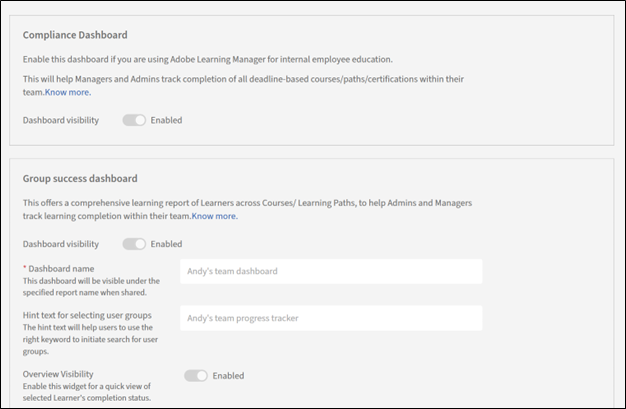

# Configuración avanzada en Adobe Learning Manager

## Etiquetas de catálogo

Las etiquetas de catálogo de Adobe Learning Manager se utilizan para etiquetar objetos de aprendizaje (cursos, certificaciones, rutas de aprendizaje, etc.) con campos y valores específicos. Estas etiquetas ayudan a usted y a los autores a categorizar y organizar el contenido de manera eficaz, lo que permite un mejor filtrado, seguimiento y generación de informes.

Consulte [Etiquetas de catálogo en Adobe Learning Manager](/help/migrated/administrators/feature-summary/catalog-labels.md) para obtener más información.

>[!NOTE]
>
>* Etiquetas obligatorias: Puede elegir que las etiquetas de catálogo sean obligatorias para los autores durante la creación del curso.
>* Flujo de trabajo de autor: Los autores deben añadir etiquetas de cumplimiento al crear o editar cursos para garantizar una categorización adecuada.

## Carpeta de contenido

Las carpetas de contenido en Adobe Learning Manager controlan qué autores pueden ver el contenido de la biblioteca de contenido y acceder a él. Con las carpetas de contenido jerárquicas, los administradores pueden organizar grandes bibliotecas de contenido en hasta tres niveles de carpetas privadas anidadas, lo que facilita la búsqueda, administración y reutilización del contenido en toda la organización.

### Qué es una carpeta de contenido

Una carpeta de contenido es un contenedor que agrupa el contenido relacionado y determina quién puede tener acceso a él. Todos los archivos de contenido de Adobe Learning Manager pertenecen a al menos una carpeta en todo momento.

Hay dos tipos de carpetas de contenido:

**Carpeta pública**: presente en todas las cuentas de forma predeterminada. La carpeta pública tiene las siguientes propiedades:

* Todos los autores de la cuenta pueden acceder al contenido de la carpeta pública.
* El contenido de la carpeta pública no puede estar en ninguna carpeta privada. Lo contrario también es cierto. El contenido de una carpeta privada no puede estar en la carpeta pública.
* La carpeta pública no forma parte de la configuración de acceso basada en funciones. Restringir una función personalizada a carpetas privadas específicas no restringe el acceso a la carpeta pública.

**Carpetas privadas**: creadas por administradores. Las carpetas privadas admiten una jerarquía de tres niveles y su acceso se controla mediante la configuración de funciones.

**Comprender los niveles de jerarquía de carpetas**

Las carpetas de contenido privado admiten hasta tres niveles de anidamiento:

* **Carpetas de nivel 1**: carpetas de nivel superior en la raíz de la biblioteca de contenido

* **Carpetas de nivel 2**: subcarpetas anidadas dentro de una carpeta de nivel 1

* **Carpetas de nivel 3**: subcarpetas anidadas dentro de una carpeta de nivel 2

Esta estructura proporciona a las organizaciones la flexibilidad de reflejar la organización de contenido real, por área de tema, tipo de entrega, audiencia o equipo, en lugar de administrar miles de archivos en una lista plana.

>[!NOTE]
>
>Solo los administradores pueden crear, editar o eliminar carpetas en cualquier nivel. Los autores y los usuarios personalizados interactúan con la jerarquía, pero no pueden modificarla. Además, los administradores personalizados con acceso a cualquier carpeta raíz pueden crear, editar o eliminar carpetas de dicha carpeta raíz.

### Reglas de nomenclatura de carpetas

Los nombres de carpeta deben ser únicos dentro del mismo nivel en la misma carpeta principal. Específicamente:

| **Escenario** | **Permitido?** |
|----------------------------------------------------------------------------------------------|--------------------------|
| Dos carpetas de nivel 1 con el mismo nombre | No |
| Dos carpetas de nivel 2 bajo la misma carpeta de nivel 1 con el mismo nombre | No |
| Dos carpetas de nivel 2 bajo diferentes carpetas de nivel 1 con el mismo nombre | Sí |
| Una carpeta de nivel 2 y una carpeta de nivel 3 con el mismo nombre | Sí. Los niveles son distintos |
| Una carpeta de nivel 3 y otra de nivel 3 bajo la misma carpeta de nivel 2 con el mismo nombre | No |

### Cómo aparecen las rutas de carpeta

La biblioteca de contenido muestra la ruta completa de cada archivo de contenido. Por ejemplo, **Programas de formación** / **Incorporación** / **Activos SCORM**. Esta ruta muestra la ubicación completa del contenido.

Si existe un archivo en más de una carpeta, todas las rutas aparecen separadas por comas. Si una ruta es larga, se trunca desde el principio con puntos suspensivos (...) y siempre se muestra el nombre de carpeta más profundo.

### Acceso a carpetas basado en funciones

El acceso a las carpetas privadas está asignado a **Nivel 1 solo**. Cuando se concede acceso a una función personalizada a una carpeta de nivel 1, ese acceso se aplica automáticamente en cascada a todas las subcarpetas de nivel 2 y nivel 3 que contiene. No existe la opción de conceder acceso al nivel de subcarpeta de forma independiente.

En la siguiente tabla se describe lo que puede hacer cada función con la jerarquía de carpetas.

| **Rol** | **Qué pueden hacer** |
|-----------------|-----------------------------------------------------------------------------------------------------------------------------------------------------------|
| Administrador | Crear, cambiar de nombre y eliminar carpetas privadas de Nivel 1, Nivel 2 y Nivel 3; configurar el acceso a carpetas de nivel 1 para funciones personalizadas |
| Administrador personalizado | Administrar carpetas dentro de ramas de nivel 1 accesibles, sujetas a sus privilegios asignados |
| Autor | Examinar carpetas, filtrar contenido por carpeta, añadir contenido a carpetas, copiar y mover contenido entre carpetas, seleccionar contenido al añadir módulos a un curso |
| Autor personalizado | Igual que el autor, pero limitado a las carpetas accesibles a través de sus privilegios de Nivel 1 asignados |

### Límites de estructura de carpetas

| **Límite** | **Valor** |
|---------------------------------------|-----------|
| Carpetas de nivel 1 por cuenta | Sin límite |
| Subcarpetas de nivel 2 por carpeta de nivel 1 | 25 |
| Subcarpetas de nivel 3 por carpeta de nivel 2 | 25 |
| Profundidad máxima de la carpeta | 3 niveles |

### Comportamiento de selección de carpetas

Al seleccionar una carpeta, por ejemplo, al filtrar o eliminar, la selección se desplaza en cascada por la jerarquía de la siguiente manera:

* Al seleccionar una **carpeta de nivel 1**, se seleccionan automáticamente todas las carpetas de nivel 2 y nivel 3 que contiene.

* Al seleccionar una **carpeta de nivel 2**, se seleccionan automáticamente todas las carpetas de nivel 3 que hay debajo. No se seleccionan otras carpetas de nivel 2 en la misma carpeta de nivel 1.

* Al seleccionar una **carpeta de nivel 3**, solo se selecciona esa carpeta. No se ha seleccionado ninguna otra carpeta.

>[!NOTE]
>
>Cuando se selecciona una subcarpeta sin seleccionar su carpeta principal, esta no muestra un indicador de selección parcial o mixta. Esto es intencional. Porque una carpeta principal puede contener contenido, no sólo subcarpetas. Seleccionar una carpeta principal significa &quot;incluir todo el contenido de esta carpeta y todo lo que haya debajo&quot;. Un indicador parcial sugeriría que se incluye parcialmente el contenido de la carpeta principal, lo que sería engañoso. Si sólo desea filtrar por una subcarpeta específica, seleccione esa subcarpeta directamente. Si desea todo el contenido de una carpeta principal y sus subcarpetas, seleccione la carpeta principal.

### Cuándo utilizar una estructura jerárquica de carpetas

Las carpetas de contenido jerárquico son especialmente valiosas cuando su organización administra muchos archivos de contenido y necesita una forma estructurada de navegar, reutilizar y controlar el acceso a ellos.

Los escenarios comunes incluyen:

* **Bibliotecas de contenido grandes**: Cuando tiene miles de archivos de contenido, una jerarquía de tres niveles permite a los autores navegar directamente a lo que necesitan, en lugar de desplazarse por una lista plana.

* **Varios equipos o proyectos**: Las carpetas de nivel 1 pueden separar áreas del equipo o del proyecto; Las carpetas de nivel 2 se pueden organizar por tipo de entrega; Las carpetas de nivel 3 pueden contener activos individuales.

* **Separación de contenido basada en funciones**: Cuando los diferentes equipos de autores deben acceder solo al contenido relevante para su trabajo, la asignación de acceso a carpetas de nivel 1 mantiene la privacidad del contenido de cada equipo.

### Casos prácticos reales de carpetas de contenido jerárquico

**Caso de uso 1: Formación de cumplimiento con contenido específico de la jurisdicción**

Una organización global imparte formación obligatoria sobre cumplimiento en varias regiones. Cada región tiene módulos principales que se aplican a todos, además de adiciones legales específicas de cada jurisdicción, como las normativas de privacidad de datos, la legislación laboral local y los requisitos de divulgación financiera, que varían según el país o la región.

Sin carpetas jerárquicas, todos los activos de cumplimiento se encuentran en una lista plana, lo que dificulta que los equipos de contenido regional sepan qué archivos pertenecen a qué programa o jurisdicción.

Con una estructura de tres niveles:

* Nivel 1: Formación de cumplimiento

* Nivel 2: EMEA / APAC / América (una subcarpeta por región)

* Nivel 3: Módulos o recursos específicos por región (PDF de normativas de privacidad, plataformas de políticas locales, archivos de evaluación)

En el caso de los autores regionales, al ser una función personalizada, solo se puede seleccionar la carpeta de nivel 1 durante la creación de la función personalizada. La selección de carpetas de nivel 2 no es una opción. Solo pueden buscar, actualizar y reutilizar los activos correspondientes a su jurisdicción sin ver ni modificar accidentalmente el contenido de otra región.

**Caso de uso 2: programa de incorporación a gran escala con muchas funciones**

Una organización incorpora a miles de empleados al año en varias funciones distintas: Colaboradores individuales, gerentes, contratistas y especialistas técnicos. Cada función tiene su propia vía de incorporación con contenido básico compartido y módulos específicos de la función.

Con una estructura de tres niveles:

* Nivel 1: Incorporación

* Nivel 2: Función (Colaborador individual / Responsable / Contratista / Especialista técnico)

* Nivel 3: Tipo de módulo (paquetes SCORM / plataformas ILT / guías de actividad / evaluaciones)

Los autores que crean cursos para cada función navegan directamente al nivel 2 y encuentran los archivos exactos para esa pista. Cuando se reutiliza un módulo entre funciones, como un vídeo de valores de empresa, se puede copiar o vincular en varias carpetas sin crear duplicados. El contenido sigue siendo de un solo origen, pero aparece en todas las ramas relevantes.

**Caso de uso 3: Biblioteca de habilidades técnicas de gran volumen con varios equipos de contenido**

Una empresa de tecnología mantiene una biblioteca de formación de habilidades internas con miles de archivos de contenido en todas las líneas de productos, infraestructura de nube, herramientas de desarrollador, seguridad e ingeniería de datos. Colaboran varios equipos de autores, cada uno de ellos responsable de un área de producto. Los módulos del curso pueden ejecutar de 40 a 60 archivos por curso.

Sin jerarquía, todos los miles de archivos se encuentran en un puñado de carpetas de nivel superior, y los autores de diferentes equipos suelen elegir la versión de archivo incorrecta o sobrescriben accidentalmente los activos compartidos.

Con una estructura de tres niveles:

* Nivel 1: Área de productos (nube / herramientas de desarrollo / seguridad / ingeniería de datos)

* Nivel 2: Nombre del curso

* Nivel 3: Tipo de contenido (Vídeos / PDF / SCORM / Cuestionarios)

A cada equipo de productos se le concede acceso solo a su carpeta de nivel 1. Encontrar una prueba específica para un curso específico significa navegar exactamente a la carpeta de nivel 3 correcta en lugar de buscar entre miles de archivos. Cuando el equipo de seguridad actualiza un paquete SCORM, sabe que se encuentra en Seguridad > [Nombre del curso] > SCORM y no puede aterrizar accidentalmente en la sucursal de otro equipo.

### Administrar carpetas de contenido como administrador

Como administrador de Adobe Learning Manager, puede crear y mantener la jerarquía de carpetas de contenido, controlar las funciones personalizadas que tienen acceso a determinadas carpetas y administrar los nombres y eliminaciones de las carpetas. Los autores pueden agregar contenido a las carpetas y organizarlas dentro de la jerarquía, pero solo los administradores pueden crear, cambiar el nombre o eliminar carpetas.

#### Crear una carpeta de contenido

>[!NOTE]
>
>Dos carpetas en el mismo nivel bajo el mismo padre no pueden compartir un nombre. Se permite el mismo nombre en ramas diferentes o en niveles diferentes.

1. Inicie sesión en Adobe Learning Manager como administrador.
2. En la barra de navegación izquierda, seleccione **Configurar** > **Configuración**.
3. En la sección **Avanzado**, seleccione **Carpeta de contenido**.
4. Seleccione **Agregar** en la esquina superior derecha de la página. Se abre el cuadro de diálogo **Agregar nueva carpeta**.
5. Introduzca un nombre y una descripción opcional para la carpeta.
6. Seleccione **Guardar**. La carpeta se creará y aparecerá en la lista de carpetas.

#### Crear una subcarpeta

1. En la página **Carpeta de contenido**, busque la carpeta principal.
2. Seleccione la opción **Crear subcarpeta** junto al nombre de la carpeta.
3. Introduzca un nombre y una descripción opcional para la subcarpeta.
4. Seleccione **Guardar**. La subcarpeta aparece con una sangría debajo de su carpeta principal en la lista de carpetas.

>[!NOTE]
>
>Cada carpeta puede contener hasta 25 subcarpetas directas. Nivel 3 es la profundidad máxima. No se puede crear una subcarpeta dentro de una carpeta de nivel 3.

#### Cambiar el nombre de una carpeta

1. En la página **Carpeta de contenido**, seleccione la carpeta cuyo nombre desea cambiar. La carpeta se abre en modo de edición.
2. Actualice el nombre de la carpeta y, si es necesario, la descripción.
3. Seleccione **Guardar**. La carpeta se guarda con el nuevo nombre.

#### Eliminar una carpeta

Antes de eliminar, tenga en cuenta las siguientes reglas:

* Puede eliminar una carpeta vacía en cualquier nivel.
* Solo se pueden eliminar las carpetas vacías. Las carpetas que contienen contenido no se pueden eliminar, independientemente de si el contenido está vinculado a otras carpetas o no.
* Al eliminar una carpeta principal, se eliminan todas sus subcarpetas. Al seleccionar una carpeta principal, se seleccionan automáticamente todos sus elementos secundarios.

#### Eliminar la carpeta principal

1. En la página **Carpeta de contenido**, marque la casilla de verificación junto a cada carpeta que desee eliminar.
2. Seleccione **Acciones** > **Eliminar carpeta** en la esquina superior derecha de la página.
3. Confirme la eliminación cuando se le solicite. También se eliminan todas las subcarpetas dentro de las carpetas principales.

#### Eliminar una subcarpeta

1. En la página **Carpeta de contenido**, seleccione la casilla de verificación junto a la subcarpeta que desea eliminar.
2. Seleccione **Acciones** > **Eliminar carpeta** en la esquina superior derecha de la página.
3. Confirme la eliminación cuando se le solicite. Se elimina la subcarpeta.

>[!CAUTION]
>
>La eliminación de una carpeta es permanente. Asegúrese de que todo el contenido de la carpeta se haya trasladado a otra ubicación antes de confirmar.

#### Configurar el acceso a carpetas para funciones personalizadas

Puede restringir las funciones personalizadas a carpetas de nivel 1 específicas para que los administradores personalizados y los autores con esas funciones vean únicamente el contenido que les corresponda.

Access está establecido en el **nivel de carpeta 1 solo**. Cuando concede acceso a una función personalizada a una carpeta de nivel 1, dicha función obtiene automáticamente acceso a todas las subcarpetas de nivel 2 y nivel 3 que contiene. No se puede asignar acceso al nivel de subcarpeta de forma independiente.

1. En la barra de navegación izquierda, seleccione **Usuarios** > **Funciones personalizadas**.
2. Abra la función personalizada que desea configurar o cree una nueva.
3. En **Privilegios de cuenta**, busque la sección **Carpetas de contenido**.
4. Seleccione **Carpetas seleccionadas**.
5. Seleccione las carpetas de nivel 1 a las que debe tener acceso esta función.
6. Seleccione **Aceptar**.

Los usuarios con esta función solo ven el contenido de las carpetas de nivel 1 seleccionadas y sus subcarpetas. El contenido de otras carpetas privadas y públicas sigue sin ser accesible para ellos.

#### Prácticas recomendadas

Las siguientes prácticas le ayudan a crear una estructura de carpetas que se adapta bien y es fácil de explorar.

1. **Planee la estructura antes de crear carpetas.** Una vez organizado el contenido en una jerarquía, la reestructuración requiere mover grandes volúmenes de contenido. Decida las categorías de nivel 1, como líneas de productos, departamentos o programas de formación, antes de empezar.

2. **Usar tres niveles para agrupaciones significativas.** Un patrón común es: Nivel 1 para un dominio o programa amplio, Nivel 2 para un tipo de entrega o equipo, Nivel 3 para activos individuales. Por ejemplo:

   * Nivel 1: Formación de ventas

   * Nivel 2: Módulos con ritmo personalizado

   * Nivel 3: Activos de PDF

3. **Mantén nombres cortos, descriptivos y únicos en su elemento principal.** Evite nombres genéricos como &quot;Módulo 1&quot; o &quot;Contenido&quot;. Utilice identificadores que tengan sentido para los autores que navegan por la biblioteca.

4. **Asignar acceso a funciones personalizadas solo en el nivel 1.** Dado que el acceso se produce en cascada automáticamente, la asignación en el nivel 1 es suficiente y simplifica la administración del acceso. No es necesario actualizar el acceso cuando se agregan subcarpetas de Nivel 2 o Nivel 3.

5. **Mover contenido antes de eliminar carpetas.** Si una carpeta contiene contenido que no está vinculado en ningún otro lugar, la eliminación se bloquea. Genera el hábito de revisar el contenido de las carpetas antes de eliminarlas.

<!--

**Key points:**

A folder is a repository of content, which is a subset of the entire content library available in an account with the following properties:

* Only you (administrator) can create, edit, or delete a folder.
* You can control access to folders as part of defining roles only for custom administrators.
* Content must at all times be associated with at least one folder. To start with, all content will be associated with the public folder, which can later be changed.
* Content can be associated with multiple folders at the time of creation, which will also be possible by a copy operation
* All folder names must be unique within the account, otherwise there will be an error in naming a folder.

Folders only control visibility of content and don't create copies of content. Therefore, editing content will reflect in all the associated folders.

**Public folder**

A public folder is always present in an account and initially, all content will be part of this folder. Later, authors can move content out of this folder into other folders. A public folder has the following properties:

* All content associated with this folder will be accessible to all types of authors, by default.
* Any content that is a part of a public folder, cannot be part of any other folder. The converse also holds true.

This folder cannot be part of configurable role definition. Consequently, not having a public folder in configurable role definition doesn't restrict access to a public folder.

**Private folder**

Any folder created by you is a private folder.

**Add a content folder**

To add a content folder, follow the steps:

1. Select **[!UICONTROL Settings]** > **[!UICONTROL Content Folder]**.
2. Select **[!UICONTROL Add]** to create a new folder.
3. Type the name and description of the folder to be created.
 
    

4. Select **[!UICONTROL Save]** to create the folder.

**Folder operations**

* **[!UICONTROL Add a folder]**: To add a folder, select the folder, and then select **[!UICONTROL Add]** on the upper-right corner of the screen.
* **[!UICONTROL Delete a folder]**: To delete a folder, select the folder to delete, select the **[!UICONTROL Actions]** menu, and then select **[!UICONTROL Delete Folder]**.
-->

## Ubicaciones de clases

Cree y administre una biblioteca de ubicaciones de clase físicas o virtuales. Los autores y los administradores pueden utilizar estas ubicaciones para configurar eventos de formación con instructor (ILT). La función garantiza que los detalles de la clase, como los límites de plazas y la información de ubicación, estén preconfigurados y sean de fácil acceso.

Consulte [Agregar ubicaciones de clase en Adobe Learning Manager](/help/migrated/administrators/feature-summary/classroom.md) para obtener más información.

## Informes

Esta sección le permite configurar los paneles Cumplimiento y Éxito de grupo.

Para obtener más información, consulte lo siguiente:

* [Tablero de cumplimiento](/help/migrated/administrators/feature-summary/reports.md#compliance-dashboard)
* [Panel de éxito de grupo](/help/migrated/administrators/feature-summary/group-success-dashboard.md)
