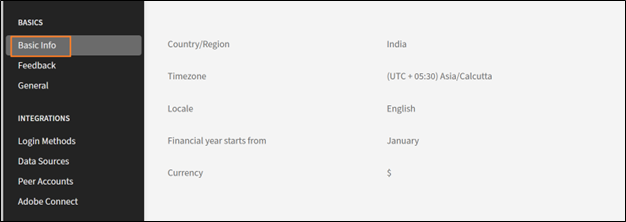
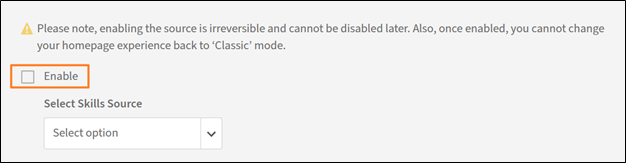

# Configuración básica en Adobe Learning Manager

## Información general

La sección Información básica sirve como base para la configuración de Adobe Learning Manager y contiene parámetros organizativos esenciales que definen el funcionamiento de la plataforma de aprendizaje en diferentes regiones, idiomas y contextos empresariales.

## Principales ventajas

* Proporciona entrega de contenido y experiencia de usuario específicas de la región.
* Estandariza las visualizaciones de tiempo, los formatos de fecha y las representaciones de moneda.
* Proporciona ajustes automáticos de horario de verano para zonas horarias seleccionadas.
* Reduce la necesidad de realizar ajustes manuales en toda la plataforma.

## Configurar opciones básicas

### Acceder a la configuración de información básica

1. Inicie sesión en Adobe Learning Manager como administrador.
2. Seleccione **[!UICONTROL Configuración]** en la barra de navegación izquierda.

   

3. Seleccione **[!UICONTROL Información básica]** en la categoría **[!UICONTROL Conceptos básicos]**.

   

4. Seleccione **[!UICONTROL Cambiar]** para modificar la configuración básica.

### Cambiar la configuración básica

**País o región**

El menú desplegable País/región en la configuración de administrador de Adobe Learning Manager le permite especificar el país o la región asociados a su organización. Esta configuración se utiliza con fines de localización, lo que garantiza que la plataforma se alinea con las preferencias regionales, los requisitos de cumplimiento y las zonas horarias.

**Zona horaria**

El menú desplegable Zona horaria le permite definir la zona horaria predeterminada para la plataforma. Esto garantiza que todas las actividades urgentes, como los calendarios de los cursos, las fechas límite y los informes, se ajusten con precisión a la hora local de la organización o los alumnos.

**Configuración regional**

La configuración regional hace referencia al idioma y la configuración regional de la cuenta. El menú desplegable Configuración regional permite a los administradores configurar el idioma en el que la interfaz y el contenido de la plataforma se muestran a los usuarios. Esta opción garantiza que los alumnos y los administradores puedan interactuar con la plataforma en el idioma que prefieran.

**El año financiero comienza a partir de**

Esta opción le permite definir el mes de inicio del ejercicio financiero de su organización. Por ejemplo, si el ejercicio financiero de su organización comienza en diciembre, puede establecer esta opción en diciembre. Los informes y los análisis se alinearán con este período fiscal.

**Moneda**

La opción Divisa permite definir la divisa predeterminada de la cuenta. Esta divisa se utiliza para asignar precios a objetos de aprendizaje, como cursos, rutas de aprendizaje y certificaciones. Por ejemplo, si su organización opera en Estados Unidos, puede establecer la moneda en USD ($). Del mismo modo, para las operaciones en Europa, puede seleccionar EUR (€).

### Cambiar la configuración de comentarios

La configuración de comentarios de Adobe Learning Manager proporciona a los administradores herramientas para recopilar y administrar comentarios de alumnos (L1) y responsables (L3). Estos ajustes garantizan que los cursos y los objetivos de aprendizaje se evalúen de forma eficaz, lo que permite una mejora continua.

Antes de empezar a recopilar información valiosa de los alumnos, debe habilitar la función de comentarios de L1 y establecer sus parámetros. Este primer paso implica navegar al área Configuración de comentarios y activar la función para todos los cursos nuevos, así como elegir el idioma principal de los formularios de comentarios.

### Activar los comentarios de L1

En la ficha Comentarios de L1, busque el conmutador denominado Activar comentarios de L1 para el curso y la ruta de aprendizaje recién creados. Seleccione el interruptor para activarlo. Esto incluirá automáticamente un formulario de comentarios de L1 para cualquier curso nuevo que cree.

**Seleccionar un idioma predeterminado**

Utilice el menú desplegable Idioma para seleccionar el idioma predeterminado para sus formularios de comentarios. Esto garantiza que las preguntas se presenten a los alumnos en el idioma correcto.

**Configurar cuestionarios para diferentes tipos de cursos**

Adobe Learning Manager le permite personalizar las preguntas en función de si el curso es un módulo con ritmo personalizado o una sesión de clase dirigida por un instructor. Esto garantiza que los comentarios que reciba sean específicos y relevantes. En este paso, seleccionará y perfeccionará las preguntas de los cursos con ritmo personalizado y de clase para recopilar los datos más significativos.

**Para Cursos Con Ritmo Personalizado**:

* **Pregunta obligatoria**: El cuestionario incluye una pregunta obligatoria, &quot;¿Qué probabilidad hay de que recomiende este curso a un compañero?&quot;. Esta es una pregunta estándar de la puntuación de promotor neto (NPS) que proporciona una métrica clave para la satisfacción general del curso.
* **Personalizar preguntas**: revise la lista de preguntas proporcionadas. Para incluir una pregunta en el formulario de comentarios, asegúrese de que el conmutador situado junto a ella esté establecido en Sí. Para eliminar una pregunta, cambie a No.
* **Agregar preguntas personalizadas**: si tiene preguntas adicionales específicas para su contenido con ritmo personalizado, seleccione el vínculo Agregar más para crear y agregar nuevas instrucciones personalizadas al cuestionario.

**Para Cursos De Clase**:

* **Personalizar preguntas**: revise la lista de preguntas adaptadas para la formación en el aula. Cambie el conmutador junto a cada pregunta a Sí para incluirla o a No para excluirla del formulario de comentarios.
* **Agregar preguntas personalizadas**: Para agregar nuevas preguntas que sean específicas de su entorno de clase o estilo de facilitación, seleccione el vínculo Agregar más para crearlas y agregarlas a la lista.

**Configurar recordatorios de comentarios**

Para maximizar las tasas de respuesta, es recomendable configurar los recordatorios automatizados. Este paso muestra cómo configurar y programar estos recordatorios, definiendo cuándo se envían, con qué frecuencia se repiten y durante cuánto tiempo. Al recordar de forma proactiva a los alumnos, puedes aumentar considerablemente la cantidad de comentarios que recopilas.

1. **Agregar un nuevo recordatorio**: En la sección **[!UICONTROL Recordatorios de comentarios de L1]**, seleccione **[!UICONTROL Agregar nuevo recordatorio]**.

   

2. **Definir programación de recordatorio**: En el panel **Configuración de recordatorio** que aparece, usa los menús desplegables y los campos de entrada para configurar el recordatorio:

   a. **[!UICONTROL Cuándo enviar]**: Selecciona si el recordatorio se envía **[!UICONTROL Al finalizar el curso]** o **[!UICONTROL Después de finalizar el curso]**.
b. **[!UICONTROL Periodicidad]**: Seleccione la frecuencia del aviso (por ejemplo, Cada semana).
c. **[!UICONTROL Durante]**: especifique la duración total (en semanas) para la que se enviarán los recordatorios (por ejemplo, 4 semanas).

3. **[!UICONTROL Guarda el recordatorio]**: Selecciona el icono de marca de verificación azul para guardar la nueva configuración del recordatorio. Puede repetir este proceso para añadir más recordatorios, si es necesario.

   

4. Seleccione **[!UICONTROL Guardar]** en la esquina superior derecha de la página para aplicar la configuración de comentarios de L1.

### Activar comentarios de L3

Para poder recopilar comentarios del responsable de un alumno, debe configurar los comentarios de L3. Este primer paso implica navegar a la página Configuración de comentarios y seleccionar la ficha Comentarios de L3. Desde aquí, puede establecer el idioma de la solicitud de comentarios y revisar la pregunta principal que se enviará al responsable.

**Seleccionar la ficha Comentarios de L3**

Seleccione la ficha Comentarios de L3 en la página Configuración de comentarios.

**Revisar la instrucción de comentarios**

Los comentarios de L3 se solicitan al responsable del alumno como una única declaración con la que puede estar de acuerdo o en desacuerdo. La declaración predeterminada que se proporciona es: &quot;El rendimiento del empleado ha mostrado una clara mejora después de recibir la formación&quot;. Puede editar esta declaración para adaptarla mejor a las necesidades de su organización.

**Seleccionar un idioma predeterminado**

Seleccione el menú desplegable Idioma para seleccionar el idioma predeterminado para la solicitud de comentarios.

**Configurar recordatorios de comentarios**

Para garantizar que los gestores proporcionen comentarios puntualmente, debes configurar recordatorios automatizados. Este paso implica configurar cuándo se envían estos recordatorios y con qué frecuencia se repiten. La captura de pantalla muestra que los recordatorios de comentarios de L3 se pueden configurar para que se envíen una vez al finalizar el curso, pero puede añadir más recordatorios si es necesario.

1. **[!UICONTROL Agregar un nuevo recordatorio]**: Para crear un nuevo recordatorio, selecciona el vínculo **[!UICONTROL Agregar nuevo recordatorio]**.
2. **[!UICONTROL Definir programación de recordatorio]**: En el panel **[!UICONTROL Configuración de recordatorio]**, seleccione los menús desplegables y los campos de entrada para configurar el recordatorio:
a. **[!UICONTROL Cuándo enviar]**: selecciona cuándo se envía el recordatorio. Las opciones son: **[!UICONTROL Al finalizar el curso]** y **[!UICONTROL Después de finalizar el curso]**.
b. **[!UICONTROL Periodicidad]**: Seleccione la frecuencia del recordatorio. Si la periodicidad es **[!UICONTROL Once]**, significa que el administrador recibirá una notificación para proporcionar comentarios. Las opciones disponibles son: Una, Cada día, Cada semana y Cada mes.
3. Después de configurar la programación, seleccione el icono de marca de verificación azul para guardar la configuración del recordatorio. El recordatorio aparece en la lista de recordatorios existentes.

   

4. Seleccione **[!UICONTROL Guardar]** en la esquina superior derecha de la página para aplicar la configuración de comentarios de L3.

## Configuración general

### Información general

La configuración general de Adobe Learning Manager proporciona a los administradores una ubicación centralizada para configurar la experiencia general del alumno y los procesos administrativos. Esta configuración le permite habilitar o deshabilitar varias funciones para adaptar la plataforma a las necesidades específicas de su organización.

Las principales opciones generales configurables incluyen:

* **Moderación y eficacia del curso:** Elija mostrar una clasificación de la eficacia del curso a los alumnos y habilitar una función de moderación del curso que requiera la aprobación del administrador para todos los cambios del curso.
* **Funciones de participación de alumnos:** Puede habilitar o deshabilitar funciones como el **foro de debate** para comentarios del curso, las aptitudes de orígenes externos para alumnos y **mensajes de correo electrónico de resumen** para mantener a los alumnos informados sobre el contenido nuevo y el progreso.
* **Administración de contenido y cursos:** La configuración permite configurar **varios intentos** para el aprendizaje electrónico interactivo, agregar **identificadores únicos de objetos de aprendizaje** al contenido y establecer el comportamiento predeterminado para las **actualizaciones de la versión del módulo**.
* **Administración de usuarios:** Habilita **Registración automática de usuarios** para agregar automáticamente nuevos usuarios al sistema y **Eliminar automáticamente usuarios internos** que hayan estado inactivos durante un período especificado.
* **Personalización y visualización**: tienes control sobre lo que ven los alumnos, como habilitar o deshabilitar los **paneles de filtro** para realizar búsquedas, mostrar **etiquetas de catálogo** y personalizar hasta tres **vínculos de pie de página**.

### Moderación de los cursos

La moderación de los cursos le permite supervisar y administrar las actualizaciones realizadas por los autores a los cursos. De este modo, se garantiza que los administradores revisen y aprueben cualquier cambio en el contenido del curso antes de publicarlo para los alumnos. La selección de Moderación de los cursos requiere que los autores soliciten la aprobación de los administradores para publicar un curso en el que hayan realizado cambios.

Cuando un autor actualiza un curso, por ejemplo, añade o elimina uno o varios módulos, e intenta publicar el curso,

1. Recibirá notificaciones cada vez que el autor vuelva a publicar un curso con cambios.
2. Seleccione la notificación para ver los cambios realizados por el autor.
3. Compara el contenido antiguo y el nuevo.
4. Aprobar o rechazar cambios:
a. Apruebe los cambios para volver a publicar el curso con actualizaciones.
b. Rechazar los cambios para mantener activa la versión anterior del curso.
5. Se notifica a los autores su decisión, ya sea de aprobación o rechazo.

### Foro de debate

La opción Foro de debate de Adobe Learning Manager permite a los alumnos participar en debates relacionados con cursos, módulos o programas de aprendizaje. Puede habilitar y administrar esta función para fomentar la colaboración y el intercambio de conocimientos entre los alumnos. Los foros de debate están vinculados a cursos o módulos específicos, lo que los hace contextualmente relevantes.

Como alumno, puede interactuar con otros alumnos y sus instructores en la ficha Debate. Puede ver las publicaciones de todos los cursos que visualice o en los que se inscriba. Si el administrador ha habilitado los debates para un curso, puede ver la ficha Debate junto a la ficha Notas para ese curso.

Al seleccionar la ficha Debates de un curso, puede ver las publicaciones y los comentarios existentes de ese curso. Si ya se ha inscrito en un curso, también puede empezar a escribir publicaciones o comentarios para que los vean los demás usuarios. Tras escribir el mensaje, haga clic en Publicar. La publicación debe contener al menos 10 caracteres.

La publicación se ve al instante en la ficha Debates. Puede ordenar las publicaciones como Más recientes primero o Más antiguos primero y eliminar las publicaciones que haya escrito. Aunque se dé de baja del curso, puede seguir viendo todas las publicaciones y eliminar las que haya escrito.

Como administrador, puede moderar los debates para garantizar su pertinencia y adecuación. Los alumnos reciben notificaciones de las respuestas o actualizaciones en los debates en los que participan.

### Varios intentos

Al seleccionar esta opción, los autores pueden definir el número de reintentos posibles en un curso o módulo. Permite a los alumnos volver a realizar el curso o la evaluación una vez completado.  Esta configuración es útil para cursos que incluyen cuestionarios, pruebas o tipos de cursos que requieren evaluación.

### Visibilidad de aptitudes, etiquetas, productos y funciones

Esta opción decide si los alumnos solo ven las aptitudes o etiquetas asignadas, o las que forman parte de los catálogos visibles para los alumnos, o todas las aptitudes y etiquetas. Esto incluye aptitudes, etiquetas, productos y funciones asociadas a cursos o rutas de aprendizaje.

Selecciona **[!UICONTROL Editar]** para restringir lo que un alumno puede ver:

A continuación, los alumnos exploran las aptitudes y las etiquetas visibles para ellos y se suscriben a las aptitudes de su elección.

### ID exclusivos de objetos de aprendizaje

La opción permite asignar un identificador único a cada objeto de aprendizaje (como cursos, rutas de aprendizaje, certificaciones o ayudas de trabajo). Esto garantiza que todos los objetos de aprendizaje tengan un ID distinto, que puede ser útil para el seguimiento, la creación de informes y la integración con sistemas externos.

Cuando está activada, los autores ven un campo para añadir el ID de objeto de aprendizaje al crear un objeto de aprendizaje. Pueden añadir los ID según corresponda. Los ID exclusivos son adecuados para la integración con sistemas de terceros, incluidos los almacenes de registros de aprendizaje (LRS) y los sistemas de administración de aprendizaje (LMS). Los ID exclusivos también facilitan la búsqueda de objetos de aprendizaje específicos y su seguimiento mediante transcripciones de alumnos.

### Mostrar paneles de filtro

Esta opción le permite controlar qué opciones de filtro están disponibles para los alumnos en la aplicación del alumno. Estos filtros ayudan a los alumnos a perfeccionar sus resultados de búsqueda en las secciones Mi aprendizaje y Catálogo de un alumno. Las siguientes opciones de filtro están disponibles para su selección:

* Grupos
* Catálogos
* Tipo
* Formato
* Duración
* Aptitudes
* Niveles de aptitudes
* Etiquetas
* Precio
* Intervalo de precios
* Ubicaciones
* Productos
* Niveles de recomendación

>[!NOTE]
>
>Los filtros **[!UICONTROL Formato]** y **[!UICONTROL Duración]** están desactivados de forma predeterminada y no se muestran inmediatamente a los alumnos. Debe seleccionarlos de forma explícita.

### Terminología del producto

Adobe Learning Manager dispone de cierta terminología de producto para definir objetos de aprendizaje, como cursos, rutas de aprendizaje o ayudas de trabajo. Puede personalizar la terminología en inglés y francés, según sus preferencias. Descargue la plantilla Terminología del producto y sustituya, por ejemplo, Plan de aprendizaje por Regla prescriptiva. Del mismo modo, cambie entradas similares en francés. A continuación, cargue la plantilla modificada y seleccione Guardar para actualizar las terminologías del producto.

Consulte Terminología del producto en Adobe Learning Manager para obtener más información.

### Actualización de la versión del módulo

Esta opción permite a los administradores actualizar el contenido de un módulo sin interrumpir el progreso de los alumnos que ya se han inscrito en cursos que contienen ese módulo. Esto garantiza que los alumnos puedan continuar su recorrido de aprendizaje sin problemas, mientras que los autores pueden mantener el contenido actualizado. Con la opción activada, los autores pueden cargar una nueva versión de un módulo (por ejemplo, paquetes SCORM, AICC o xAPI) para sustituir la existente.

* Los alumnos que ya han iniciado el módulo continuarán con la versión en la que se inscribieron.
* Los nuevos alumnos accederán automáticamente a la versión actualizada.
* Adobe Learning Manager realiza un seguimiento de las diferentes versiones del módulo con fines de informes y auditoría.

### Registro automático de usuarios

Esta opción le permite registrar automáticamente usuarios en catálogos o contenido de aprendizaje específicos cuando se agregan al sistema. Esto garantiza que los usuarios tengan acceso inmediato a los materiales de aprendizaje pertinentes sin necesidad de intervención manual.

* Los nuevos usuarios se registran automáticamente en los catálogos o cursos predefinidos una vez que se añaden al sistema.
* Los administradores pueden definir reglas para determinar para qué catálogos o cursos se registran automáticamente los usuarios, en función de atributos de usuario como funciones, grupos u otros criterios. Consulte [Planes de aprendizaje en Adobe Learning Manager](/help/migrated/administrators/feature-summary/learning-plans.md) o [Inscribir automáticamente grupos de usuarios externos en cursos al registrarse](https://elearning.adobe.com/2024/05/automatically-enroll-external-user-groups-in-courses-upon-registration/) para obtener más información.

### Eliminar automáticamente usuarios internos

Esta opción elimina usuarios si no acceden a Adobe Learning Manager durante un período de tiempo especificado.  Especifique el número de días que un usuario puede tener acceso sin iniciar sesión en Adobe Learning Manager. Con esta opción, también puede eliminar automáticamente usuarios internos inactivos del sistema después de un período especificado. Esto ayuda a mantener una base de datos de usuarios limpia y organizada, ya que elimina a los usuarios que ya no están activos.

* Los usuarios internos que han estado inactivos durante un período de tiempo definido se eliminan automáticamente.
* Se notifica a los usuarios antes de la eliminación, lo que les da la oportunidad de iniciar sesión y evitar la eliminación.
* Para que se les restablezca el acceso, el usuario eliminado deberá ponerse en contacto con el administrador de la cuenta.

### Mostrar etiquetas de catálogo

Esta opción permite a un autor definir etiquetas de catálogo al crear un objeto de aprendizaje. A continuación, un alumno ve las etiquetas de catálogo en la sección Catálogo de la aplicación del alumno. Estas etiquetas ayudan a los alumnos a identificar y diferenciar los diversos catálogos disponibles para ellos. Si se anula la selección de la opción, los cursos u objetos de aprendizaje se desplazan al catálogo predeterminado.

### Tipo de cumplimiento personalizado

Esta opción permite a un autor definir y administrar tipos de conformidad adaptados a los requisitos específicos de su organización, al tiempo que crea objetos de aprendizaje. Los autores pueden añadir una etiqueta de cumplimiento y una fecha límite al curso que están creando.
Esto resulta especialmente útil para realizar un seguimiento y aplicar la formación de cumplimiento para los empleados basada en políticas organizativas únicas.

### Los alumnos pueden ver sus puntuaciones

Al seleccionar esta opción, se garantiza que los alumnos puedan ver sus puntuaciones de las pruebas en sus transcripciones de alumnos. En las transcripciones, las columnas Puntuación_de_prueba, Puntuación_máx._de_prueba, Puntuación_más_alta_de_prueba y Puntuación_más_alta_de_prueba_máx. ayudan al alumno a ver sus puntuaciones de evaluación. Estas puntuaciones ayudan a los alumnos a realizar un seguimiento de su progreso y a comprender su rendimiento.

Si deselecciona la opción, las puntuaciones de las pruebas no aparecerán en las transcripciones de alumnos de los alumnos.

### Correo electrónico de resumen

Esta opción permite enviar correos electrónicos de resumen a los alumnos para proporcionarles actualizaciones sobre sus actividades de aprendizaje, el progreso y las fechas límite próximas. Estos mensajes de correo electrónico están diseñados para mantener a los alumnos informados y comprometidos con sus programas de formación. Estos correos electrónicos capturan las actividades de los alumnos, como los cursos completados.

Puede cambiar la frecuencia de los mensajes de correo electrónico en la configuración de la plantilla de correo electrónico. Además, puede personalizar el contenido de los mensajes de correo electrónico de resumen para incluir detalles específicos relevantes para los alumnos.

>[!NOTE]
>
>* En el caso de las cuentas activas, los mensajes de resumen se desactivarán de forma predeterminada, lo que se puede activar manualmente.
>* En el caso de las cuentas de prueba, la opción de mensajes de correo electrónico de resumen permanecerá desactivada y no podrá activarla.

### Activar iconos de curso/ruta de aprendizaje/certificación/tarjeta de ayuda de trabajo

Esta opción permite a los autores añadir imágenes de portada en las tarjetas del curso del alumno para diferentes tipos de contenido de aprendizaje. Estas imágenes ayudan a los alumnos a identificar fácilmente el tipo de contenido (por ejemplo, curso, ruta de aprendizaje, certificación o ayuda de trabajo) de un vistazo. Al crear un objeto de aprendizaje, los autores pueden añadir imágenes de portada a los cursos.

Si no selecciona la opción, las tarjetas no mostrarán ningún icono.

### Vínculos de pie de página

Esta opción le permite personalizar la sección de pie de página de la aplicación del alumno añadiendo vínculos a recursos externos, sitios web de la empresa u otras páginas relevantes. Estos vínculos aparecen en la parte inferior de la interfaz de la aplicación del alumno y se pueden utilizar para proporcionar acceso rápido a información importante. Los vínculos pueden dirigir a los alumnos a sitios web externos, páginas de ayuda o directivas de la empresa. Proporcionan a los alumnos un acceso sencillo a recursos adicionales directamente desde la aplicación.

A continuación se explica cómo personalizar los vínculos de pie de página:

1. **[!UICONTROL Agregar vínculos]**: selecciona **[!UICONTROL Agregar más]** e introduce el nombre y la URL o el ID de correo electrónico en los campos especificados. Asegúrese de que la URL vaya precedida de http:// o https://.
2. **[!UICONTROL Replicar en todas las configuraciones regionales]**: selecciona **[!UICONTROL Replicar]** para aplicar los cambios en cascada en todas las configuraciones regionales, asegurando que todos los idiomas obtengan el mismo nombre y URL.
3. Seleccione **[!UICONTROL Guardar]** para aplicar los cambios.

**Opciones adicionales:**

* Restablecer valores predeterminados: seleccione el icono Restablecer para volver a los valores predeterminados en los campos Ayuda y Contactar con el administrador.
* Personalizar para todos los idiomas: seleccione un idioma de la lista desplegable y, a continuación, agregue el nombre y la dirección URL de ese idioma. Guarde los cambios para actualizar los vínculos del pie de página para el idioma seleccionado.

### Zona horaria del informe

Esta opción le permite establecer una preferencia a nivel de cuenta para exportar el informe Transcripciones de aprendizaje y Resumen de sesión en zonas horarias específicas. Opciones disponibles:

* UTC (comportamiento predeterminado)
* Preferencia de zona horaria en el nivel de cuenta

Esta opción también garantiza que la transcripción del alumno descargada mediante la API de trabajos refleje la zona horaria seleccionada.

### Integración de Badgr

Al seleccionar la opción, los alumnos pueden:

* Cargue sus insignias en el sitio web de Badgr.
* Comparta las insignias en las redes sociales.

Cómo funciona:

* Seleccione la opción en la sección Integración de Badgr.
* Los alumnos inician sesión en su cuenta de Badgr desde Adobe Learning Manager.
* Las insignias obtenidas en Adobe Learning Manager se cargan automáticamente en la cuenta de Badgr.

>[!NOTE]
>
>* Adobe Learning Manager no proporciona una cuenta de Badgr como parte de la integración. Los alumnos deben crear su propia cuenta de Badgr.
>* Los alumnos pueden configurar su cuenta de Badgr directamente desde la página Insignias de la aplicación del alumno.

Vea [Compatibilidad con insignias de Badgr](/help/migrated/learners/feature-summary/badges.md#support-for-badgr-badges) para obtener más información.

### Mostrar valoraciones

Esta opción le permite activar o desactivar la visualización de las valoraciones de los cursos en la aplicación del alumno. Cuando está activada, los alumnos pueden ver las valoraciones de los cursos, lo que les ayuda a tomar decisiones fundamentadas sobre la inscripción en un curso.

* Si se selecciona la opción Eficacia del curso , los alumnos solo podrán ver el valor de la eficacia del curso. La eficacia del curso se calcula en función de los comentarios del alumno (L1), las puntuaciones de las pruebas (L2) y los comentarios del responsable (L3).
* Si se selecciona la opción Valoración basada en estrellas , los alumnos solo podrán ver la valoración media con estrellas y el número de alumnos que han valorado el curso. La valoración basada en estrellas es el promedio de todas las valoraciones proporcionadas por los alumnos al completar un curso.

Para las nuevas cuentas, la sección Mostrar valoraciones tendrá activada de forma predeterminada la opción Valoración basada en estrellas.

Para las cuentas existentes, si la cuenta tenía activada la opción Eficacia del curso , la sección Mostrar valoraciones se activará con la opción Eficacia del curso seleccionada. Si la opción Eficacia del curso está desactivada, la sección Mostrar valoraciones también se desactivará. Cuando la sección Mostrar valoraciones está activada, la opción Valoración basada en estrellas se activará de forma predeterminada.

### Vista predeterminada (función de alumno)

Esta opción hace referencia a la vista de los alumnos del catálogo de cursos. Seleccione la casilla de verificación Vista de lista para cambiar la vista de los alumnos de la vista de cuadrícula predeterminada a la vista de lista.

### Rutas de aprendizaje

Si selecciona **[!UICONTROL Habilitar características ampliadas de la ruta de aprendizaje]**, puede incluir rutas de aprendizaje dentro de rutas de aprendizaje y combinarlas con cursos. La opción es irreversible.

### Administración de instructores

Esta opción garantiza que los autores puedan seleccionar instructores para una clase virtual o una sesión de clase de una lista predeterminada.

**Características principales:**

* Restringir la selección del instructor: solo se pueden asignar sesiones a los usuarios con la función de instructor.
* Impacto en los flujos de trabajo de migración: esta restricción no se aplica a los flujos de trabajo de migración.

### Vista previa del módulo

Si selecciona Activar, los autores pueden previsualizar un curso como alumnos después de crearlo.

### Habilitar precios para cursos/rutas de aprendizaje/certificaciones

Esta opción le permite activar la funcionalidad de comercio electrónico para cursos, rutas de aprendizaje y certificaciones. Esta función se utiliza principalmente para integrar Adobe Learning Manager con Adobe Commerce, lo que permite a las organizaciones rentabilizar sus ofertas de formación.
Una vez activada la función, el campo Moneda aparece en la página Información básica.

Cuando los cursos son de pago, los autores pueden especificar el curso, la ruta de aprendizaje o el precio de certificación. Los alumnos pueden adquirir formación directamente en Adobe Learning Manager o en [sitios de AEM personalizados](/help/migrated/integrate-aem-learning-manager.md).

>[!NOTE]
>
>No es posible adquirir ciertos tipos de formación, como certificaciones periódicas y cursos aprobados por el responsable.

### Habilitar carro de SKU de varios elementos

Esta opción permite a los alumnos añadir varios elementos de formación (cursos, rutas de aprendizaje, certificaciones) a un carro de compras y comprarlos juntos. Esta función forma parte de la funcionalidad de comercio electrónico integrada con Adobe Commerce.

Esta función es especialmente útil para las organizaciones que venden varios artículos de formación y desean agilizar el proceso de compra para los alumnos.

**Características principales:**

* Compras múltiples: los alumnos pueden añadir varios artículos a su carrito y comprarlos en una transacción. Consulte Carrito de varios elementos para obtener más información.
*Pago optimizado: reduce la necesidad de que los alumnos realicen compras por separado para cada elemento de formación.
* Administración de SKU: los administradores pueden gestionar las SKU de los cursos, las rutas de aprendizaje y las certificaciones para garantizar un seguimiento y unos informes adecuados.

### Configuración del reproductor

Esta opción permite a los autores personalizar el reproductor Fluidic para diferentes cursos en el nivel del curso. Los autores pueden configurar el modo en que se muestra el contenido de formación a los alumnos en el reproductor. Esto incluye la configuración relacionada con el idioma del contenido, las preferencias de la interfaz y las opciones de reproducción.

### Los responsables pueden marcar como completado

Esta opción permite a los responsables marcar la finalización del curso, la certificación o la ruta de aprendizaje para su personal. Esta función es útil en situaciones en las que los alumnos han completado la formación fuera de la plataforma o necesitan la intervención manual para actualizar su progreso.
Los responsables pueden marcar la finalización del curso mediante:

* Módulo Lista de comprobación: el módulo Lista de comprobación permite a los responsables evaluar el rendimiento de los alumnos en función de tareas o criterios específicos. Los autores deben habilitar este módulo durante la creación del curso y asignar responsables como revisores.
* Página del curso: en la página del curso:
a.    Seleccione la pestaña **[!UICONTROL Alumnos]** en el panel izquierdo.
b.    Seleccione el alumno cuya asistencia desea marcar.
c.    Seleccione **[!UICONTROL Acciones]** > **[!UICONTROL Marcar finalización]**.

**Notas adicionales:**

* Los responsables también pueden exportar la lista de alumnos con fines de creación de informes.
* Si un curso incluye varias instancias, los responsables pueden ver y gestionar a los alumnos por separado para cada instancia.

### Retirar

Esta opción permite a los autores retirar contenido de formación (cursos, rutas de aprendizaje, certificaciones) que ya no sea relevante o necesario. El contenido retirado se elimina del catálogo del alumno, pero se puede acceder a él en informes y datos históricos con fines de seguimiento. Tiene dos opciones:

1. Una vez retirados, los alumnos inscritos podrán ver y realizar acciones, pero los alumnos aún no inscritos perderán su acceso:
a. Alumnos inscritos:
i. Los alumnos que ya se han inscrito en el curso o la ruta de aprendizaje retirados pueden seguir accediendo al contenido.
ii. Pueden seguir realizando acciones como completar el curso o ver el material.
b. Alumnos aún no inscritos:
i. Los alumnos que no se hayan inscrito en el curso o la ruta de aprendizaje antes de que se retirara ya no verán el contenido en el catálogo.
ii. Perderán por completo el acceso al contenido retirado.
2. Una vez retirados, tanto los alumnos inscritos como los que aún no lo han hecho perderán el acceso:
a. Alumnos inscritos:
i. Los alumnos que ya se han inscrito en el curso o la ruta de aprendizaje perderán el acceso al contenido una vez que se retiren.
ii. Ya no podrán ver ni realizar ninguna acción en el contenido retirado.
b. Alumnos aún no inscritos:
i. Los alumnos que no se hayan inscrito en el curso o la ruta de aprendizaje también perderán el acceso, ya que el contenido ya no aparecerá en el catálogo.

### Retirada automática

Esta opción permite a los autores establecer una fecha específica para que un curso se retire automáticamente. Cuando se retira un curso, ya no está disponible para nuevas inscripciones, pero los alumnos que ya se han inscrito pueden seguir accediendo al curso y completarlo.

Notas clave:

* Una vez establecida la fecha de Retirada automática, el curso pasará automáticamente al estado Retirado en la fecha especificada.
* Los cursos retirados no están visibles en el catálogo de cursos para los nuevos alumnos, pero los alumnos existentes pueden seguir accediendo a ellos y completarlos.

### Mostrar todos los cursos inscritos en los resultados de búsqueda

Esta opción permite a los alumnos ver cursos en los resultados de búsqueda aunque formen parte de su ruta de aprendizaje o certificación inscrita.

### Importación de aptitudes

Esta opción permite importar aptitudes desde orígenes externos, como LinkedIn Learning y Go1, mediante los conectores correspondientes. Esta funcionalidad integra Skills Cloud y Talent Management Systems externos en Adobe Learning Manager, lo que mejora la capacidad de la plataforma para gestionar y utilizar las aptitudes de forma eficaz.

Las aptitudes de los proveedores de contenido externos se añaden al repositorio de aptitudes definido por el administrador en Adobe Learning Manager. Estas aptitudes pasan a estar disponibles para los autores durante el flujo de trabajo de creación de cursos.

1. Seleccione **[!UICONTROL Habilitar]**.

   

2. Seleccione un proveedor de contenido en el menú desplegable **[!UICONTROL Seleccionar origen de aptitudes]**.
3. Seleccione **[!UICONTROL Guardar]**.
Tenga en cuenta que, una vez activada la opción, la acción es irreversible. No puede deshabilitar ni cambiar a otro origen más adelante.

